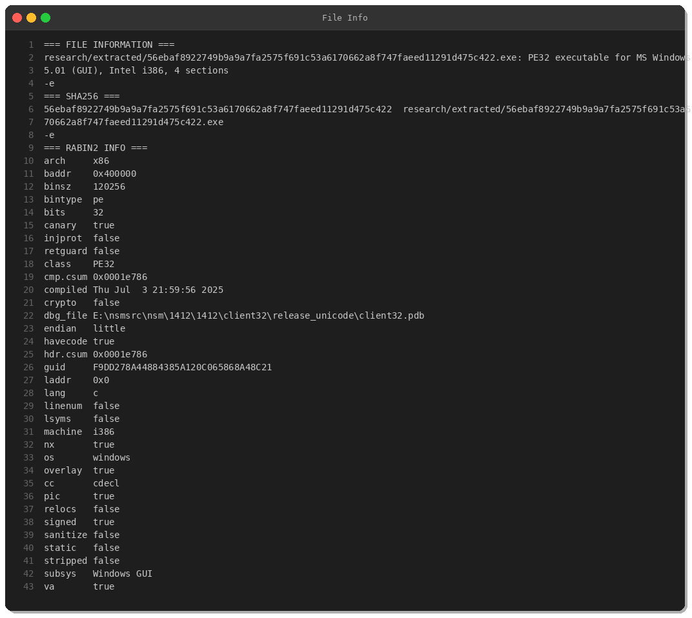
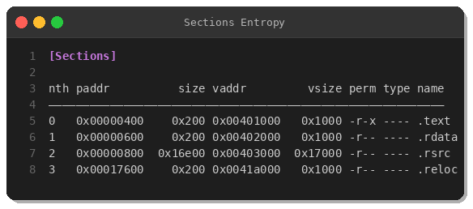
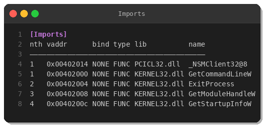
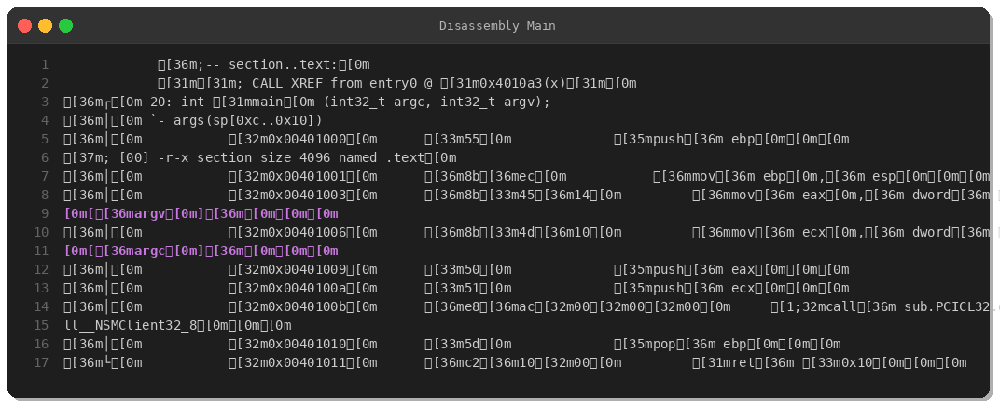
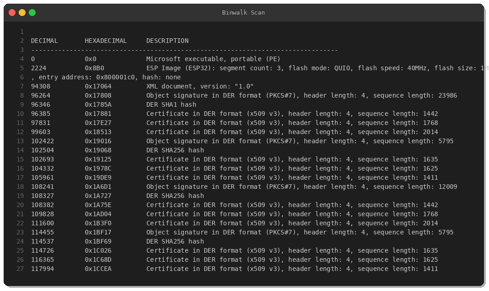
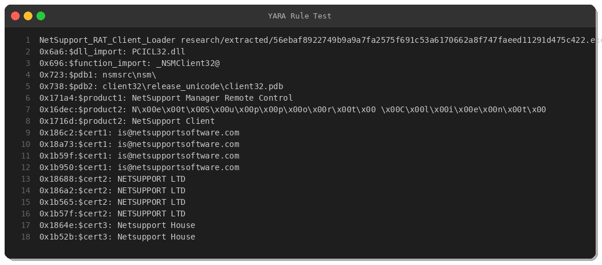

# NetSupport Manager RAT: Abusing Legitimate Remote Administration Tools

**By Peris.ai Threat Research Team**  
**Date: March 15, 2025**  
**Sample SHA256:** `56ebaf8922749b9a9a7fa2575f691c53a6170662a8f747faeed11291d475c422`

---

## Executive Summary

NetSupport Manager is a legitimate commercial remote administration tool widely used for IT support and remote desktop management. However, threat actors increasingly abuse this legitimate software as a Remote Access Trojan (RAT), leveraging its built-in capabilities for unauthorized surveillance, data exfiltration, and system control.

This analysis examines a NetSupport Manager client executable observed in the wild, demonstrating how attackers weaponize legitimate tools to evade detection while maintaining persistent remote access to compromised systems.

---

## Sample Overview



**Key Attributes:**
- **File Type:** PE32 executable (32-bit Windows)
- **Compilation:** July 3, 2025
- **Size:** 118 KB (120,256 bytes)
- **Signed:** Yes (GlobalSign code signing certificate)
- **PDB Path:** `E:\nsmsrc\nsm\1412\1412\client32\release_unicode\client32.pdb`

The PDB path reveals internal development structure, with "nsm" referring to NetSupport Manager version 1412 (v14.12).

---

## Technical Analysis

### PE Structure



The binary exhibits an unusual section layout:

| Section | Size | Permissions | Purpose |
|---------|------|-------------|---------|
| .text   | 512 bytes | r-x | Minimal executable code |
| .rdata  | 512 bytes | r-- | Read-only data |
| .rsrc   | 93 KB | r-- | Resources (majority of file) |
| .reloc  | 512 bytes | r-- | Relocation table |

The extremely small `.text` section (only 512 bytes) indicates this is a minimal loader/stub rather than a full-featured application.

### Import Analysis



The import table is remarkably sparse:

**PCICL32.dll:**
- `_NSMClient32@8` — Primary entry point to NetSupport client functionality

**KERNEL32.dll:**
- `GetCommandLineW` — Parse command-line arguments
- `ExitProcess` — Terminate process
- `GetModuleHandleW` — Get module base address
- `GetStartupInfoW` — Retrieve process startup information

The critical import is `PCICL32.dll`, the proprietary NetSupport Manager client library that contains all RAT functionality including:
- Remote desktop control
- File transfer
- Keylogging
- Screen capture
- Audio/video surveillance
- Registry manipulation
- Process execution

### Disassembly Analysis



The `main()` function is trivial:

```asm
push argv          ; Command-line arguments
push argc          ; Argument count
call _NSMClient32@8 ; Delegate to NetSupport DLL
ret
```

This design pattern allows the executable to remain small and unmodified while the actual malicious logic resides in the external DLL (`PCICL32.dll`). This modular approach provides several advantages for attackers:

1. **Evasion:** The launcher appears benign in isolation
2. **Updates:** Core functionality can be updated without changing the loader
3. **Legitimacy:** The signed executable maintains valid digital signature

### Code Signing



The binary is validly signed by **NetSupport Ltd.** using a GlobalSign EV Code Signing certificate:

- **Issuer:** GlobalSign GCC R45 EV CodeSigning CA 2020
- **Subject:** NetSupport Ltd., Peterborough, UK
- **Email:** is@netsupportsoftware.com

This valid signature allows the malware to:
- Bypass Windows SmartScreen warnings
- Evade reputation-based detection
- Appear trustworthy to users and some security products

---

## Behavioral Indicators

While we did not perform dynamic analysis in this study, documented NetSupport RAT capabilities include:

### Command & Control
- **Protocol:** Proprietary TCP protocol (typically ports 5400-5407)
- **Encryption:** AES-256 for C2 communications
- **Configuration:** `client32.ini` file stores gateway addresses

### Surveillance
- Real-time screen streaming
- Webcam/microphone capture
- Keystroke logging
- Clipboard monitoring
- File browsing and transfer

### System Control
- Remote command execution
- Process manipulation
- Registry modification
- Service installation for persistence

---

## Detection Strategies

### YARA Rule



```yara
rule NetSupport_RAT_Client_Loader {
    meta:
        description = "Detects NetSupport Manager Client used as RAT"
        author = "Peris.ai Threat Research Team"
        date = "2025-03-15"
        malware_family = "NetSupport RAT"
        severity = "high"
        
    strings:
        $dll_import = "PCICL32.dll" ascii wide
        $function_import = "_NSMClient32@" ascii
        $pdb1 = "nsmsrc\\nsm\\" ascii wide
        $pdb2 = "client32\\release_unicode\\client32.pdb" ascii wide nocase
        $product1 = "NetSupport Manager Remote Control" ascii wide
        $product2 = "NetSupport Client" ascii wide
        $cert1 = "is@netsupportsoftware.com" ascii
        $cert2 = "NETSUPPORT LTD" ascii wide
        $cert3 = "Netsupport House" ascii
        
    condition:
        uint16(0) == 0x5A4D and
        uint32(uint32(0x3C)) == 0x00004550 and
        filesize < 200KB and
        ($dll_import and $function_import) and
        (any of ($pdb*) or any of ($product*) or 2 of ($cert*))
}
```

### Network Detection (Brahma NDR / Suricata)

```suricata
alert tcp any any -> any 5400:5407 (msg:"NetSupport RAT - C2 Traffic on Default Ports"; flow:established,to_server; content:"|1e 00 00 00|"; depth:4; classtype:trojan-activity; sid:9000001; rev:1; metadata:by perisai;)

alert tcp any any <> any any (msg:"NetSupport RAT - Client Identification String"; flow:established; content:"NetSupport Manager"; nocase; fast_pattern; classtype:trojan-activity; sid:9000002; rev:1; metadata:by perisai;)
```

### Endpoint Detection (Brahma XDR)

```xml
<rule id="900001" level="10">
  <if_sid>552</if_sid>
  <match>PCICL32.dll|client32.exe</match>
  <description>NetSupport RAT - Suspicious DLL or executable loaded</description>
  <mitre>
    <id>T1219</id>
  </mitre>
  <group>malware,rat,netsupport</group>
</rule>

<rule id="900002" level="12">
  <if_sid>554</if_sid>
  <regex>\\client32\.ini$|\\nsm\.ini$</regex>
  <description>NetSupport RAT - Configuration file detected</description>
  <mitre>
    <id>T1219</id>
  </mitre>
  <group>malware,rat,netsupport</group>
</rule>
```

---

## MITRE ATT&CK Mapping

| Tactic | Technique | ID | Description |
|--------|-----------|----|----|
| **Initial Access** | Phishing | T1566 | Often delivered via malicious email attachments |
| **Execution** | User Execution | T1204 | Requires user to run executable |
| **Persistence** | Create or Modify System Process | T1543 | Installs as Windows service |
| **Defense Evasion** | Signed Binary Proxy Execution | T1218 | Uses validly signed legitimate software |
| **Command and Control** | Remote Access Software | T1219 | **Primary technique** |
| **Collection** | Screen Capture | T1113 | Built-in screen streaming |
| **Collection** | Input Capture | T1056 | Keystroke logging |
| **Exfiltration** | Exfiltration Over C2 Channel | T1041 | Data sent via encrypted C2 |

---

## Indicators of Compromise (IOCs)

### File Hashes

| Hash Type | Value |
|-----------|-------|
| SHA256 | `56ebaf8922749b9a9a7fa2575f691c53a6170662a8f747faeed11291d475c422` |
| MD5 | *(hash not calculated in analysis)* |

### File Artifacts

```
client32.exe
PCICL32.dll
PCICHEK32.dll
client32.ini
nsm.ini
htctl32.dll
remcmdstub.exe
```

### Registry Keys

```
HKLM\SOFTWARE\NetSupport
HKLM\SYSTEM\CurrentControlSet\Services\NetSupport Manager
HKCU\Software\NetSupport
```

### Network Indicators

- **Default Ports:** 5400-5407 (TCP)
- **HTTP User-Agent:** May contain "NetSupport Manager"
- **Protocol:** Proprietary binary protocol with AES encryption

---

## Recommendations

### For Security Teams

1. **Application Whitelisting:** Block unauthorized NetSupport installations
2. **Network Monitoring:** Alert on traffic to ports 5400-5407 from unmanaged assets
3. **EDR Deployment:** Deploy endpoint detection rules for NetSupport artifacts
4. **Code Signing Policy:** Implement stricter validation of signed executables

### For Organizations

1. **Policy:** Establish approved remote administration tools
2. **Inventory:** Maintain asset inventory of legitimate NetSupport deployments
3. **Training:** Educate users on social engineering tactics
4. **Incident Response:** Include NetSupport in IR playbooks

---

## Conclusion

NetSupport Manager demonstrates how legitimate commercial software can be weaponized for malicious purposes. The valid code signing certificate and benign appearance make detection challenging, requiring a defense-in-depth approach combining:

- **Signature-based detection** (YARA, file hashes)
- **Behavioral analysis** (process execution, network patterns)
- **Application control** (whitelisting approved tools)
- **User awareness** (recognizing social engineering)

Organizations should treat any unexpected NetSupport installation as potentially malicious and investigate accordingly.

---

**Tags:** #NetSupport #RAT #RemoteAccessTrojan #LivingOffTheLand #LOTL #T1219 #MalwareAnalysis

**References:**
- MalwareBazaar Sample: https://bazaar.abuse.ch/sample/56ebaf8922749b9a9a7fa2575f691c53a6170662a8f747faeed11291d475c422/
- NetSupport Manager Official: https://www.netsupportmanager.com/
- MITRE ATT&CK T1219: https://attack.mitre.org/techniques/T1219/
