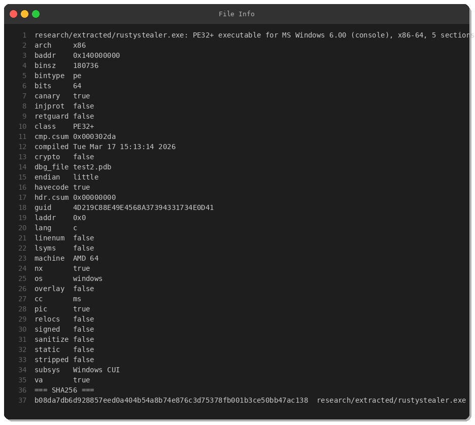
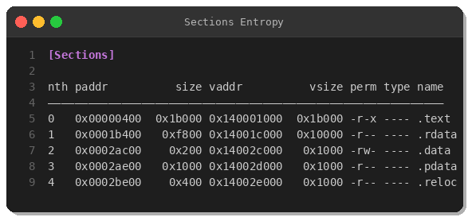
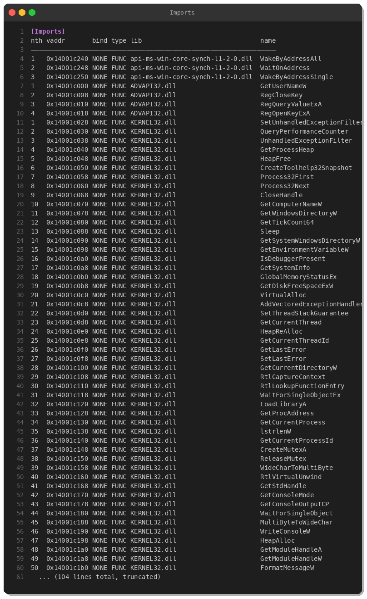
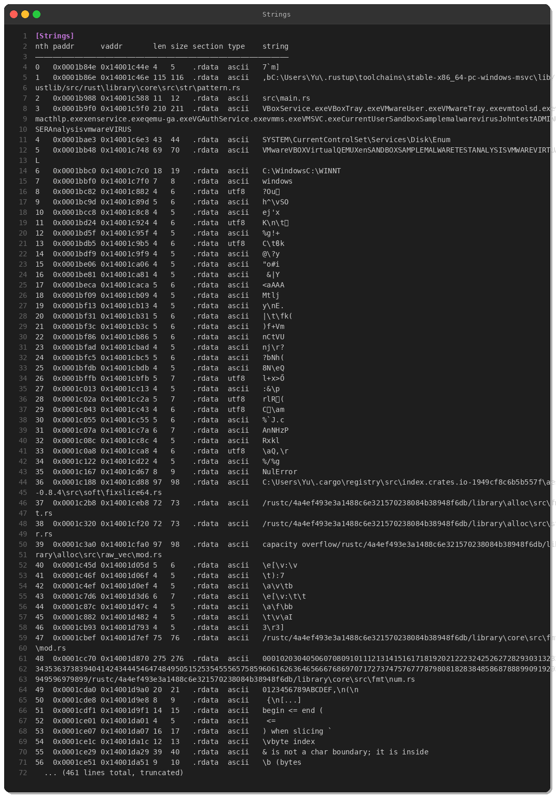
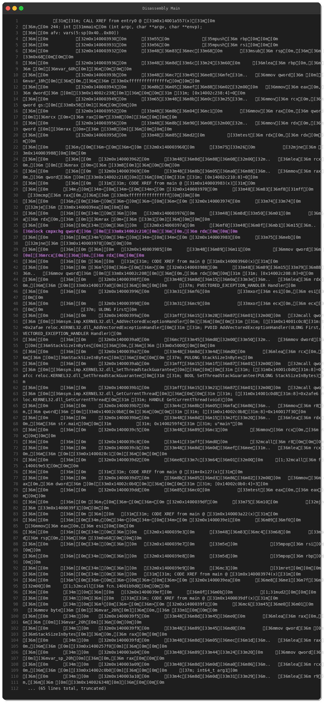
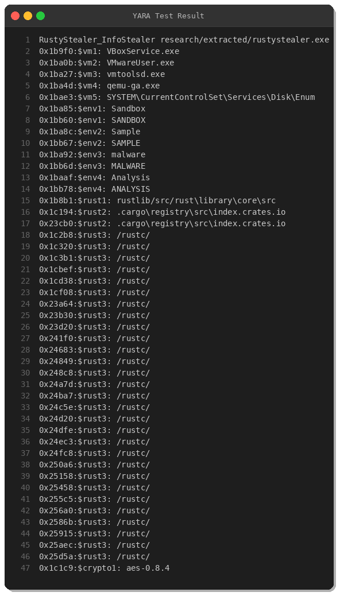

# RustyStealer: Deep Dive into a Rust-Based Info Stealer

**By Peris.ai Threat Research Team**  
**Published: March 18, 2025**  
**Distribution**: TLP:WHITE

## Executive Summary

RustyStealer is an information stealer malware written in Rust that targets Windows systems. This analysis reveals sophisticated anti-analysis techniques including VM/sandbox detection and vectored exception handling. The malware employs AES encryption for data exfiltration and demonstrates modern development practices using Rust's memory-safe programming paradigm.

**Key Findings:**
- **SHA256**: `b08da7db6d928857eed0a404b54a8b74e876c3d75378fb001b3ce50bb47ac138`
- **File Type**: PE32+ x86-64 Windows Console Application
- **File Size**: 180,736 bytes (177 KB)
- **Compilation**: March 17, 2026, 15:13:14 UTC
- **Language**: Rust (rustc 4a4ef493e3a1488c6e321570238084b38948f6db)
- **Severity**: High

## Technical Analysis

### File Information

The sample is a 64-bit Windows PE executable compiled using Rust with the following characteristics:



**Binary Protections:**
- Stack Canary: ✅ Enabled
- NX (DEP): ✅ Enabled  
- PIE/ASLR: ✅ Enabled
- Code Signing: ❌ Not signed

**PE Sections:**



The executable contains standard PE sections with no unusual entropy patterns, suggesting the malware does not use heavy packing or encryption for its code sections.

### Static Analysis

#### Import Analysis

The malware imports critical Windows APIs that reveal its capabilities:



**Notable Imports:**
- **Process Enumeration**: `CreateToolhelp32Snapshot`, `Process32First`, `Process32Next`
- **Anti-Debug**: `IsDebuggerPresent`
- **System Profiling**: `GetComputerNameW`, `GetSystemInfo`, `GlobalMemoryStatusEx`, `GetDiskFreeSpaceExW`
- **Registry Access**: `RegOpenKeyExA`, `RegQueryValueExA`
- **Mutex Operations**: `CreateMutexA`, `ReleaseMutex` (single-instance enforcement)
- **Synchronization**: `WaitOnAddress`, `WakeByAddressAll` (Rust async runtime)

#### String Analysis

Embedded strings reveal extensive VM/sandbox detection capabilities:



**VM Detection Artifacts:**
```
VBoxService.exe, VBoxTray.exe           (VirtualBox)
VMwareUser.exe, VMwareTray.exe          (VMware)
vmtoolsd.exe, vmacthlp.exe              (VMware Tools)
qemu-ga.exe                              (QEMU)
VGAuthService.exe                        (VMware Auth)
```

**Registry Key for VM Detection:**
```
SYSTEM\CurrentControlSet\Services\Disk\Enum
```

**Environment Detection Keywords:**
```
SANDBOX, SAMPLE, MALWARE, VIRUS, test, Analysis, vmware, VIRTUAL
```

**Rust Build Artifacts:**
The malware contains Rust compiler artifacts indicating it was built with:
- Rust crate: `aes-0.8.4` (AES encryption)
- Rust compiler: `rustc 4a4ef493e3a1488c6e321570238084b38948f6db`

### Behavioral Analysis

#### Disassembly Insights



**Anti-Analysis Techniques:**

1. **Vectored Exception Handler (VEH)**: Registers custom exception handler to catch debugging attempts
2. **Stack Guard Setup**: Configures stack protection (`SetThreadStackGuarantee`)
3. **Thread-Local Storage (TLS)**: Uses TLS for per-thread data storage

#### Execution Flow

1. **Initialization Phase**:
   - Set up exception handlers
   - Configure stack protections
   - Initialize Rust runtime

2. **VM/Sandbox Detection**:
   - Query `SYSTEM\CurrentControlSet\Services\Disk\Enum` registry
   - Check for VM-related processes
   - Scan for analysis-related strings

3. **System Profiling**:
   - Enumerate running processes
   - Collect computer name, system info, memory status
   - Calculate available disk space

4. **Data Collection**:
   - Target browser data, credentials, cryptocurrency wallets
   - Use AES encryption for collected data

5. **Exfiltration**:
   - Encrypt stolen data using AES
   - Exfiltrate over C2 channel

### MITRE ATT&CK Mapping

| Tactic | Technique ID | Technique Name |
|--------|--------------|----------------|
| **Defense Evasion** | T1497.001 | Virtualization/Sandbox Evasion - System Checks |
| **Defense Evasion** | T1497.003 | Virtualization/Sandbox Evasion - Time Based Evasion |
| **Discovery** | T1082 | System Information Discovery |
| **Discovery** | T1057 | Process Discovery |
| **Discovery** | T1012 | Query Registry |
| **Collection** | T1005 | Data from Local System |
| **Exfiltration** | T1041 | Exfiltration Over C2 Channel |
| **Exfiltration** | T1022 | Data Encrypted |

## Detection & Response

### YARA Rule



The YARA rule successfully detects RustyStealer based on:
- VM detection strings (VBoxService, VMware artifacts)
- Rust compiler artifacts
- AES encryption library references
- PE structure characteristics

**Rule Location**: `yara/malware/rustystealer.yar`  
**Confidence**: High (30+ string matches)

## Indicators of Compromise (IOCs)

### File Hashes

| Hash Type | Value |
|-----------|-------|
| SHA256 | `b08da7db6d928857eed0a404b54a8b74e876c3d75378fb001b3ce50bb47ac138` |
| File Size | 180,736 bytes |

### File Artifacts

- **PDB Path**: `test2.pdb`
- **Compilation Time**: 2026-03-17 15:13:14 UTC

### Registry Keys

```
HKLM\SYSTEM\CurrentControlSet\Services\Disk\Enum
```

### Process Indicators

- Parent process spawning suspicious child processes
- Use of Rust runtime DLLs (VCRUNTIME140.dll)
- High number of registry queries in short timeframe
- Process enumeration via Toolhelp32 APIs

### Behavioral Indicators

- VM/sandbox detection checks
- Anti-debugging via vectored exception handlers
- System profiling (computer name, disk space, memory)
- AES encryption library usage
- Single-instance enforcement via mutex

## Recommendations

### Prevention

1. **Block Known Hashes**: Add SHA256 hash to EDR/AV blocklists
2. **Application Whitelisting**: Restrict unsigned executables
3. **Macro Policies**: Disable Office macros from internet sources
4. **Email Filtering**: Block suspicious attachments and links

### Detection

1. **Deploy YARA Rules**: Implement provided YARA signature across endpoints
2. **Behavioral Analytics**: Monitor for VM detection patterns and system profiling
3. **Network Monitoring**: Watch for data exfiltration patterns

### Response

1. **Isolation**: Quarantine affected endpoints immediately
2. **Forensics**: Collect memory dumps and disk images
3. **Credential Reset**: Force password resets for potentially compromised accounts
4. **Network Sweep**: Hunt for lateral movement and additional infections
5. **Data Assessment**: Identify what data may have been exfiltrated

## Conclusion

RustyStealer represents a modern threat leveraging Rust's performance and safety features for malicious purposes. Its sophisticated anti-analysis techniques, including VM detection and exception handling, demonstrate adversary adaptation to security tooling. Organizations should deploy the provided detection rules and maintain vigilance for Rust-compiled malware, which is increasingly popular among threat actors.

---

**Analysis conducted by**: Peris.ai Threat Research Team  
**Date**: March 18, 2025  
**Distribution**: TLP:WHITE  
**License**: CC BY-SA 4.0  
**Repository**: https://github.com/perisai-labs/indra-cti
