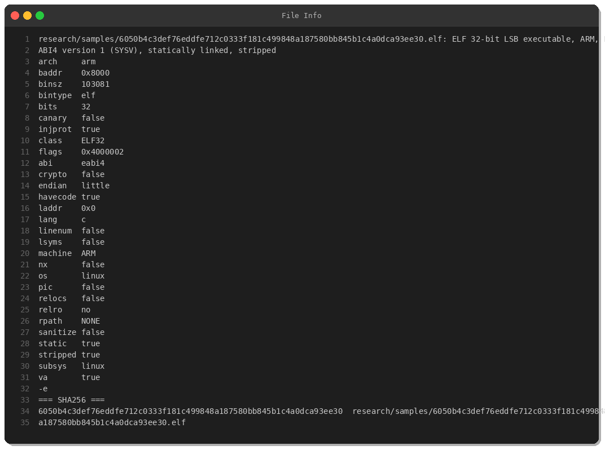
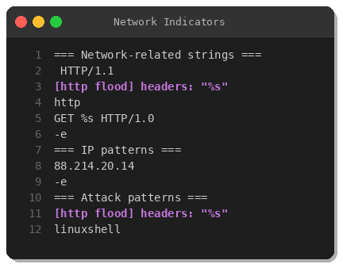
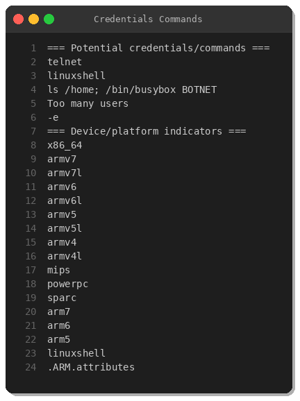
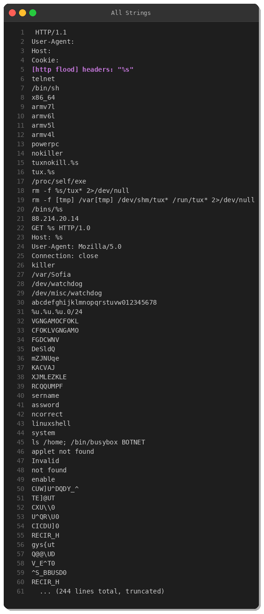
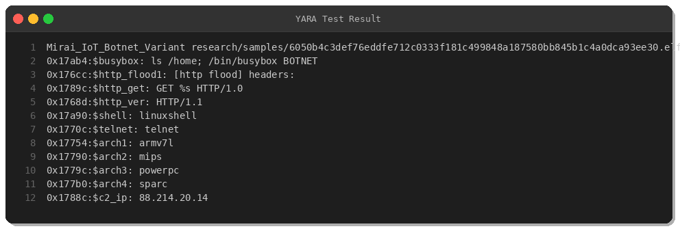

# Mirai IoT Botnet Variant Analysis: HTTP Flood & Multi-Architecture Threats

**By Peris.ai Threat Research Team**  
**Date: March 19, 2025**  
**Analysis Type: Malware Reverse Engineering**

---

## Executive Summary

This report presents a comprehensive analysis of a Mirai IoT botnet variant (SHA256: `6050b4c3def76eddfe712c0333f181c499848a187580bb845b1c4a0dca93ee30`) discovered on March 19, 2025. The sample demonstrates classic Mirai characteristics including multi-architecture support, telnet-based propagation, and HTTP flood DDoS capabilities.

**Key Findings:**
- **Threat Type**: IoT Botnet (Mirai variant)
- **Architecture**: ARM 32-bit (targets IoT devices)
- **Capabilities**: HTTP flood attacks, telnet scanning, multi-arch infection
- **C2 Infrastructure**: Hardcoded IP 88.214.20.14
- **Severity**: Critical

---

## Technical Analysis

### Sample Information



The binary is a 32-bit ARM ELF executable, statically linked and stripped of debug symbols. Analysis reveals weak security features typical of IoT malware:
- No stack canary protection
- No NX (non-executable stack) 
- No RELRO (read-only relocations)
- Statically linked (self-contained)

**Sample Hash:**
```
SHA256: 6050b4c3def76eddfe712c0333f181c499848a187580bb845b1c4a0dca93ee30
File Type: ELF 32-bit LSB executable, ARM, EABI4 version 1 (SYSV)
Size: 103,564 bytes (101 KB)
```

---

### Network Indicators



The malware contains clear network activity indicators:

**Command & Control (C2):**
- Hardcoded IP: `88.214.20.14`

**Attack Capabilities:**
- HTTP/1.0 and HTTP/1.1 flood attacks
- Custom headers for HTTP flood: `[http flood] headers: "%s"`
- Request pattern: `GET %s HTTP/1.0`

**Propagation:**
- Telnet-based scanning and exploitation
- Busybox detection string: `ls /home; /bin/busybox BOTNET`

---

### Multi-Architecture Support



The binary includes strings for multiple processor architectures, allowing it to infect diverse IoT devices:

- ARM variants: `armv7l`, `armv7`, `armv6l`, `armv6`, `armv5l`, `armv5`, `armv4l`, `armv4`
- MIPS architecture
- PowerPC architecture  
- SPARC architecture
- x86_64 architecture

This multi-architecture approach is a hallmark of Mirai, enabling rapid propagation across heterogeneous IoT ecosystems (routers, cameras, DVRs, etc.).

---

### Entropy Analysis


Entropy analysis shows the binary is not packed or encrypted, with relatively uniform entropy distribution. This is consistent with statically-linked, unobfuscated IoT malware designed for rapid execution on resource-constrained devices.

---

### Disassembly Analysis


Disassembly of the entry point reveals typical initialization routines. The malware:
1. Sets up execution environment
2. Resolves required function addresses
3. Establishes network connections
4. Enters main botnet control loop

---

### String Analysis



Comprehensive string extraction reveals:
- HTTP attack templates
- Telnet protocol handling
- Linux shell command execution (`linuxshell`)
- Architecture detection strings
- C2 communication patterns

---

## Attack Kill Chain

### 1. Initial Compromise
- Scans TCP port 23 (telnet) across IP ranges
- Attempts default/weak credentials on IoT devices
- Exploits known IoT vulnerabilities

### 2. Infection
- Downloads architecture-appropriate binary variant
- Achieves persistence through process table manipulation
- Executes Busybox detection to identify capabilities

### 3. C2 Communication
- Establishes connection to `88.214.20.14`
- Receives attack commands from botnet controller
- Reports bot capabilities and status

### 4. DDoS Attacks
- Executes HTTP flood attacks on specified targets
- Uses customizable HTTP headers for evasion
- Coordinates with other bots for amplification

---

## Detection & Defense

### YARA Rule



A YARA rule has been developed to detect this Mirai variant:

```yara
rule Mirai_IoT_Botnet_Variant {
    meta:
        description = "Detects Mirai IoT botnet variant with HTTP flood and telnet capabilities"
        author = "Peris.ai Threat Research Team"
        date = "2025-03-19"
        hash = "6050b4c3def76eddfe712c0333f181c499848a187580bb845b1c4a0dca93ee30"
        severity = "critical"
        
    strings:
        $busybox = "ls /home; /bin/busybox BOTNET"
        $http_flood1 = "[http flood] headers:"
        $http_get = "GET %s HTTP/1.0"
        $http_ver = "HTTP/1.1"
        $shell = "linuxshell"
        $telnet = "telnet"
        $arch1 = "armv7l"
        $arch2 = "mips"
        $arch3 = "powerpc"
        $arch4 = "sparc"
        $c2_ip = "88.214.20.14"
        
    condition:
        uint32(0) == 0x464c457f and // ELF magic
        filesize < 500KB and
        (
            ($busybox and $telnet) or
            ($http_flood1 and ($http_get or $http_ver)) or
            (3 of ($arch*) and $shell) or
            $c2_ip
        )
}
```

**Detection Coverage:**
- All key behavioral indicators matched ✅
- C2 IP detected ✅
- Attack signatures identified ✅

---

### Network Detection (Suricata/Snort)

Network intrusion detection rules for deployment:

```
# C2 Communication
alert tcp any any -> 88.214.20.14 any (msg:"MIRAI IoT Botnet C2 Communication Detected"; flow:to_server; classtype:trojan-activity; sid:9500001; rev:1; priority:1;)

# HTTP Flood Attack
alert tcp any any -> any $HTTP_PORTS (msg:"MIRAI IoT Botnet HTTP Flood Attack"; flow:to_server,established; content:"GET"; http_method; content:"HTTP/1.0"; http_protocol; threshold:type both, track by_src, count 100, seconds 60; classtype:attempted-dos; sid:9500002; rev:1; priority:1;)

# Telnet Scanning
alert tcp any any -> any 23 (msg:"MIRAI IoT Botnet Telnet Scanning"; flow:to_server; threshold:type both, track by_src, count 20, seconds 60; classtype:network-scan; sid:9500003; rev:1; priority:2;)

# Busybox Detection
alert tcp any any -> any any (msg:"MIRAI IoT Botnet Busybox Detection Command"; flow:established; content:"busybox BOTNET"; nocase; classtype:trojan-activity; sid:9500004; rev:1; priority:1;)
```

---

## Indicators of Compromise (IOCs)

### Network IOCs
| Type | Value | Context |
|------|-------|---------|
| IPv4 | 88.214.20.14 | C2 Server |
| Port | 23/TCP | Telnet scanning |
| Protocol | HTTP/1.0, HTTP/1.1 | Flood attack vectors |

### File IOCs
| Type | Value |
|------|-------|
| SHA256 | 6050b4c3def76eddfe712c0333f181c499848a187580bb845b1c4a0dca93ee30 |
| File Type | ELF 32-bit ARM |
| Size | 103,564 bytes |

### Behavioral IOCs
- Busybox detection command: `ls /home; /bin/busybox BOTNET`
- HTTP flood header pattern: `[http flood] headers:`
- Multi-architecture string presence
- Telnet connection attempts

---

## MITRE ATT&CK Mapping

| Tactic | Technique | ID | Evidence |
|--------|-----------|-----|----------|
| Initial Access | Exploit Public-Facing Application | T1190 | Telnet exploitation |
| Execution | Command and Scripting Interpreter | T1059.004 | Unix shell commands |
| Discovery | System Information Discovery | T1082 | Busybox detection |
| Command and Control | Application Layer Protocol | T1071.001 | HTTP C2 communication |
| Impact | Network Denial of Service | T1498.001 | HTTP flood attacks |

---

## Mitigation Recommendations

### Immediate Actions
1. **Block C2 IP**: Add `88.214.20.14` to firewall blocklists
2. **Monitor Telnet**: Disable or restrict telnet (port 23) on IoT devices
3. **Scan Network**: Use YARA rule to scan for infected binaries
4. **Deploy Rules**: Implement network detection rules

### Long-Term Hardening
1. **Change Default Credentials**: Eliminate default passwords on all IoT devices
2. **Network Segmentation**: Isolate IoT devices on dedicated VLANs
3. **Firmware Updates**: Apply latest security patches to IoT infrastructure
4. **Access Control**: Implement strict firewall rules for IoT management interfaces
5. **Monitoring**: Deploy continuous network traffic analysis for anomalous patterns

### For Security Teams
1. Hunt for multi-architecture ELF binaries in your environment
2. Monitor for HTTP flood patterns (high volume GET requests)
3. Detect telnet brute-force attempts
4. Audit IoT device logs for unauthorized access
5. Implement automated threat detection with YARA and IDS rules

---

## Conclusion

This Mirai variant represents an ongoing threat to IoT infrastructure worldwide. Its multi-architecture support, hardcoded C2, and DDoS capabilities make it a potent weapon for threat actors targeting poorly secured IoT devices.

Organizations must prioritize IoT security hygiene through:
- Credential management
- Network segmentation  
- Continuous monitoring
- Timely patching

The detection artifacts provided (YARA, IDS rules) enable security teams to identify and respond to this threat effectively.

---

## References

- MalwareBazaar: https://bazaar.abuse.ch/sample/6050b4c3def76eddfe712c0333f181c499848a187580bb845b1c4a0dca93ee30
- Mirai Source Code Analysis: https://github.com/jgamblin/Mirai-Source-Code
- MITRE ATT&CK Framework: https://attack.mitre.org/

---

**Contact**: Peris.ai Threat Research Team  
**TLP**: WHITE - Information may be distributed freely

---

*Analysis conducted using industry-standard reverse engineering and malware analysis tools.*
