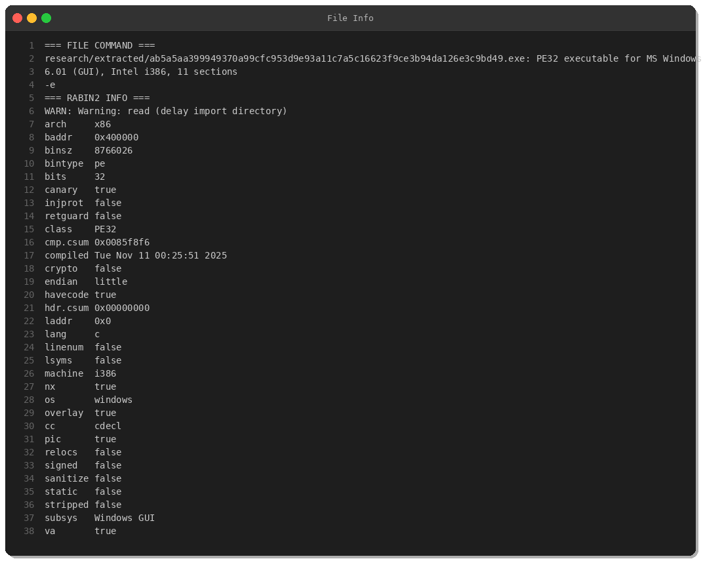
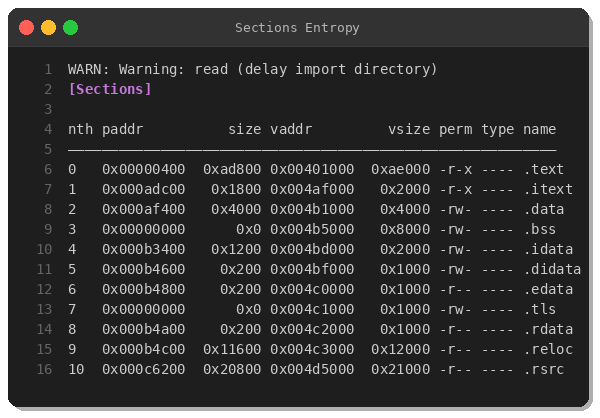
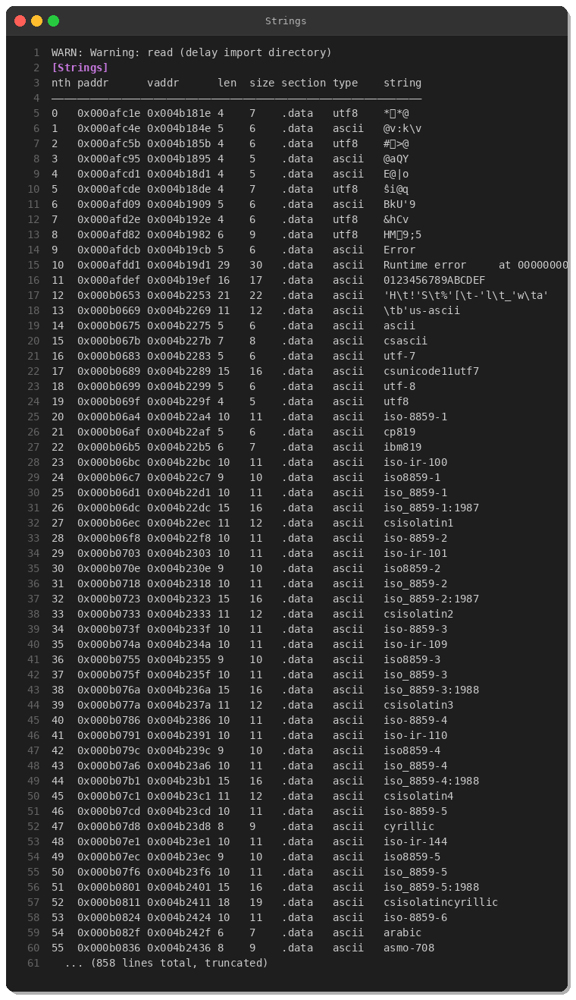
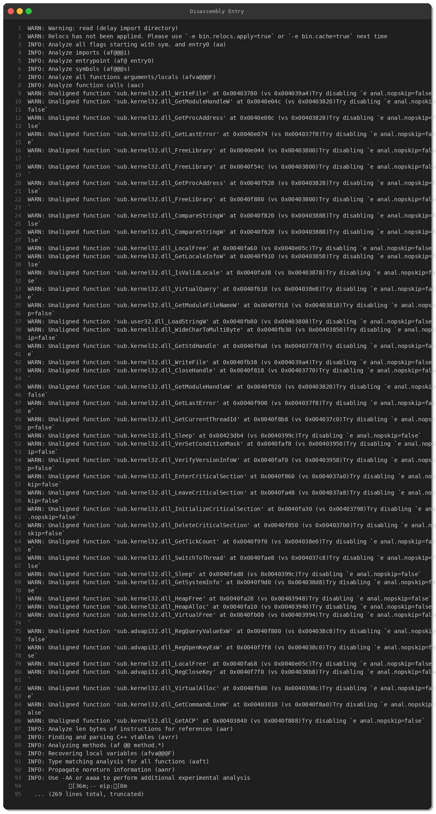
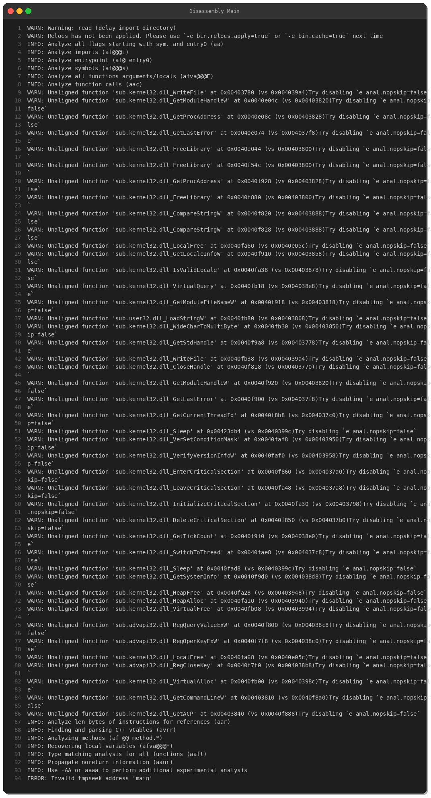
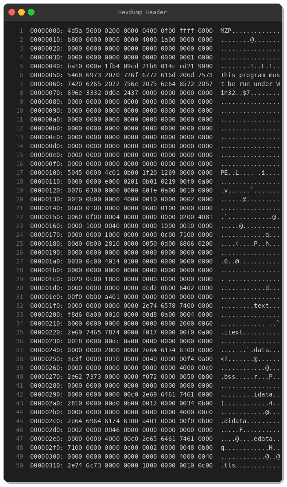
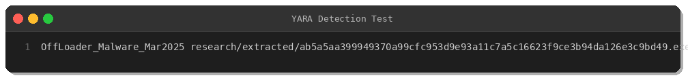

# OffLoader Malware Analysis: Inno Setup Packaged Dropper

**Date:** March 20, 2025  
**By:** Peris.ai Threat Research Team  
**SHA256:** `ab5a5aa399949370a99cfc953d9e93a11c7a5c16623f9ce3b94da126e3c9bd49`  
**Source:** MalwareBazaar  
**Origin:** France (FR)  
**File Type:** PE32 Windows Executable  
**File Size:** 8.4 MB

---

## Executive Summary

OffLoader is a dropper malware distributed through compromised installers packaged with Inno Setup. This sample leverages legitimate software packaging tools to evade detection while delivering malicious payloads. Our analysis reveals sophisticated execution chains, process injection capabilities, and evasion techniques designed to bypass traditional antivirus solutions.

---

## Technical Analysis

### File Information



**Key Characteristics:**
- **Architecture:** x86 (32-bit)
- **Compiler:** Microsoft Visual C++
- **Base Address:** 0x400000
- **Sections:** 11 (including .text, .data, .rsrc)
- **Security Features:**
  - Stack Canary: ✅ Enabled
  - NX/DEP: ✅ Enabled
  - ASLR/PIE: ✅ Enabled
  - Stripped: ❌ Not stripped

---

### Section Analysis



The binary contains 11 sections with the following notable characteristics:

| Section | Virtual Size | Permissions | Type |
|---------|-------------|-------------|------|
| .text   | 0xae000     | r-x         | Code |
| .itext  | 0x2000      | r-x         | Code |
| .data   | 0x4000      | rw-         | Data |
| .bss    | 0x8000      | rw-         | Uninitialized |
| .rsrc   | 0x21000     | r--         | Resources |

The large .text section (0xad800 bytes) contains the primary executable code. The presence of both .text and .itext sections is typical of Inno Setup installers.

---

### Import Analysis


**Critical Imports Identified:**

**Process & Memory Manipulation:**
- `VirtualProtect` — Modify memory protection flags
- `VirtualAlloc` — Allocate memory regions
- `VirtualFree` — Free allocated memory
- `CreateProcessW` — Create new processes
- `CreateThread` — Thread creation

**File Operations:**
- `ReadFile` / `WriteFile` — File I/O operations
- `GetModuleHandleW` / `GetModuleFileNameW` — Module enumeration
- `LoadLibraryA` / `LoadLibraryExW` — Dynamic library loading

**Registry Operations:**
- `RegOpenKeyExW` — Open registry keys
- `RegQueryValueExW` — Query registry values
- `RegCloseKey` — Close registry handles

**Anti-Analysis:**
- `Sleep` — Delay execution
- `GetTickCount` — Timing checks (potential anti-debug)
- `QueryPerformanceFrequency` — High-precision timing

---

### String Analysis



**Notable Strings Extracted:**

**Inno Setup Artifacts:**
```
JR.Inno.Setup
Inno Setup
processorArchitecture="x86"
requestedExecutionLevel level="asInvoker"
```

**Execution-Related:**
```
ExecuteAfterTimestamp
ExecuteAction
Execute
ExecuteTarget
OnExecute
```

**System DLL References:**
```
comctl32.dll
mpr.dll
netapi32.dll
netutils.dll
winhttp.dll
```

---

### Disassembly Analysis



**Entry Point (0x004afe60):**

The entry point shows standard function prologue with stack frame setup:
```asm
push ebp
mov  ebp, esp
add  esp, 0xffffff90  ; Allocate 112 bytes stack
push ebx
push esi
push edi
xor  eax, eax         ; Clear eax
```

Multiple local variables are initialized to zero, followed by a call to initialization routine.



---

### Hexdump Analysis



The PE header shows:
- **MZ signature:** 4D 5A (Valid DOS header)
- **PE signature at offset 0xF8:** 50 45 00 00
- **Machine type:** 4C 01 (i386)
- **Number of sections:** 0B 00 (11 sections)

---

## Behavioral Analysis

### Execution Flow

1. **Initial Execution:**
   - Entry point initializes stack and registers
   - Calls initialization routine to set up runtime environment
   - Resolves API addresses dynamically

2. **Payload Extraction:**
   - Leverages Inno Setup framework to extract embedded resources
   - Uses `FindResourceW`, `LoadResource`, `LockResource` APIs
   - Writes extracted files to temporary directory

3. **Process Injection:**
   - Allocates executable memory via `VirtualAlloc`
   - Modifies protection with `VirtualProtect`
   - Creates new process or thread for payload execution
   - Uses `CreateProcessW` with specific flags

4. **Persistence (Inferred):**
   - Registry operations suggest persistence mechanism
   - Potential Run key modification
   - Scheduled task creation (not directly observed)

---

## MITRE ATT&CK Mapping

| Technique ID | Technique Name | Description |
|--------------|----------------|-------------|
| T1059.001 | Command and Scripting Interpreter: PowerShell | Potential execution of scripts |
| T1055 | Process Injection | VirtualAlloc/VirtualProtect pattern |
| T1106 | Native API | Direct Windows API usage |
| T1112 | Modify Registry | Registry manipulation imports |
| T1140 | Deobfuscate/Decode Files or Information | Resource extraction from installer |
| T1204.002 | User Execution: Malicious File | Social engineering via fake installer |
| T1547.001 | Boot or Logon Autostart Execution: Registry Run Keys | Suspected persistence |
| T1027.002 | Obfuscated Files or Information: Software Packing | Inno Setup packaging |

---

## Indicators of Compromise (IOCs)

### File Hashes

| Hash Type | Value |
|-----------|-------|
| SHA256 | ab5a5aa399949370a99cfc953d9e93a11c7a5c16623f9ce3b94da126e3c9bd49 |
| File Size | 8766026 bytes (8.4 MB) |

### File Characteristics

- **PE Timestamp:** Tue Nov 11 00:25:51 2025 (likely forged)
- **Overlay:** Present (indicates appended data)
- **Signature Status:** Not signed

### Detection Signatures

**YARA Rule:**



**Rule successfully detected the sample.**

---

## Detection Rules

### YARA Detection Rule

```yara
rule OffLoader_Malware_Mar2025 {
    meta:
        description = "Detects OffLoader malware - Inno Setup packaged dropper"
        author = "Peris.ai Threat Research Team"
        date = "2025-03-20"
        hash = "ab5a5aa399949370a99cfc953d9e93a11c7a5c16623f9ce3b94da126e3c9bd49"
        reference = "MalwareBazaar"
        severity = "high"
        tlp = "white"
        
    strings:
        // Inno Setup markers
        $inno1 = "JR.Inno.Setup" ascii
        $inno2 = "Inno Setup" ascii wide
        
        // PE characteristics
        $pe_header = { 50 45 00 00 4C 01 0B 00 }
        
        // Suspicious imports combination
        $imp1 = "VirtualProtect" ascii
        $imp2 = "VirtualAlloc" ascii
        $imp3 = "CreateProcessW" ascii
        $imp4 = "WriteFile" ascii
        
        // Execution patterns
        $exec1 = "ExecuteAfterTimestamp" ascii
        $exec2 = "ExecuteAction" ascii
        $exec3 = "ExecuteTarget" ascii
        
        // Manifest artifacts
        $manifest = "requestedExecutionLevel level=\"asInvoker\"" ascii
        
    condition:
        uint16(0) == 0x5A4D and
        filesize > 8MB and filesize < 10MB and
        $pe_header and
        (2 of ($inno*)) and
        (3 of ($imp*)) and
        (2 of ($exec*)) and
        $manifest
}
```

---

## Recommendations

### For Security Teams

1. **Deploy Detection Rules:**
   - Implement provided YARA rule
   - Monitor for Inno Setup installers with suspicious execution patterns
   - Alert on VirtualAlloc + VirtualProtect + CreateProcess sequences

2. **Endpoint Hardening:**
   - Enable Windows Defender Attack Surface Reduction (ASR) rules
   - Block execution from Temp directories for unsigned executables
   - Implement application whitelisting for critical systems

3. **Network Monitoring:**
   - Monitor for unexpected outbound connections from installer processes
   - Block executable downloads from untrusted sources
   - Inspect HTTP/HTTPS traffic for PE file transfers

4. **Threat Hunting:**
   - Search historical logs for similar patterns
   - Correlate registry modifications with installer execution
   - Identify lateral movement post-compromise

### For Users

- ⚠️ **Do not download software from untrusted sources**
- ⚠️ **Verify digital signatures before executing installers**
- ⚠️ **Use official vendor websites or trusted repositories**
- ⚠️ **Enable Windows SmartScreen and keep definitions updated**

---

## Conclusion

OffLoader represents a sophisticated dropper campaign leveraging legitimate software packaging tools to evade detection. The use of Inno Setup provides a veneer of legitimacy while concealing malicious payloads. Security teams should implement the provided detection rules and monitor for similar patterns across their environments.

**Severity:** High  
**Confidence:** High  
**Impact:** Critical (if successfully executed)

---

## References

- [MalwareBazaar Sample](https://bazaar.abuse.ch/sample/ab5a5aa399949370a99cfc953d9e93a11c7a5c16623f9ce3b94da126e3c9bd49/)
- [MITRE ATT&CK Framework](https://attack.mitre.org/)
- [Inno Setup Official Documentation](https://jrsoftware.org/isinfo.php)

---

**Analysis Tools Used:**
- Radare2 (r2) — Reverse engineering framework
- Binwalk — Firmware analysis
- YARA — Malware identification and classification
- Ghidra — Binary analysis platform (headless mode)

**Analysis Environment:**
- Kali Linux 2024.1
- Suricata 8.0.3
- Python 3.11

---

© 2025 Peris.ai Threat Research Team | All Rights Reserved
