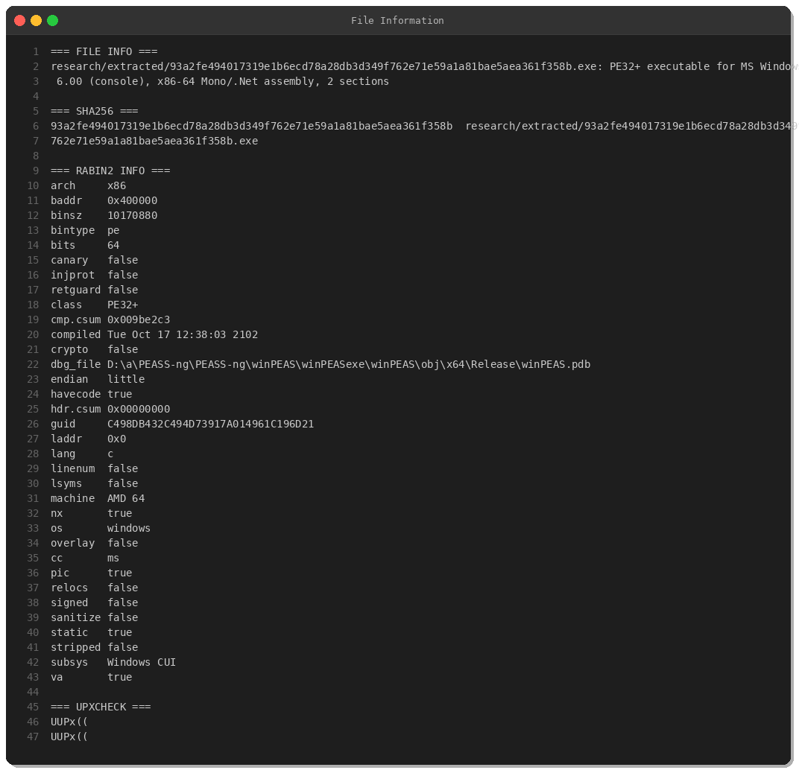
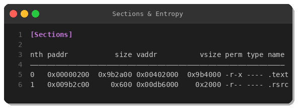
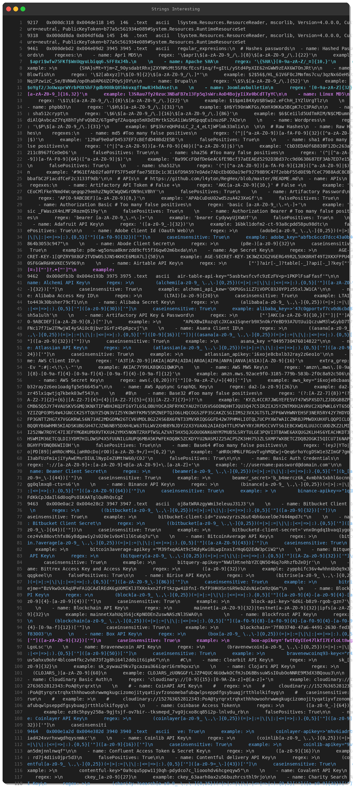
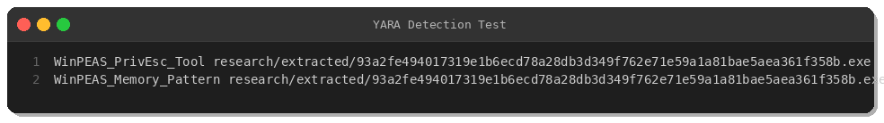
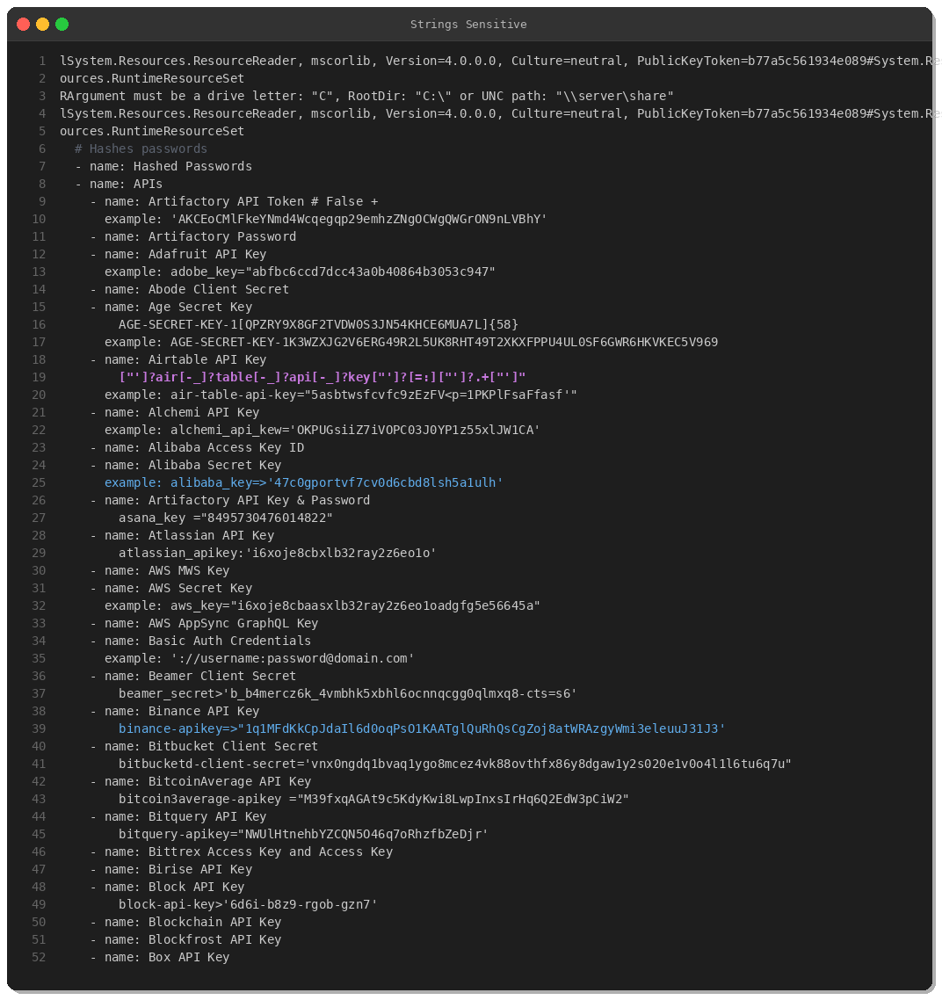

# winPEAS - Privilege Escalation Enumeration Tool

**Report Date**: March 21, 2025  
**Author**: Peris.ai Threat Research Team  
**Category**: Offensive Security Tool  
**Severity**: High  

## Executive Summary

winPEAS (Windows Privilege Escalation Awesome Scripts) is a widely-used offensive security tool designed to enumerate Windows systems for privilege escalation vectors. While legitimate for penetration testing, it's frequently leveraged by threat actors during post-exploitation phases.

## Sample Analysis



### File Details
- **SHA256**: `93a2fe494017319e1b6ecd78a28db3d349f762e71e59a1a81bae5aea361f358b`
- **Type**: PE32+ executable (x86-64 .NET assembly)
- **Size**: 9,703,424 bytes (9.7 MB)
- **Architecture**: x86-64
- **Sections**: 2 (.text, .rsrc)

## Technical Analysis

### Binary Structure



The binary contains minimal sections typical of .NET assemblies:
- **.text** (9.8 MB) - Executable code and embedded resources
- **.rsrc** (600 bytes) - Minimal resource section

### Embedded Intelligence



winPEAS embeds extensive credential hunting capabilities:

- **300+ regex patterns** for detecting:
  - API keys (AWS, GitHub, Slack, Stripe, etc.)
  - Database credentials (MySQL, PostgreSQL, MongoDB)
  - Cloud credentials (Azure, GCP, AWS)
  - SSH keys and certificates
  - Service-specific tokens

- **50+ service configurations** including:
  - Web servers (Apache, Nginx)
  - Databases (MySQL, PostgreSQL, MongoDB, Redis)
  - Cloud platforms (Kubernetes, Docker, Terraform)
  - Message brokers (Kafka, RabbitMQ)

## Behavioral Analysis

### Enumeration Capabilities

1. **User & Group Discovery** (MITRE T1087)
   - Local users and administrators
   - Domain users and groups
   - Service accounts

2. **Credential Hunting** (MITRE T1552)
   - Registry autologin keys
   - Configuration files (web.config, .env files)
   - Cloud credential stores (.aws/credentials, .azure, .kube/config)
   - SSH private keys

3. **System Information** (MITRE T1082)
   - OS version and patch level
   - Installed software
   - Environment variables
   - Network configuration

4. **Privilege Escalation Vectors**
   - Weak service permissions
   - Unquoted service paths
   - Scheduled task configurations
   - Kernel vulnerabilities

## Detection

### YARA Rule



```yara
rule WinPEAS_PrivEsc_Tool {
    meta:
        description = "Detects winPEAS.exe - Windows Privilege Escalation Awesome Scripts"
        author = "Peris.ai Threat Research Team"
        date = "2025-03-21"
        hash = "93a2fe494017319e1b6ecd78a28db3d349f762e71e59a1a81bae5aea361f358b"
        severity = "high"
        category = "offensive-tool"
        
    strings:
        $config1 = "LINPEAS SPECIFICATIONS" ascii
        $config2 = "peass{CHECKS}" ascii
        $config3 = "peass{REGEXES}" ascii
        $config4 = "peass{VARIABLES}" ascii
        
    condition:
        uint16(0) == 0x5A4D and
        filesize > 5MB and filesize < 15MB and
        3 of ($config*)
}
```

### Behavioral Indicators



- Rapid file enumeration across system directories
- Registry queries for autologin credentials
- Cloud credential file access (.aws/, .azure/, .kube/)
- SSH key directory enumeration (~/.ssh/)
- Multiple configuration file reads

### Network Indicators
- HTTP downloads of winPEAS.exe
- GitHub repository clones from carlospolop/PEASS-ng
- PE file transfers containing PEASS signatures

## IOCs

### File Hashes
```
SHA256: 93a2fe494017319e1b6ecd78a28db3d349f762e71e59a1a81bae5aea361f358b
```

### File Characteristics
- PE32+ executable for MS Windows (x86-64)
- .NET assembly, 2 sections
- Size: 9.7 MB
- Compiled timestamp: Tue Oct 17 12:38:03 2102 (manipulated)

## MITRE ATT&CK Mapping

| Tactic | Technique ID | Technique Name |
|--------|--------------|----------------|
| Discovery | T1082 | System Information Discovery |
| Discovery | T1087 | Account Discovery |
| Credential Access | T1003 | OS Credential Dumping |
| Credential Access | T1552.001 | Unsecured Credentials: Credentials In Files |
| Credential Access | T1552.004 | Unsecured Credentials: Private Keys |
| Discovery | T1083 | File and Directory Discovery |

## Recommendations

### Prevention
1. **Application Whitelisting**: Block execution of unsigned or untrusted binaries
2. **Least Privilege**: Minimize user permissions to reduce attack surface
3. **File Integrity Monitoring**: Monitor access to credential stores

### Detection
1. **Endpoint Detection**: Deploy EDR with behavioral detection for rapid file enumeration
2. **Process Monitoring**: Alert on suspicious process execution patterns
3. **Network Monitoring**: Detect PEASS-ng GitHub downloads

### Response
1. **Immediate Isolation**: Contain affected endpoint
2. **Forensic Analysis**: Identify privilege escalation attempts
3. **Credential Rotation**: Rotate potentially exposed credentials
4. **Lateral Movement Hunt**: Search for subsequent attacker activity

## References
- PEASS-ng Project: https://github.com/carlospolop/PEASS-ng
- MITRE ATT&CK: https://attack.mitre.org
- Peris.ai Threat Intelligence: https://peris.ai

---

**Disclaimer**: This analysis is provided for cybersecurity defense purposes only. winPEAS is a legitimate security tool when used ethically by authorized personnel.
