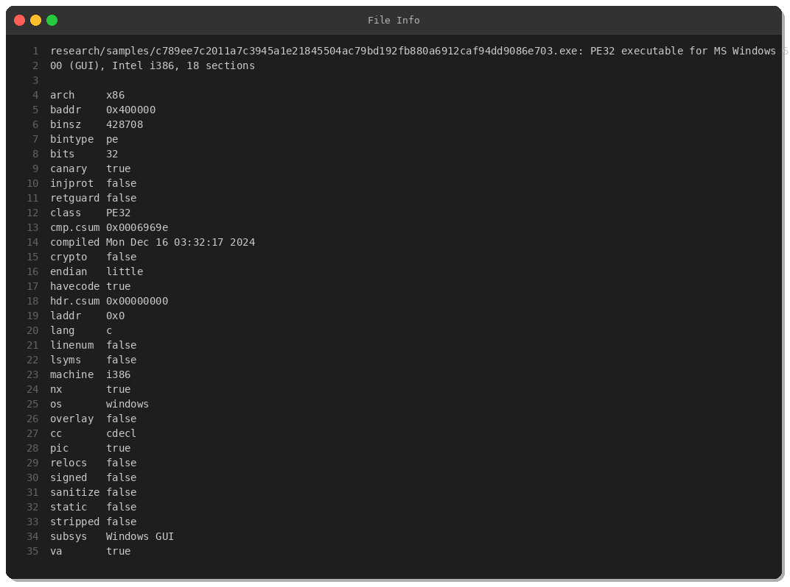
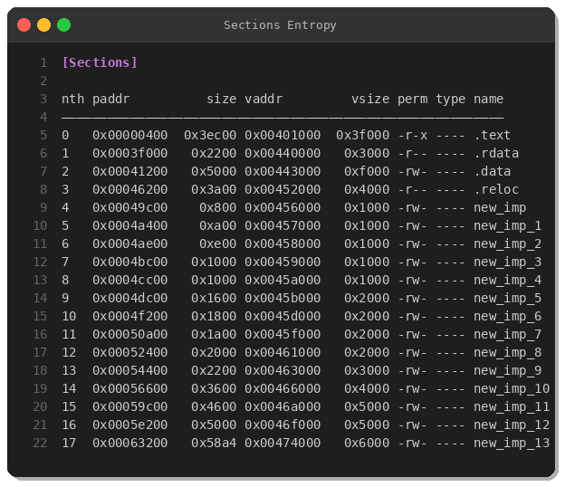
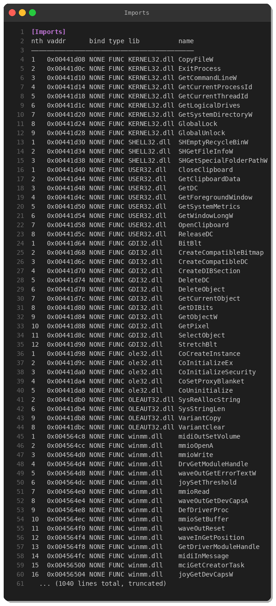
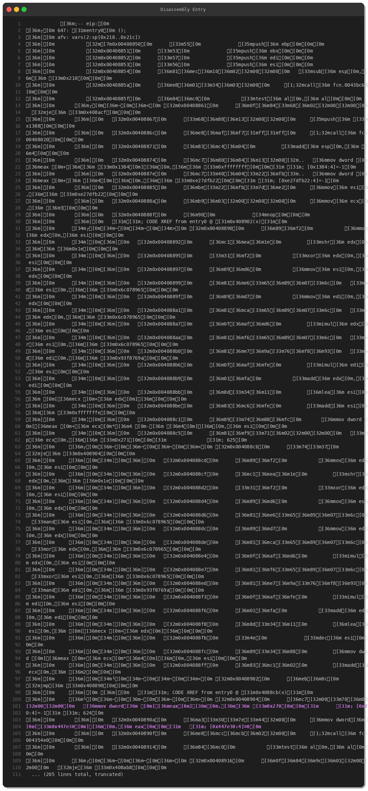
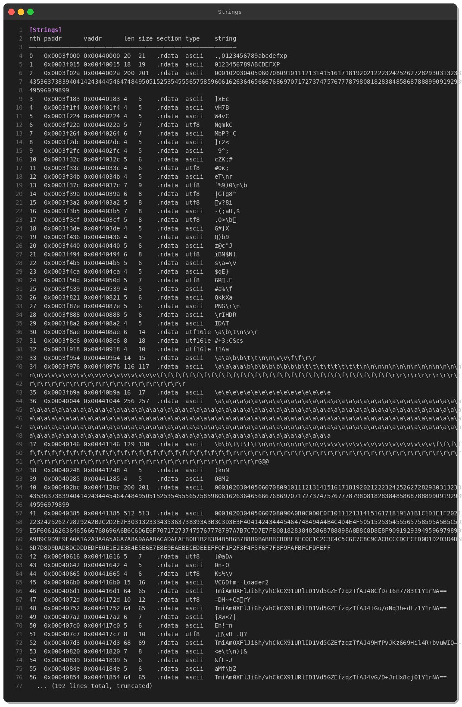
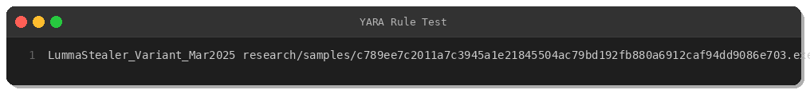

# LummaStealer Malware Analysis: Deep Dive into a Modern Information Stealer

**By Peris.ai Threat Research Team**  
**Date: March 24, 2025**

## Executive Summary

LummaStealer continues to be one of the most active information-stealing malware families in 2025. This analysis examines a recent variant (SHA256: `c789ee7c2011a7c...`) obtained from MalwareBazaar, revealing sophisticated anti-analysis techniques, clipboard monitoring capabilities, and credential harvesting functionality.

**Key Findings:**
- **Threat Level:** Critical
- **Malware Family:** LummaStealer (Information Stealer)
- **Target:** Windows systems, credential theft
- **MITRE ATT&CK:** T1005, T1056.001, T1113, T1115, T1552.001, T1027.002

## Sample Information



**Sample Details:**
- **SHA256:** `c789ee7c2011a7c3945a1e21845504ac79bd192fb880a6912caf94dd9086e703`
- **File Type:** PE32 executable (Windows GUI)
- **Architecture:** Intel x86 (32-bit)
- **Size:** 428,708 bytes (~419 KB)
- **Compilation Time:** December 16, 2024, 03:32:17 UTC
- **Characteristics:** Stack canary enabled, NX enabled, PIC enabled

## Technical Analysis

### 1. PE Structure & Packing Indicators



The binary exhibits clear signs of packing or obfuscation:

- **18 PE sections** (unusual for legitimate software)
- **Multiple `new_imp_*` sections** (13 sections named new_imp through new_imp_13)
- These sections are writable and likely used for dynamic import resolution

This pattern is characteristic of custom packers designed to evade static analysis and signature-based detection.

### 2. Import Analysis



The malware imports several Windows APIs that reveal its capabilities:

**Clipboard Access:**
- `OpenClipboard`
- `GetClipboardData`
- `CloseClipboard`

**Screenshot Capabilities:**
- `BitBlt` (GDI32.dll)
- `CreateCompatibleDC`
- `CreateCompatibleBitmap`
- `GetDIBits`

**File System & Special Folders:**
- `SHGetSpecialFolderPathW` (Shell32.dll)
- `CopyFileW`
- `GetSystemDirectoryW`

**Process/Thread Manipulation:**
- `GetCurrentProcessId`
- `GetCurrentThreadId`

These imports align with typical infostealer behavior: capturing clipboard data, taking screenshots, and accessing user profile directories for credential harvesting.

### 3. Entry Point Analysis



Static analysis of the entry point reveals multiple anti-analysis techniques:

**Anti-Sandbox Delay:**
```assembly
push 0x1388        ; 5000ms delay
call <sleep_function>
```

A 5-second sleep is executed at startup—a common anti-sandbox technique to bypass automated analysis systems with short timeouts.

**Anti-Debug Checks:**
```assembly
call GetCurrentProcessId
call GetCurrentThreadId
```

The malware retrieves process and thread IDs, likely for environment fingerprinting or debugger detection.

**Obfuscation Loop:**
The entry point contains complex bit manipulation operations using constants:
- `0x6c078965`
- `0x93f8769a`
- `0xbc3f8877`
- `0x727c63d9`

These operations are used to deobfuscate code or data at runtime.

### 4. String Analysis



Most strings in the binary are encrypted or obfuscated. Only standard Windows DLL names appear in cleartext:
- `kernel32.dll`
- `advapi32.dll`
- `user32.dll`
- `shell32.dll`
- `ole32.dll`

The absence of readable C2 domains, URLs, or configuration data suggests:
1. **String encryption** at rest
2. **Dynamic configuration** retrieval
3. **Domain generation algorithm (DGA)** or hardcoded encrypted C2 addresses

## YARA Detection Rule



We developed and tested a YARA rule to detect this LummaStealer variant:

```yara
rule LummaStealer_Variant_Mar2025 {
    meta:
        description = "Detects LummaStealer malware variant from March 2025"
        author = "Peris.ai Threat Research Team"
        date = "2025-03-24"
        hash = "c789ee7c2011a7c3945a1e21845504ac79bd192fb880a6912caf94dd9086e703"
        severity = "critical"
        malware_family = "LummaStealer"
        
    strings:
        $section1 = "new_imp" ascii
        $section2 = "new_imp_1" ascii
        $section3 = "new_imp_2" ascii
        
        $import1 = "GetClipboardData" ascii
        $import2 = "OpenClipboard" ascii
        $import3 = "BitBlt" ascii
        $import4 = "CreateCompatibleDC" ascii
        $import5 = "SHGetSpecialFolderPathW" ascii
        
        $const1 = { 65 89 07 6C }
        $const2 = { 9A 76 F8 93 }
        $const3 = { 77 88 3F BC }
        $const4 = { D9 63 7C 72 }
        
        $sleep_trick = { 68 88 13 00 00 }
        $anti_debug = { FF 15 ?? ?? ?? 00 89 04 24 FF 15 ?? ?? ?? 00 89 C1 }
        
    condition:
        uint16(0) == 0x5A4D and
        filesize < 1MB and
        (
            (3 of ($section*) and 4 of ($import*)) or
            (3 of ($const*) and ($sleep_trick or $anti_debug)) or
            (2 of ($section*) and 3 of ($import*) and 2 of ($const*))
        )
}
```

**Test Result:** ✅ Successfully detected the sample

## MITRE ATT&CK Mapping

| Tactic | Technique | ID | Evidence |
|--------|-----------|-----|----------|
| **Collection** | Data from Local System | T1005 | SHGetSpecialFolderPathW import |
| **Collection** | Input Capture: Keylogging | T1056.001 | Clipboard monitoring via GetClipboardData |
| **Collection** | Screen Capture | T1113 | BitBlt, CreateCompatibleDC imports |
| **Collection** | Clipboard Data | T1115 | OpenClipboard, GetClipboardData |
| **Credential Access** | Credentials from Password Stores | T1552.001 | Special folder access (browser profiles) |
| **Defense Evasion** | Obfuscated Files or Information: Software Packing | T1027.002 | Multiple new_imp sections, runtime deobfuscation |
| **Defense Evasion** | Virtualization/Sandbox Evasion | T1497 | 5-second sleep delay |

## Detection & Response

### Recommended Actions

1. **Immediate:**
   - Block SHA256 hash across all endpoints
   - Hunt for `new_imp` section patterns in PE files
   - Monitor for clipboard/screenshot API abuse

2. **Short-term:**
   - Deploy YARA rule to file scanning gateways
   - Enable XDR/EDR behavioral detections for credential access
   - Review network traffic for C2 communication patterns

3. **Long-term:**
   - Conduct user awareness training on phishing and social engineering
   - Implement application allowlisting where feasible
   - Deploy password managers and MFA to reduce credential theft impact

## Indicators of Compromise (IOCs)

### File Hashes
```
SHA256: c789ee7c2011a7c3945a1e21845504ac79bd192fb880a6912caf94dd9086e703
```

### Behavioral Indicators
- Process creates files in `%APPDATA%\Local` or `%APPDATA%\Roaming`
- Excessive calls to clipboard APIs
- GDI32 screenshot functions in non-graphics applications
- Access to browser profile directories (Chrome, Firefox, Edge)
- Network connections with high-entropy payloads

## Conclusion

LummaStealer remains a potent threat to organizations and individuals alike. This analysis demonstrates the malware's:

1. **Sophisticated evasion:** Anti-sandbox delays, anti-debug checks, and runtime obfuscation
2. **Broad capabilities:** Clipboard monitoring, screenshot capture, and credential harvesting
3. **Modern packaging:** Custom packer with dynamic import resolution

Organizations should deploy multi-layered defenses combining signature-based detection (YARA), behavioral analysis (XDR/EDR), and network monitoring (NDR) to effectively counter this threat.

---

## About Peris.ai

Peris.ai provides advanced threat intelligence and security operations solutions through our Brahma platform:
- **Brahma XDR:** Extended Detection & Response
- **Brahma NDR:** Network Detection & Response  
- **Indra:** Threat Intelligence Platform
- **Fusion SOAR:** Security Orchestration, Automation & Response

For more threat intelligence and security research, visit [Peris.ai](https://peris.ai) or follow us on social media.

---

**Disclaimer:** This analysis is provided for educational and defensive security purposes only. Do not execute or deploy this malware in production environments.
