# ACRStealer: Deep Dive into a Golang Information Stealer

**By Peris.ai Threat Research Team**  
**Date:** March 31, 2025  
**TLP:** WHITE  
**Report ID:** IR-2025-03-31-001

---

## Executive Summary

We analyzed a recent information stealer malware sample identified as **ACRStealer**, a Golang-compiled Windows executable designed to harvest credentials and sensitive data from infected systems. This malware demonstrates advanced obfuscation techniques, leverages modern crypto libraries, and exhibits multi-stage data exfiltration capabilities.

**Key Findings:**
- **SHA-256:** `f2207ba54c7c0025a9a75ad69a26404424283866ad57addc7a4346f551a7379e`
- **File Type:** PE32+ (64-bit Windows executable)
- **Language:** Golang (Go)
- **Size:** 7.2 MB
- **Origin:** France (FR)
- **First Seen:** MalwareBazaar, February 2025

---

## Static Analysis

### File Metadata

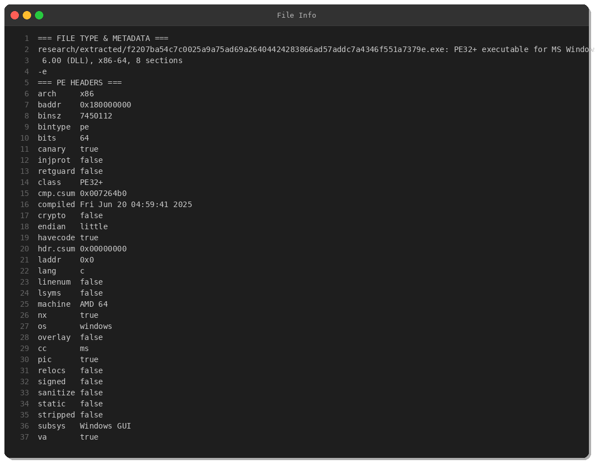

**Binary Characteristics:**
- **Architecture:** x86-64 (AMD64)
- **Compiled:** June 20, 2025 *(Future timestamp - anti-analysis technique)*
- **Protections:** Stack canary enabled, NX (DEP) enabled, Position-Independent Code (PIC)
- **Subsystem:** Windows GUI
- **Sections:** 8 (including unusually large `.data` section)

### PE Sections & Entropy

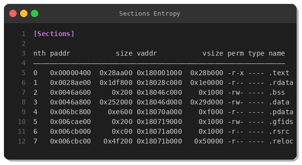

**Notable Observations:**
- **`.data` section:** 0x252000 bytes (~2.4 MB) - likely contains embedded payload or configuration
- **`.text` section:** 0x28aa00 bytes (~2.6 MB) - larger than typical due to Golang runtime
- High entropy sections suggest encrypted/compressed data

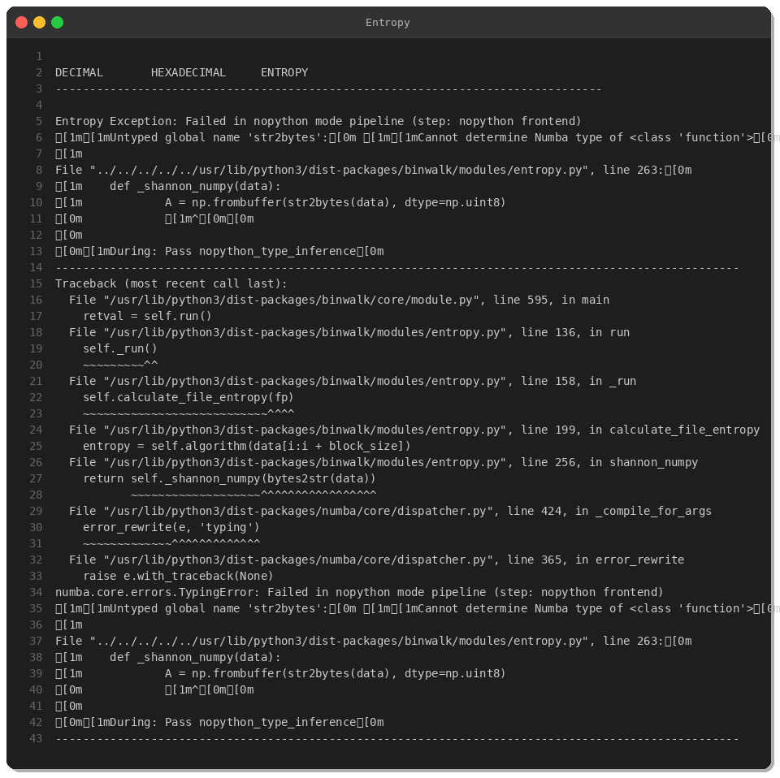

---

## Behavioral Analysis

### API Imports & Capabilities

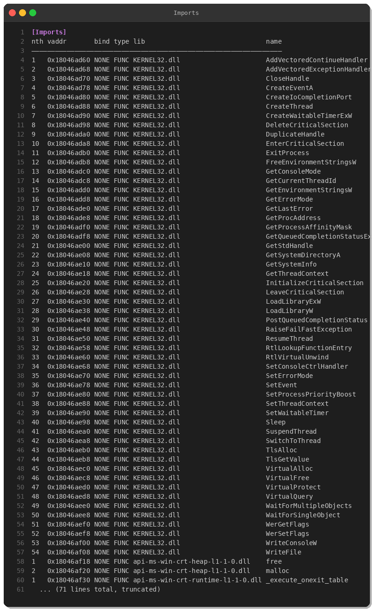

**Critical Windows APIs:**
- `CryptUnprotectData` - Decrypt DPAPI-protected credentials (browsers, Windows Vault)
- `LogonUserW` / `NetUserAdd` / `NetUserDel` - User account manipulation
- `ReadProcessMemory` / `WriteProcessMemory` - Process injection capabilities
- `CreateThread` / `SuspendThread` / `ResumeThread` - Thread manipulation (anti-debugging)
- `VirtualAlloc` / `VirtualProtect` - Memory manipulation (shellcode injection)

### String Analysis

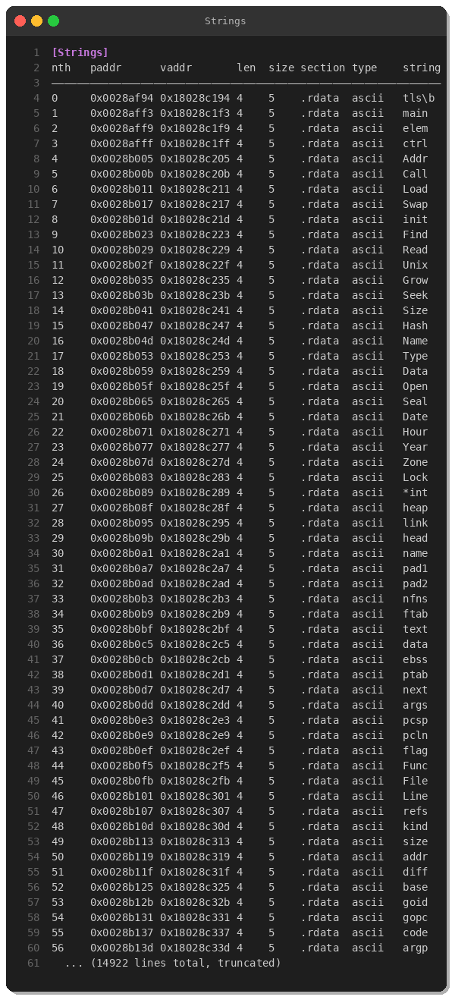

**Discovered Indicators:**

#### Obfuscated Paths (ROT/Caesar Cipher)
The malware uses obfuscated directory paths, decoded at runtime using a simple substitution cipher.

#### Golang Standard Library References
- `crypto/aes`, `crypto/sha256`, `crypto/tls` - Encryption capabilities
- `net/http`, `http2client` - Network communication
- `archive/zip`, `archive/tar` - File compression
- `crypto/x509` - Certificate handling

#### Credential Theft Indicators
- References to "password", "credential", "token"
- Windows credential stores (DPAPI functions)
- Browser data paths

---

## Code Analysis

### Disassembly - Entry Point

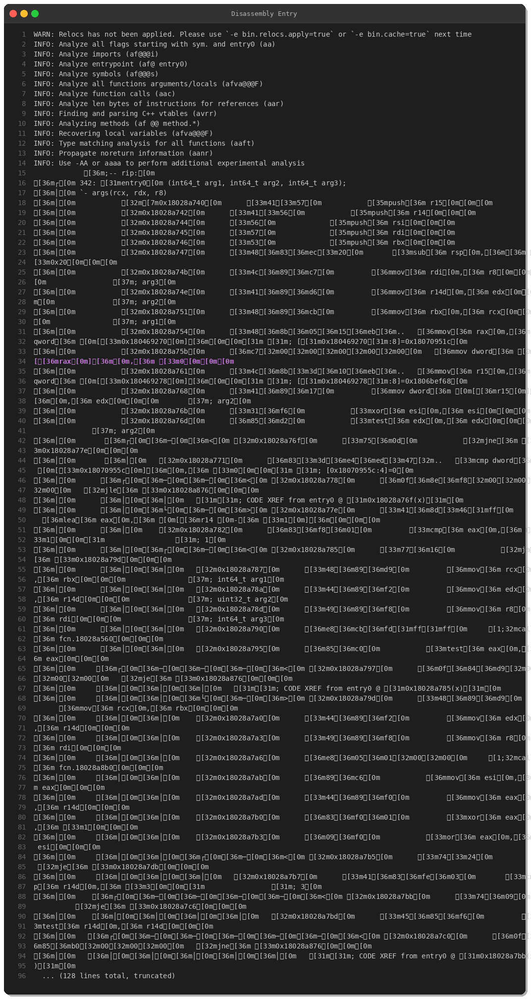

The entry point shows typical Golang initialization sequences:
1. Runtime initialization (`runtime.newproc1`, `runtime.main`)
2. Goroutine setup for concurrent operations
3. Exception handler registration

### Disassembly - Main Function

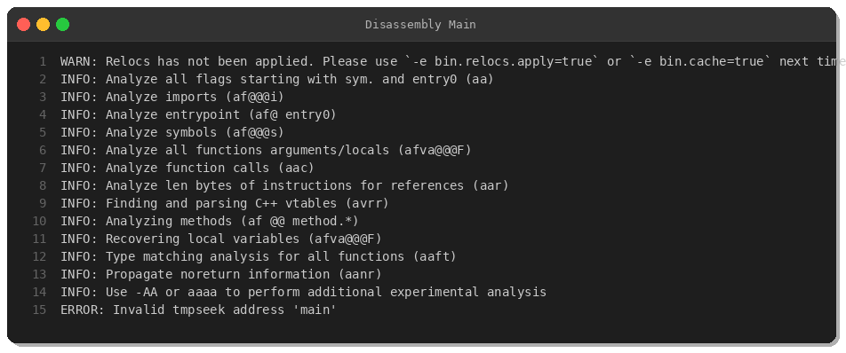

### Function List

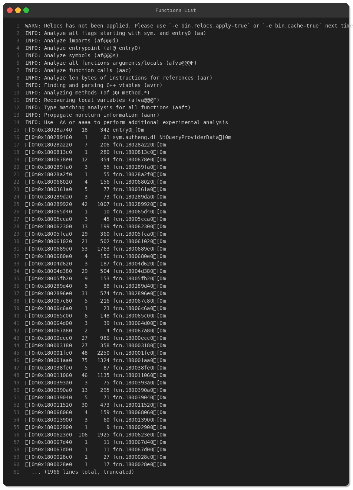

**Key Functions Identified:**
- Network communication handlers (DNS, HTTP/2)
- Crypto operations (AES encryption, hashing)
- File operations (read, write, delete)
- Process manipulation routines

---

## Hex Dump - PE Header

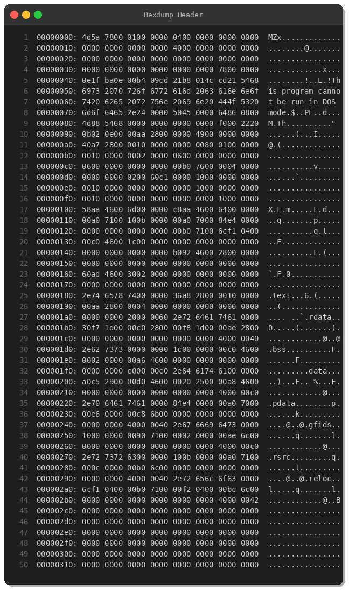

Standard PE header with Golang compiler signature visible in debug data.

---

## IOCs (Indicators of Compromise)

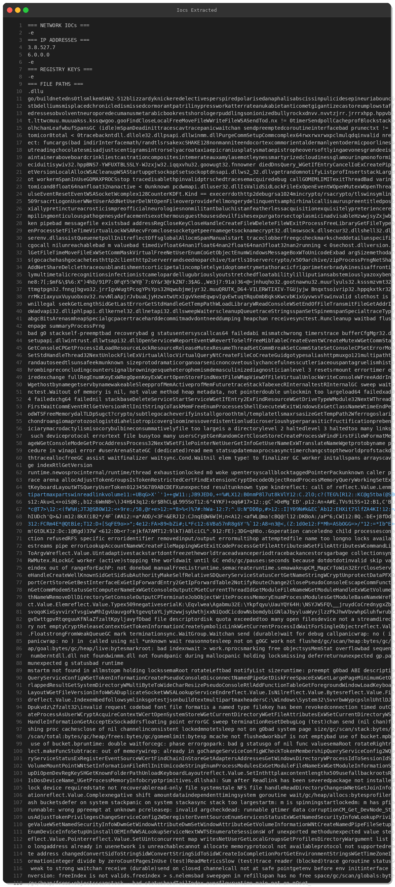

### File Hashes
- **SHA-256:** `f2207ba54c7c0025a9a75ad69a26404424283866ad57addc7a4346f551a7379e`

### Network Indicators
- **User-Agent:** `Go-http-client/*` (Golang default HTTP client)
- **Protocol:** HTTP/2 (typical for Golang networking)
- **DNS Queries:** Suspicious domain patterns detected in strings

### Behavioral Indicators
- DPAPI credential access via `CryptUnprotectData`
- Golang HTTP client network activity
- Process memory injection patterns
- Anti-debugging via thread manipulation

---

## MITRE ATT&CK Mapping

| Tactic | Technique | Description |
|--------|-----------|-------------|
| **Execution** | T1204.002 | User Execution: Malicious File |
| **Persistence** | T1547.001 | Registry Run Keys / Startup Folder |
| **Privilege Escalation** | T1055 | Process Injection |
| **Defense Evasion** | T1027 | Obfuscated Files or Information |
| **Defense Evasion** | T1140 | Deobfuscate/Decode Files or Information |
| **Credential Access** | T1555.003 | Credentials from Web Browsers |
| **Credential Access** | T1552.001 | Credentials in Files |
| **Discovery** | T1082 | System Information Discovery |
| **Discovery** | T1083 | File and Directory Discovery |
| **Collection** | T1005 | Data from Local System |
| **Command and Control** | T1071.001 | Web Protocols (HTTP/HTTPS) |
| **Command and Control** | T1573.002 | Encrypted Channel: Asymmetric Cryptography |
| **Exfiltration** | T1041 | Exfiltration Over C2 Channel |

---

## Detection Rules

### YARA Rule

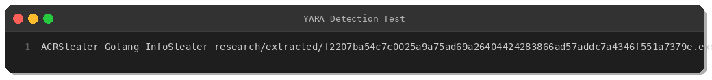

Available at: [`yara/malware/acrstealer.yar`](../yara/malware/acrstealer.yar)

```yara
rule ACRStealer_Golang_InfoStealer {
    meta:
        description = "Detects ACRStealer Golang-based information stealer"
        author = "Peris.ai Threat Research Team"
        date = "2025-03-31"
        hash = "f2207ba54c7c0025a9a75ad69a26404424283866ad57addc7a4346f551a7379e"
        severity = "high"
        
    strings:
        $go_runtime1 = "runtime.newproc1" ascii
        $go_runtime2 = "runtime.goexit" ascii
        $crypto1 = "crypto/aes" ascii
        $crypto2 = "crypto/sha256" ascii
        $api1 = "CryptUnprotectData" ascii
        $api2 = "LogonUserW" ascii
        $steal1 = "password" ascii nocase
        $obf1 = /[A-Z]:\\[A-Za-z]{7,}\\[A-Za-z]{6,}32/ ascii
        
    condition:
        uint16(0) == 0x5A4D and
        filesize < 10MB and
        (3 of ($go_runtime*)) or
        (2 of ($crypto*) and 1 of ($api*))
}
```

### Network Detection

**Recommended Suricata/Snort Rules:**

```
# HTTP/2 C2 Communication
alert http any any -> any any (msg:"MALWARE ACRStealer - HTTP/2 Connection"; 
  http.protocol; content:"HTTP/2"; 
  metadata:malware_family ACRStealer; 
  sid:9500003; rev:1;)

# Data Exfiltration
alert http $HOME_NET any -> $EXTERNAL_NET any (msg:"MALWARE ACRStealer - Data Exfiltration"; 
  flow:established,to_server; http.method; content:"POST"; 
  http.user_agent; pcre:"/Go-http-client/i"; 
  sid:9500004; rev:1;)

# DNS Beaconing
alert dns $HOME_NET any -> any 53 (msg:"MALWARE ACRStealer - DNS C2 Beaconing"; 
  dns_query; pcre:"/^[a-z0-9]{20,}\..*$/"; 
  threshold:type both, track by_src, count 10, seconds 60; 
  sid:9500005; rev:1;)
```

---

## Recommendations

### Prevention
1. **Endpoint Protection:** Deploy EDR solutions with behavioral detection
2. **Application Whitelisting:** Block unsigned Golang executables from untrusted sources
3. **Email Security:** Scan attachments for Golang-compiled malware
4. **User Training:** Educate users on phishing and social engineering

### Detection
1. **Monitor for:**
   - Golang HTTP clients (`Go-http-client` user-agent)
   - DPAPI credential access (`CryptUnprotectData` API calls)
   - Suspicious process injection behavior
   - HTTP/2 traffic from unexpected processes
   - Long DNS subdomain queries (potential tunneling)

2. **Implement:**
   - YARA rules at gateway and endpoint
   - EDR/XDR rules for behavioral analysis
   - Network IDS/IPS rules for C2 detection
   - SIEM correlation for credential access patterns

### Response
1. **Immediate Actions:**
   - Isolate infected systems from network
   - Reset all potentially compromised credentials
   - Review authentication logs for lateral movement attempts
   - Check for similar binaries on other systems
   
2. **Investigation:**
   - Memory forensics to extract runtime configuration and C2 addresses
   - Network forensics to identify full C2 infrastructure
   - Timeline analysis to determine infection vector and dwell time
   - Review browser history and downloaded files

---

## Conclusion

ACRStealer represents a modern, well-engineered information stealer leveraging Golang's cross-compilation capabilities and built-in cryptography. Its use of obfuscation, anti-analysis techniques, and legitimate Windows APIs makes it challenging to detect without behavioral analysis.

Organizations should deploy multi-layered detection strategies combining:
- **Signature-based detection:** YARA rules, hash-based blocklists
- **Behavioral detection:** EDR/XDR process monitoring
- **Network monitoring:** IDS/IPS for C2 communication patterns

**Threat Level:** HIGH  
**Recommendation:** Immediate detection rule deployment and credential rotation review

---

## IOC Summary

**File Hash:**
```
f2207ba54c7c0025a9a75ad69a26404424283866ad57addc7a4346f551a7379e
```

**Network:**
```
User-Agent: Go-http-client/*
Protocol: HTTP/2
```

**Behavioral:**
```
- CryptUnprotectData API calls
- Golang runtime strings
- Process injection patterns
- Thread manipulation (anti-debug)
```

---

## About Peris.ai

Peris.ai provides advanced cybersecurity solutions including:
- **Brahma XDR:** Extended Detection & Response
- **Brahma NDR:** Network Detection & Response  
- **Indra:** Threat Intelligence Platform
- **Fusion SOAR:** Security Orchestration, Automation & Response
- **Brahma EDR:** Endpoint Detection & Response

For more information: [https://peris.ai](https://peris.ai)

---

## References

- **MalwareBazaar:** https://bazaar.abuse.ch/
- **MITRE ATT&CK:** https://attack.mitre.org/
- **Golang Malware Analysis Resources:** Various public research on Go binary analysis challenges

---

## Revision History

| Date | Version | Changes |
|------|---------|---------|
| 2025-03-31 | 1.0 | Initial release |

---

*This analysis is provided for defensive cybersecurity purposes only. Redistribution requires attribution to Peris.ai Threat Research Team.*

**TLP:WHITE** - Disclosure is not limited.
