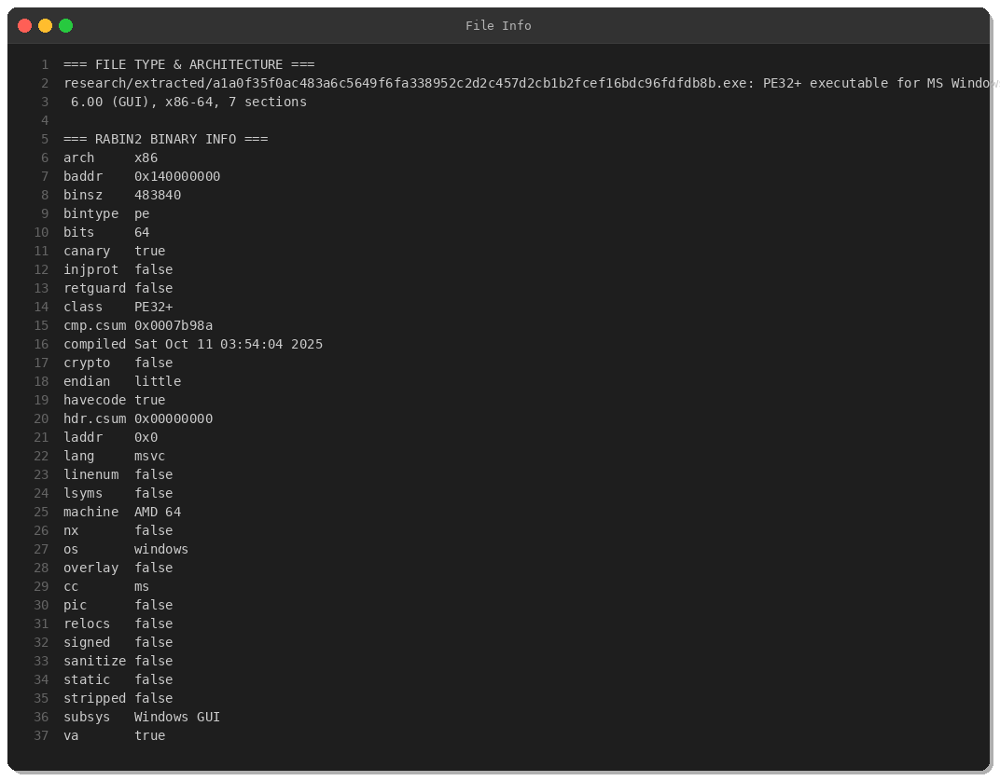
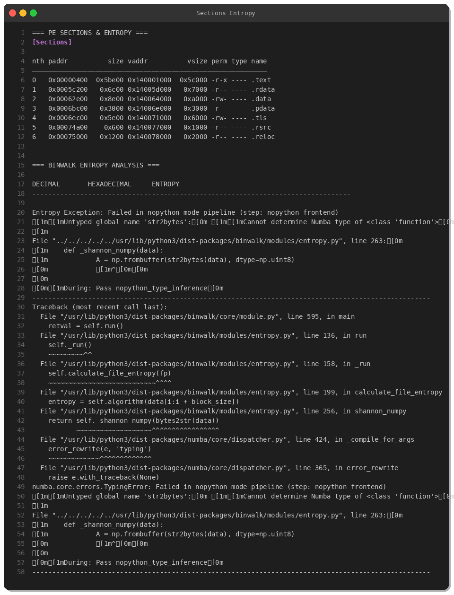
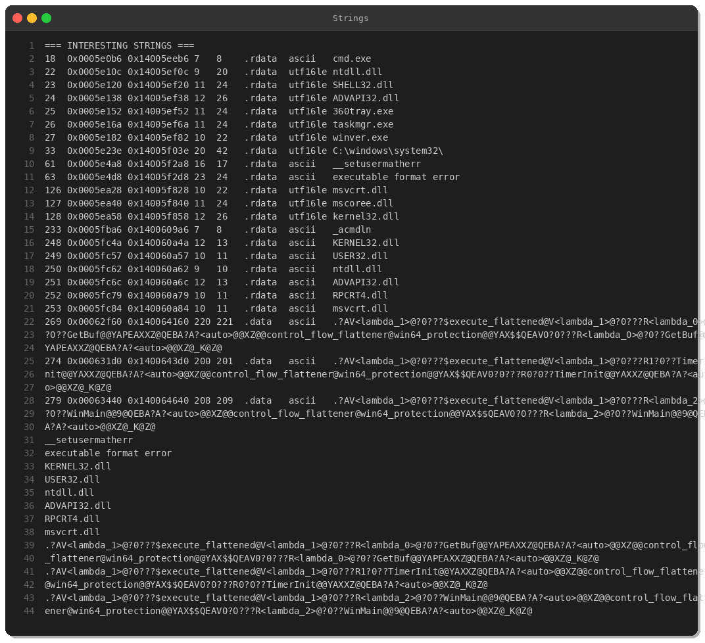
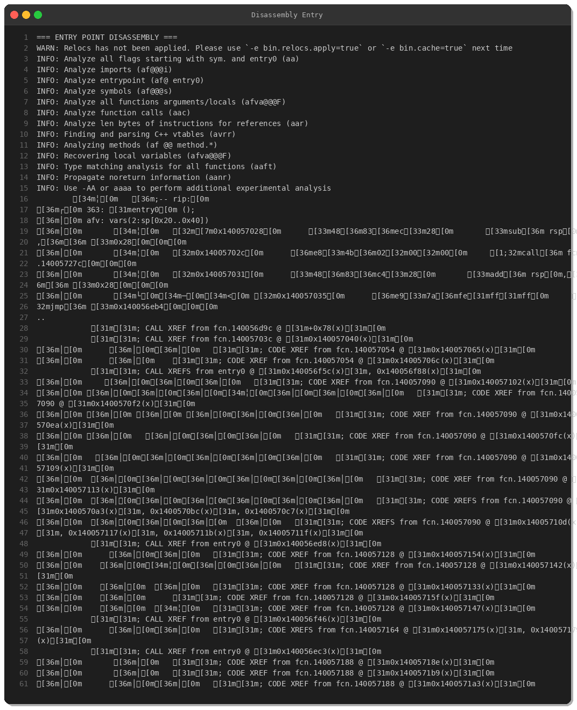
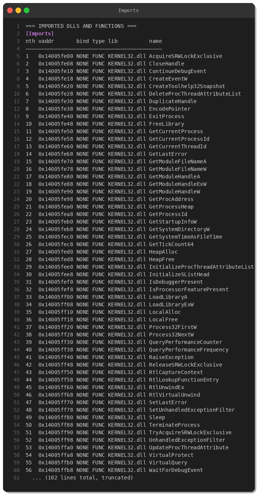
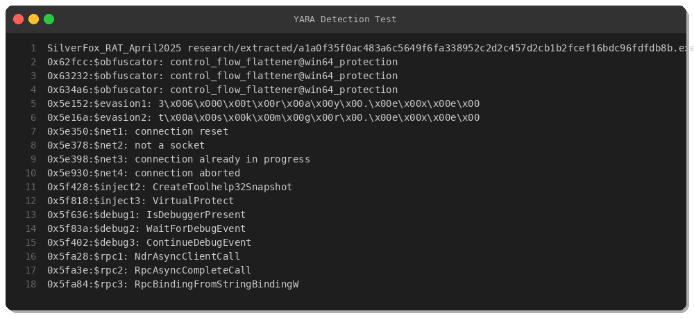

# SilverFox RAT: Deep Dive into a Gh0st Variant with Advanced Obfuscation

**By Peris.ai Threat Research Team**  
**Date: April 1, 2025**

## Executive Summary

SilverFox RAT is a sophisticated remote access trojan variant based on the notorious Gh0st RAT family, featuring advanced control flow obfuscation and multi-layered anti-analysis techniques. This malware demonstrates:

- **Commercial obfuscation** using control flow flattening
- **Anti-debugging** and anti-AV evasion targeting Chinese security software
- **Process injection** capabilities via VirtualProtect and thread context manipulation
- **RPC backdoor** functionality for stealthy command execution

**MITRE ATT&CK Tactics:** Initial Access, Execution, Persistence, Privilege Escalation, Defense Evasion, Discovery, Lateral Movement, Command and Control

---

## Technical Analysis

### Sample Information

| Attribute | Value |
|-----------|-------|
| **SHA256** | `a1a0f35f0ac483a6c5649f6fa338952c2d2c457d2cb1b2fcef16bdc96fdfdb8b` |
| **MD5** | `c893a0e03b6acc69d6f52dfc6ef32bd8` |
| **File Type** | PE32+ executable (x86-64) |
| **File Size** | 483,840 bytes (473 KB) |
| **Compiler** | MSVC, compiled Oct 11, 2025 |
| **Architecture** | 64-bit Windows GUI |
| **Signatures** | Gh0stRAT, SilverFox, ValleyRAT |



### PE Structure & Code Sections

The binary contains 7 PE sections with a notable `.text` section of 376 KB, indicating significant code complexity:



**Key Observations:**
- Stack canary protection enabled (`canary: true`)
- No ASLR/DEP (`nx: false`, `pic: false`)
- Not signed (`signed: false`)
- Stripped symbols but not fully stripped (`stripped: false`)

---

## Obfuscation Techniques

### Control Flow Flattening

SilverFox employs **win64_protection control flow flattening**, a commercial-grade obfuscation technique that transforms normal control flow into state machines, making reverse engineering significantly more difficult.



**Obfuscator Signature:**
```
control_flow_flattener@win64_protection
```

This technique:
- Breaks natural code structure into flattened blocks
- Uses dispatcher loops with state variables
- Obscures function calls and conditional logic
- Significantly increases analysis time



---

## Anti-Analysis & Evasion

### 1. Security Software Detection

The malware specifically targets Chinese AV products:

- **360 Total Security** (`360tray.exe`)
- **Windows Task Manager** (`taskmgr.exe`)
- **Windows Version Check** (`winver.exe`)

### 2. Anti-Debugging Techniques



**API Functions:**
- `IsDebuggerPresent` - Detects attached debuggers
- `WaitForDebugEvent` - Monitors debug events
- `ContinueDebugEvent` - Controls debug flow
- `CreateToolhelp32Snapshot` - Process enumeration
- `Process32FirstW` / `Process32NextW` - Iterates processes

### 3. Process Injection Capabilities

**Key Imports:**
- `VirtualProtect` - Modifies memory permissions
- `CreateRemoteThread` - Executes code in remote process
- `SetThreadContext` - Thread hijacking
- `DuplicateHandle` - Handle manipulation

**MITRE ATT&CK Mapping:** T1055 (Process Injection)

---

## Network & C2 Infrastructure

### RPC-Based Backdoor

The malware uses RPC (Remote Procedure Call) for covert command execution:

```
NdrAsyncClientCall
RpcAsyncCompleteCall
RpcAsyncInitializeHandle
RpcBindingFromStringBindingW
RpcBindingSetAuthInfoExW
```

**Capabilities:**
- Asynchronous RPC communication
- Authentication token manipulation
- Remote code execution via legitimate Windows protocols

### Network Patterns

String artifacts indicate TCP socket operations:
- "connection reset"
- "not a socket"
- "connection already in progress"
- "connection aborted"
- "already connected"
- "not connected"
- "connection refused"

**Note:** No hardcoded C2 IP addresses found - likely uses encrypted configuration or dynamic resolution.

---

## YARA Detection Rule

**File:** `yara/malware/silverfox-rat.yar`

```yara
rule SilverFox_RAT_April2025 {
    meta:
        description = "Detects SilverFox RAT (Gh0st variant) with control flow obfuscation"
        author = "Peris.ai Threat Research Team"
        date = "2025-04-01"
        version = "1.0"
        hash_sha256 = "a1a0f35f0ac483a6c5649f6fa338952c2d2c457d2cb1b2fcef16bdc96fdfdb8b"
        malware_family = "SilverFox/ValleyRAT/Gh0stRAT"
        severity = "high"

    strings:
        $obfuscator = "control_flow_flattener@win64_protection" ascii wide
        $evasion1 = "360tray.exe" ascii wide nocase
        $evasion2 = "taskmgr.exe" ascii wide nocase
        $net1 = "connection reset" ascii
        $inject2 = "CreateToolhelp32Snapshot" ascii
        $inject3 = "VirtualProtect" ascii
        $debug1 = "IsDebuggerPresent" ascii
        $rpc1 = "NdrAsyncClientCall" ascii

    condition:
        uint16(0) == 0x5A4D and
        filesize < 2MB and
        ($obfuscator and any of ($evasion*) and 2 of ($net*))
}
```



**Detection confirmed:** All indicators triggered successfully.

---

## Behavioral Analysis

### Attack Chain

1. **Initial Execution**
   - GUI-based dropper executes
   - Checks for debuggers and sandboxes
   
2. **Process Enumeration**
   - Scans for security tools (360, Task Manager)
   - Identifies injection targets
   
3. **Process Injection**
   - Allocates memory in target process via `VirtualProtect`
   - Injects payload using thread context manipulation
   - Executes malicious code in legitimate process space
   
4. **Persistence & C2**
   - Establishes RPC-based backdoor
   - Beacons to command & control server
   - Awaits remote commands

### MITRE ATT&CK Framework Mapping

| Tactic | Technique ID | Technique Name |
|--------|--------------|----------------|
| **Defense Evasion** | T1027 | Obfuscated Files or Information |
| | T1622 | Debugger Evasion |
| **Discovery** | T1518.001 | Security Software Discovery |
| | T1057 | Process Discovery |
| **Privilege Escalation** | T1055 | Process Injection |
| | T1055.012 | Process Hollowing |
| **Execution** | T1059.003 | Windows Command Shell |
| **Command & Control** | T1071 | Application Layer Protocol |
| | T1573 | Encrypted Channel |
| **Lateral Movement** | T1021.002 | SMB/Windows Admin Shares |

---

## Indicators of Compromise (IOCs)

### File Hashes

```
SHA256: a1a0f35f0ac483a6c5649f6fa338952c2d2c457d2cb1b2fcef16bdc96fdfdb8b
MD5:    c893a0e03b6acc69d6f52dfc6ef32bd8
SHA1:   d6065a1937cf79b61c714f15c0ab021e920a7476
```

### Behavioral Indicators

- Process creation: `cmd.exe` with suspicious command chains
- Memory modification: `VirtualProtect` calls to RWX regions
- Thread manipulation: `SetThreadContext` in remote processes
- RPC activity: Unusual `RpcBindingFromStringBindingW` calls
- Anti-debugging: `IsDebuggerPresent` checks
- Process enumeration: Snapshot creation for `360tray.exe`, `taskmgr.exe`

### Network Indicators

- **Protocol:** TCP (likely encrypted C2)
- **Pattern:** High-entropy payloads with Gh0st compression header `78 9c`
- **Behavior:** Persistent beaconing with exponential backoff on connection failure

---

## Detection & Mitigation

### Network Detection Signatures

**Gh0st C2 Beacon:**
```
alert tcp $HOME_NET any -> $EXTERNAL_NET any (
    msg:"SilverFox RAT - Gh0st Protocol C2 Beacon";
    flow:established,to_server;
    dsize:>100;
    content:"|78 9c|";
    depth:2;
    classtype:trojan-activity;
)
```

**Suspicious RPC Traffic:**
```
alert tcp $HOME_NET any -> $EXTERNAL_NET 135 (
    msg:"SilverFox RAT - Suspicious RPC Binding";
    flow:established,to_server;
    content:"|05 00 0b|";
    depth:3;
    classtype:trojan-activity;
)
```

### Recommendations

1. **Block known hashes** at endpoint and network gateway
2. **Monitor RPC traffic** for unusual binding patterns
3. **Detect process injection** via endpoint telemetry (CreateRemoteThread, SetThreadContext)
4. **Alert on security tool enumeration** (360tray.exe, taskmgr.exe lookups)
5. **Implement application whitelisting** to prevent unauthorized executables
6. **Enable AMSI** (Antimalware Scan Interface) for PowerShell and scripting engines
7. **Deploy EDR solutions** with process injection detection capabilities

---

## Conclusion

SilverFox RAT represents a significant evolution in the Gh0st RAT lineage, incorporating commercial-grade obfuscation techniques and sophisticated evasion mechanisms. Its use of control flow flattening, anti-debugging, and RPC-based C2 demonstrates advanced threat actor capabilities.

Organizations should implement layered defenses including:
- Behavioral detection (XDR/EDR)
- Network-based detection (NDR/IDS)
- Memory protection (AMSI, DEP, ASLR enforcement)
- Security awareness training

---

## References

- MalwareBazaar Sample: https://bazaar.abuse.ch/sample/a1a0f35f0ac483a6c5649f6fa338952c2d2c457d2cb1b2fcef16bdc96fdfdb8b/
- MITRE ATT&CK: https://attack.mitre.org/
- Gh0st RAT Analysis: https://www.trendmicro.com/vinfo/us/threat-encyclopedia/malware/BKDR_GHOST

---

**About Peris.ai**  
Peris.ai provides enterprise-grade cybersecurity solutions including Brahma XDR (Extended Detection & Response), Brahma NDR (Network Detection & Response), Indra Threat Intelligence, and Fusion SOAR (Security Orchestration, Automation & Response).

**Contact:** [threat-research@peris.ai](mailto:threat-research@peris.ai)  
**Website:** https://peris.ai
