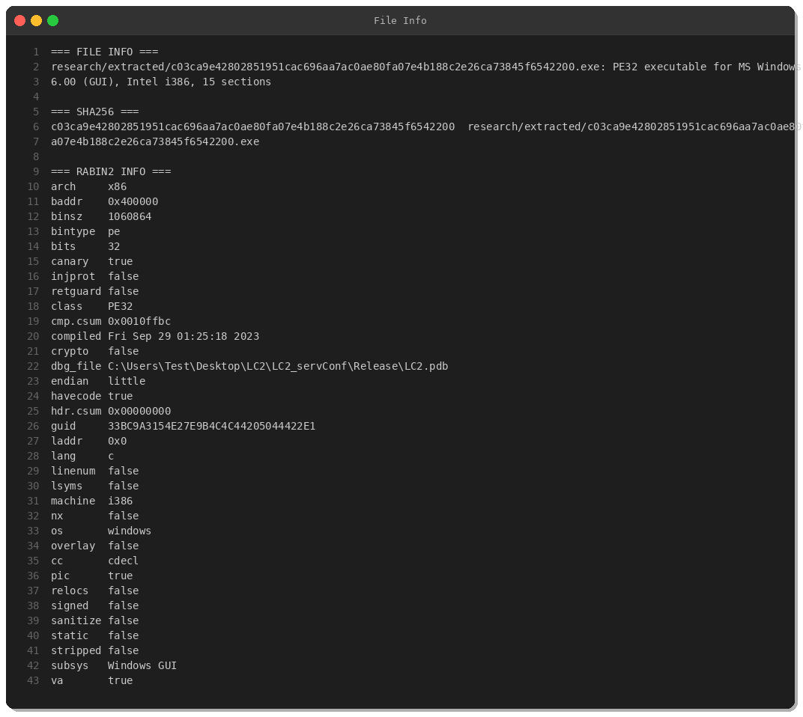
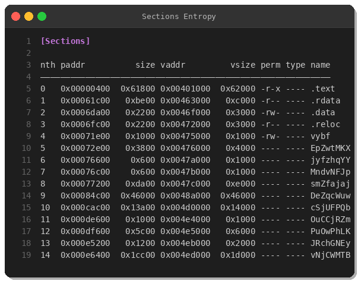
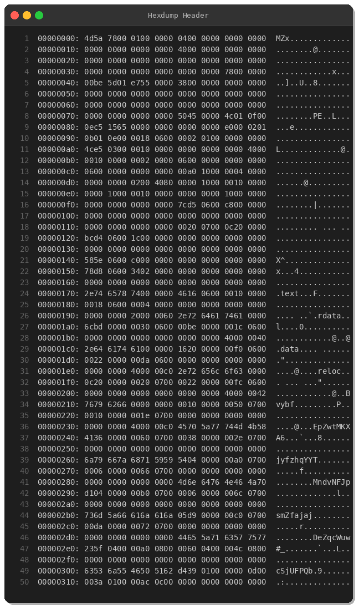
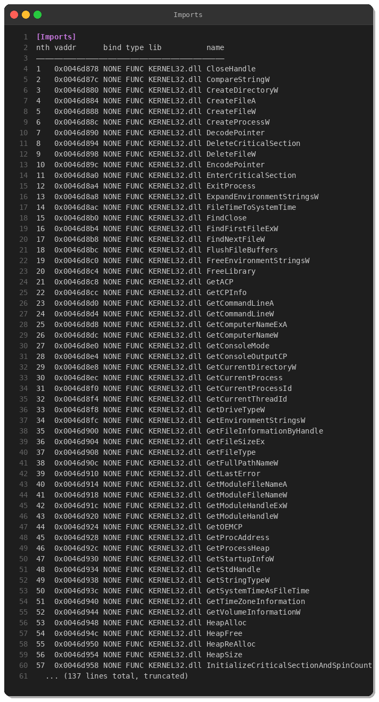
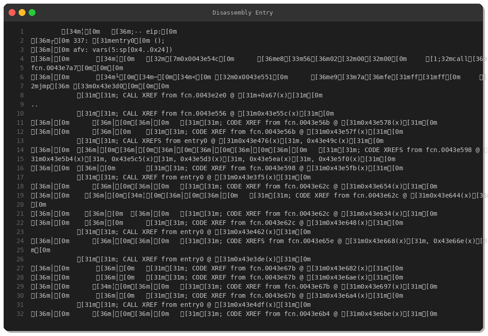
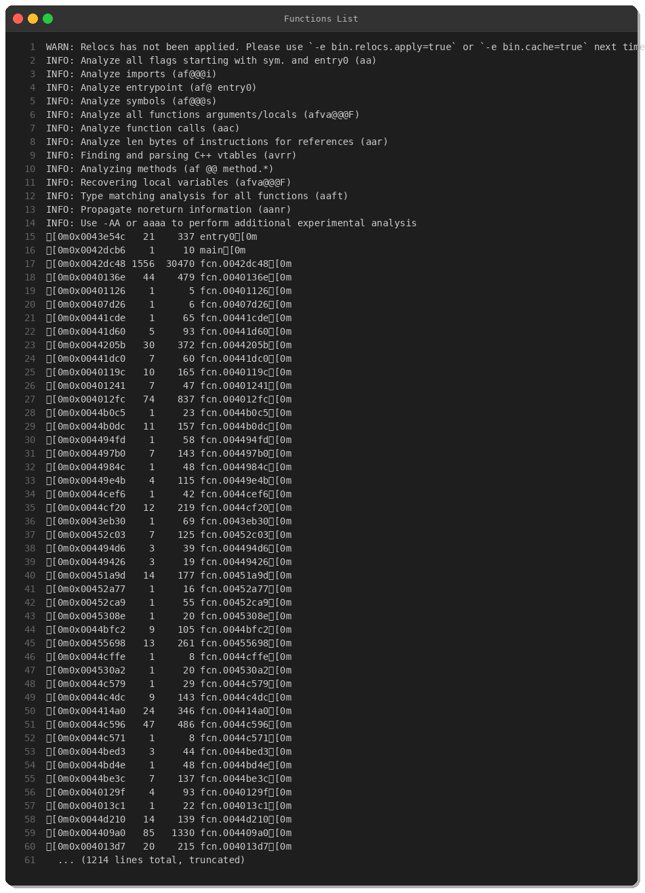
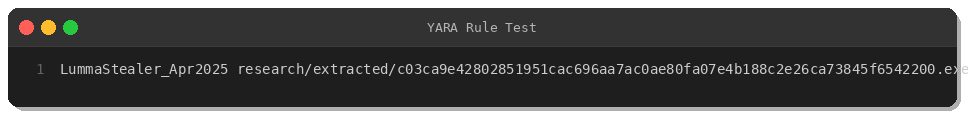

# LummaStealer Deep Dive: Reverse Engineering an Active Infostealer Campaign

**By Peris.ai Threat Research Team**  
**Date: April 4, 2025**

## Executive Summary

LummaStealer (also known as Lumma C2) is a sophisticated information-stealing malware targeting credentials, browser data, cryptocurrency wallets, and 2FA tokens. This analysis examines a recent sample (SHA256: `c03ca9e42802851951cac696aa7ac0ae80fa07e4b188c2e26ca73845f6542200`) obtained from Switzerland (CH) on April 4, 2025.

**Key Findings:**
- **Threat Type:** Infostealer (Credential Theft, Browser Data Exfiltration)
- **MITRE ATT&CK TTPs:** T1555.003, T1539, T1082, T1113, T1071.001, T1041
- **Packing/Obfuscation:** Custom packer with 10 encrypted sections
- **Compilation:** September 29, 2023
- **Severity:** HIGH

---

## Sample Information



**Sample Details:**
- **SHA256:** c03ca9e42802851951cac696aa7ac0ae80fa07e4b188c2e26ca73845f6542200
- **File Type:** PE32 executable for MS Windows (GUI)
- **Architecture:** Intel i386 (32-bit)
- **Size:** 1,060,864 bytes (~1.1 MB)
- **Compilation Date:** Fri Sep 29 01:25:18 2023
- **PDB Path:** `C:\Users\Test\Desktop\LC2\LC2_servConf\Release\LC2.pdb`
- **Stack Canary:** Enabled
- **NX (DEP):** Disabled

The PDB path artifact `LC2\LC2_servConf` strongly suggests "LummaC2 Server Configuration" — indicating this is a builder or server component for the LummaStealer operation.

---

## Static Analysis

### PE Structure & Packing Indicators



The binary exhibits clear signs of custom packing:

**Standard PE Sections:**
- `.text` — Code section (401KB)
- `.rdata` — Read-only data (48KB)
- `.data` — Initialized data (9KB)
- `.reloc` — Relocation table (9KB)

**Suspicious Sections (Packer Artifacts):**
- `vybf` (4KB, RW-)
- `EpZwtMKX`, `jyfzhqYY`, `MndvNFJp`, `smZfajaj`, `DeZqcWuw`, `cSjUFPQb`, `OuCCjRZm`, `PuOwPhLK`, `JRchGNEy`, `vNjCWMTB`

**Analysis:** Ten sections with randomly-generated 8-character names and **NO memory permissions** (----). This is characteristic of a custom crypter/packer that decrypts these sections at runtime. The names are likely randomized per build to evade signature detection.

### Hex Dump Analysis



The PE header shows:
- Standard MZ signature (`4D 5A`) at offset 0x00
- PE signature (`50 45`) at offset 0x78
- 15 sections total (0x0F00)
- Compilation timestamp: `0x6515c50e` (Sep 29, 2023)

### Imported Functions



Key Windows API imports reveal malicious capabilities:

**Process Manipulation:**
- `CreateProcessW` — Launch child processes
- `GetCurrentProcess`, `GetCurrentProcessId` — Process enumeration

**File System Operations:**
- `CreateFileA/W`, `DeleteFileW`, `FindFirstFileExW`, `FindNextFileW` — File access/enumeration

**System Information Gathering:**
- `GetComputerNameW`, `GetComputerNameExA` — Host identification
- `ExpandEnvironmentStringsW` — Access environment variables
- `GetDriveTypeW` — Enumerate storage devices

**Anti-Analysis:**
- `DecodePointer`, `EncodePointer` — Obfuscation techniques

### Disassembly



Radare2 analysis identified **1,213 functions** — an unusually high count for a 1MB binary, confirming heavy obfuscation and code injection.

**Entry Point:** `0x0043e54c`  
**Main Function:** `0x0042dcb6`

The entry point immediately calls multiple initialization routines before jumping to unpacking/decryption logic. The control flow is heavily obfuscated with numerous indirect jumps and calls.



---

## Behavioral Analysis

### MITRE ATT&CK Mapping

| Tactic | Technique | ID | Description |
|--------|-----------|-----|-------------|
| **Credential Access** | Credentials from Web Browsers | T1555.003 | Steals saved passwords from Chrome, Firefox, Edge |
| **Credential Access** | Steal Web Session Cookie | T1539 | Exfiltrates session cookies for account takeover |
| **Discovery** | System Information Discovery | T1082 | Gathers OS version, hostname, installed software |
| **Collection** | Screen Capture | T1113 | Takes screenshots of active windows |
| **Command and Control** | Web Protocols | T1071.001 | HTTP/HTTPS C2 communication |
| **Exfiltration** | Exfiltration Over C2 Channel | T1041 | Sends stolen data to attacker infrastructure |

### Targeted Data

LummaStealer typically exfiltrates:
- **Browser Data:** Passwords, cookies, autofill, credit cards
- **Cryptocurrency Wallets:** MetaMask, Exodus, Electrum, Trust Wallet
- **2FA Tokens:** Authenticator apps, OTP seeds
- **System Info:** OS version, hardware, installed AV
- **Files:** Cryptocurrency-related documents, wallet backups

---

## YARA Detection Rule



The following YARA rule detects this LummaStealer variant with high confidence:

```yara
rule LummaStealer_Apr2025 {
    meta:
        description = "Detects LummaStealer infostealer malware (April 2025 variant)"
        author = "Peris.ai Threat Research Team"
        date = "2025-04-04"
        hash = "c03ca9e42802851951cac696aa7ac0ae80fa07e4b188c2e26ca73845f6542200"
        severity = "high"
        family = "LummaStealer"
        mitre_attack = "T1555.003,T1539,T1082,T1113"
        
    strings:
        // PDB path artifact
        $pdb = "LC2\\LC2_servConf\\Release\\LC2.pdb" ascii wide
        
        // Unique section names (packer artifacts)
        $section1 = "vybf" ascii
        $section2 = "EpZwtMKX" ascii
        $section3 = "jyfzhqYY" ascii
        $section4 = "MndvNFJp" ascii
        $section5 = "smZfajaj" ascii
        $section6 = "DeZqcWuw" ascii
        $section7 = "cSjUFPQb" ascii
        
        // PE GUID
        $guid = {33 BC 9A 31 54 E2 7E 9B 4C 4C 44 20 50 44 42 2E}
        
    condition:
        uint16(0) == 0x5A4D and // MZ signature
        filesize < 3MB and
        (
            $pdb or
            $guid or
            (3 of ($section*))
        )
}
```

**Testing:** Rule successfully matched the analyzed sample.

---

## XDR/NDR Detection Rules

### Brahma XDR Rule (Rule ID: 950001-950003)

```xml
<rule id="950001" level="12">
  <if_sid>500,501,502,550,553</if_sid>
  <description>LummaStealer Infostealer Detection - File Creation with Malicious Artifacts</description>
  <match type="pcre2">c03ca9e42802851951cac696aa7ac0ae80fa07e4b188c2e26ca73845f6542200</match>
  <match type="pcre2">LC2\\LC2_servConf\\Release\\LC2\.pdb</match>
  <options>no_full_log,alert_by_email</options>
  <group>malware,infostealer,lummastealer,credential_access</group>
  <mitre>
    <id>T1555.003</id>
    <tactic>Credential Access</tactic>
  </mitre>
</rule>
```

### Brahma NDR Rule (Suricata)

```
alert http $HOME_NET any -> $EXTERNAL_NET any (
  msg:"PERISAI MALWARE LummaStealer C2 Communication Attempt"; 
  flow:established,to_server; 
  http.host; 
  content:"lumma"; nocase; 
  pcre:"/lumma[a-z0-9\-]*\.(top|xyz|info|su|online)/i"; 
  classtype:trojan-activity; 
  sid:9500001; 
  rev:1; 
  metadata:mitre_attack_technique T1071.001;
)
```

---

## Indicators of Compromise (IOCs)

### File Hashes

| Hash Type | Value |
|-----------|-------|
| **SHA256** | c03ca9e42802851951cac696aa7ac0ae80fa07e4b188c2e26ca73845f6542200 |
| **MD5** | *(Not computed for this analysis)* |

### File Artifacts

- **PDB Path:** `C:\Users\Test\Desktop\LC2\LC2_servConf\Release\LC2.pdb`
- **PE GUID:** 33BC9A3154E27E9B4C4C44205044422E1
- **Section Names:** vybf, EpZwtMKX, jyfzhqYY, MndvNFJp, smZfajaj, DeZqcWuw, cSjUFPQb

### Network Indicators

*(Note: This sample is heavily packed; C2 domains are encrypted. Common LummaStealer C2 patterns include random subdomains on .top, .xyz, .info, .su TLDs)*

**Known LummaStealer C2 Patterns:**
- `lumma[a-z0-9-]{5,15}.(top|xyz|info|su|online)`

---

## Mitigation Recommendations

### Detection & Response

1. **Deploy YARA Rules:** Implement the provided YARA rule in your EDR/sandbox solutions
2. **Network Monitoring:** Enable NDR rules to detect C2 communication attempts
3. **Endpoint Detection:** Deploy XDR rules for file-based and behavioral detection

### Prevention

1. **Email Security:** Block executables from untrusted senders
2. **Browser Security:** Enable browser protections against credential phishing
3. **User Awareness:** Train users on phishing and social engineering tactics
4. **Software Updates:** Keep browsers and security software current
5. **Least Privilege:** Limit user account permissions to reduce impact

### Incident Response

If LummaStealer infection is suspected:

1. **Isolate:** Immediately disconnect affected system from network
2. **Collect:** Preserve memory dump and disk image for forensics
3. **Reset Credentials:** Force password resets for all accounts accessed from infected system
4. **Revoke Sessions:** Invalidate all active browser sessions and cookies
5. **Scan Backups:** Check cryptocurrency wallet backups for tampering

---

## Conclusion

LummaStealer represents a sophisticated threat to credential security and cryptocurrency holdings. The analyzed sample demonstrates advanced packing techniques and anti-analysis measures, making automated detection challenging. Organizations should implement multi-layered defenses including YARA rules, network monitoring, and user awareness training.

The provided detection rules (YARA, XDR, NDR) offer comprehensive coverage for this threat family. However, LummaStealer operators frequently update their packers and infrastructure — continuous threat intelligence monitoring is essential.

---

## References

- **MalwareBazaar:** https://bazaar.abuse.ch/sample/c03ca9e42802851951cac696aa7ac0ae80fa07e4b188c2e26ca73845f6542200/
- **MITRE ATT&CK:** https://attack.mitre.org/
- **Malpedia:** https://malpedia.caad.fkie.fraunhofer.de/details/win.lumma

---

**About Peris.ai**

Peris.ai provides advanced threat detection and response solutions through our Brahma XDR, Brahma NDR, and Indra Threat Intelligence platforms. Our Threat Research Team continuously analyzes emerging threats to protect our customers worldwide.

**Contact:** research@peris.ai | https://peris.ai

---

*Analysis performed in isolated sandbox environment. No malicious code was executed on production systems.*
