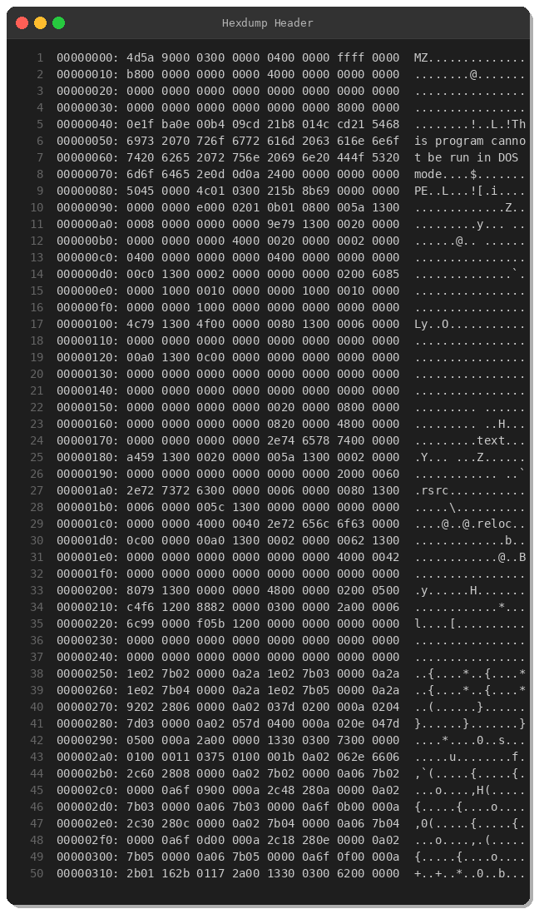
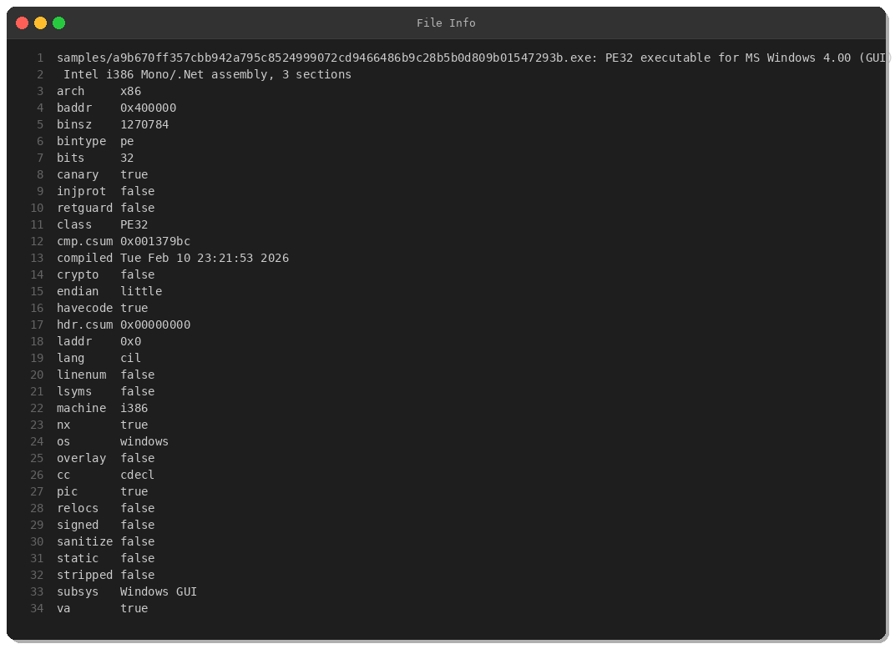
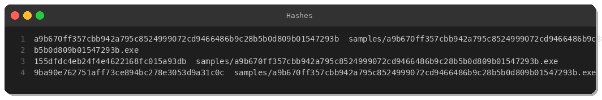
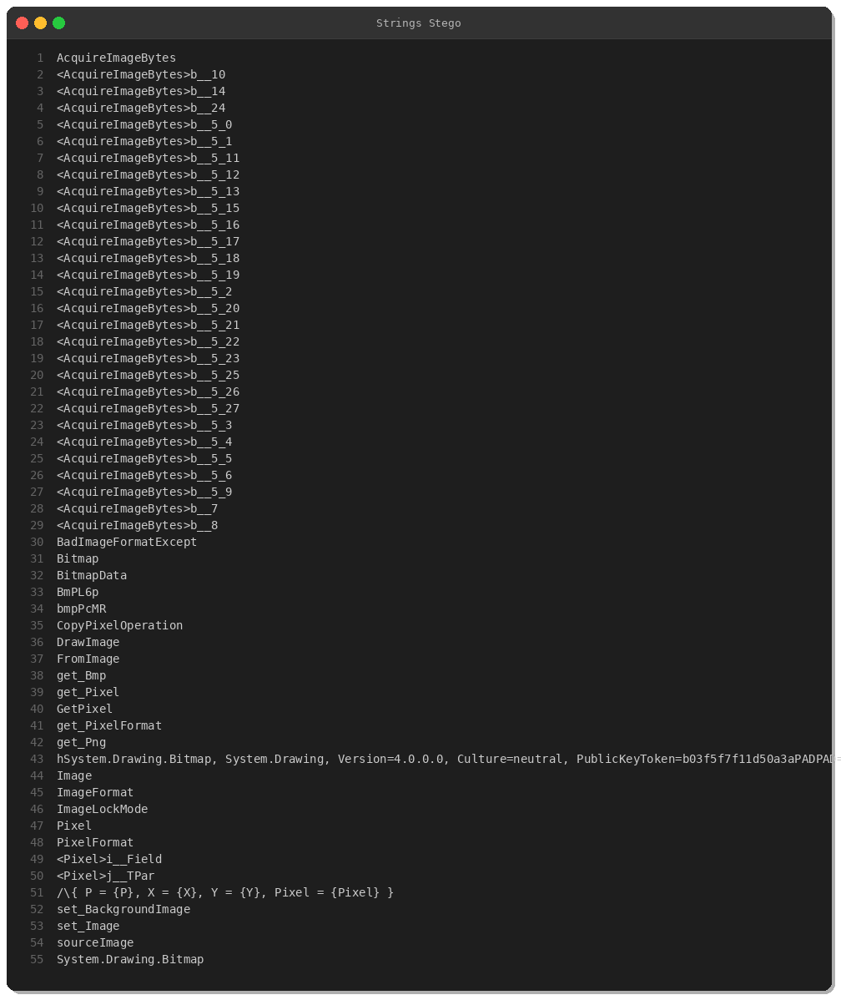
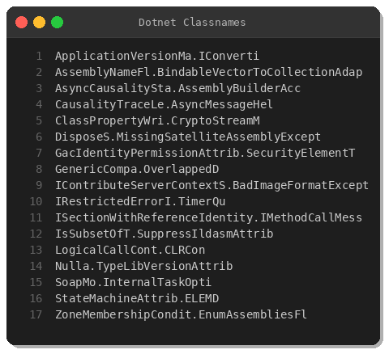
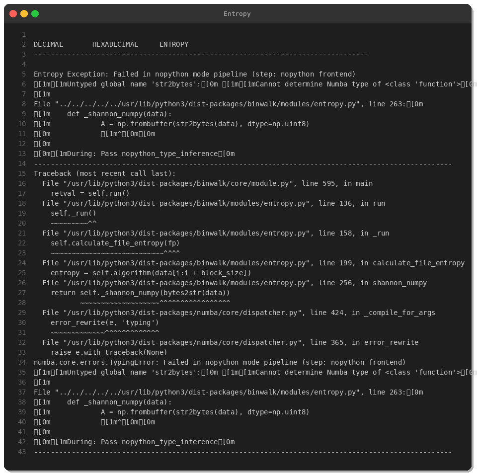
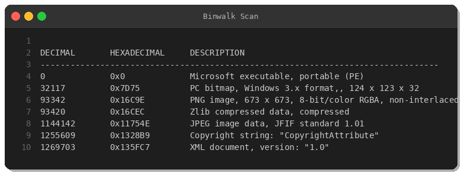
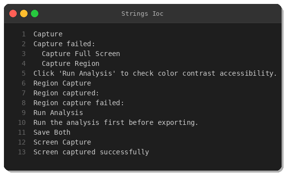
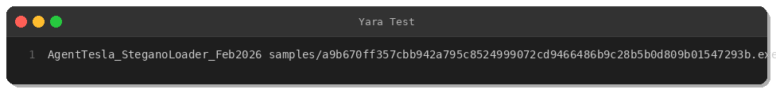

# AgentTesla — Steganography Bitmap Loader

**Date:** 2026-02-11
**Severity:** HIGH
**Category:** Information Stealer
**Source:** MalwareBazaar

## Summary

A new AgentTesla variant was identified using bitmap steganography to conceal its payload. The loader reads pixel data from an embedded bitmap image using `GetPixel` and `FromArgb` calls, reconstructs the payload bytes, and loads the final AgentTesla binary via `Assembly.Load` for in-memory execution. This technique bypasses most static analysis tools and signature-based AV engines.

## Sample Information

| Property | Value |
|----------|-------|
| SHA256 | `a9b670ff357cbb942a795c8524999072cd9466486b9c28b5b0d809b01547293b` |
| MD5 | `155dfdc4eb24f4e4622168fc015a93db` |
| SHA1 | `9ba90e762751aff73ce894bc278e3053d9a31c0c` |
| File Type | PE32 .NET executable |
| Family | AgentTesla |
| Delivery | Phishing email attachment |

## Technical Analysis

### Delivery Vector

The sample arrives as a phishing attachment named `new_order3223.com.exe`, using the double-extension trick (`.com.exe`) to appear as a harmless file to users who have file extensions hidden.

### Steganography Loader

The loader contains an embedded bitmap resource. At runtime, it iterates over the image pixels using `System.Drawing.Bitmap.GetPixel()`, extracts RGB values via `Color.FromArgb()`, and reassembles them into a byte array. This byte array is the actual AgentTesla payload.

The reconstructed payload is loaded reflectively:

```
Assembly.Load(decoded_bytes).EntryPoint.Invoke()
```

This approach avoids writing the payload to disk, keeping the final malware entirely in memory.

### Execution Chain

```
Phishing email
  -> new_order3223.com.exe (steganography loader)
    -> Bitmap pixel extraction
      -> Assembly.Load (in-memory)
        -> AgentTesla (credential stealer)
```

### Capabilities

The final AgentTesla payload includes:
- Keystroke logging
- Screenshot capture
- Browser credential harvesting
- Email client credential theft
- Data exfiltration via SMTP

## Analysis Evidence

### PE Header



### File Properties



### Hash Verification



### Steganography-Related Strings



### .NET Class Names



### Entropy Analysis



### Embedded Content Scan



### IOC-Relevant Strings



### YARA Rule Validation



## MITRE ATT&CK

| Technique | ID | Usage |
|-----------|----|-------|
| Steganography | T1027.003 | Payload hidden in bitmap pixel data |
| Reflective Code Loading | T1620 | Assembly.Load for fileless execution |
| Deobfuscate/Decode | T1140 | Runtime pixel-to-byte decoding |
| Screen Capture | T1113 | Screenshot exfiltration |
| Keylogging | T1056.001 | Keystroke recording |
| Phishing Attachment | T1566.001 | Email delivery with double extension |

## Indicators of Compromise

### Hashes

| Type | Value |
|------|-------|
| SHA256 | `a9b670ff357cbb942a795c8524999072cd9466486b9c28b5b0d809b01547293b` |
| MD5 | `155dfdc4eb24f4e4622168fc015a93db` |
| SHA1 | `9ba90e762751aff73ce894bc278e3053d9a31c0c` |

### Filenames

| Filename | Context |
|----------|---------|
| `new_order3223.com.exe` | Phishing payload (double extension) |
| `EQwhl.exe` | Dropped secondary payload |

## Detection

A YARA rule for this loader variant is available at [`yara/malware/agenttesla-stegano-loader-2026.yar`](../../yara/malware/agenttesla-stegano-loader-2026.yar).

## Recommendations

1. Block double-extension filenames (`.com.exe`, `.pdf.exe`) at the email gateway
2. Monitor .NET processes performing bitmap pixel operations followed by `Assembly.Load`
3. Alert on SMTP traffic originating from non-mail-client processes
4. Scan endpoints with the provided YARA rule
5. Review email quarantine for purchase-order themed phishing

---

*Indra CTI by Peris.ai*
