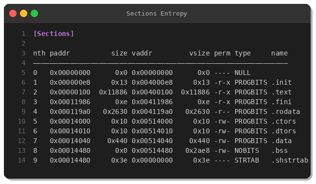
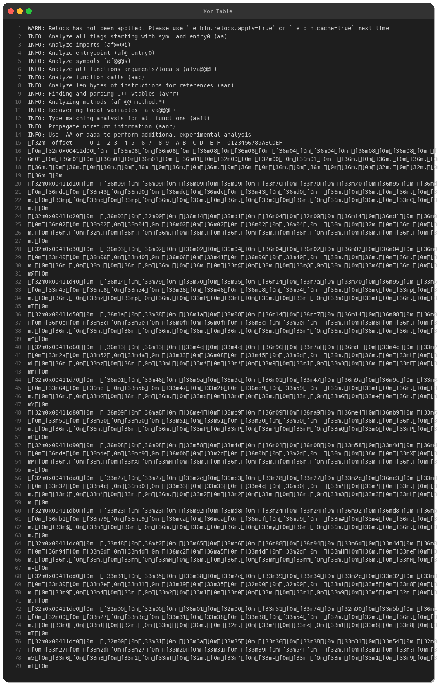

# Mirai HTTP Flood Variant with Cloudflare Bypass — Technical Analysis

**By Peris.ai Threat Research Team | Indra CTI**
**Date: February 12, 2026**

## Executive Summary

A new Mirai botnet variant targeting x86-64 Linux systems features HTTP/2 flood capabilities with Cloudflare CDN bypass techniques, a hardcoded C2 server, and XOR-obfuscated configuration.

## Sample Overview

| Property | Value |
|----------|-------|
| SHA256 | `d70d9f3c8cfdaa59728178f0b44b9664a956421ecaa4d17a5cb94d1e1118cd4d` |
| MD5 | `aeba465111d4d02ea141e7a90bed21c0` |
| File Type | ELF 64-bit LSB executable, x86-64 |
| Size | 83,776 bytes |
| Tags | Mirai, UPX-decoded |
| Origin | NL |

## Static Analysis

## Disassembly

## Key Findings

- **HTTP GET/POST flood** with Chrome 120 User-Agent mimicry
- **Cloudflare bypass** via `POST /cdn-cgi/` endpoints
- **HTTP/2 support** (`h2` protocol negotiation)
- **C2 Server**: `158.94.210.195` (hardcoded)
- **XOR-obfuscated** configuration table
- **Attack marker**: `/tmp/.atk` (single instance lock)

## MITRE ATT&CK

| Technique | ID |
|-----------|-----|
| Unix Shell | T1059.004 |
| Boot/Logon Scripts | T1037 |
| Obfuscated Files | T1027 |
| Masquerading | T1036 |
| HTTP C2 | T1071.001 |
| HTTP Flood DDoS | T1498.001 |

## IOCs

| Type | Value |
|------|-------|
| SHA256 | `d70d9f3c8cfdaa59728178f0b44b9664a956421ecaa4d17a5cb94d1e1118cd4d` |
| MD5 | `aeba465111d4d02ea141e7a90bed21c0` |
| IPv4 | `158.94.210.195` |
| File | `/tmp/.atk` |
| URI | `/cdn-cgi/` |

## YARA Rule

See: [`yara/malware/mirai-httpflood-variant-2026-02.yar`](../yara/malware/mirai-httpflood-variant-2026-02.yar)

## Recommendations

1. Block C2 IP `158.94.210.195` at perimeter
2. Monitor `/tmp/.atk` creation on Linux endpoints
3. Deploy YARA rule on EDR/scanning systems
4. Rate-limit outbound HTTP per source
5. Update IoT firmware, change default credentials

---

*Indra CTI by Peris.ai — Licensed under CC BY 4.0*
