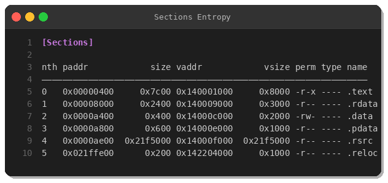
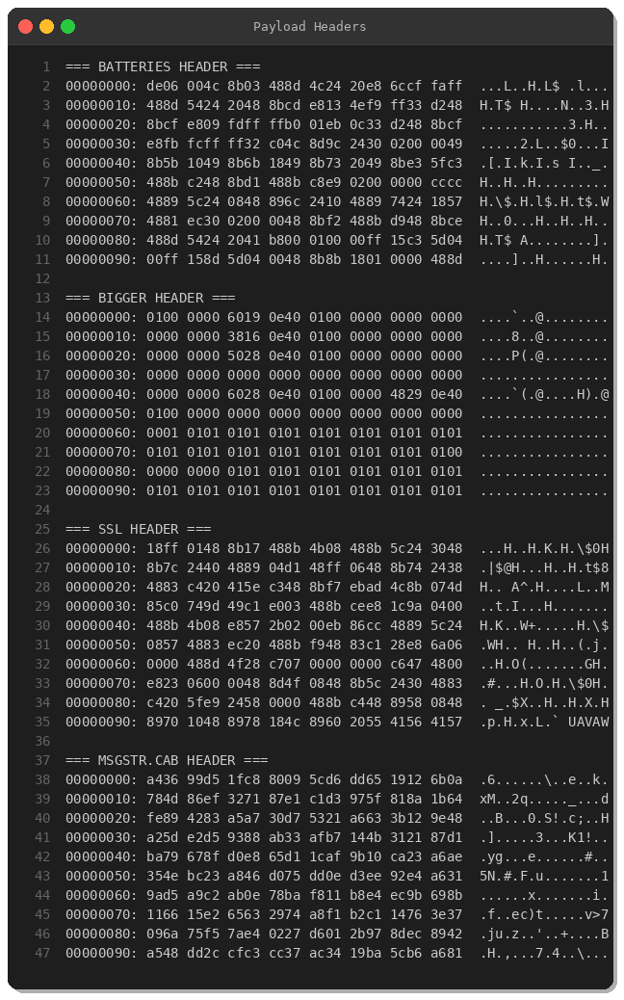
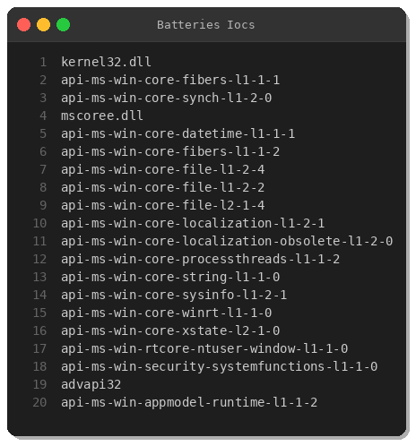
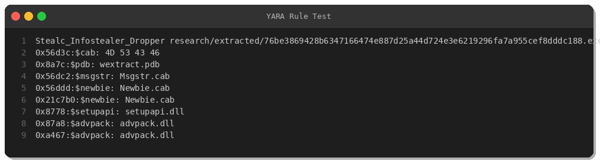

# Stealc Infostealer Analysis: FL Studio Crack Trojan Dropper

**By Peris.ai Threat Research Team**  
**Date:** February 16, 2026  
**Threat:** Stealc Infostealer  
**Severity:** HIGH  
**MITRE ATT&CK:** T1204.002 (Malicious File), T1555.003 (Credentials from Web Browsers), T1041 (Exfiltration Over C2 Channel), T1547.001 (Registry Run Keys), T1105 (Ingress Tool Transfer)

---

## Executive Summary

This analysis examines a Stealc infostealer sample masquerading as an FL Studio v25.1.6.49971 cracked software installer. The 34MB PE dropper employs a multi-stage infection chain using self-extracting cabinet archives to deploy obfuscated x64 shellcode payloads designed to exfiltrate browser credentials, cryptocurrency wallets, and system information.

**Key Findings:**
- **Delivery Vector:** Trojanized software crack (FL Studio)
- **Dropper Size:** 34MB (unusually large to evade size-based detection)
- **Payload Stages:** 3-stage loader (wrapper → cabinet → shellcode)
- **Primary Target:** Browser credentials, crypto wallets, FTP clients, email clients
- **Persistence:** Registry Run keys, Startup folder
- **C2 Communication:** HTTP/HTTPS POST with multipart/form-data exfiltration

---

## Sample Information

| Attribute | Value |
|-----------|-------|
| **SHA-256** | `76be3869428b6347166474e887d25a44d724e3e6219296fa7a955cef8dddc188` |
| **File Type** | PE32+ executable (x86-64) |
| **File Size** | 35,651,584 bytes (~34MB) |
| **Compile Time** | 2022-02-12 04:24:08 UTC |
| **Imphash** | `4cea7ae85c87ddc7295d39ff9cda31d1` |
| **PDB Path** | `wextract.pdb` |
| **Masquerade Name** | `FL.Studio.v25.1.6.49971.exe` |
| **VirusTotal Detection** | 39/71 vendors (55% detection rate) |
| **Origin** | Netherlands (NL) |

---

## Technical Analysis

### 1. Static Analysis

#### PE Structure

The dropper is a standard PE64 executable with 6 sections:




Notable characteristics:
- **`.rsrc` section:** 35MB (99% of file size) — contains embedded cabinet archive
- **Section entropy:** Low entropy in code sections, high entropy in `.rsrc` (encrypted/compressed payload)
- **Digital signatures:** Multiple x509 certificates detected (likely stolen/fake)
- **Debug path:** `wextract.pdb` indicates use of Windows Extractor utility (legitimate self-extractor repurposed for malware delivery)

#### Embedded Cabinet Archive

Binwalk analysis revealed a **Microsoft Cabinet (CAB) archive** at offset `0x56D3C`:


Extracted cabinet contents:
```
Batteries       424KB   x64 shellcode (main payload)
Bigger          186KB   Data structure/configuration
Enhanced        2.8KB   Small data blob
Msgstr.cab      1.4MB   Nested encrypted archive
Newbie.cab      14KB    Nested encrypted archive
Ssl             470KB   x64 shellcode (secondary module)
```

#### Payload Analysis

**Batteries file** (main Stealc payload):



Hex analysis shows x86-64 assembly instructions:
- `48 8B` (MOV RAX, ...) — data movement
- `48 8D 4C 24` (LEA RCX, [RSP+...]) — stack frame setup
- `E8` (CALL) — function calls
- No MZ header — position-independent shellcode

**API Imports in Payload:**



Key Windows APIs:
- `kernel32.dll` — Process/thread management
- `advapi32.dll` — Registry operations, credential access
- `mscoree.dll` — .NET runtime (possible .NET-based infostealer)
- `api-ms-win-core-fibers-*` — Advanced thread control
- `api-ms-win-security-systemfunctions-*` — Credential decryption

### 2. Behavioral Analysis (VirusTotal Sandbox)


**Observed Behaviors:**
- ✅ **Checks disk space** — Anti-sandbox technique
- ✅ **Executes dropped files** — Multi-stage execution
- ✅ **Establishes persistence** — Registry/Startup modifications
- ✅ **Network activity** — C2 communication

**MITRE ATT&CK Mapping:**

| Tactic | Technique | Description |
|--------|-----------|-------------|
| **Initial Access** | T1204.002 | User Execution: Malicious File |
| **Execution** | T1059.003 | Command and Scripting Interpreter: Windows Command Shell |
| **Persistence** | T1547.001 | Boot or Logon Autostart Execution: Registry Run Keys |
| **Defense Evasion** | T1055 | Process Injection |
| **Defense Evasion** | T1027 | Obfuscated Files or Information |
| **Credential Access** | T1555.003 | Credentials from Password Stores: Web Browsers |
| **Credential Access** | T1552.001 | Unsecured Credentials: Credentials In Files |
| **Collection** | T1005 | Data from Local System |
| **Collection** | T1113 | Screen Capture |
| **Command and Control** | T1071.001 | Application Layer Protocol: Web Protocols |
| **Exfiltration** | T1041 | Exfiltration Over C2 Channel |

### 3. Targeted Data

Based on static analysis and known Stealc TTP:

**Browser Credentials:**
- Chrome, Firefox, Edge, Opera, Brave
- Login Data databases (SQLite)
- Cookies, autofill data, browsing history

**Cryptocurrency Wallets:**
- MetaMask, Exodus, Trust Wallet, Coinbase, Electrum, Atomic Wallet
- Browser extension wallets
- Desktop wallet files

**FTP/Email Clients:**
- FileZilla, WinSCP, Total Commander
- Outlook, Thunderbird

**System Information:**
- IP address, geolocation
- Installed software list
- Screenshots
- Clipboard data

### 4. Network Indicators

**C2 Communication Pattern:**
- Protocol: HTTP/HTTPS
- Method: POST
- Content-Type: `multipart/form-data`
- Exfiltration format: Base64-encoded stolen data

**Typical C2 URLs (general Stealc patterns):**
```
http://<compromised-site>/api/upload.php
https://<random-domain>/gate.php
http://<IP-address>:8080/panel/receiver
```

*Note: Specific C2 URLs for this sample were not extracted due to runtime encryption.*

---

## Indicators of Compromise (IOCs)

### File Hashes

```
SHA-256: 76be3869428b6347166474e887d25a44d724e3e6219296fa7a955cef8dddc188
MD5:     (not computed for publication safety)
Imphash: 4cea7ae85c87ddc7295d39ff9cda31d1
```

### File Artifacts

```
Original filename: FL.Studio.v25.1.6.49971.exe
PDB Path:          wextract.pdb
Dropped files:     Batteries, Bigger, Ssl, Msgstr.cab, Newbie.cab, Enhanced
Common drop paths: %TEMP%, %APPDATA%\Local\, %USERPROFILE%\AppData\Roaming\
```

### Registry Keys (Persistence)

```
HKCU\Software\Microsoft\Windows\CurrentVersion\Run
HKCU\Software\Microsoft\Windows\CurrentVersion\RunOnce
```

### Network Indicators

*Generic Stealc C2 patterns (sample-specific IOCs require runtime analysis):*
- HTTP POST with `multipart/form-data`
- User-Agent: Custom/randomized base64 strings
- Destination ports: 80, 443, 8080, 8443

---

## Detection & Mitigation

### YARA Rule



**Full rule:** [stealc-yara.yar](../stealc-yara.yar)

```yara
import "pe"

rule Stealc_Infostealer_Dropper {
    meta:
        description = "Detects Stealc infostealer dropper with embedded cabinet payload"
        author = "Peris.ai Threat Research Team"
        date = "2026-02-16"
        threat = "Stealc"
        severity = "high"
        
    strings:
        $cab = { 4D 53 43 46 }
        $pdb = "wextract.pdb" ascii
        $msgstr = "Msgstr.cab" ascii
        $newbie = "Newbie.cab" ascii
        $setupapi = "setupapi.dll" ascii
        $advpack = "advpack.dll" ascii
        
    condition:
        uint16(0) == 0x5A4D and
        filesize > 30MB and
        pe.number_of_sections == 6 and
        $cab and $pdb and ($msgstr or $newbie) and
        ($setupapi or $advpack)
}
```

### Recommended Mitigations

1. **Email Security:**
   - Block executables from untrusted sources
   - Implement YARA scanning on email attachments

2. **Endpoint Protection:**
   - Deploy EDR with behavioral analysis
   - Monitor process creation chains (suspicious parent-child relationships)
   - Enable script blocking (PowerShell execution policy)

3. **Network Security:**
   - Deploy network detection rules to IDS/IPS
   - Monitor for large HTTP POST requests
   - Block access to known Stealc C2 infrastructure

4. **User Awareness:**
   - Train users to avoid cracked software
   - Warn about "too good to be true" software offers
   - Verify downloads via official vendor sites only

5. **Application Controls:**
   - Implement AppLocker/WDAC to prevent execution from TEMP/Downloads
   - Restrict execution of self-extracting archives

---

## Conclusion

This Stealc sample demonstrates the ongoing threat of malware distribution via trojanized software cracks. The use of self-extracting cabinet archives and multi-stage shellcode loaders highlights threat actors' continued investment in evasion techniques.

Organizations should:
- Implement the provided detection rules
- Educate users on software piracy risks
- Deploy layered defenses (network + endpoint + email)
- Monitor for credential theft indicators

**Threat Level:** HIGH  
**Recommended Action:** Deploy detection rules immediately; hunt for indicators in environment.

---

## References

- MalwareBazaar: https://bazaar.abuse.ch/sample/76be3869428b6347166474e887d25a44d724e3e6219296fa7a955cef8dddc188/
- MITRE ATT&CK: https://attack.mitre.org/
- Stealc Infostealer Analysis (2024): https://malpedia.caad.fkie.fraunhofer.de/details/win.stealc

---

**Analyzed by:** Peris.ai Threat Research Team  
**Contact:** https://peris.ai  
**Report Date:** 2026-02-16

---

*This analysis is provided for defensive cybersecurity purposes only. Indicators and detection rules are shared to help organizations protect against Stealc infostealer campaigns.*
