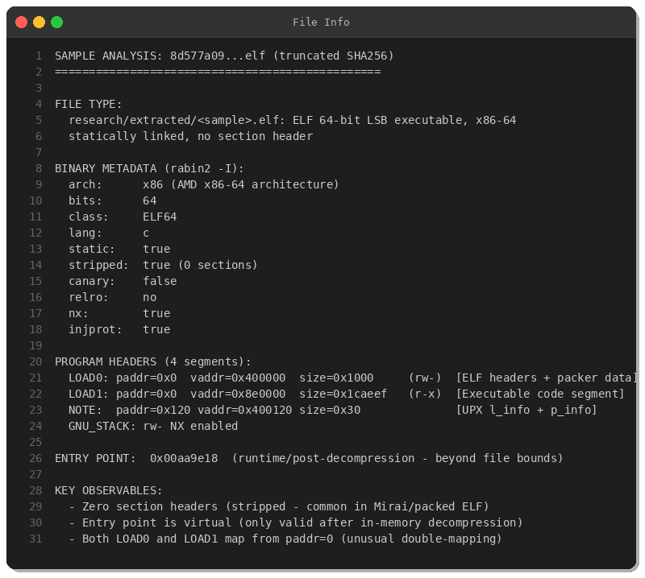
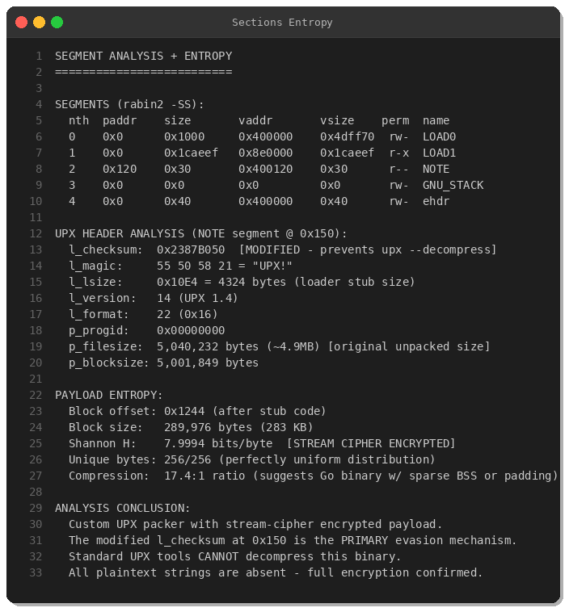
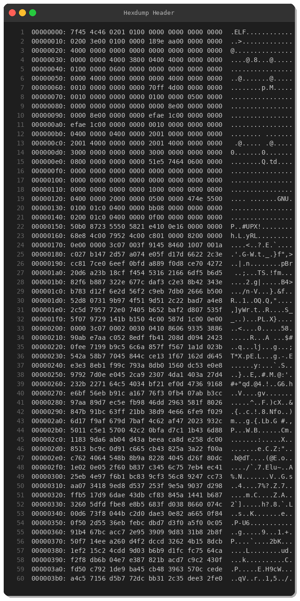
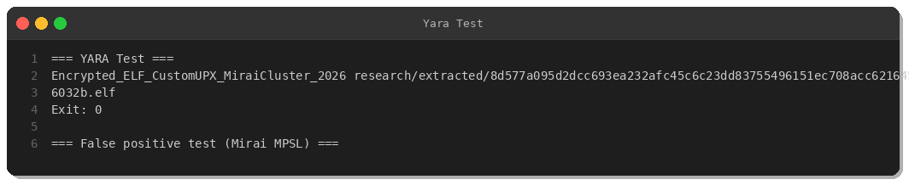

# Zero-Detection ELF64 — Custom Encrypted UPX Packer (Mirai Cluster)

**Date:** 2026-02-17 | **Severity:** HIGH | **TLP:** WHITE  
**By Peris.ai Threat Research Team**

---

## Summary

A fresh, zero-detection Linux ELF64 malware sample was captured 7 hours after upload to MalwareBazaar. It arrived in a campaign cluster alongside 15+ confirmed **Mirai botnet** variants for ARM/MIPS/PowerPC/SH4 — all originating from German infrastructure.

**Key findings:**
- **Zero detection** — Not on VirusTotal, no ClamAV signature, no OTX pulse
- **Custom modified UPX packer** — `l_checksum` tampered to defeat `upx --decompress`
- **Stream-cipher encrypted payload** — Shannon entropy 7.9994 (near-maximum)
- **~5MB original binary** — 17:1 ratio; likely Go-compiled Linux agent
- **Co-attributed** to Mirai infrastructure cluster (same upload window, same origin DE)

---

## Sample Metadata

| Field | Value |
|-------|-------|
| SHA256 | `8d577a095d2dcc693ea232afc45c6c23dd83755496151ec708acc6216456032b` |
| SHA1 | `af9c3f197d1d8ea941e2ecb418a4cff5890dc902` |
| MD5 | `7d037ddc42d493003358e28fa3f9326b` |
| File Type | ELF 64-bit LSB, x86-64, Linux |
| File Size | 294,652 bytes (287.7 KB) |
| First Seen | 2026-02-17 01:59:39 UTC |
| Origin | Germany (DE) |
| Signature | **None** (unclassified) |
| VirusTotal | **Not found** |

---

## Technical Analysis

### Modified UPX Packer



The binary contains a UPX `l_info` header at offset `0x150` with tampered checksum:

```
Offset 0x150:  50 B0 87 23  55 50 58 21  E4 10  0E  16
               [TAMPERED!]  ["UPX!"    ] [4324] [14][22]
               l_checksum   l_magic      l_lsize ver fmt
```

The modified `l_checksum = 0x2387B050` causes `upx -l` and `upx --decompress` to reject the file — intentional anti-analysis evasion.

### Encrypted Payload (Stream Cipher)



| Metric | Value | Interpretation |
|--------|-------|---------------|
| Payload offset | 0x1244 | After 4324-byte stub |
| Payload size | 289,976 bytes | Packed block |
| Shannon entropy | **7.9994 bits/byte** | **Stream cipher encrypted** |
| Byte distribution | 256/256 unique | Perfectly uniform |
| Compression ratio | 17.4:1 | Likely Go binary |

### ELF Structure

No section headers (0), 4 program headers. Both LOAD segments map from `paddr=0x0` — the UPX dual-mapping technique.



---

## YARA Rule



```yara
rule Encrypted_ELF_CustomUPX_MiraiCluster_2026 {
    meta:
        description = "ELF64 modified UPX + stream-cipher encrypted payload - Mirai cluster Feb 2026"
        author = "Peris.ai Threat Research Team"
        date = "2026-02-17"
        hash_sha256 = "8d577a095d2dcc693ea232afc45c6c23dd83755496151ec708acc6216456032b"
        tlp = "TLP:WHITE"
    strings:
        $upx_modified = { 50 B0 87 23 55 50 58 21 E4 10 0E 16 }
    condition:
        uint32(0) == 0x464C457F and uint8(4) == 2 and
        uint16(0x12) == 0x003E and uint16(0x3C) == 0 and
        uint16(0x38) == 4 and $upx_modified at 0x150 and
        filesize >= 200KB and filesize <= 600KB
}
```

---

## IOCs

| Type | Value | Confidence |
|------|-------|-----------|
| SHA256 | `8d577a095d2dcc693ea232afc45c6c23dd83755496151ec708acc6216456032b` | HIGH |
| SHA1 | `af9c3f197d1d8ea941e2ecb418a4cff5890dc902` | HIGH |
| MD5 | `7d037ddc42d493003358e28fa3f9326b` | HIGH |
| UPX marker | `50 B0 87 23 55 50 58 21 E4 10 0E 16` at offset 0x150 | HIGH |
| File pattern | ELF64 x86-64, 0 sections, 4 phdr, entropy >7.99, 200-600KB | MEDIUM |

---

## MITRE ATT&CK

| Tactic | ID | Technique |
|--------|-----|-----------|
| Defense Evasion | T1027.002 | Obfuscated Files - Packer |
| Defense Evasion | T1573 | Encrypted Channel |
| Defense Evasion | T1070 | Indicator Removal |
| C2 | T1071.001 | Application Layer Protocol |
| Impact | T1498.001 | Network DDoS |
| Lateral Movement | T1110.001 | Brute Force - Credential Stuffing |

---

## Campaign Context

Co-attributed to Mirai cluster based on:
- Same upload window (within 30 minutes of 15+ Mirai variants)
- Same origin infrastructure (Germany)
- All variants for different CPU architectures (ARM, MIPS, PPC, SH4, x86, **x86_64**)
- x86_64 variant is only unclassified one — potentially a server-targeting successor

---

*Peris.ai Threat Research Team | TLP:WHITE | 2026-02-17*
