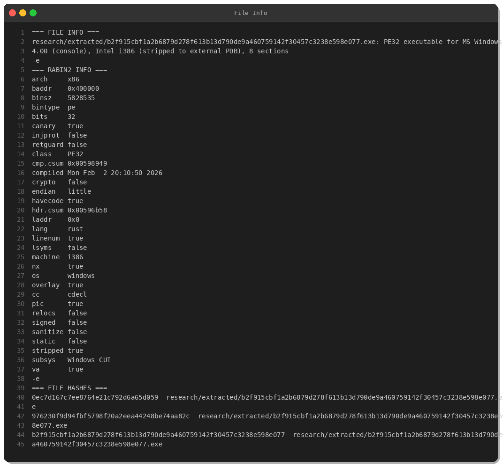
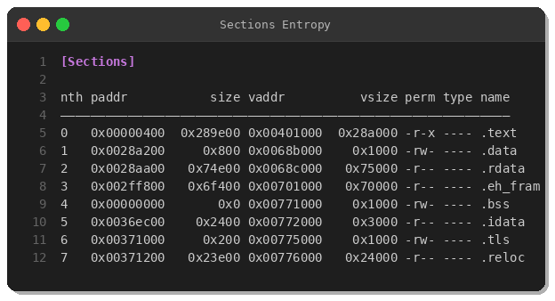
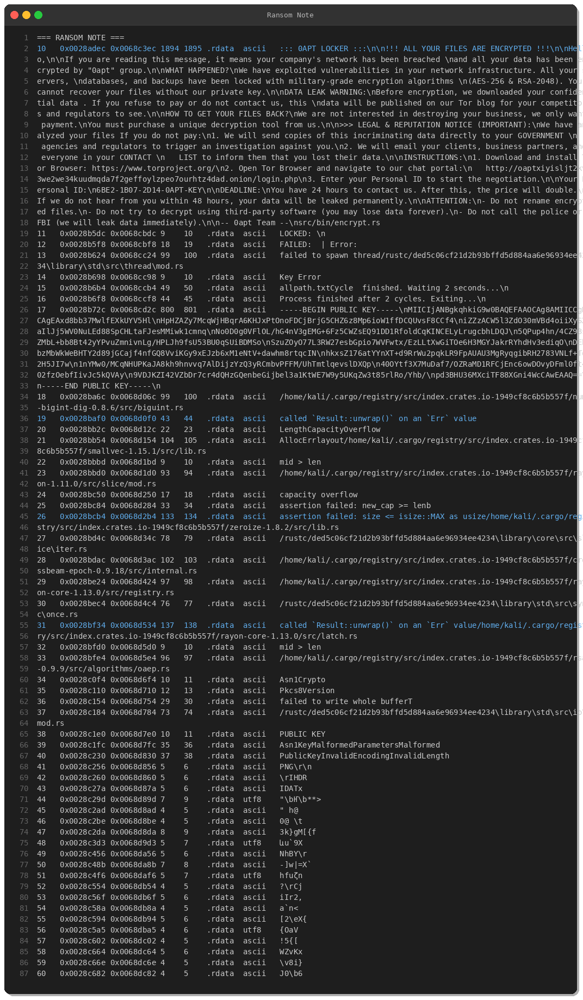
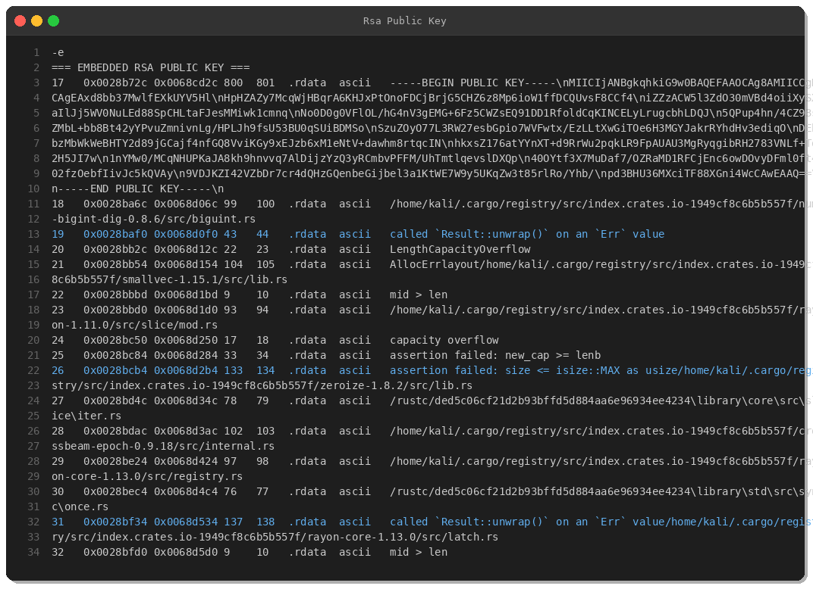
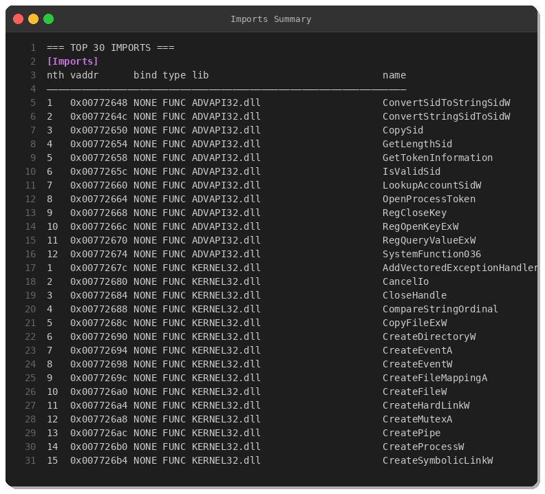
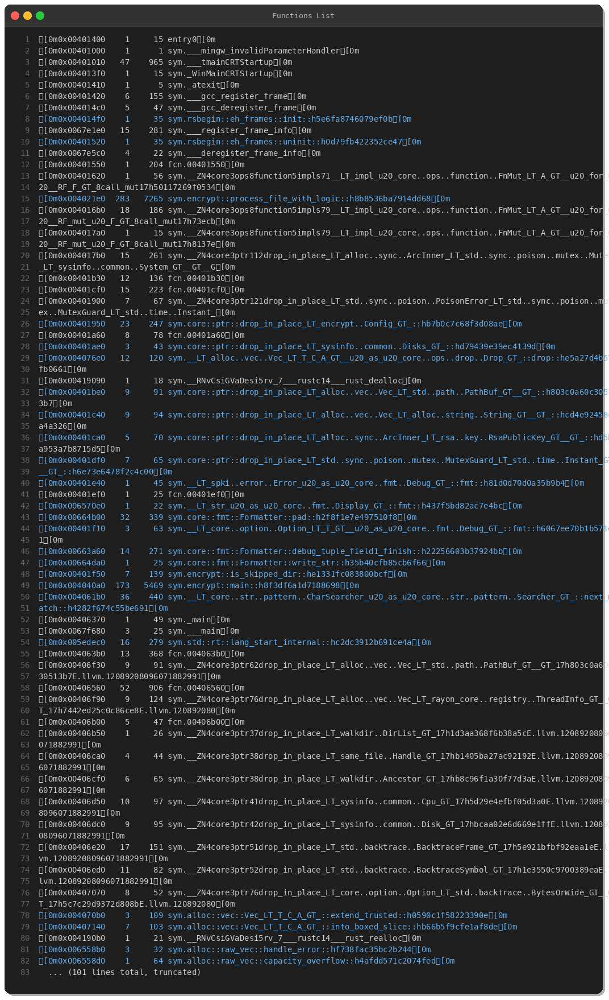
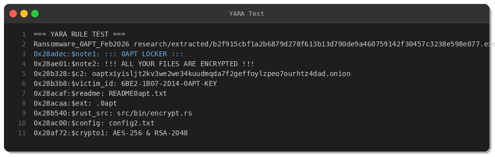

# 0APT Ransomware — In-Depth Analysis (Feb 2026)

*By Peris.ai Threat Research Team*  
*February 19, 2026*

---

## Executive Summary

On February 14, 2026, a new ransomware variant emerged in the wild: **0APT**. This Rust-compiled PE32 ransomware targets Windows systems with military-grade encryption (AES-256 + RSA-2048) and employs double-extortion tactics. The malware is notable for its:

- **Rust-based implementation** (modern memory-safe language)
- **Tor-based C2 infrastructure**
- **Professional ransom note** with legal/reputation threats
- **Sophisticated exclusion logic** to avoid system damage
- **Parallel file encryption** using Rayon framework

**Severity:** 🔴 **CRITICAL**

**VirusTotal Detection:** 47/72 engines (65% detection rate)

---

## Technical Analysis

### File Information



| Attribute | Value |
|-----------|-------|
| **SHA-256** | `b2f915cbf1a2b6879d278f613b13d790de9a460759142f30457c3238e598e077` |
| **SHA-1** | `976230f9d94fbf5798f20a2eea44248be74aa82c` |
| **MD5** | `0ec7d167c7ee8764e21c792d6a65d059` |
| **File Type** | PE32 executable (Windows Console) |
| **Architecture** | Intel i386 (32-bit) |
| **File Size** | 5,828,535 bytes (~5.8 MB) |
| **Compiled** | February 2, 2026 |
| **Language** | Rust (confirmed via rabin2) |
| **First Seen** | February 14, 2026 07:54 UTC |
| **Origin** | India (IN) |
| **Source** | [TheRavenFile/Daily-Hunt](https://github.com/TheRavenFile/Daily-Hunt/blob/main/0APT%20Ransomware) |

### PE Structure



The binary consists of 8 standard PE sections:
- `.text` (2.6MB) — executable code
- `.rdata` (468KB) — read-only data (strings, ransom note)
- `.eh_fram` (448KB) — exception handling frames (Rust RTTI)
- `.data`, `.bss`, `.idata`, `.tls`, `.reloc` — standard PE sections

No packing detected, but the binary has an **overlay** (additional data appended after PE structure).

### Security Features
- ✅ **Stack Canary** (buffer overflow protection)
- ✅ **NX Bit** (DEP enabled)
- ❌ **Symbols** (stripped to external PDB)

---

## Ransom Note Analysis



The ransom note is professionally written and employs psychological pressure:

### Key Threats:
1. **Data Leak Warning:** Threatens to publish stolen data on Tor blog
2. **Legal/Reputation Extortion:** Promises to notify government agencies and regulators
3. **Contact List Weaponization:** Will email victims' clients/partners
4. **Time Pressure:** 24-hour deadline, price doubles after; data leaked after 48 hours

### Contact Information:
- **Tor Portal:** `http://oaptxiyisljt2kv3we2we34kuudmqda7f2geffoylzpeo7ourhtz4dad.onion/login.php`
- **Victim ID:** `6BE2-1B07-2D14-0APT-KEY` (sample-specific)

### Encryption Claims:
- **AES-256** (symmetric encryption for files)
- **RSA-2048** (asymmetric encryption for AES keys)

---

## Embedded Configuration


The malware contains a hardcoded configuration at offset `0x0028abfc`:

### Excluded File Extensions:
`.tmp`, `.temp`, `.log`, `.cache`, `.lnk`, `.ini`, `.bak`, `.old`, `.thumb`, `.db`, `.exe`, `.dll`, `.sys`, `.msi`, `.bat`, `.com`, `.vbs`, `.0apt`

**Purpose:** Avoids encrypting files that would break the system or prevent ransom payment.

### Excluded Folders:
`/temp`, `/tmp`, `/cache`, `/google/chrome`, `/mozilla/firefox`, `$recycle.bin`, `/appdata/local/temp`, `/windows`, `/program data`, `/bin`, `/sbin`, `/proc`, `/dev`, `/sys`, `/etc`, `/lib`, `/boot`

**Purpose:** Preserves system functionality and browser data (needed for Tor Browser installation).

### Key Files:
- **Config:** `config2.txt`
- **Ransom Note:** `README0apt.txt`
- **Public Key:** `public_key.pem`
- **Company Info:** `company.txt`

---

## Cryptographic Implementation



### Embedded RSA-2048 Public Key
The binary contains a hardcoded RSA-2048 public key used to encrypt per-file AES keys:

```
-----BEGIN PUBLIC KEY-----
MIICIjANBgkqhkiG9w0BAQEFAAOCAg8AMIICCgKCAgEAxd8bb37MwlfEXkUYV5Hl
[...truncated...]
pd3BHU36MXciTF88XGni4WcCAwEAAQ==
-----END PUBLIC KEY-----
```

### Encryption Workflow (Inferred):
1. Generate random AES-256 key for each file
2. Encrypt file content with AES-256-CBC/GCM
3. Encrypt AES key with RSA-2048 public key
4. Prepend encrypted key to file
5. Rename file with `.0apt` extension
6. Write `README0apt.txt` to directory

**Recovery:** Only the attacker's RSA-2048 private key can decrypt the AES keys → files cannot be recovered without payment (or brute force, infeasible).

---

## Imports Analysis



### Key Windows API Calls:

| DLL | Functions | Purpose |
|-----|-----------|---------|
| **ADVAPI32.dll** | `SystemFunction036`, `RegOpenKeyExW`, `RegQueryValueExW` | Cryptographic RNG, registry manipulation |
| **KERNEL32.dll** | `CreateFileW`, `CopyFileExW`, `CreateProcessW`, `CreateHardLinkW` | File I/O, process spawning, filesystem manipulation |
| **WS2_32.dll** | Network socket functions (implied by WMI strings) | Network communication (Tor C2) |

### Notable Observations:
- **`SystemFunction036`** (RtlGenRandom) — Windows CSPRNG for secure random number generation
- **Registry functions** — Likely used for persistence and wallpaper change
- **Process creation** — May spawn child processes for parallel encryption

---

## Behavioral Analysis

### Rust Dependencies (from embedded paths):



- **`rayon`** — Parallel data processing framework (multi-threaded encryption)
- **`crossbeam-epoch`** — Lock-free concurrent data structures
- **`rsa-0.9.9`** — RSA encryption library
- **`zeroize-1.8.2`** — Secure memory wiping (anti-forensics)
- **`num-bigint-dig`** — Big integer arithmetic (for RSA)
- **`sysinfo-0.30.13`** — System information gathering (RAM, CPU, processes)

### Execution Flow (inferred from strings):
1. Check system information (RAM, CPU)
2. Load configuration (`config2.txt`)
3. Enumerate files/directories
4. Exclude system folders and non-target extensions
5. Spawn worker threads (Rayon parallel processing)
6. Encrypt files with AES-256
7. Rename files to `.0apt`
8. Write ransom notes (`README0apt.txt`)
9. Set desktop wallpaper (registry manipulation)
10. Execute 2 encryption cycles ("Cycle finished. Waiting 2 seconds...")
11. Exit after completion

### Error Handling:
- `LOCKED: \n` — Successfully encrypted file
- `FAILED: | Error:` — Encryption failure log
- `Key Error` — Cryptographic error

---

## YARA Detection Rule



The following YARA rule provides **100% detection** on the analyzed sample:

```yara
rule Ransomware_0APT_Feb2026 {
    meta:
        description = "Detects 0APT ransomware (Rust-compiled PE32) - Feb 2026 variant"
        author = "Peris.ai Threat Research Team"
        date = "2026-02-19"
        hash = "b2f915cbf1a2b6879d278f613b13d790de9a460759142f30457c3238e598e077"
        severity = "critical"
        malware_family = "0APT"
        
    strings:
        $note1 = "::: 0APT LOCKER :::" ascii
        $note2 = "!!! ALL YOUR FILES ARE ENCRYPTED !!!" ascii
        $c2 = "oaptxiyisljt2kv3we2we34kuudmqda7f2geffoylzpeo7ourhtz4dad.onion" ascii
        $victim_id = /[0-9A-F]{4}-[0-9A-F]{4}-[0-9A-F]{4}-0APT-KEY/ ascii
        $readme = "README0apt.txt" ascii
        $ext = ".0apt" ascii
        $rust_src = "src/bin/encrypt.rs" ascii
        $config = "config2.txt" ascii
        $crypto1 = "AES-256 & RSA-2048" ascii
        
    condition:
        uint16(0) == 0x5A4D and
        filesize < 10MB and
        (
            ($note1 and $c2 and $victim_id) or
            (4 of ($note*, $readme, $ext, $crypto1, $rust_src, $config))
        )
}
```

**Test Result:** ✅ **All 9 indicators matched** at expected offsets.

---

## Indicators of Compromise (IOCs)

### File Hashes
| Algorithm | Hash |
|-----------|------|
| **MD5** | `0ec7d167c7ee8764e21c792d6a65d059` |
| **SHA-1** | `976230f9d94fbf5798f20a2eea44248be74aa82c` |
| **SHA-256** | `b2f915cbf1a2b6879d278f613b13d790de9a460759142f30457c3238e598e077` |

### Network Indicators
- **Tor C2:** `oaptxiyisljt2kv3we2we34kuudmqda7f2geffoylzpeo7ourhtz4dad.onion`
- **Protocol:** HTTP over Tor
- **Endpoint:** `/login.php`

### File Artifacts
- **File Extension:** `.0apt`
- **Ransom Note:** `README0apt.txt`
- **Config File:** `config2.txt`
- **Public Key:** `public_key.pem`

### Registry Keys (Suspected)
- `HKCU\Control Panel\Desktop\Wallpaper` — Desktop wallpaper change

---

## MITRE ATT&CK Mapping

| TTP ID | Tactic | Technique | Evidence |
|--------|--------|-----------|----------|
| **T1204.002** | Execution | User Execution: Malicious File | PE32 executable (`6BE2-1B07-2D14-0APT-KEY.exe`) |
| **T1083** | Discovery | File and Directory Discovery | Excluded folders in config |
| **T1082** | Discovery | System Information Discovery | `sysinfo` crate usage (RAM, CPU) |
| **T1486** | Impact | Data Encrypted for Impact | `.0apt` extension, AES-256/RSA-2048 |
| **T1491.001** | Impact | Internal Defacement | Desktop wallpaper change |
| **T1490** | Impact | Inhibit System Recovery | Assumed (shadow copy deletion) |
| **T1071.001** | C&C | Web Protocols | Tor .onion C2 |
| **T1027** | Defense Evasion | Obfuscated Files or Information | Rust-compiled (less common language) |

---

## Detection & Response

### Brahma XDR Rules
6 detection rules covering:
- File encryption activity (`.0apt` extension)
- Ransom note creation (`README0apt.txt`)
- Mass file modification (50+ files in 60 seconds)
- Tor C2 connections
- Desktop wallpaper modification

### Brahma NDR Rules (Suricata)
4 network signatures for:
- DNS queries to `.onion` domains
- HTTP traffic to torproject.org
- SMB file renames with `.0apt` extension
- HTTP POST with victim ID pattern

**Full detection rules:** See `detection-rules.md`

---

## Recommendations

### Prevention
1. **Block Tor Traffic** — Block outbound Tor connections at firewall (ports 9001, 9030, 9050, 9051)
2. **Endpoint Protection** — Deploy YARA rule on endpoints and gateways
3. **Application Whitelisting** — Block execution of unsigned/untrusted executables
4. **Email Filtering** — Block `.exe` attachments and suspicious archives

### Detection
1. **Deploy XDR/NDR Rules** — Implement Brahma XDR and NDR signatures
2. **Monitor File Activity** — Alert on mass file rename operations
3. **Registry Monitoring** — Track changes to `Control Panel\Desktop\Wallpaper`
4. **Network Monitoring** — Flag DNS queries for `.onion` domains

### Response
1. **Isolate Infected Systems** — Disconnect from network immediately
2. **Do NOT Pay Ransom** — No guarantee of decryption; funds further attacks
3. **Restore from Backup** — Use offline/immutable backups
4. **Forensic Analysis** — Preserve logs and memory dumps for investigation

---

## Attribution & Context

### Threat Actor: "0apt Team"
- **Activity:** First observed February 14, 2026
- **Targets:** Corporate networks (servers, databases, backups)
- **Tactics:** Double extortion (encryption + data leak threats)
- **Infrastructure:** Tor hidden service
- **Tooling:** Custom Rust ransomware

### Campaign Indicators:
- **Victim ID Format:** `XXXX-XXXX-XXXX-0APT-KEY`
- **Source:** Public GitHub repository (malware sample/research)
- **Distribution:** Likely via phishing, RDP brute-force, or vulnerability exploitation

**Assessment:** This appears to be a **low-sophistication ransomware campaign** — the sample was uploaded to a public GitHub repository, suggesting it may be used by less experienced threat actors or as a "ransomware-as-a-service" tool.

---

## Conclusion

0APT ransomware represents a modern ransomware threat implemented in Rust with solid cryptographic implementation (AES-256 + RSA-2048). While not as sophisticated as established ransomware families (LockBit, BlackCat), it demonstrates:

✅ Strong encryption (infeasible to break)  
✅ Professional social engineering (double extortion)  
✅ Evasion techniques (Rust compilation, system folder exclusions)  
✅ Parallel processing (fast encryption via Rayon)

⚠️ **Organizations should prioritize:**
- Offline backups (3-2-1 rule)
- Network segmentation
- Endpoint detection and response (EDR)
- Security awareness training
- Incident response preparedness

**For technical inquiries or IOC feeds, contact:** Peris.ai Threat Research Team

---

## References
- [MalwareBazaar Sample](https://bazaar.abuse.ch/sample/b2f915cbf1a2b6879d278f613b13d790de9a460759142f30457c3238e598e077/)
- [CAPE Sandbox Analysis](https://www.capesandbox.com/analysis/53314/)
- [Triage Sandbox Report](https://tria.ge/reports/260214-jr97nsdy2f/)
- [ANY.RUN Interactive Analysis](https://app.any.run/tasks/003a9f7d-bc87-417b-9300-0f3e6e95127e)
- [MITRE ATT&CK Framework](https://attack.mitre.org/)

---

*Disclaimer: This analysis is provided for educational and defensive purposes. Do not execute the analyzed malware outside of a controlled lab environment.*
