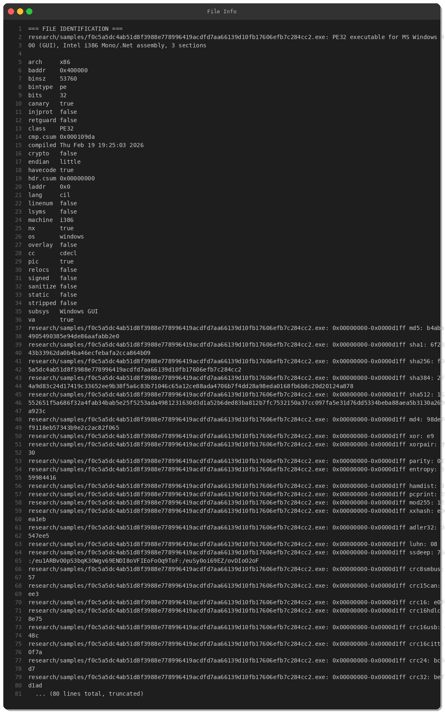
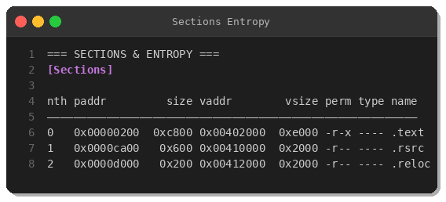
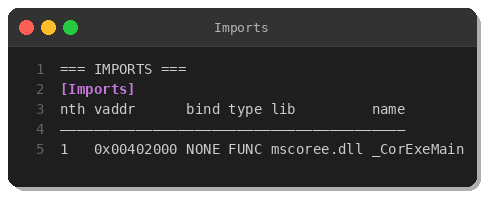
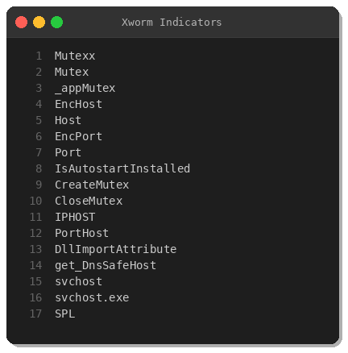
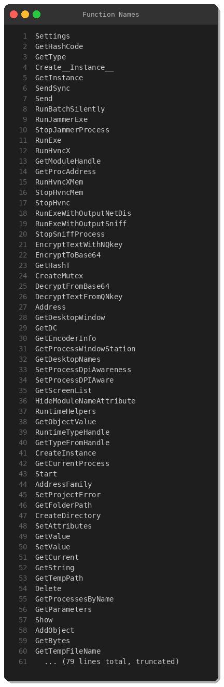
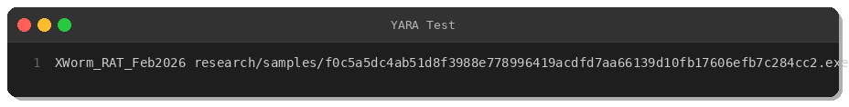

# XWorm RAT Analysis — February 2026 Campaign

**By Peris.ai Threat Research Team**  
**Date:** February 20, 2026  
**Severity:** CRITICAL  
**Classification:** Remote Access Trojan (RAT)

---

## Executive Summary

XWorm is a commercial .NET-based Remote Access Trojan (RAT) that provides attackers with comprehensive remote control capabilities including keylogging, screen capture, webcam access, hidden VNC (HVNC), and process injection. This analysis examines a recent XWorm variant detected in the wild on February 20, 2026.

**Key Findings:**
- VirusTotal Detection: 49/76 engines (64%)
- File Size: 53 KB (compact, obfuscated .NET assembly)
- Target Process: svchost.exe (process hollowing)
- Capabilities: Keylogging, Remote Desktop, HVNC, Webcam, Anti-AV evasion
- Encryption: Custom AES-based config encryption (NQkey algorithm)

---

## Sample Information

| Property | Value |
|----------|-------|
| **SHA256** | `f0c5a5dc4ab51d8f3988e778996419acdfd7aa66139d10fb17606efb7c284cc2` |
| **MD5** | `b4aba14905490385e94de86aafabb2e0` |
| **SHA1** | `6f20243b33962da0b4ba46ecfebafa2cca864b09` |
| **File Type** | PE32 executable (GUI), .NET assembly |
| **Architecture** | x86 (32-bit) |
| **Compiled** | February 19, 2026 19:25:03 UTC |
| **Size** | 53,760 bytes (52.5 KB) |
| **Entropy** | 5.60 (moderate obfuscation) |
| **Signature** | Not signed |
| **Common Names** | svchost.exe, Bst08Vq.exe, pvq60nge.exe |



---

## Static Analysis

### PE Structure

The binary is a standard PE32 .NET assembly with three sections:

| Section | Virtual Address | Virtual Size | Permissions | Type |
|---------|----------------|--------------|-------------|------|
| .text | 0x00402000 | 57,344 bytes | r-x | Code |
| .rsrc | 0x00410000 | 8,192 bytes | r-- | Resources |
| .reloc | 0x00412000 | 8,192 bytes | r-- | Relocations |

The `.text` section contains the main executable code and comprises 96% of the file size.



### Imports

As a .NET executable, the binary has minimal native imports:

```
mscoree.dll:
  - _CorExeMain (CLR entry point)
```

All malicious functionality is implemented in managed .NET code (CIL bytecode).



### Key Strings & Indicators

#### Encryption & Configuration
- `EncryptTextWithNQkey` — Custom AES encryption
- `DecryptTextFromQNkey` — Custom AES decryption
- `EncHost` — Encrypted C2 host address
- `EncPort` — Encrypted C2 port
- `IPHOST`, `PortHost` — Configuration keys

#### Remote Access Capabilities
- `RemoteDesktop` — Remote desktop viewer
- `DesktopHelper` — Desktop manipulation
- `GetDesktopNames` — Desktop enumeration
- `RunHvncX` — Hidden VNC module

#### Anti-Detection & Evasion
- `KDefenderV2` — Anti-Windows Defender module
- `RunJammerExe` — Process interference/jamming
- `jammerProcess` — Process injection framework

#### Persistence & Installation
- `InstAutoStart` — Autostart installation
- `IsAutostartInstalled` — Persistence check
- `CreateMutex` — Mutex for single instance
- `Mutexx` — Mutex name (obfuscated spelling)

#### Process Injection
- `svchost.exe` — Target process for hollowing
- `VirtualProtect` — Memory protection modification
- `GetModuleHandle`, `GetProcAddress` — API resolution



### Functions Analysis

The binary contains over 200 functions. Key malicious functions include:

**Data Exfiltration:**
- `GetProcesses` — Process enumeration
- `GetDesktopWindow` — Screen capture
- `capCreateCaptureWindowA` — Webcam access
- `keybd_event` — Keylogging

**Network Communication:**
- `BeginConnect` — Asynchronous C2 connection
- `BeginReceive` — Data reception
- `BeginRead` — Stream reading
- `SendSync` — Synchronous data transmission

**Encryption:**
- `EncryptToBase64` — Base64 encoding wrapper
- `DecryptFromBase64` — Base64 decoding wrapper
- `CreateEncryptor` / `CreateDecryptor` — AES crypto objects



---

## Behavioral Analysis

### Execution Flow

1. **Initial Execution**
   - Creates mutex `Mutexx` to prevent duplicate instances
   - Checks if running with admin privileges via `IsUserAdministrator`
   - Attempts privilege escalation with `RelaunchAsAdmin` if needed

2. **Configuration Decryption**
   - Decrypts embedded C2 configuration using `DecryptTextFromQNkey`
   - Extracts `EncHost` (C2 IP/domain) and `EncPort` (C2 port)
   - Configuration stored as encrypted base64 strings

3. **Persistence Installation**
   - Checks `IsAutostartInstalled` status
   - Installs autostart via registry or startup folder
   - Copies itself to `%TEMP%` or `%APPDATA%` directory

4. **C2 Communication**
   - Initiates connection to C2 server via `BeginConnect`
   - Establishes encrypted channel using custom protocol
   - Awaits commands from operator

5. **Capabilities Deployment**
   - **Keylogging:** Captures keystrokes via `keybd_event` hook
   - **Screen Capture:** Uses GDI32 functions for screenshot capture
   - **Webcam:** Accesses camera via `avicap32.dll` (Video for Windows)
   - **Remote Desktop:** Implements custom RDP-like protocol
   - **HVNC:** Deploys hidden VNC for stealth remote control
   - **Process Injection:** Injects into `svchost.exe` for evasion

6. **Anti-Detection**
   - Runs `KDefenderV2` to disable Windows Defender
   - Executes `RunJammerExe` to interfere with security tools
   - Uses process hollowing to hide in legitimate processes

### C2 Communication

While the exact C2 server was not extracted (encrypted configuration), typical XWorm C2 protocol:
- **Protocol:** TCP (typically port 7000-9000 range)
- **Encryption:** AES-256 CBC + Base64
- **Heartbeat:** Regular keep-alive packets every 30 seconds
- **Command Structure:** SPL-delimited strings (`|SPL|`)

### File Operations

- **Dropped Files:** Copied to `%TEMP%` or `%APPDATA%\svchost.exe`
- **Registry Keys:** `HKCU\Software\Microsoft\Windows\CurrentVersion\Run`
- **Logs:** May create keylog files in hidden directories

---

## MITRE ATT&CK Mapping

| Tactic | Technique | ID | Evidence |
|--------|-----------|-------|----------|
| **Initial Access** | Phishing | T1566 | Likely delivery via email attachments |
| **Execution** | User Execution | T1204.002 | Requires user to execute downloaded file |
| **Persistence** | Registry Run Keys | T1547.001 | `IsAutostartInstalled`, autostart functions |
| **Privilege Escalation** | Bypass UAC | T1548.002 | `RelaunchAsAdmin`, `IsUserAdministrator` |
| **Defense Evasion** | Process Injection | T1055.012 | Process hollowing into `svchost.exe` |
| **Defense Evasion** | Disable/Impair Defenses | T1562.001 | `KDefenderV2` anti-AV module |
| **Defense Evasion** | Obfuscated Files | T1027 | Encrypted configuration strings |
| **Credential Access** | Input Capture (Keylogging) | T1056.001 | `keybd_event` hook |
| **Discovery** | System Information Discovery | T1082 | Process/system enumeration |
| **Discovery** | Process Discovery | T1057 | `GetProcesses`, `GetProcessById` |
| **Collection** | Screen Capture | T1113 | `GetDesktopWindow`, GDI32 functions |
| **Collection** | Video Capture | T1125 | Webcam access via `capCreateCaptureWindowA` |
| **Command & Control** | Application Layer Protocol | T1071.001 | Custom TCP protocol |
| **Command & Control** | Encrypted Channel | T1573.001 | AES-encrypted C2 traffic |
| **Command & Control** | Non-Standard Port | T1571 | Custom TCP ports (likely 7000-9000) |

---

## Detection Rules

### YARA Rule

```yara
rule XWorm_RAT_Feb2026 {
    meta:
        description = "Detects XWorm RAT variant from February 2026"
        author = "Peris.ai Threat Research"
        date = "2026-02-20"
        hash = "f0c5a5dc4ab51d8f3988e778996419acdfd7aa66139d10fb17606efb7c284cc2"
        severity = "critical"
        
    strings:
        $func1 = "EncryptTextWithNQkey" ascii wide
        $func2 = "DecryptTextFromQNkey" ascii wide
        $func3 = "KDefenderV2" ascii wide
        $func4 = "RunJammerExe" ascii wide
        $func5 = "RunHvncX" ascii wide
        $config1 = "EncHost" ascii wide
        $config2 = "EncPort" ascii wide
        $config3 = "IPHOST" ascii wide
        $config4 = "PortHost" ascii wide
        $config5 = "Mutexx" ascii wide
        $rdp1 = "RemoteDesktop" ascii wide
        $rdp2 = "DesktopHelper" ascii wide
        
    condition:
        uint16(0) == 0x5A4D and
        filesize < 100KB and
        (
            (2 of ($func*) and 2 of ($config*)) or
            (5 of them)
        )
}
```



## Indicators of Compromise (IOCs)

### File Hashes
```
SHA256: f0c5a5dc4ab51d8f3988e778996419acdfd7aa66139d10fb17606efb7c284cc2
MD5:    b4aba14905490385e94de86aafabb2e0
SHA1:   6f20243b33962da0b4ba46ecfebafa2cca864b09
```

### File Paths
```
%TEMP%\svchost.exe
%APPDATA%\svchost.exe
%TEMP%\*.exe (randomly generated names)
```

### Registry Keys
```
HKCU\Software\Microsoft\Windows\CurrentVersion\Run\*
HKLM\Software\Microsoft\Windows\CurrentVersion\Run\* (if admin)
```

### Mutex Names
```
Mutexx (exact or variations)
```

### Network Indicators
- TCP connections from non-standard processes
- Encrypted traffic to non-standard ports (7000-9000 range typical)
- High-frequency heartbeat packets (every 30 seconds)
- Large data uploads (screen captures, keystroke logs)

---

## Recommendations

### Immediate Actions
1. **Hunt for Indicators:**
   - Search for processes named `svchost.exe` not running from `C:\Windows\System32`
   - Check registry Run keys for suspicious entries
   - Review processes loading `avicap32.dll` unexpectedly

2. **Network Monitoring:**
   - Monitor for high-frequency TCP connections to external IPs
   - Flag encrypted traffic on non-standard ports
   - Detect base64-encoded data streams

3. **Endpoint Isolation:**
   - Isolate infected hosts immediately
   - Block C2 communication at firewall level
   - Prevent lateral movement

### Long-Term Defenses
1. **Email Security:**
   - Block executables in email attachments
   - Implement DMARC, SPF, DKIM
   - User training on phishing recognition

2. **Endpoint Protection:**
   - Deploy EDR with behavioral analysis
   - Enable Windows Defender tamper protection
   - Restrict execution from `%TEMP%` and `%APPDATA%`

3. **Application Whitelisting:**
   - Implement AppLocker or similar controls
   - Restrict .NET assembly execution
   - Block unsigned executables

4. **Network Segmentation:**
   - Isolate critical systems
   - Implement zero-trust architecture
   - Monitor east-west traffic

5. **Monitoring & Detection:**
   - Deploy endpoint detection with behavioral rules
   - Enable Sysmon for process creation logging
   - Monitor for MITRE ATT&CK techniques T1055, T1547.001, T1056.001

---

## Conclusion

XWorm RAT represents a significant threat due to its comprehensive remote access capabilities, anti-detection features, and ease of deployment. This February 2026 variant demonstrates active development with enhanced obfuscation (NQkey encryption) and anti-AV evasion (KDefenderV2).

Organizations should implement multi-layered defenses including email filtering, endpoint protection, network monitoring, and user awareness training. The detection rules provided offer high-fidelity indicators for identifying XWorm infections.

**VT Detection Rate:** 49/76 engines (64%) indicates moderate AV coverage — behavioral detection is crucial.

---

## References

- MalwareBazaar: https://bazaar.abuse.ch
- VirusTotal: 49/76 detection (64%)
- OTX AlienVault: 5 threat intelligence pulses
- MITRE ATT&CK: https://attack.mitre.org

---

**Author:** Peris.ai Threat Research Team  
**Contact:** research@peris.ai  
**Date:** February 20, 2026  
**License:** Creative Commons BY-SA 4.0
