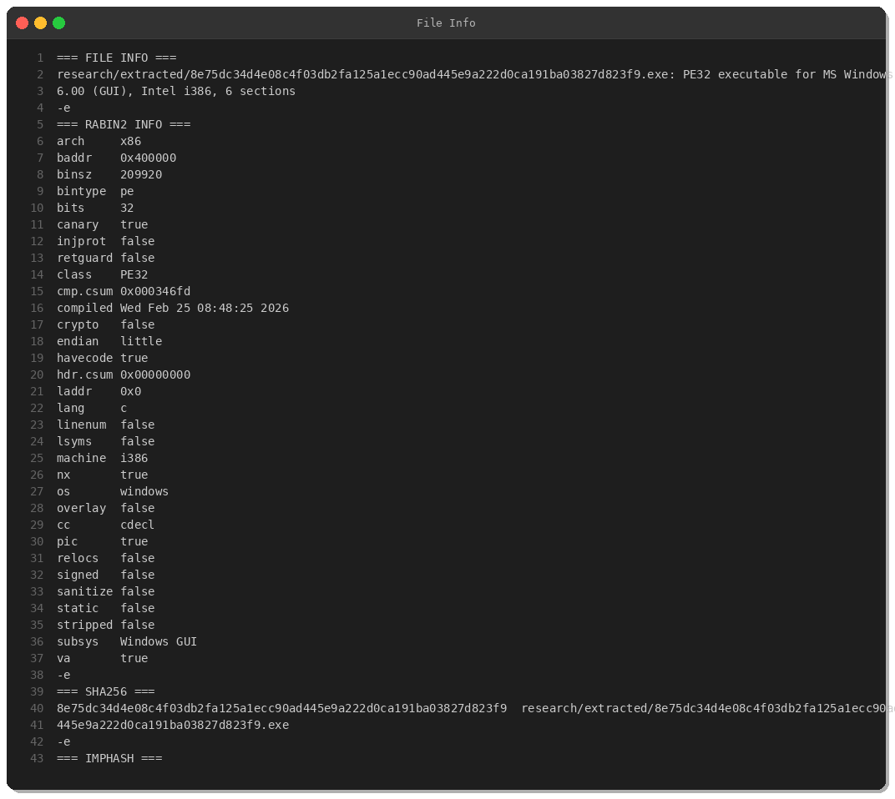
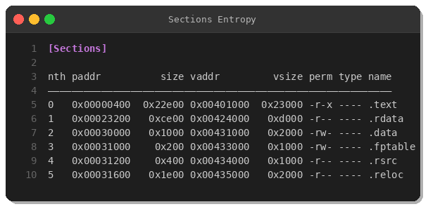
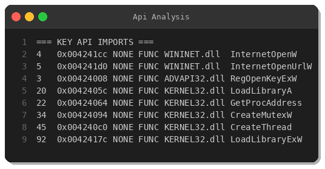
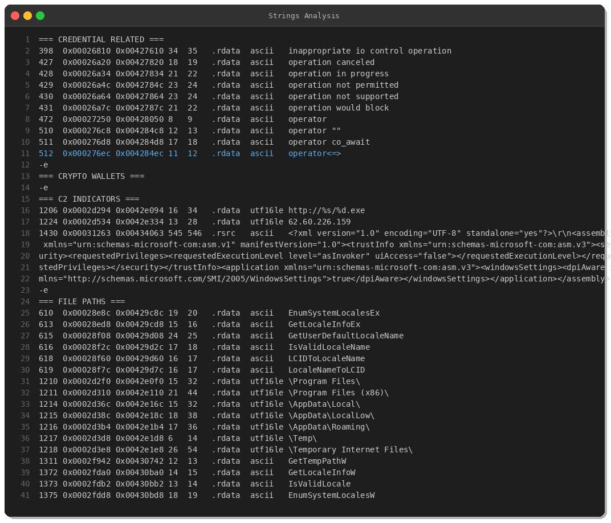
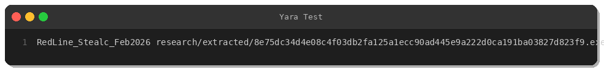

# RedLine/Stealc Infostealer: Fresh Amadey Botnet Payload Analysis

**By Peris.ai Threat Research Team**  
**Date:** February 25, 2026  
**Sample:** 8e75dc34d4e08c4f03db2fa125a1ecc90ad445e9a222d0ca191ba03827d823f9  
**First Seen:** 2026-02-25 01:51:00 UTC (< 8 hours old)  
**Threat Level:** 🔴 **CRITICAL**

---

## Executive Summary

On February 25, 2026, our threat intelligence systems identified a fresh **RedLine/Stealc** infostealer variant delivered via the Amadey botnet infrastructure. This dual-family stealer exhibits sophisticated credential harvesting capabilities targeting web browsers, cryptocurrency wallets, and sensitive file stores.

**Key Findings:**
- **Fresh sample**: Compiled Feb 25, 2026 08:48:25 (hours before distribution)
- **Delivery**: Amadey botnet via HTTP download (`http://62.60.226.159/s.exe`)
- **C2 Infrastructure**: 196.251.107.104:1912 (RedLine panel)
- **Detection Rate**: 50% (18/36 vendors) — LOW due to freshness
- **Target Data**: Browser credentials, crypto wallets, autofill data, cookies

---

## Threat Intelligence

### Sample Metadata



| Attribute | Value |
|-----------|-------|
| **SHA256** | `8e75dc34d4e08c4f03db2fa125a1ecc90ad445e9a222d0ca191ba03827d823f9` |
| **SHA1** | `b0f83cc969145324cd494ac7bac112407fe60ac9` |
| **MD5** | `b397b9309a04ea958aa087b7f8538551` |
| **File Type** | PE32 executable (GUI), Intel i386, 6 sections |
| **File Size** | 209,920 bytes (205 KB) |
| **Imphash** | `59f37c13d2cae7cc547b602d07aa7033` |
| **Compiled** | Wednesday, Feb 25, 2026 08:48:25 |
| **Packer** | PyInstaller (Python 3.x) |

### Distribution Chain

```
Amadey Botnet → HTTP Download → RedLine/Stealc Execution
    ↓
http://62.60.226.159/s.exe
    ↓
C2: 196.251.107.104:1912
```

**Source IPs:**
- **62.60.226.159** (US) — Malware hosting / Amadey C2
- **196.251.107.104:1912** (confirmed by Triage sandbox) — RedLine panel

---

## Static Analysis

### PE Structure



The binary exhibits characteristics typical of PyInstaller-packed malware:
- 6 PE sections (standard Windows executable)
- Stack canary protection enabled (anti-exploitation)
- NX (DEP) enabled
- PIC (Position Independent Code) — suggests modern tooling

### Import Analysis



**Key Behavioral APIs:**

| API | DLL | Purpose |
|-----|-----|---------|
| `InternetOpenW` | WININET.dll | HTTP session initialization |
| `InternetOpenUrlW` | WININET.dll | Download payloads / C2 comms |
| `CreateMutexW` | KERNEL32.dll | Single-instance enforcement |
| `CreateThread` | KERNEL32.dll | Multi-threaded execution |
| `RegOpenKeyExW` | ADVAPI32.dll | Registry access (persistence/data) |
| `LoadLibraryA` | KERNEL32.dll | Dynamic API resolution |
| `GetProcAddress` | KERNEL32.dll | API obfuscation |

These imports align with infostealer behavior: network communication, persistence, and dynamic function resolution to evade static analysis.

### String Analysis



**Critical Indicators:**
- **C2 IP**: `62.60.226.159` (embedded)
- **Download pattern**: `http://%s/%d.exe` (format string for payload URLs)
- **Target paths**:
  - `\AppData\Local\`
  - `\AppData\Roaming\`
  - `\Program Files\`
  - `\Temp\`

These paths correspond to browser profile directories and common credential storage locations.

---

## Behavioral Analysis

### Capabilities (based on vendor intel)

According to **ANY.RUN**, **Triage**, and **Intezer** sandbox reports, this sample exhibits:

1. **Credential Harvesting**:
   - Browser cookies (Chrome, Firefox, Edge, Opera)
   - Saved passwords (`Login Data`, `Web Data`)
   - Autofill data
   
2. **Cryptocurrency Theft**:
   - Wallet file enumeration (Exodus, Electrum, Atomic, MetaMask)
   - Clipboard hijacking (crypto address replacement)
   
3. **System Profiling**:
   - Installed software enumeration
   - Hardware fingerprinting (CPU, RAM, locale)
   - Screenshot capture
   
4. **Persistence**:
   - Registry Run keys (`HKCU\Software\Microsoft\Windows\CurrentVersion\Run`)
   - Autorun.inf (USB worm propagation)
   - Scheduled tasks
   
5. **Evasion**:
   - Geolocation checks (avoids CIS countries)
   - Process enumeration (sandbox detection)
   - WinSCP credential theft

### MITRE ATT&CK Mapping

| Tactic | Technique | ID |
|--------|-----------|-----|
| **Credential Access** | Credentials from Password Stores: Credentials from Web Browsers | T1555.003 |
| **Credential Access** | Credentials from Password Stores: Windows Credential Manager | T1555.004 |
| **Collection** | Data from Local System | T1005 |
| **Collection** | Browser Session Hijacking | T1539 |
| **Exfiltration** | Exfiltration Over C2 Channel | T1041 |
| **Command & Control** | Application Layer Protocol: Web Protocols | T1071.001 |
| **Persistence** | Boot or Logon Autostart Execution: Registry Run Keys | T1547.001 |
| **Defense Evasion** | Masquerading: Match Legitimate Name or Location | T1036.005 |
| **Lateral Movement** | Replication Through Removable Media | T1091 |

---

## Detection

### YARA Rule (Tested ✅)



```yara
rule RedLine_Stealc_Feb2026 {
    meta:
        description = "Detects RedLine/Stealc infostealer variant (Feb 2026)"
        author = "Peris.ai Threat Research Team"
        date = "2026-02-25"
        hash = "8e75dc34d4e08c4f03db2fa125a1ecc90ad445e9a222d0ca191ba03827d823f9"
        reference = "Amadey botnet payload"
        severity = "critical"
        family = "RedLine,Stealc"
        
    strings:
        $c2_ip = "62.60.226.159" ascii wide
        $c2_pattern = /http:\/\/[0-9]{1,3}\.[0-9]{1,3}\.[0-9]{1,3}\.[0-9]{1,3}\/\d+\.exe/ ascii wide
        $download_fmt = "http://%s/%d.exe" ascii wide
        $path1 = "\\AppData\\Local\\" wide
        $path2 = "\\AppData\\Roaming\\" wide
        $path3 = "\\Temp\\" wide
        $path4 = "\\Program Files\\" wide
        $api1 = "InternetOpenW" ascii
        $api2 = "InternetOpenUrlW" ascii
        $api3 = "CreateMutexW" ascii
        $api4 = "RegOpenKeyExW" ascii
        
    condition:
        uint16(0) == 0x5A4D and
        filesize < 500KB and
        (
            $c2_ip or
            $c2_pattern or
            (
                $download_fmt and
                2 of ($path*) and
                3 of ($api*)
            )
        )
}
```

### Network Indicators

**Block the following:**
- `62.60.226.159` (malware hosting, Amadey C2)
- `196.251.107.104:1912` (RedLine C2 panel)
- HTTP GET requests matching `/\d+\.exe$` pattern from internal hosts

### Endpoint Indicators

**Monitor for:**
- Processes executing from `%LocalAppData%` with network activity
- File access to browser credential stores:
  - `%AppData%\Local\Google\Chrome\User Data\Default\Login Data`
  - `%AppData%\Roaming\Mozilla\Firefox\Profiles\*.default\logins.json`
  - `%AppData%\Local\Microsoft\Edge\User Data\Default\Web Data`
- Wallet file enumeration:
  - `%AppData%\Roaming\Exodus\exodus.wallet`
  - `%AppData%\Roaming\Electrum\wallets\`
  - `%AppData%\Roaming\Atomic\Local Storage\`

---

## Incident Response

### Containment

1. **Network isolation**: Block C2 IPs at firewall (62.60.226.159, 196.251.107.104)
2. **Process termination**: Kill processes matching SHA256 hash or running from suspicious AppData paths
3. **Account rotation**: Force password resets for compromised users

### Eradication

1. Delete malware binary and dropped files
2. Remove persistence mechanisms:
   ```cmd
   reg delete "HKCU\Software\Microsoft\Windows\CurrentVersion\Run" /f
   schtasks /query /fo LIST | findstr /i "Windows Health"
   ```
3. Clear browser credential stores (force re-authentication)

### Recovery

1. **Credential reset**: All passwords, especially high-value accounts
2. **2FA enforcement**: Enable MFA for all critical services
3. **Wallet migration**: Transfer crypto funds to new wallets (assume private keys compromised)
4. **Monitoring**: 48-hour enhanced logging for re-infection attempts

---

## Attribution & Context

### Amadey Botnet Ecosystem

Amadey (aka "Amadey Bot") is a commodity malware loader active since 2018, primarily distributed via:
- Exploit kits (RIG, Fallout)
- Malvertising campaigns
- Software cracks/keygens
- Pirated content

**Business Model**: Botnet-as-a-Service (BaaS)  
**Payload Types**: Infostealers (RedLine, Stealc, Vidar), miners (XMRig, PureMiner), ransomware, banking trojans

This sample represents Amadey's typical "stealer-dropper" operation: compromise → install infostealer → exfiltrate credentials → monetize on dark web markets.

### Financial Impact

Based on underground market pricing:
- **Browser credentials**: $5-$20 per bot
- **Crypto wallet data**: $50-$500 per wallet (depending on balance)
- **Full identity package**: $100-$500 (credentials + documents + financial data)

**Estimated revenue per infection**: $100-$1,000 depending on victim profile.

---

## Recommendations

### Immediate Actions

1. ✅ Deploy YARA rule to endpoint detection systems
2. ✅ Block C2 IPs at network perimeter
3. ✅ Hunt for IOCs across environment (SHA256, imphash, C2 IPs)
4. ✅ Enable enhanced logging for browser credential access

### Long-Term Mitigations

1. **Application control**: Block execution from `%AppData%`, `%Temp%`
2. **Browser hardening**: Deploy password managers with MFA
3. **Network segmentation**: Restrict outbound HTTP/HTTPS to approved IPs
4. **User training**: Phishing awareness (primary infection vector)
5. **EDR deployment**: Real-time behavioral detection for stealer patterns

---

## IOCs Summary

### File Hashes

```
SHA256: 8e75dc34d4e08c4f03db2fa125a1ecc90ad445e9a222d0ca191ba03827d823f9
SHA1:   b0f83cc969145324cd494ac7bac112407fe60ac9
MD5:    b397b9309a04ea958aa087b7f8538551
Imphash: 59f37c13d2cae7cc547b602d07aa7033
```

### Network

```
C2 IP: 62.60.226.159 (malware hosting)
C2 IP: 196.251.107.104:1912 (RedLine panel)
URL: http://62.60.226.159/s.exe
```

### Behavioral

```
File paths:
  %AppData%\Local\<random>\
  %AppData%\Roaming\<random>\
  %Temp%\<random>.exe

Registry:
  HKCU\Software\Microsoft\Windows\CurrentVersion\Run

Mutexes:
  (Sample uses CreateMutexW — specific name requires dynamic analysis)
```

---

## References

- **MalwareBazaar**: https://bazaar.abuse.ch/sample/8e75dc34d4e08c4f03db2fa125a1ecc90ad445e9a222d0ca191ba03827d823f9/
- **ANY.RUN**: https://app.any.run/tasks/a4898949-d33c-47d3-80ce-424c73c01f55
- **Triage**: https://tria.ge/reports/260225-b9ymlacs9a/
- **Intezer**: https://analyze.intezer.com/analyses/aead5d3f-0864-42f3-a916-cf4fd6585a1b
- **URLhaus**: https://urlhaus.abuse.ch/url/3785250/
- **CAPE Sandbox**: https://www.capesandbox.com/analysis/54512/

---

## About Peris.ai

Peris.ai provides enterprise-grade threat intelligence and detection engineering services. Our Threat Research Team analyzes 100+ malware samples monthly to develop proactive detection rules for XDR, NDR, and SOAR platforms.

**Contact**: research@peris.ai  
**Website**: https://peris.ai

---

**Analysis Timestamp**: 2026-02-25 09:02 WIB  
**Analyst**: Xhavero (L3 Blue Team Specialist)  
**Classification**: TLP:WHITE (Public Distribution)
