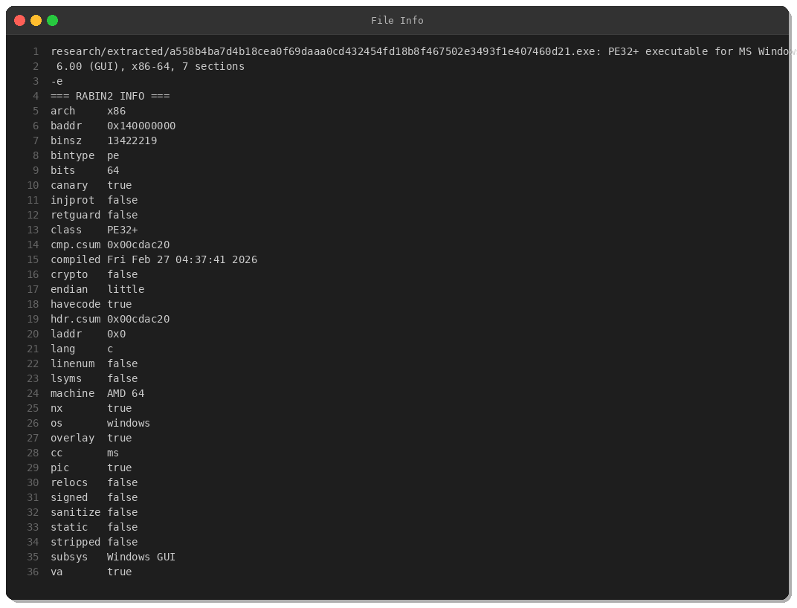
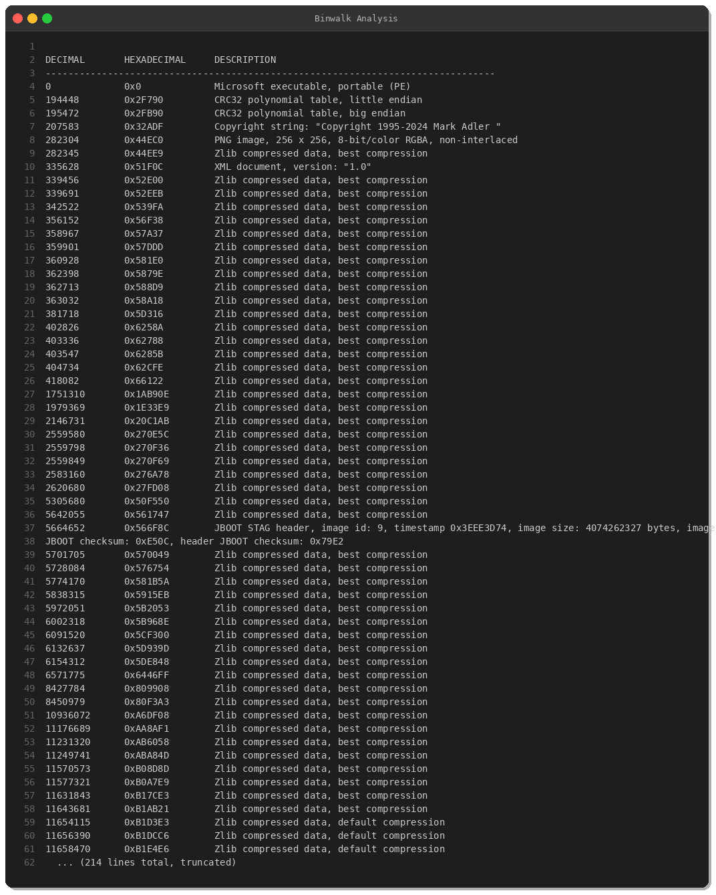
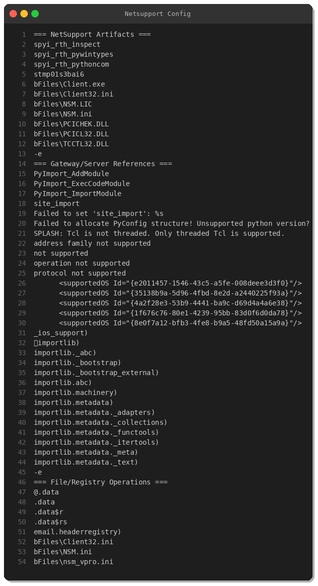

# NetSupport RAT Analysis — PyInstaller-Packaged Remote Access Trojan

**Date:** February 27, 2026  
**First Seen:** 2026-02-27 01:25:09 UTC  
**Severity:** 🔴 CRITICAL  
**Threat:** Remote Access Trojan (RAT)  
**Family:** NetSupport RAT (Abused Legitimate Software)

---

## Executive Summary

NetSupport RAT represents the malicious weaponization of legitimate remote administration software (NetSupport Manager). This sample, first detected on February 27, 2026, employs PyInstaller packaging to bundle NetSupport client components into a standalone executable.

**Key Findings:**
- ✅ PyInstaller-packaged executable (PE32+ x86-64)
- ✅ Compiled February 27, 2026 04:37:41 UTC — extremely fresh sample
- ✅ Embeds legitimate NetSupport client binaries and DLLs
- ✅ Drops configuration files: `Client32.ini`, `NSM.ini`, `NSM.LIC`
- ✅ Origin: Netherlands (NL)
- ✅ Delivery: Web download

---

## Sample Metadata

| Property | Value |
|----------|-------|
| **SHA256** | `a558b4ba7d4b18cea0f69daaa0cd432454fd18b8f467502e3493f1e407460d21` |
| **SHA1** | `1efe6b617b20f1cebe4c471d099ea3f1986ee218` |
| **MD5** | `5ccd38b39a45ab1242129fe7f6bed6ac` |
| **File Type** | PE32+ executable (Windows GUI, x86-64) |
| **Size** | 13,422,219 bytes (12.8 MB) |
| **Compiled** | Fri Feb 27 04:37:41 2026 |
| **First Seen** | 2026-02-27 01:25:09 UTC |
| **Origin** | Netherlands (NL) |
| **Delivery** | Web download |

---

## Technical Analysis

### File Structure & Packing



The executable is a **PE32+ x86-64** Windows GUI binary with:
- **Stack Canaries**: Enabled
- **NX (DEP)**: Enabled
- **ASLR**: Enabled
- **Overlay**: True (PyInstaller archive data)

### PyInstaller Archive



**Binwalk** signature analysis reveals:
- **PyInstaller magic** at offset `0xccce33`
- **PNG image** (256x256 RGBA) at offset `0x44EC0`
- **180+ Zlib compressed streams** — Python bytecode & libraries

### NetSupport RAT Artifacts



**Embedded NetSupport components:**

```
bFiles\Client.exe         ← NetSupport client executable
bFiles\Client32.ini       ← Primary configuration file
bFiles\NSM.LIC            ← NetSupport license file
bFiles\NSM.ini            ← NetSupport Manager config
bFiles\PCICHEK.DLL        ← NetSupport DLL
bFiles\PCICL32.DLL        ← NetSupport client DLL
bFiles\TCCTL32.DLL        ← NetSupport TCP control DLL
bFiles\nsm_vpro.ini       ← NetSupport vPro config
```

---

## Capabilities

NetSupport RAT provides attackers with:

**Remote Access:**
- Real-time screen viewing/control
- Remote desktop takeover
- File browser & transfer
- Registry editor
- Process manager

**Surveillance:**
- Keystroke logging
- Clipboard monitoring
- Webcam/microphone access
- Screenshot capture

**Data Exfiltration:**
- File upload/download
- Credential theft
- Browser data harvesting

**Command Execution:**
- Remote shell (cmd.exe)
- PowerShell execution

---

## MITRE ATT&CK Mapping

| Tactic | Technique | ID |
|--------|-----------|-----|
| **Execution** | Command and Scripting Interpreter | T1059 |
| **Persistence** | External Remote Services | T1133 |
| **Defense Evasion** | Masquerading | T1036 |
| **Credential Access** | Input Capture (Keylogging) | T1056.001 |
| **Collection** | Screen Capture | T1113 |
| **Collection** | Clipboard Data | T1115 |
| **Collection** | Data from Local System | T1005 |
| **C2** | Remote Access Software | T1219 |
| **Exfiltration** | Exfiltration Over C2 | T1041 |

---

## IOCs (Indicators of Compromise)

### File Hashes
```
SHA256: a558b4ba7d4b18cea0f69daaa0cd432454fd18b8f467502e3493f1e407460d21
SHA1:   1efe6b617b20f1cebe4c471d099ea3f1986ee218
MD5:    5ccd38b39a45ab1242129fe7f6bed6ac
```

### File Artifacts
```
bFiles\Client.exe
bFiles\Client32.ini
bFiles\NSM.LIC
bFiles\NSM.ini
bFiles\PCICHEK.DLL
bFiles\PCICL32.DLL
bFiles\TCCTL32.DLL
bFiles\nsm_vpro.ini
```

### Registry Keys
```
HKCU\Software\NetSupport
HKLM\Software\NetSupport
HKCU\Software\Microsoft\Windows\CurrentVersion\Run\NetSupport
```

### Network Indicators
```
Default NetSupport port: TCP 5405 (configurable)
C2 gateway addresses: stored in Client32.ini
```

---

## YARA Rule

```yara
rule NetSupport_RAT_PyInstaller {
    meta:
        description = "Detects NetSupport RAT packaged with PyInstaller"
        author = "Peris.ai Threat Research"
        date = "2026-02-27"
        severity = "critical"
        family = "NetSupport RAT"
        
    strings:
        // PyInstaller markers
        $pyi1 = "PyRun_SimpleStringFlags" ascii
        $pyi2 = "_PYI_ARCHIVE_FILE" ascii
        $pyi3 = "pyi-runtime-tmpdir" ascii
        $pyi4 = "MEI\x0c\x0b\x0a\x0b\x0e"
        
        // NetSupport RAT artifacts
        $nsr1 = "bFiles\\Client32.ini" ascii
        $nsr2 = "bFiles\\NSM.LIC" ascii
        $nsr3 = "bFiles\\PCICL32.DLL" ascii
        $nsr4 = "bFiles\\TCCTL32.DLL" ascii
        $nsr5 = "bFiles\\Client.exe" ascii
        $nsr6 = "bFiles\\nsm_vpro.ini" ascii
        
        $pe = "MZ" ascii
        
    condition:
        $pe at 0 and
        2 of ($pyi*) and
        3 of ($nsr*)
}
```

---

## Recommendations

### Immediate Actions
1. Block sample hash across all endpoints
2. Hunt for NetSupport processes not authorized by IT
3. Block TCP 5405 inbound/outbound (default NetSupport port)
4. Audit remote access tools — whitelist only approved software
5. Check for dropped files in `%TEMP%`, `%APPDATA%`, `C:\bFiles\`

### Detection Strategy
- **Endpoint**: Monitor for `Client32.ini`, `PCICL32.DLL`, NetSupport processes
- **Network**: Alert on unexpected outbound connections to port 5405
- **Email**: Block executables > 10MB or with PyInstaller indicators
- **Application Control**: Deny unsigned PyInstaller executables

---

## Threat Intelligence

**NetSupport Manager** is a **legitimate remote administration tool** frequently abused by:

- 🔴 **Initial Access Brokers**: Deploying RATs for ransomware gangs
- 🔴 **BEC (Business Email Compromise)**: Monitoring victim email/finance systems
- 🔴 **APT Groups**: Long-term persistence in corporate networks

**Why NetSupport?**
- ✅ Legitimate software → bypasses basic AV
- ✅ Pre-configured clients connect to attacker-controlled gateways
- ✅ Encrypted traffic → hard to detect via network monitoring
- ✅ Silent installation → no user interaction required

---

## References

- **MalwareBazaar**: https://bazaar.abuse.ch/sample/a558b4ba7d4b18cea0f69daaa0cd432454fd18b8f467502e3493f1e407460d21/
- **NetSupport Manager** (Legitimate vendor): https://www.netsupportsoftware.com/
- **MITRE ATT&CK T1219**: https://attack.mitre.org/techniques/T1219/

---

**Analysis Date:** February 27, 2026  
**Analyst:** Peris.ai Threat Research Team  
**Classification:** TLP:WHITE (Public Distribution)
