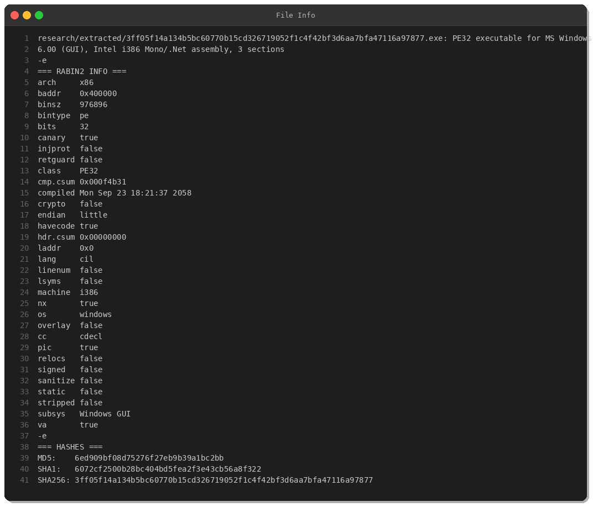
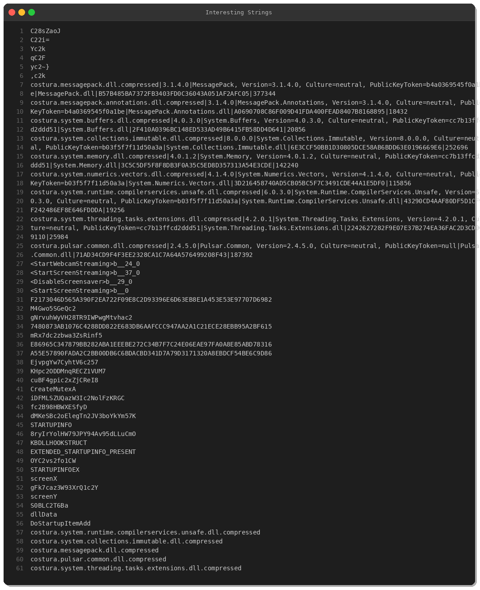
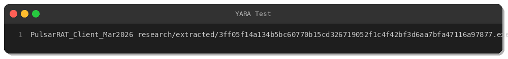

# Pulsar RAT Analysis - Chile Campaign (March 2026)

**By Peris.ai Threat Research Team**  
**Date:** March 1, 2026  
**Sample Hash:** `3ff05f14a134b5bc60770b15cd326719052f1c4f42bf3d6aa7bfa47116a97877`  
**Detection:** 45/76 engines (59%)  
**Origin:** Chile (CL)

## Executive Summary

Fresh Pulsar RAT sample (Client v2.4.5.0) discovered targeting victims in Chile. This .NET-based remote access trojan features comprehensive capabilities including webcam/screen capture, credential theft from multiple browsers, process injection, reverse proxy, and anti-VM evasion. Sample was uploaded to VirusTotal hours before analysis, indicating active campaign.

## Sample Information



- **File Type:** PE32 executable (Windows .NET assembly)
- **Size:** 954 KB (976,896 bytes)
- **Architecture:** x86 (32-bit)
- **Compiler:** .NET/CIL (Mono assembly)
- **MD5:** `6ed909bf08d75276f27eb9b39a1bc2bb`
- **SHA1:** `6072cf2500b28bc404bd5fea2f3e43cb56a8f322`
- **SHA256:** `3ff05f14a134b5bc60770b15cd326719052f1c4f42bf3d6aa7bfa47116a97877`

**VirusTotal Detection:** 45/76 (59%)  
**First Seen:** March 1, 2026 (FRESH - uploaded hours before analysis)  
**Tags:** detect-debug-environment, obfuscated, idle, malware, peexe, calls-wmi, assembly

## Capabilities



### Remote Access & Surveillance
- Webcam capture and streaming
- Screen capture and streaming
- Clipboard data theft
- Anti-idle technique (screensaver disable)

### Code Execution
- Process hollowing/RunPE injection
- In-memory .NET assembly execution
- Shell command execution
- Generic command dispatcher

### Credential Theft
Targets multiple browsers for credential/cookie theft:
- Opera GX browser
- Opera browser
- Microsoft Edge
- Google Chrome
- Brave browser

### Network & Proxy
- Reverse proxy/SOCKS tunneling
- File transfer (upload/download)
- Network communication via MessagePack serialization

### Persistence
- Registry Run key modification
- Startup folder persistence
- Single instance via mutex

### Evasion
- VM detection (PortConnectionAntiVM)
- Memory permissions manipulation for code injection
- Anti-debugging techniques
- WMI queries for system profiling
- Keyboard hooking (keylogger)

## MITRE ATT&CK Mapping

| Tactic | Technique | Evidence |
|--------|-----------|----------|
| **Initial Access** | T1566.001 - Phishing: Spearphishing Attachment | Likely distribution vector |
| **Execution** | T1059.003 - Command and Scripting: Windows Command Shell | Command execution capability |
| **Execution** | T1055.012 - Process Injection: Process Hollowing | RunPE injection |
| **Persistence** | T1547.001 - Boot/Logon: Registry Run Keys | Startup persistence |
| **Defense Evasion** | T1497.001 - Virtualization/Sandbox Evasion | Anti-VM checks |
| **Defense Evasion** | T1027 - Obfuscated Files or Information | Encrypted config |
| **Credential Access** | T1555.003 - Credentials from Web Browsers | Browser theft |
| **Credential Access** | T1056.001 - Input Capture: Keylogging | Keyboard hooking |
| **Discovery** | T1082 - System Information Discovery | WMI calls |
| **Collection** | T1113 - Screen Capture | Screen streaming |
| **Collection** | T1125 - Video Capture | Webcam streaming |
| **Collection** | T1115 - Clipboard Data | Clipboard theft |
| **Command and Control** | T1071.001 - Application Layer Protocol | HTTP/TCP C2 |
| **Command and Control** | T1090 - Proxy | Reverse proxy |
| **Exfiltration** | T1041 - Exfiltration Over C2 Channel | File upload |

## Indicators of Compromise (IOCs)

### File Hashes
```
MD5:    6ed909bf08d75276f27eb9b39a1bc2bb
SHA1:   6072cf2500b28bc404bd5fea2f3e43cb56a8f322
SHA256: 3ff05f14a134b5bc60770b15cd326719052f1c4f42bf3d6aa7bfa47116a97877
```

### Filenames
- `Client.exe`
- `xywdk5jqx.exe`

### .NET Assembly
- **Name:** Client
- **Version:** 2.4.5.0
- **Framework:** Pulsar.Common v2.4.5.0

### Behavioral Indicators
- Registry Run key modifications under `HKLM\Software\Microsoft\Windows\CurrentVersion\Run` or `HKCU\Software\Microsoft\Windows\CurrentVersion\Run`
- Browser profile access in `AppData\Local\{browser}\User Data`
- WMI queries for system profiling
- Memory injection with PAGE_EXECUTE_READWRITE permissions

## YARA Detection Rule



```yara
rule PulsarRAT_Client_Mar2026 {
    meta:
        description = "Detects Pulsar RAT Client v2.4.5 - .NET remote access trojan"
        author = "Peris.ai Threat Research"
        date = "2026-03-01"
        hash = "3ff05f14a134b5bc60770b15cd326719052f1c4f42bf3d6aa7bfa47116a97877"
        severity = "high"
        malware_family = "PulsarRAT"
        reference = "MalwareBazaar"
        
    strings:
        // .NET Assembly metadata
        $net1 = "Client.exe" ascii wide
        $net2 = "Pulsar.Common" ascii wide
        $net3 = "MessagePack" ascii wide
        
        // RAT capabilities
        $cap1 = "StartWebcamStreaming" ascii wide
        $cap2 = "StartScreenStreaming" ascii wide
        $cap3 = "SendClipboardData" ascii wide
        $cap4 = "ExecuteViaRunPE" ascii wide
        $cap5 = "ExecuteViaInMemoryDotNet" ascii wide
        $cap6 = "DoStartupItemAdd" ascii wide
        $cap7 = "GetReverseProxyByConnectionId" ascii wide
        
        // Browser targeting
        $browser1 = "operaGXConfig" ascii wide
        $browser2 = "chromeConfig" ascii wide
        $browser3 = "braveConfig" ascii wide
        $browser4 = "edgeConfig" ascii wide
        
        // Evasion techniques
        $evasion1 = "PortConnectionAntiVM" ascii wide
        $evasion2 = "DisableScreensaver" ascii wide
        $evasion3 = "PAGE_EXECUTE_READWRITE" ascii wide
        
        // .NET marker
        $clr = "_CorExeMain" ascii
        
    condition:
        uint16(0) == 0x5A4D and
        filesize < 2MB and
        $clr and
        (
            (2 of ($net*)) or
            (3 of ($cap*)) or
            (2 of ($browser*) and 1 of ($cap*)) or
            (1 of ($evasion*) and 2 of ($cap*))
        )
}
```

## Recommendations

### Detection
1. Deploy YARA rule to endpoint/gateway scanning
2. Monitor for .NET processes loading Pulsar.Common or MessagePack with suspicious behavior
3. Alert on process hollowing techniques
4. Detect browser credential access patterns
5. Monitor WMI queries combined with network connections

### Prevention
1. Block execution of unsigned .NET assemblies from untrusted sources
2. Implement application whitelisting
3. Restrict startup item modifications
4. Monitor registry Run keys for unauthorized additions
5. Deploy browser credential protection (e.g., credential guard)

### Response
1. Isolate infected hosts immediately
2. Harvest memory dump for C2 config extraction
3. Block C2 IPs/domains at network perimeter
4. Scan for lateral movement indicators
5. Reset all credentials accessed from infected browsers
6. Check for additional persistence mechanisms (scheduled tasks, services)

## Conclusion

Pulsar RAT v2.4.5 represents a sophisticated, actively-developed .NET remote access trojan with comprehensive surveillance and data theft capabilities. The Chile-based campaign observed on March 1, 2026 demonstrates continued evolution of commodity RATs. Organizations should prioritize detection of .NET-based malware and credential theft patterns, especially targeting browser data.

---

**Analysis performed on:** March 1, 2026  
**Analyst:** Peris.ai Threat Research Team  
**Classification:** TLP:WHITE  
**Source:** [MalwareBazaar](https://bazaar.abuse.ch/sample/3ff05f14a134b5bc60770b15cd326719052f1c4f42bf3d6aa7bfa47116a97877/)
