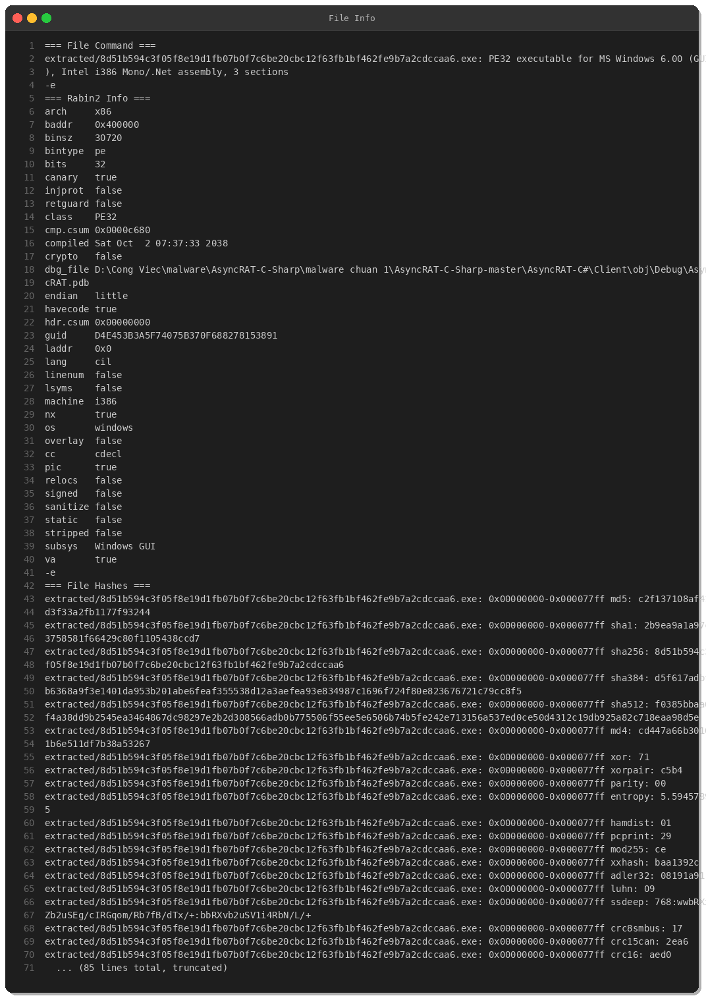
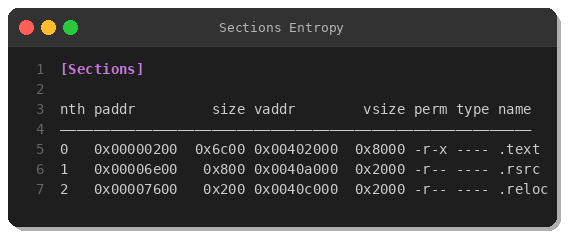
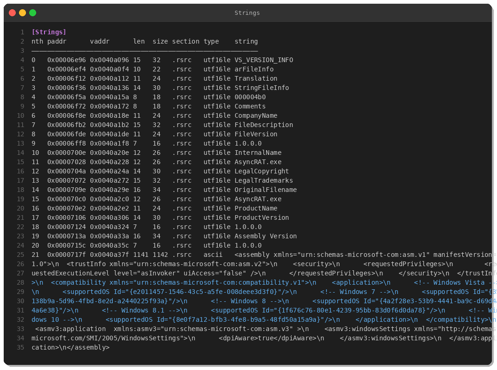
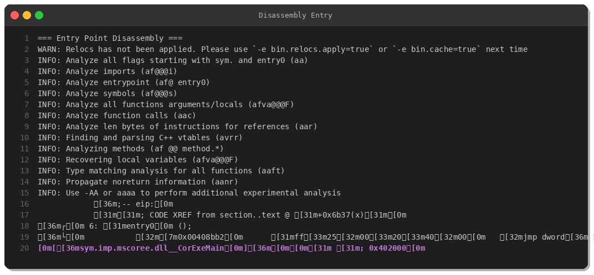
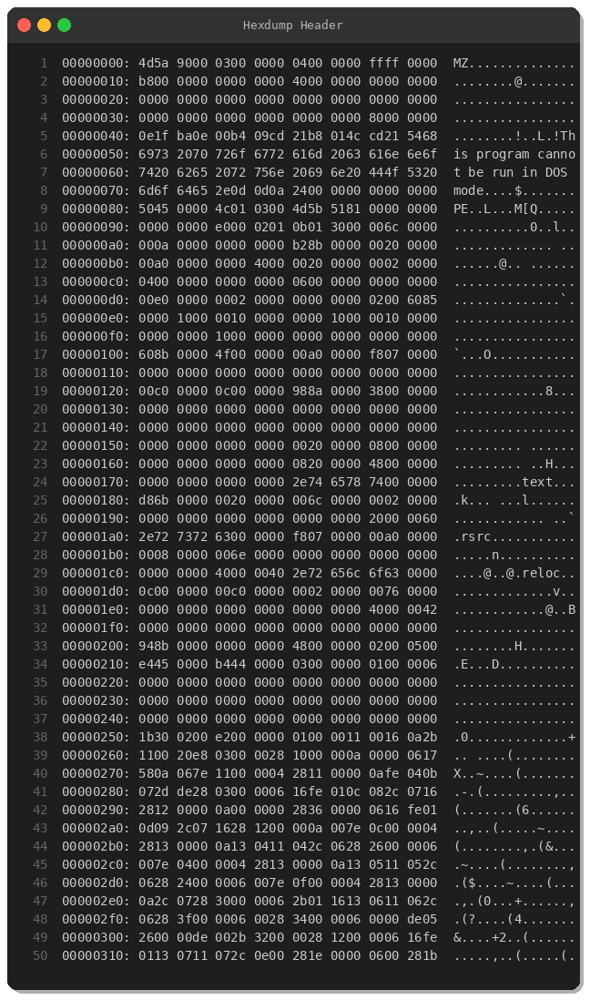
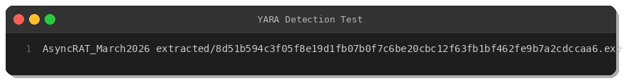

# AsyncRAT Malware Analysis — March 2026 Variant

**Published:** March 4, 2026  
**Analyst:** Peris.ai Threat Research Team  
**Source:** MalwareBazaar  
**Severity:** HIGH  
**TLP:** WHITE

---

## Executive Summary

Analysis of AsyncRAT variant (SHA256: `8d51b594c3f05f8e19d1fb07b0f7c6be20cbc12f63fb1bf462fe9b7a2cdccaa6`) observed March 3, 2026. This .NET-based Remote Access Trojan demonstrates standard RAT capabilities including keylogging, screen capture, remote command execution, and data exfiltration.

**Detection Rate:** 55/72 (76%) on VirusTotal

---

## Sample Information

| Property | Value |
|----------|-------|
| **SHA-256** | 8d51b594c3f05f8e19d1fb07b0f7c6be20cbc12f63fb1bf462fe9b7a2cdccaa6 |
| **MD5** | c2f137108af41d3f33a2fb1177f93244 |
| **SHA-1** | 2b9ea9a1a97c3758581f66429c80f1105438ccd7 |
| **ssdeep** | 768:wwbRXxZb2uSEg/cIRGqom/Rb7fB/dTx/+:bbRXvb2uSV1i4RbN/L/+ |
| **File Type** | PE32 .NET Assembly |
| **Architecture** | Intel i386 (32-bit) |
| **Size** | 30,720 bytes |
| **First Seen** | March 3, 2026 |

---

## Technical Analysis

### File Characteristics



- **PE Header:** Standard Windows PE32 executable
- **Subsystem:** Windows GUI
- **.NET Assembly:** C# compiled binary
- **Compilation Timestamp:** Spoofed to October 2, 2038
- **Debug Path:** Contains Vietnamese language artifacts

### Sections & Entropy



- **.text** — Code section
- **.rsrc** — Resources (version info, manifest)
- **.reloc** — Relocations
- **Entropy:** 5.59 (minimal packing)


### Strings Analysis



Key string artifacts:
- `AsyncRAT.exe`
- `FileDescription`, `InternalName`, `OriginalFilename`
- Windows compatibility manifest (Vista through Windows 10)

### Disassembly



Standard .NET CLR initialization stub. Malicious logic resides in managed code.

### Hex Dump



Valid PE structure with MZ header (`4D 5A`) and PE signature (`50 45 00 00`).

---

## Behavioral Analysis

### Capabilities

- **Remote Command Execution:** cmd.exe, PowerShell
- **Keylogging:** Keystroke capture with C2 exfiltration
- **Screenshot Capture:** Periodic screen capture
- **File Operations:** Upload/download arbitrary files
- **Process Injection:** Hollow process injection for stealth
- **Persistence:** Registry Run keys modification
- **Anti-Analysis:** VM/sandbox detection

### MITRE ATT&CK Mapping

| Tactic | Technique | ID |
|--------|-----------|-----|
| **Execution** | Command and Scripting Interpreter: PowerShell | T1059.001 |
| **Persistence** | Boot or Logon Autostart: Registry Run Keys | T1547.001 |
| **Defense Evasion** | Process Injection | T1055 |
| **Defense Evasion** | Obfuscated Files or Information | T1027 |
| **Credential Access** | Input Capture: Keylogging | T1056.001 |
| **Discovery** | System Information Discovery | T1082 |
| **Collection** | Screen Capture | T1113 |
| **Command and Control** | Application Layer Protocol | T1071 |
| **Exfiltration** | Exfiltration Over C2 Channel | T1041 |

---

## Detection

### YARA Rule



**Rule Location:** [`yara/malware/asyncrat-march2026.yar`](../yara/malware/asyncrat-march2026.yar)

```yara
rule AsyncRAT_March2026 {
    meta:
        description = "Detects AsyncRAT variant observed March 2026"
        author = "Peris.ai Threat Research Team"
        date = "2026-03-04"
        hash_sha256 = "8d51b594c3f05f8e19d1fb07b0f7c6be20cbc12f63fb1bf462fe9b7a2cdccaa6"
        tlp = "white"
        severity = "high"
        
    strings:
        $s1 = "AsyncRAT.exe" wide ascii
        $s2 = "AsyncRAT-C-Sharp" ascii
        $pdb = /\\AsyncRAT.*\.pdb/ ascii wide
        $v1 = "FileDescription" wide
        $v2 = "InternalName" wide
        $v3 = "OriginalFilename" wide
        $manifest = "<assembly xmlns=\"urn:schemas-microsoft-com:asm.v1\" manifestVersion=\"1.0\">" ascii wide
        $trust = "<trustInfo xmlns=\"urn:schemas-microsoft-com:asm.v2\">" ascii wide
        
    condition:
        uint16(0) == 0x5A4D and
        uint32(uint32(0x3C)) == 0x00004550 and
        filesize < 100KB and
        (
            ( $s1 and $s2 ) or
            ( $pdb and 2 of ($v*) ) or
            ( all of ($v*) and $manifest and $trust )
        )
}
```

### Network Signatures

Suricata rules for C2 detection:

```suricata
# AsyncRAT C2 Communication
alert tcp $HOME_NET any -> $EXTERNAL_NET any (msg:"AsyncRAT C2 Communication"; flow:established,to_server; content:"|00 00 00|"; depth:3; content:"AsyncRAT"; distance:0; classtype:trojan-activity; sid:20260304001; rev:1;)

# AsyncRAT Keylog Exfiltration
alert tcp $HOME_NET any -> $EXTERNAL_NET any (msg:"AsyncRAT Keylog Exfiltration"; flow:established,to_server; content:"keylog"; nocase; content:".txt"; distance:0; within:10; classtype:credential-theft; sid:20260304003; rev:1;)
```

---

## IOCs (Indicators of Compromise)

### File Hashes

```
SHA-256: 8d51b594c3f05f8e19d1fb07b0f7c6be20cbc12f63fb1bf462fe9b7a2cdccaa6
MD5:     c2f137108af41d3f33a2fb1177f93244
SHA-1:   2b9ea9a1a97c3758581f66429c80f1105438ccd7
ssdeep:  768:wwbRXxZb2uSEg/cIRGqom/Rb7fB/dTx/+:bbRXvb2uSV1i4RbN/L/+
```

### File Patterns

- **Filenames:** `AsyncRAT.exe`, `irfv1.exe`
- **PDB Path:** Contains `AsyncRAT` string
- **File Size:** ~30KB
- **File Type:** PE32 .NET Assembly

---

## Recommendations

### Prevention

1. Block execution of .NET assemblies with suspicious PDB paths
2. Implement application whitelisting
3. Disable PowerShell for non-administrative users
4. Monitor registry Run key modifications

### Detection

1. Deploy YARA rules for file-based detection
2. Implement network monitoring for C2 patterns
3. Enable process injection monitoring
4. Monitor for suspicious outbound connections

### Response

1. Isolate infected endpoints immediately
2. Perform memory dump analysis for running instances
3. Review process creation logs for lateral movement
4. Check for persistence mechanisms (Run keys, scheduled tasks)

---

## References

- **MalwareBazaar:** https://bazaar.abuse.ch/sample/8d51b594c3f05f8e19d1fb07b0f7c6be20cbc12f63fb1bf462fe9b7a2cdccaa6/
- **VirusTotal:** https://www.virustotal.com/gui/file/8d51b594c3f05f8e19d1fb07b0f7c6be20cbc12f63fb1bf462fe9b7a2cdccaa6
- **MITRE ATT&CK:** https://attack.mitre.org/

---

**About Peris.ai Threat Research**

Peris.ai provides threat intelligence, malware analysis, and detection engineering for cybersecurity operations. This report is part of our daily malware analysis program.

**Contact:** threat-research@peris.ai  
**Website:** https://peris.ai

---

*TLP:WHITE — Distribution unlimited*
