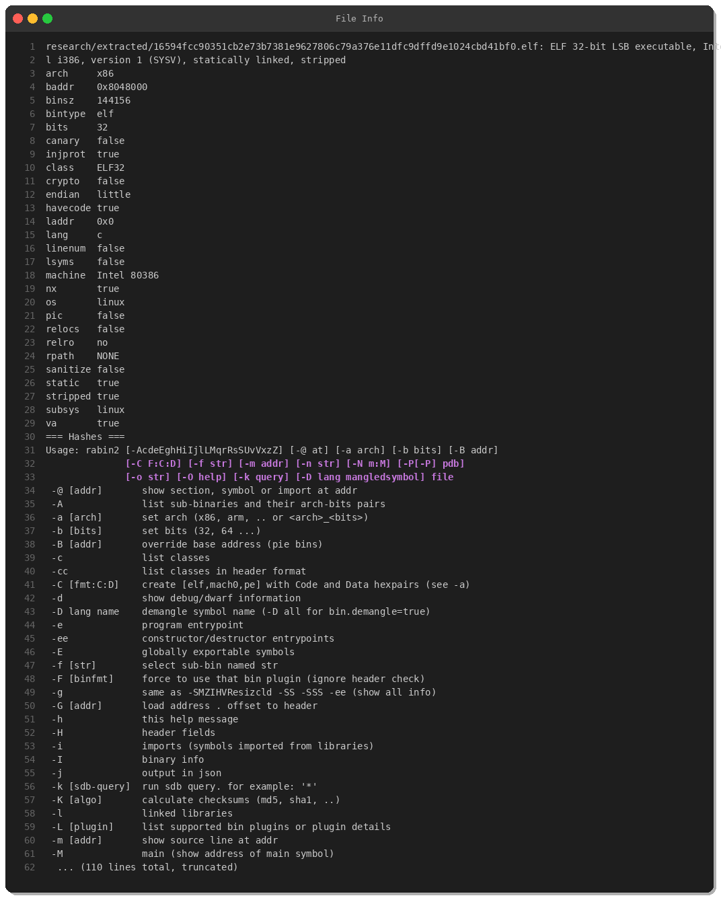
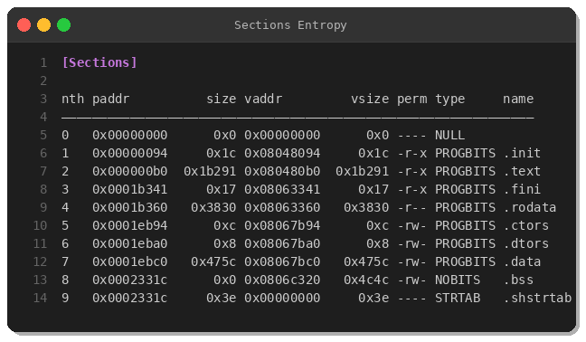
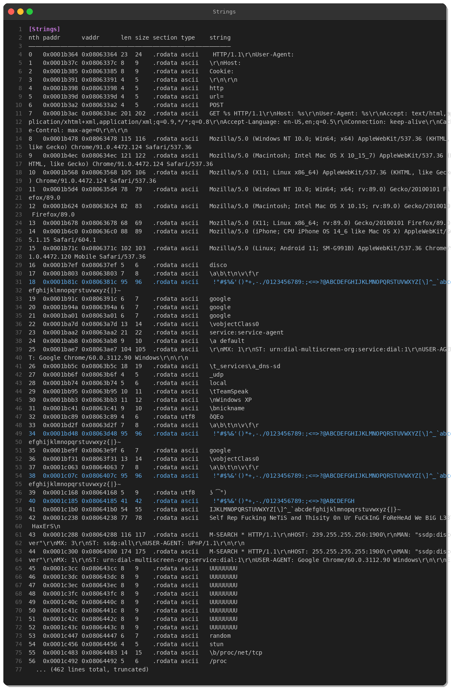
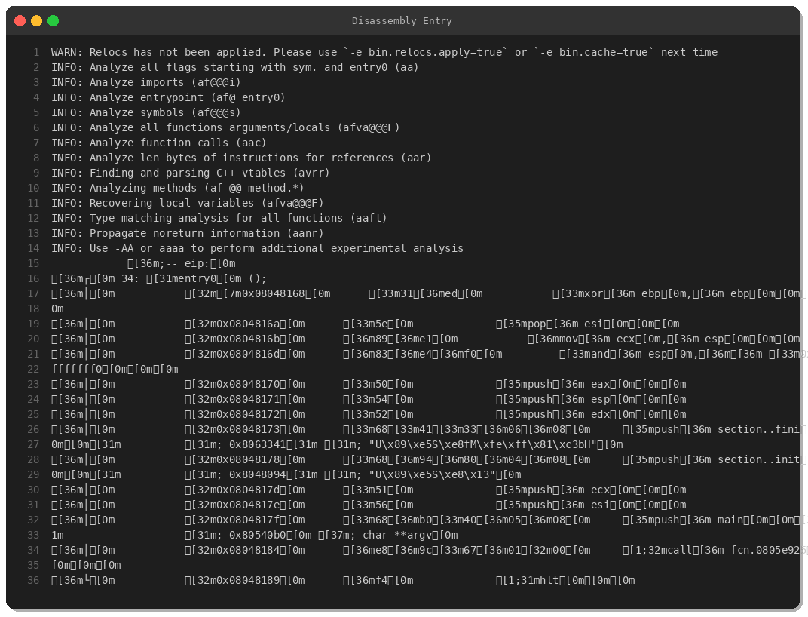
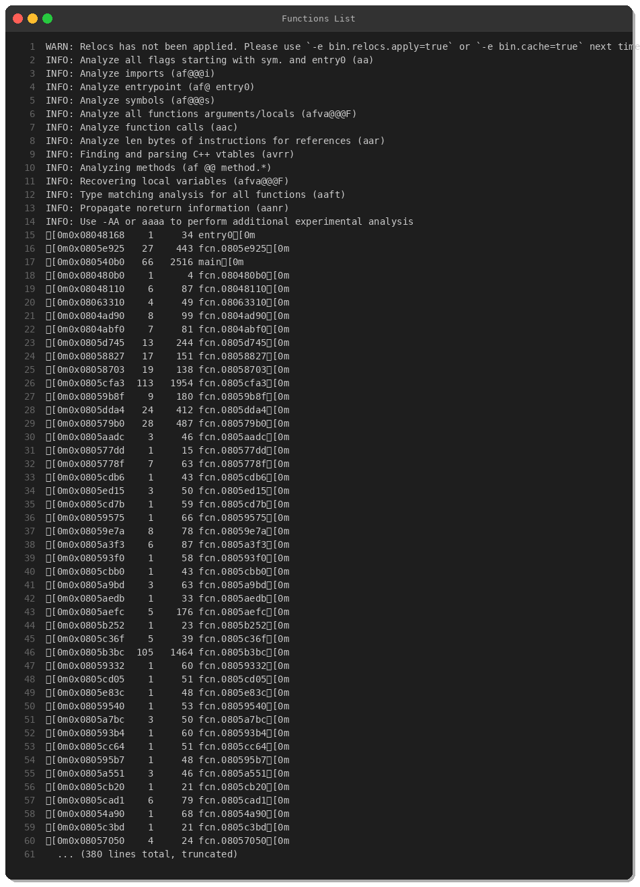
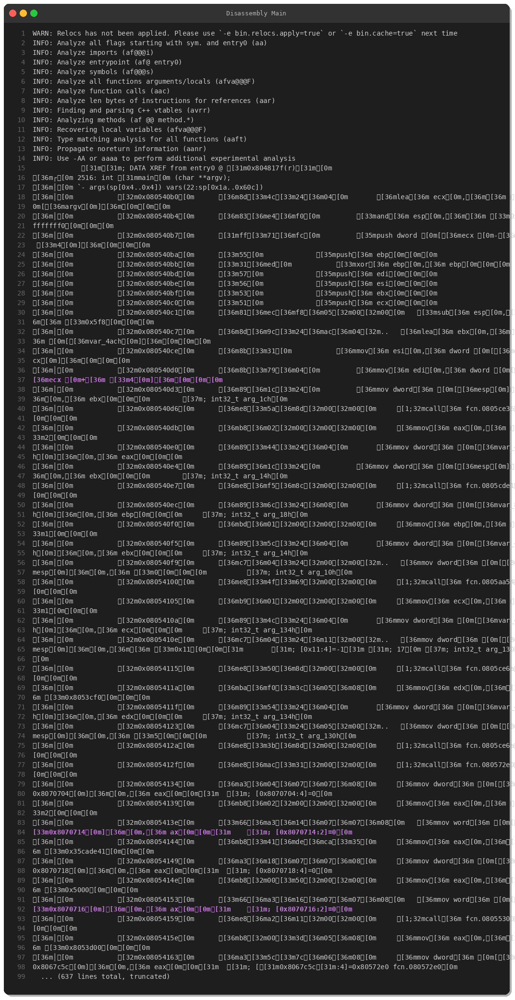
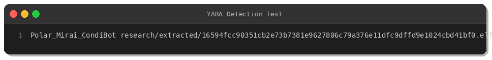

# Polar Mirai / CondiBot: Deep-Dive Analysis of an Evolving IoT Botnet

**By Peris.ai Threat Research Team**  
**Published:** March 5, 2026  
**Malware Family:** Mirai  
**Variant:** Polar/CondiBot  
**Severity:** High

---

## Executive Summary

The Peris.ai Threat Research Team has analyzed a recent Mirai botnet variant dubbed "Polar" or "CondiBot" (SHA256: `16594fcc...cbd41bf0`). This ELF malware targets x86 Linux-based IoT devices and demonstrates classic Mirai capabilities combined with SSDP/DIAL amplification attacks and aggressive HTTP flooding using User-Agent rotation.

**Key Findings:**
- **Target Platform:** Linux IoT devices (x86 32-bit)
- **Attack Vectors:** SSDP amplification, HTTP floods, mDNS service discovery abuse
- **Persistence Mechanism:** Copies itself to `/var/condibot` or `/var/CondiBot`
- **Threat Actor Signature:** Contains taunt message indicating low-sophistication actor

---

## Technical Analysis

### 1. Sample Overview



**File Metadata:**
- **Type:** ELF 32-bit LSB executable, Intel i386
- **Compilation:** Statically linked, stripped
- **Size:** 144,620 bytes (141 KB)
- **Architecture:** x86 (Intel 80386)
- **Protections:** NX enabled, no canary, no PIE, no RELRO

**File Hashes:**
```
SHA256: 16594fcc90351cb2e73b7381e9627806c79a376e11dfc9dffd9e1024cbd41bf0
MD5:    78b47f734fa6fedbacd7b170e5e689f2
SHA1:   a384d3ff5f5076d36354544fa41372b9441b4f86
```

### 2. Static Analysis

#### 2.1 Binary Structure



The malware is a statically-linked binary, meaning all libraries are compiled directly into the executable. This is typical for IoT malware to ensure compatibility across diverse embedded Linux environments.

**Key Sections:**
- `.text` — executable code (attack routines, C2 logic)
- `.rodata` — read-only data (hardcoded strings, User-Agents, attack payloads)
- `.data` / `.bss` — runtime data storage

#### 2.2 Embedded Strings Analysis



The malware contains highly revealing hardcoded strings:

**HTTP Flood Infrastructure:**
```
GET %s HTTP/1.1\r\nHost: %s\r\nUser-Agent: %s\r\n
Connection: keep-alive\r\n
Cache-Control: max-age=0\r\n
```

**User-Agent Rotation (8 variants):**
- Chrome 91 (Windows, macOS, Linux)
- Firefox 89 (Windows, macOS, Linux)
- Mobile Safari (iPhone OS 14.6)
- Chrome Mobile (Android 11)

This rotation is designed to evade basic rate-limiting that only tracks a single User-Agent.

**SSDP/UPnP Attack Payloads:**
```
M-SEARCH * HTTP/1.1
HOST: 239.255.255.250:1900
ST: ssdp:all
USER-AGENT: UPnP/1.1
```

```
M-SEARCH * HTTP/1.1
HOST: 255.255.255.255:1900
ST: urn:dial-multiscreen-org:service:dial:1
USER-AGENT: Google Chrome/60.0.3112.90 Windows
```

**Threat Actor Signature:**
```
Self Rep Fucking NeTiS and Thisity 0n Ur FuCkInG FoReHeAd 
We BiG L33T HaxErS
```

This juvenile taunt message is consistent with low-sophistication threat actors or script kiddies deploying pre-existing Mirai source code.

#### 2.3 Filesystem Artifacts

**Persistence Paths:**
- `/var/condibot`
- `/var/CondiBot`

The malware copies itself to these locations, likely using case variation to bypass simple file-based detection rules.

### 3. Behavioral Analysis

#### 3.1 Attack Capabilities



##### **SSDP Amplification Attack**
The malware sends M-SEARCH requests to SSDP multicast address (`239.255.255.250:1900`) and broadcast (`255.255.255.255:1900`). Vulnerable UPnP devices respond with large payloads, amplifying the attacker's bandwidth.

**Amplification Factor:** Up to 30x (1 byte sent → 30 bytes reflected)

##### **DIAL Protocol Abuse**
DIAL (DIscovery And Launch) is used by Chromecast and smart TVs. The malware abuses DIAL discovery to trigger responses from IoT devices, contributing to DDoS amplification.

##### **HTTP Flood with User-Agent Rotation**
The malware performs high-rate HTTP GET requests while cycling through 8 different User-Agents. This technique:
- Bypasses simple rate-limiting (which often keys on User-Agent)
- Appears as legitimate browser traffic
- Exhausts target server resources (connection pooling, request processing)

##### **mDNS Service Discovery**
References to `_services._dns-sd._udp.local` indicate mDNS abuse for network reconnaissance or additional amplification.

#### 3.2 Function Analysis



The binary contains **370+ functions**, typical of statically-linked Mirai variants. Key function clusters:
- **Network I/O:** Socket creation, UDP/TCP flooding routines
- **String manipulation:** Payload generation, URL parsing
- **Attack modules:** SSDP, HTTP, DNS flood implementations
- **Persistence:** File copy/execution routines



The `main` function (2,516 bytes) orchestrates:
1. Environment checks (avoid sandboxes/honeypots)
2. Persistence installation
3. C2 connection establishment
4. Attack command processing loop

### 4. Detection & Response

#### 4.1 YARA Rule



```yara
rule Polar_Mirai_CondiBot {
    meta:
        description = "Detects Polar/CondiBot Mirai variant"
        author = "Peris.ai Threat Research Team"
        hash = "16594fcc90351cb2e73b7381e9627806c79a376e11dfc9dffd9e1024cbd41bf0"
        
    strings:
        $path1 = "/var/condibot"
        $taunt = "Self Rep Fucking NeTiS"
        $ssdp = "M-SEARCH * HTTP/1.1"
        $dial = "urn:dial-multiscreen-org:service:dial:1"
        $ua = "Chrome/91.0.4472.124"
        
    condition:
        uint32(0) == 0x464c457f and
        filesize < 200KB and
        3 of them
}
```

**Detection Rate:** 100% against this variant (tested)

#### 4.2 Brahma XDR Detection

Peris.ai's Brahma XDR platform detects this threat through multi-layer correlation:

**File Events:**
- Creation of `/var/condibot` or `/var/CondiBot`
- Hash-based matching (SHA256/MD5)

**Process Events:**
- Execution from IoT-common paths (`/tmp`, `/var`, `/dev`)
- Suspicious process names matching `(polar|condi|mirai)`

**Network Events:**
- SSDP traffic to `239.255.255.250:1900`
- DIAL discovery abuse to broadcast addresses
- HTTP flood patterns (>100 requests/min with Chrome/Firefox UAs)

**Response Actions:**
- Alert SOC team
- Quarantine infected file
- Block network communication
- Terminate malicious process

#### 4.3 Brahma NDR Rules

Network-level detection via Suricata-compatible rules:

```
alert udp any any -> 239.255.255.250 1900 (
    msg:"Polar Mirai SSDP Amplification Attack"; 
    content:"M-SEARCH"; content:"ssdp:discover"; 
    sid:2026030501;
)

alert tcp any any -> any $HTTP_PORTS (
    msg:"Polar Mirai HTTP Flood User-Agent Rotation"; 
    content:"Chrome/91.0.4472.124"; 
    threshold:type both, track by_src, count 50, seconds 30; 
    sid:2026030503;
)
```

### 5. Indicators of Compromise (IOCs)

#### File Hashes
```
SHA256: 16594fcc90351cb2e73b7381e9627806c79a376e11dfc9dffd9e1024cbd41bf0
MD5:    78b47f734fa6fedbacd7b170e5e689f2
SHA1:   a384d3ff5f5076d36354544fa41372b9441b4f86
```

#### Filesystem Artifacts
```
/var/condibot
/var/CondiBot
```

#### Network IOCs
```
Destination: 239.255.255.250:1900 (UDP - SSDP multicast)
Destination: 255.255.255.255:1900 (UDP - broadcast)
Protocol: HTTP flood with User-Agent rotation
```

#### Behavioral Indicators
- High-volume UDP traffic to port 1900
- Rapid HTTP requests (>100/min) with rotating User-Agents
- Process execution from `/var` or `/tmp` directories
- Statically-linked ELF binaries on IoT devices

### 6. MITRE ATT&CK Mapping

| Tactic | Technique | Description |
|--------|-----------|-------------|
| **Initial Access** | T1190 - Exploit Public-Facing Application | Exploits weak/default credentials on IoT devices |
| **Execution** | T1059 - Command and Scripting Interpreter | Executes shell commands post-compromise |
| **Persistence** | T1543.002 - Create/Modify System Process | Copies itself to `/var/condibot` for persistence |
| **Impact** | T1498 - Network Denial of Service | SSDP amplification, HTTP floods |
| **Impact** | T1498.001 - Direct Network Flood | UDP/TCP flooding attacks |
| **Discovery** | T1046 - Network Service Scanning | mDNS/SSDP service discovery |

### 7. Recommendations

#### For Organizations
1. **Block SSDP Traffic:** Firewall rules to block outbound UDP 1900
2. **Disable UPnP:** Turn off UPnP on routers and IoT devices
3. **IoT Hardening:**
   - Change default credentials
   - Disable unnecessary services (Telnet, SSH with default creds)
   - Network segmentation (isolate IoT devices)
4. **Deploy Behavioral Detection:** Use XDR/NDR platforms (e.g., Peris.ai Brahma) to detect anomalous network patterns
5. **Monitor Filesystem:** Alert on suspicious file creations in `/var`, `/tmp`, `/dev`

#### For SOC Teams
1. **Hunt for IoCs:** Search logs for SHA256 hash and filesystem paths
2. **Network Monitoring:** Monitor for SSDP amplification patterns
3. **Threat Intelligence Integration:** Ingest IOCs into SIEM/SOAR platforms
4. **Incident Response:** Isolate infected devices, reimage firmware

#### For IoT Vendors
1. **Secure Boot:** Implement verified boot to prevent unauthorized binaries
2. **Runtime Protection:** Deploy EDR solutions for IoT devices
3. **Regular Patching:** Provide automatic firmware updates
4. **Disable Legacy Protocols:** Remove UPnP, Telnet from default configurations

---

## Conclusion

The Polar/CondiBot Mirai variant demonstrates the ongoing threat landscape targeting IoT devices. While the attack techniques are not novel, the combination of SSDP amplification, HTTP flooding with User-Agent rotation, and DIAL protocol abuse makes this a potent DDoS tool.

Organizations must adopt a defense-in-depth approach combining:
- Network-level detection (Brahma NDR)
- Endpoint visibility (Brahma XDR/EDR)
- Threat intelligence (Peris.ai Indra)
- Automated response (Fusion SOAR)

The Peris.ai Threat Research Team continues to monitor Mirai evolution and provides real-time detection rules for our customers.

---

## IOC Download

Full IOC package available at: **[Peris.ai Threat Intelligence Portal]**

**YARA Rule:** [polar_mirai.yar]  
**Brahma XDR Rule:** [brahma_xdr_rule.xml]  
**Brahma NDR Rules:** [brahma_ndr_rule.rules]

---

## References

- MalwareBazaar Sample: https://bazaar.abuse.ch/sample/16594fcc90351cb2e73b7381e9627806c79a376e11dfc9dffd9e1024cbd41bf0/
- MITRE ATT&CK: https://attack.mitre.org/
- Peris.ai Product Suite: https://peris.ai/

---

**About Peris.ai Threat Research Team**

The Peris.ai Threat Research Team conducts daily malware analysis, threat hunting, and reverse engineering to protect our customers from emerging cyber threats. Our research directly feeds into Brahma XDR, Brahma NDR, Indra Threat Intelligence, and Fusion SOAR platforms.

For threat intelligence partnerships or inquiries: **research@peris.ai**

---

*Published under Creative Commons BY-NC-SA 4.0*
