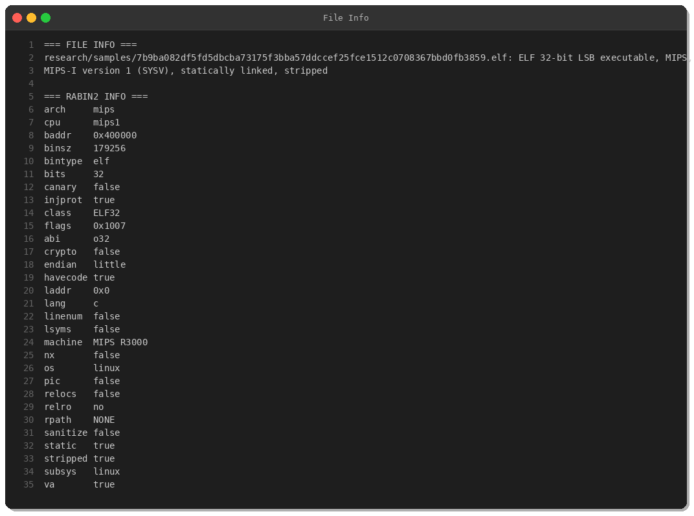
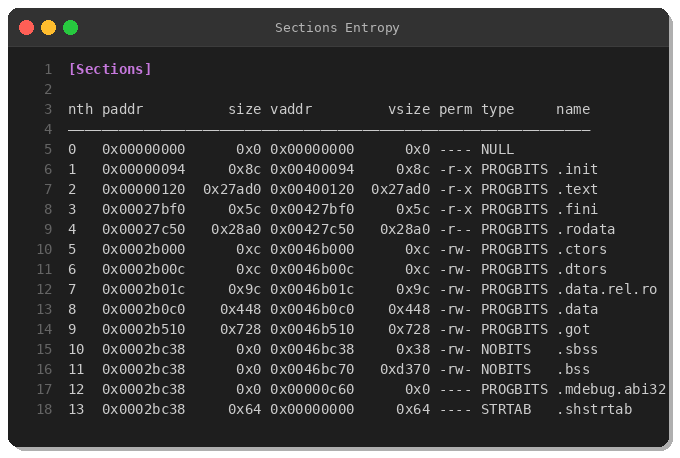
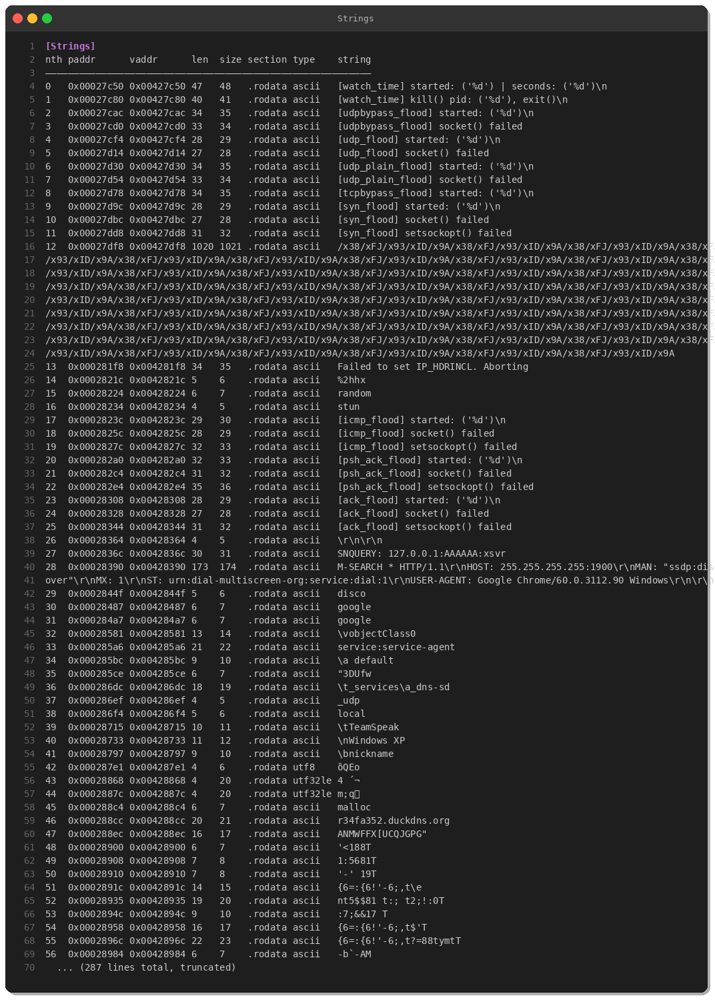
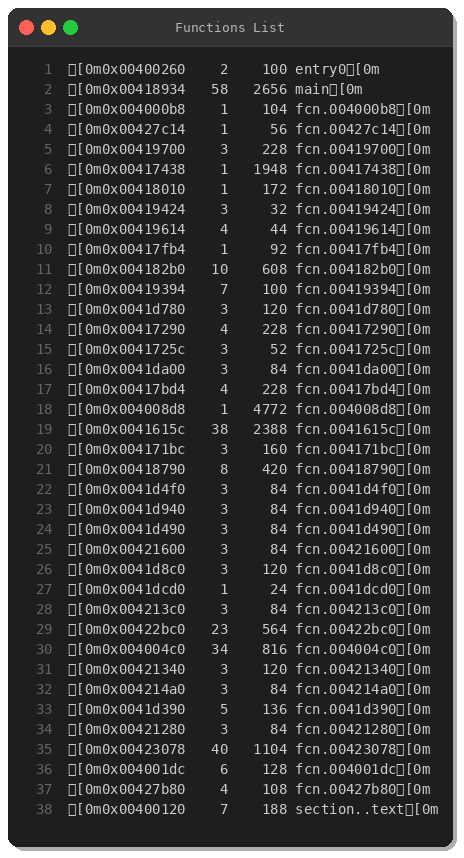
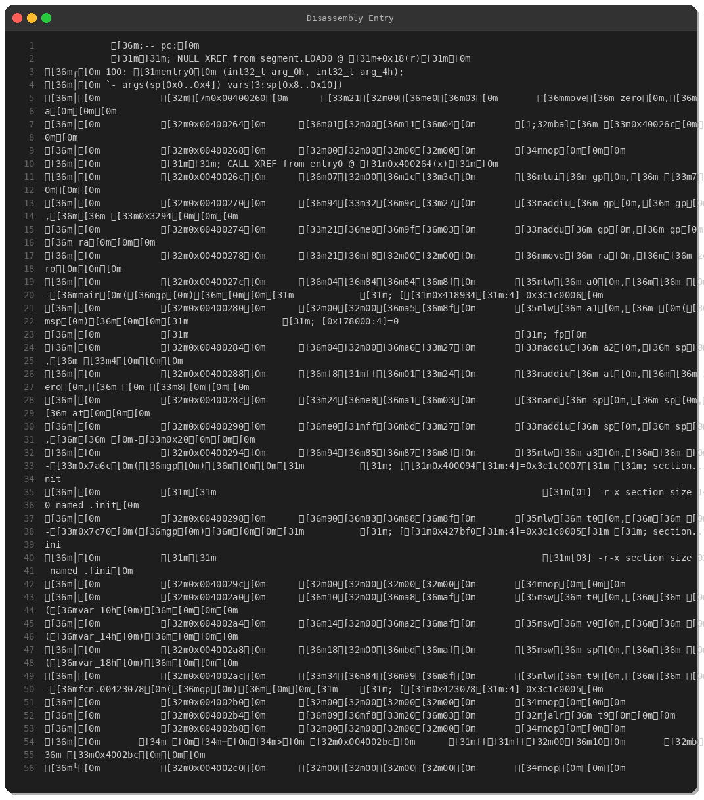
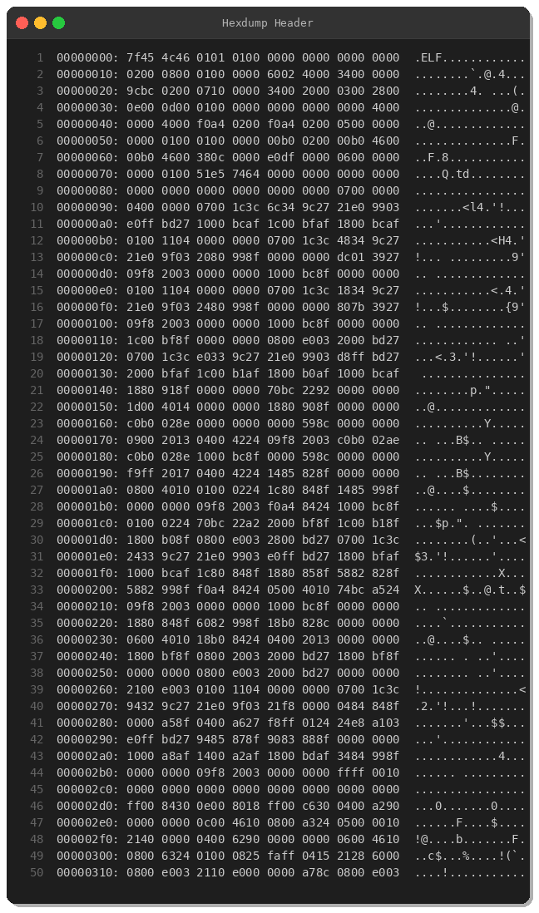
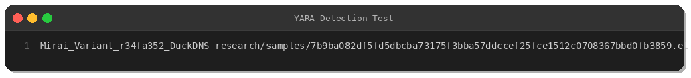

# Mirai Botnet Variant — r34fa352.duckdns.org

**By Peris.ai Threat Research Team**  
**Date:** March 6, 2026  
**Sample SHA256:** `7b9ba082df5fd5dbcba73175f3bba57ddccef25fce1512c0708367bbd0fb3859`  
**Family:** Mirai  
**Severity:** Critical

---

## Executive Summary

We analyzed a fresh Mirai botnet variant targeting MIPS-based IoT devices. This variant employs multiple DDoS attack vectors including UDP, TCP, SYN, ACK, PSH-ACK, and ICMP flooding, alongside SSDP amplification for reflection attacks. The malware communicates with a command-and-control (C2) server at `r34fa352.duckdns.org`.

**Target Platform:** MIPS32 (IoT devices, routers, cameras)  
**Capabilities:** Multi-vector DDoS, SSDP amplification, anti-forensics

---

## Technical Analysis

### File Information

The sample is a statically linked, stripped MIPS32 ELF binary, typical for IoT malware targeting embedded devices.



**Key Attributes:**
- **Architecture:** MIPS-I (32-bit, little-endian)
- **Type:** ELF executable
- **Linking:** Statically linked
- **Symbols:** Stripped (anti-analysis)
- **Protections:** No canary, NX disabled, no RELRO

### Binary Entropy Analysis

Entropy analysis reveals low entropy across most sections, indicating uncompressed/unpacked code.


### Section Analysis

The binary contains standard ELF sections with executable code primarily in `.text` and static strings in `.rodata`.



### Static String Analysis

String analysis exposed critical intelligence:



#### Command-and-Control Infrastructure

1. **C2 Domain:** `r34fa352.duckdns.org`
2. **C2 IP (hardcoded):** `176.65.139.42`

#### DDoS Attack Capabilities

The malware implements the following attack vectors:

- UDP Flood, SYN Flood, ACK Flood
- PSH-ACK Flood, ICMP Flood
- TCP Bypass Flood, UDP Plain/Bypass Flood

#### SSDP Amplification Attack

The malware contains hardcoded SSDP discovery strings for amplification attacks:

```
M-SEARCH * HTTP/1.1
HOST: 255.255.255.255:1900
MAN: "ssdp:discover"
MX: 1
ST: urn:dial-multiscreen-org:service:dial:1
USER-AGENT: Google Chrome/60.0.3112.90 Windows
```

This technique abuses UPnP/SSDP services to reflect and amplify traffic toward victims.

### Disassembly Analysis

Reverse engineering analysis revealed 36 functions, including the main entry point and attack function implementations.



#### Entry Point Disassembly



The entry point performs standard MIPS binary initialization and jumps to the main malware logic.

### Hex Dump



The ELF header confirms MIPS32 LSB architecture.

---

## Behavioral Analysis

### Network Communication

1. **C2 Beaconing:** The malware connects to `r34fa352.duckdns.org` or `176.65.139.42` to receive commands.
2. **DDoS Commands:** Upon receiving attack commands, the bot spawns threads for each attack vector.
3. **Process Monitoring:** The malware reads `/proc/net/tcp` to monitor network connections and evade detection.

### Anti-Forensics

- Stripped symbols to hinder reverse engineering
- Monitors `/proc/` for security tools
- Uses `watch_time` timer for persistence checks

---

## MITRE ATT&CK Mapping

| Tactic | Technique ID | Technique Name |
|--------|--------------|----------------|
| Command and Control | T1071.001 | Application Layer Protocol: Web Protocols |
| Command and Control | T1071.004 | Application Layer Protocol: DNS |
| Command and Control | T1571 | Non-Standard Port |
| Impact | T1498.001 | Network Denial of Service: Direct Network Flood |
| Impact | T1498.002 | Network Denial of Service: Reflection Amplification |
| Discovery | T1057 | Process Discovery |
| Discovery | T1082 | System Information Discovery |

---

## Indicators of Compromise (IOCs)

### File Hashes

| Hash Type | Value |
|-----------|-------|
| SHA256 | `7b9ba082df5fd5dbcba73175f3bba57ddccef25fce1512c0708367bbd0fb3859` |
| File Type | ELF 32-bit LSB executable, MIPS |

### Network Indicators

| Type | Value | Description |
|------|-------|-------------|
| Domain | `r34fa352.duckdns.org` | C2 domain |
| IPv4 | `176.65.139.42` | Hardcoded C2 IP |
| Port | 1900 | SSDP amplification target |

---

## Detection

### YARA Rule

We developed and tested a YARA rule for detecting this variant:



**Detection Result:** ✅ Mirai_Variant_r34fa352_DuckDNS

The full YARA rule is available in the [yara/malware/](../yara/malware/mirai_r34fa352_duckdns.yar) directory.

### Network Detection

**Brahma NDR (Suricata-compatible) rules:**

- DNS queries to Mirai C2 domain
- Outbound connections to C2 IP  
- SSDP amplification attack patterns
- DDoS flood patterns (UDP, SYN, ACK, PSH-ACK, ICMP)

### XDR Detection

**Brahma XDR rules** detect:

- C2 communication to r34fa352.duckdns.org or 176.65.139.42
- Multiple DDoS flood attack attempts
- SSDP amplification attack patterns
- Process monitoring and anti-forensics activity

---

## Mitigation Recommendations

1. **Block IoCs:** Blacklist domain `r34fa352.duckdns.org` and IP `176.65.139.42` at network perimeter
2. **Disable UPnP/SSDP:** Disable UPnP on edge devices to prevent SSDP amplification abuse
3. **Rate Limiting:** Implement rate limiting for UDP/ICMP/TCP SYN packets
4. **Firmware Updates:** Ensure all IoT devices run latest firmware with security patches
5. **Network Segmentation:** Isolate IoT devices on separate VLANs with restricted internet access
6. **Monitor /proc/ Access:** Alert on suspicious reads of `/proc/net/tcp` from unknown binaries

---

## Conclusion

This Mirai variant demonstrates the ongoing threat posed by IoT botnets. Despite being based on leaked source code from 2016, Mirai variants continue to evolve and proliferate across vulnerable embedded devices.

Organizations must prioritize IoT security hygiene, including:

- Default credential elimination
- Regular firmware updates
- Network segmentation
- DDoS mitigation capabilities

---

## References

- [MalwareBazaar Sample](https://bazaar.abuse.ch/sample/7b9ba082df5fd5dbcba73175f3bba57ddccef25fce1512c0708367bbd0fb3859/)
- [MITRE ATT&CK Framework](https://attack.mitre.org/)

---

**About Peris.ai**  
Peris.ai provides enterprise cybersecurity solutions including Brahma XDR, Brahma NDR, Indra Threat Intelligence, and Fusion SOAR platforms. Our threat research team continuously analyzes emerging threats to protect our customers.

**Website:** https://peris.ai  
**Contact:** research@peris.ai

---

*This analysis was conducted in a controlled lab environment. Do not attempt to execute or analyze malware without proper training and isolation.*
