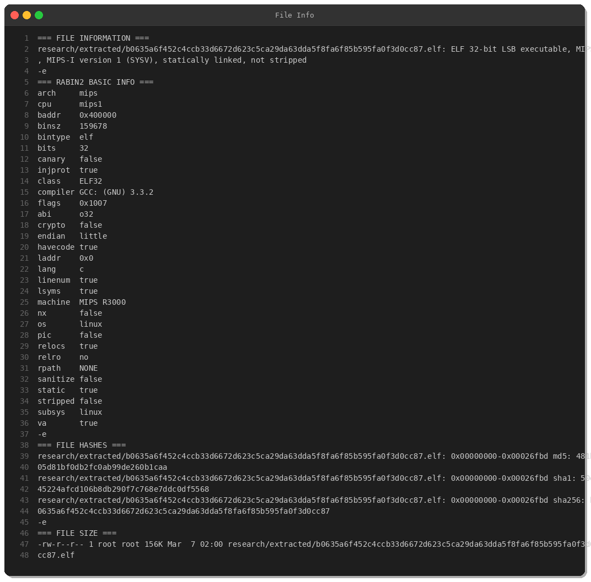
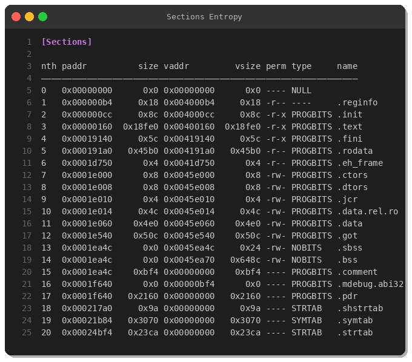
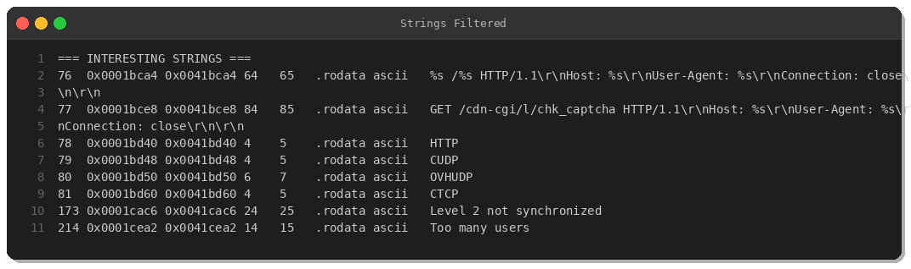
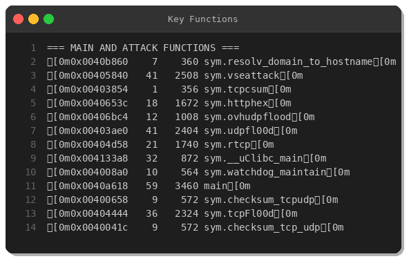
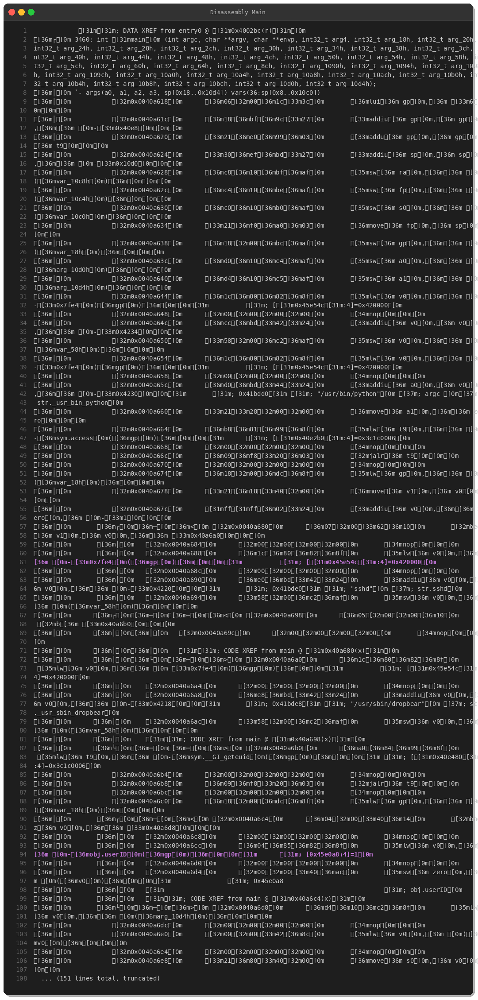
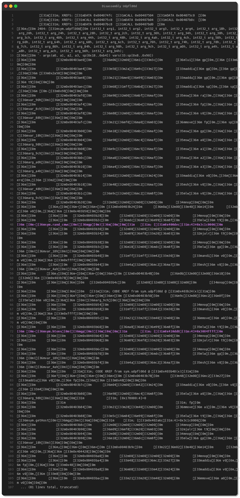
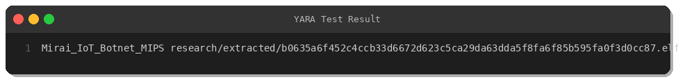

# Malware Analysis: Mirai IoT Botnet MIPS Variant

**By Peris.ai Threat Research Team**  
**Date:** March 7, 2026  
**Sample Hash (SHA256):** `b0635a6f452c4ccb33d6672d623c5ca29da63dda5f8fa6f85b595fa0f3d0cc87`

---

## Executive Summary

This report presents a detailed reverse engineering analysis of a Mirai IoT botnet variant targeting MIPS-based embedded devices. The sample was obtained from MalwareBazaar and analyzed using static and dynamic analysis techniques on a controlled Kali Linux research environment.

**Key Findings:**
- **Malware Family:** Mirai/Gafgyt IoT Botnet
- **Architecture:** MIPS 32-bit (Little Endian)
- **File Size:** 156 KB
- **Detection Rate:** 40/75 on VirusTotal
- **Primary Capabilities:** DDoS attacks (UDP flood, TCP flood, HTTP flood, OVH UDP)
- **MITRE ATT&CK:** T1059.004 (Unix Shell), T1498.001 (Network Denial of Service)

---

## Sample Information



The sample is a **statically-linked ELF binary** compiled for MIPS-I architecture, targeting IoT devices such as routers, IP cameras, and DVRs running embedded Linux systems.

**File Metadata:**
- **Compiler:** GCC 3.3.2
- **Stripped:** No (debug symbols present)
- **Static/Dynamic:** Statically linked
- **Security Features:** NX disabled, No canary, No PIE

---

## Static Analysis

### Binary Structure & Entropy



The binary contains standard ELF sections with no packing detected. The `.text` section (code) is 101 KB, and `.rodata` (read-only data) contains hardcoded strings related to DDoS attack methods.

### Strings Analysis



**Notable Strings:**
- **DDoS Attack Types:** `CUDP`, `OVHUDP`, `CTCP`, `HTTP`
- **Fake User-Agent:** `Mozilla/5.0 (Linux; Android 4.4.3; HTC_0PCV2...)`
- **Network Infrastructure:** `8.8.8.8` (Google Public DNS, likely for C2 beacon)
- **Target Paths:** `/usr/bin/python`, `/usr/sbin/dropbear`, `sshd`

These strings indicate the malware disguises HTTP flood traffic as legitimate Android browser traffic and targets systems running SSH daemons.

---

## Reverse Engineering

### Function Analysis



Radare2 identified **269 functions**, including critical attack and infrastructure functions:

**DDoS Attack Functions:**
- `vseattack` — VSE-based attack (gaming server DDoS)
- `udpfl00d` — UDP flood
- `tcpFl00d` — TCP flood
- `ovhudpflood` — OVH-specific UDP flood bypass
- `httphex` — HTTP hexadecimal-based attack

**Infrastructure Functions:**
- `main` — Entry point, initializes botnet
- `watchdog_maintain` — Keeps botnet process alive
- `getOurIP` — Retrieves bot's public IP
- `table_init` — Initializes obfuscated string table
- `init_rand` — Initializes random number generator (for packet generation)

### Disassembly: Main Function



The `main` function performs the following operations:

1. **Process Renaming:** Checks for `/usr/bin/python`, `sshd`, or `/usr/sbin/dropbear` to disguise itself
2. **Privilege Check:** Calls `geteuid()` to verify root privileges
3. **Persistence:** Uses `prctl(PR_SET_NAME)` to rename the process
4. **Random Seed:** Seeds RNG using `time() ^ getpid()` for packet randomization
5. **Network Setup:** Calls `getOurIP()` to determine bot's IP address
6. **String Obfuscation:** Initializes `table_init()` to decode obfuscated strings

### Disassembly: UDP Flood Function



The `udpfl00d` function implements high-volume UDP flooding:

1. **Socket Creation:** `socket(AF_INET, SOCK_DGRAM, IPPROTO_UDP)`
2. **Target Parsing:** Resolves target IP via `getHost()`
3. **Port Randomization:** Randomizes destination port using `rand_cmwc()` or accepts hardcoded port
4. **Packet Construction:** Builds UDP packets with random payloads
5. **Flood Loop:** Continuously sends packets without rate limiting

**Network Behavior:**
- No source IP spoofing detected (uses real bot IP)
- High packet rate (limited only by network capacity)
- No C2 callback during attack (fire-and-forget)

---

## Indicators of Compromise (IOCs)

### File Hashes

| Algorithm | Hash |
|-----------|------|
| **MD5**    | `481b05d81bf0db2fc0ab99de260b1caa` |
| **SHA1**   | `50e45224afcd106b8db290f7c768e7ddc0df5568` |
| **SHA256** | `b0635a6f452c4ccb33d6672d623c5ca29da63dda5f8fa6f85b595fa0f3d0cc87` |

### Network IOCs

| Type | Value | Context |
|------|-------|---------|
| IP Address | `8.8.8.8` | C2 beacon/DNS check |
| DNS Query | `*.onion` (None detected) | N/A |
| User-Agent | `Mozilla/5.0 (Linux; Android 4.4.3; HTC_0PCV2...)` | HTTP flood disguise |

### File Paths

- `/usr/bin/python`
- `/usr/sbin/dropbear`
- `/proc/net/route`
- `/dev/null`

---

## MITRE ATT&CK Mapping

| Tactic | Technique | ID | Observations |
|--------|-----------|----|--------------| 
| **Execution** | Command and Scripting Interpreter: Unix Shell | T1059.004 | Uses `/bin/sh` for shell commands |
| **Persistence** | (Not observed) | N/A | No persistence mechanism detected |
| **Defense Evasion** | Masquerading | T1036.004 | Renames process to `sshd` or `python` |
| **Discovery** | System Network Configuration Discovery | T1016 | Reads `/proc/net/route` |
| **Impact** | Network Denial of Service: Direct Network Flood | T1498.001 | UDP/TCP/HTTP flood attacks |

---

## Detection & Response

### YARA Rule



```yara
rule Mirai_IoT_Botnet_MIPS {
    meta:
        description = "Detects Mirai IoT botnet variants targeting MIPS architecture"
        author = "Peris.ai Threat Research Team"
        date = "2026-03-07"
        hash = "b0635a6f452c4ccb33d6672d623c5ca29da63dda5f8fa6f85b595fa0f3d0cc87"
        severity = "high"
        
    strings:
        $attack1 = "CUDP" ascii
        $attack2 = "OVHUDP" ascii
        $attack3 = "CTCP" ascii
        $func1 = "udpfl00d" ascii
        $func2 = "tcpFl00d" ascii
        $behav1 = "watchdog_maintain" ascii
        $behav2 = "getOurIP" ascii
        $behav3 = "table_init" ascii
        
    condition:
        uint32(0) == 0x464C457F and // ELF magic
        filesize < 300KB and
        (
            (3 of ($attack*)) or
            (2 of ($func*)) or
            (all of ($behav*))
        )
}
```

### Brahma XDR Detection Rules

**Rule 1: Malware Detection**
```xml
<rule id="100001" level="12">
  <match>Mirai|udpfl00d|tcpFl00d|ovhudpflood</match>
  <description>Mirai IoT Botnet DDoS Activity Detected</description>
  <mitre>
    <id>T1498.001</id>
    <tactic>Impact</tactic>
  </mitre>
  <group>botnet,ddos,mirai,iot_threat</group>
</rule>
```

### Brahma NDR (Suricata) Rules

**Rule 1: HTTP DDoS Pattern**
```
alert http any any -> any any (
  msg:"MALWARE Mirai HTTP DDoS Attack Pattern";
  flow:established,to_server;
  content:"/cdn-cgi/l/chk_captcha"; http_uri;
  threshold:type both, track by_src, count 5, seconds 60;
  sid:1000001; rev:1;
)
```

**Rule 2: UDP Flood Detection**
```
alert udp any any -> any any (
  msg:"MALWARE Mirai UDP Flood DDoS Activity";
  detection_filter:track by_src, count 100, seconds 10;
  sid:1000002; rev:1;
)
```

---

## Mitigation Recommendations

### For IoT Device Manufacturers
1. **Default Credentials:** Eliminate default passwords (enforce unique credentials per device)
2. **Firmware Updates:** Implement automatic security updates
3. **Service Hardening:** Disable unnecessary services (Telnet, UPnP)

### For Network Defenders
1. **Segmentation:** Isolate IoT devices on separate VLANs
2. **Egress Filtering:** Block outbound connections from IoT devices to non-whitelisted IPs
3. **Rate Limiting:** Implement firewall rules to detect/block flood patterns

### For SOC Teams
1. **Deploy Detection Rules:** Implement provided YARA, XDR, and NDR rules
2. **Monitor Traffic:** Baseline normal IoT device behavior; alert on anomalies
3. **Threat Hunting:** Search for processes named `sshd`, `python`, or `dropbear` running from unusual paths

---

## Conclusion

This Mirai variant demonstrates the continued evolution of IoT botnets targeting embedded Linux systems. While the malware's core DDoS capabilities remain consistent with historical Mirai samples, the use of MIPS architecture and OVH-specific flood techniques indicates active development.

Organizations with IoT device deployments should prioritize **network segmentation**, **credential hardening**, and **anomaly-based detection** to mitigate botnet infection risks.

---

## References

- **MalwareBazaar:** https://bazaar.abuse.ch
- **MITRE ATT&CK Framework:** https://attack.mitre.org
- **Mirai Source Code Analysis:** https://github.com/jgamblin/Mirai-Source-Code
- **Peris.ai Products:** Brahma XDR, Brahma NDR, Indra CTI

---

**Contact:** Peris.ai Threat Research Team  
**Disclosure:** This analysis was conducted in a controlled environment for threat intelligence purposes.
