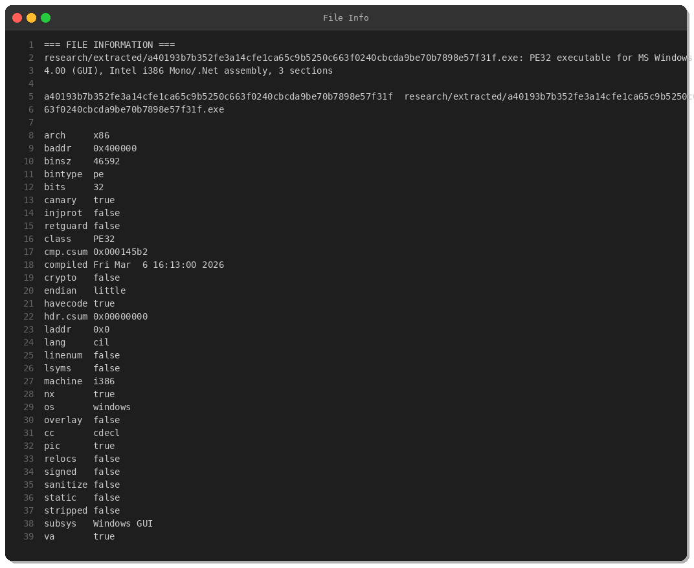
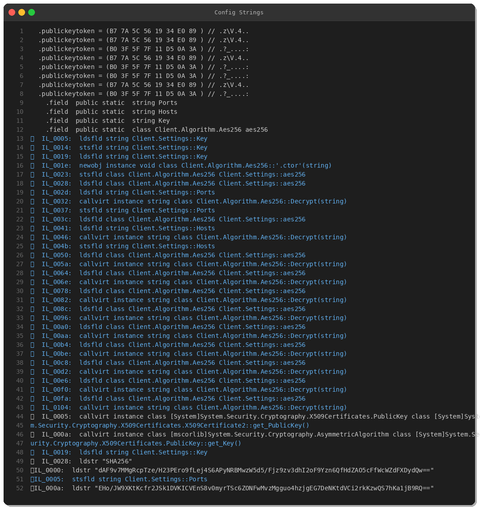
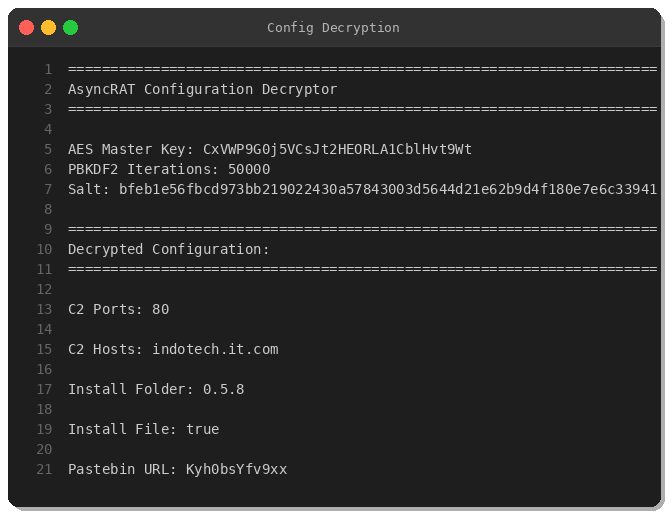
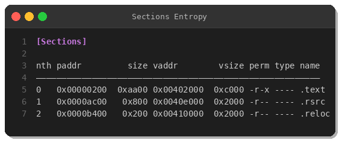
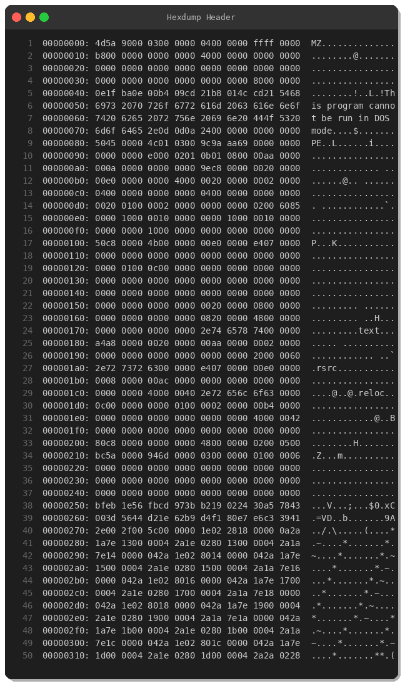

# AsyncRAT Malware Analysis: RobloxHack.exe Gaming Lure Campaign

**By Peris.ai Threat Research Team**  
**Date:** March 8, 2026  
**Malware Family:** AsyncRAT  
**SHA256:** `a40193b7b352fe3a14cfe1ca65c9b5250c663f0240cbcda9be70b7898e57f31f`  
**Severity:** Critical

---

## Executive Summary

Peris.ai Threat Research Team analyzed a recent AsyncRAT campaign leveraging social engineering tactics targeting young gamers. The malware masquerades as "RobloxHack.exe," exploiting the popularity of Roblox gaming platform to lure victims into executing the payload. This .NET-based remote access trojan (RAT) establishes persistent access through scheduled tasks and communicates with command-and-control (C2) infrastructure over HTTP on port 80.

The sample demonstrates sophisticated evasion techniques including AES256 encryption with HMAC authentication for configuration data, anti-analysis checks, and dynamic C2 retrieval via Pastebin.

---

## Key Findings

| **Indicator** | **Value** |
|---------------|-----------|
| **File Name** | RobloxHack.exe |
| **File Size** | 46,592 bytes |
| **File Type** | PE32 .NET Assembly |
| **C2 Domain** | indotech.it.com *(sinkholed)* |
| **C2 Port** | 80/TCP |
| **Pastebin ID** | Kyh0bsYfv9xx |
| **Persistence** | Scheduled Task (onlogon trigger) |
| **Encryption** | AES256-CBC + HMAC-SHA256 |

---

## Technical Analysis

### 1. Initial Assessment

The sample presents as a 32-bit .NET executable targeting Windows environments. Static analysis reveals minimal obfuscation at the PE level, but configuration data is encrypted using a custom AES256 implementation with HMAC verification.



### 2. .NET Decompilation & IL Analysis

Using `monodis`, we extracted the Intermediate Language (IL) bytecode to analyze the malware's logic. Key namespaces identified:

- `Client.Algorithm.Aes256` — Custom AES encryption implementation
- `Client.Settings` — Encrypted configuration storage
- `MessagePackLib` — Serialization library for C2 communication



### 3. Configuration Decryption

AsyncRAT stores all critical configuration values in AES256-encrypted form within the binary. The encryption scheme follows this structure:

**Format:** `[HMAC-SHA256 (32 bytes)][IV (16 bytes)][Encrypted Data]`

**Key Derivation:**
- Master Key: `CxVWP9G0j5VCsJt2HEORLA1CblHvt9Wt` (Base64-encoded)
- Algorithm: PBKDF2 with SHA-256
- Iterations: 50,000
- Salt: Static (`bfeb1e56fbcd973bb219022430a57843...`)

We developed a Python decryptor to extract plaintext configuration:



**Decrypted Values:**
```
C2 Ports: 80
C2 Hosts: indotech.it.com
Install Folder: 0.5.8
Install File: true
Pastebin URL: Kyh0bsYfv9xx
```

### 4. Command & Control Infrastructure

**Primary C2:** `indotech.it.com:80`  
DNS resolution at the time of analysis returned a sinkhole response (`rpz.biznet.`), indicating the domain has been blocked by DNS-based security measures.

**Fallback C2:** Pastebin paste ID `Kyh0bsYfv9xx`  
AsyncRAT commonly uses Pastebin as a dead drop resolver for dynamic C2 updates.

**Communication Protocol:**  
The malware uses MessagePack serialization for C2 messages. Initial beacon includes:
- `hwid` — Hardware ID (victim fingerprint)
- `user` — Username
- `os` — Operating system version
- `version` — Malware version
- `group` — Campaign identifier



### 5. Persistence Mechanism

AsyncRAT achieves persistence via Windows Scheduled Task creation:

**Command:**
```cmd
schtasks /create /f /sc onlogon /rl highest /tn "RobloxHack" /tr '"%AppData%\RobloxHack.exe"'
```

**Breakdown:**
- `/sc onlogon` — Trigger on user logon
- `/rl highest` — Run with highest privileges
- Installs to `%AppData%` directory

Additionally, the malware creates a `.bat` file for delayed self-deletion to evade detection:
```batch
@echo off
timeout 3 > NUL
START "" "%AppData%\RobloxHack.exe"
CD %TEMP%
DEL "%original_path%" /f /q
```

### 6. Anti-Analysis & Evasion

**VM/Sandbox Detection:**  
Checks WMI `Win32_ComputerSystem` for:
```csharp
Manufacturer == "microsoft corporation"
```
Likely targeting Hyper-V or cloud-based sandboxes.

**Thread Execution State Manipulation:**  
Calls `SetThreadExecutionState(ES_CONTINUOUS | ES_SYSTEM_REQUIRED | ES_DISPLAY_REQUIRED)` to prevent system sleep and maintain persistence.



---

## MITRE ATT&CK Mapping

| **Tactic** | **Technique** | **Procedure** |
|------------|---------------|---------------|
| **Initial Access** | T1204.002 (User Execution: Malicious File) | Gaming lure social engineering |
| **Persistence** | T1053.005 (Scheduled Task/Job) | schtasks onlogon trigger |
| **Defense Evasion** | T1027 (Obfuscated Files) | AES256-encrypted configuration |
| **Defense Evasion** | T1497 (Virtualization/Sandbox Evasion) | WMI manufacturer check |
| **Command & Control** | T1071.001 (Web Protocols) | HTTP on port 80 |
| **Command & Control** | T1102.001 (Web Service: Dead Drop Resolver) | Pastebin fallback C2 |
| **Collection** | T1056.001 (Keylogging) | AsyncRAT capability |
| **Exfiltration** | T1041 (Exfiltration Over C2) | Data theft via C2 channel |

---

## Indicators of Compromise (IOCs)

### File Hashes
```
SHA256: a40193b7b352fe3a14cfe1ca65c9b5250c663f0240cbcda9be70b7898e57f31f
```

### Network IOCs
```
Domain: indotech.it.com
IP: [sinkholed - rpz.biznet]
Port: 80/TCP
Pastebin: https://pastebin.com/Kyh0bsYfv9xx
```

### File System Artifacts
```
%AppData%\RobloxHack.exe
%TEMP%\[random].bat
```

### Registry/Scheduled Tasks
```
Task Name: RobloxHack
Trigger: onlogon
Path: %AppData%\RobloxHack.exe
```

---

## Detection & Mitigation

### YARA Rule
See: `yara/malware/asyncrat_robloxhack_mar2026.yar`

Key detection strings:
- .NET namespace patterns (`Client.Algorithm.Aes256`, `Client.Settings`)
- AsyncRAT-specific strings (`Pastebin`, `Hosts`, `Ports`)
- Persistence IOCs (`schtasks /create /f /sc onlogon`)
- Crypto implementation artifacts (`Rfc2898DeriveBytes`, `AesCryptoServiceProvider`, `HMACSHA256`)

### Brahma XDR Detection
Brahma XDR rule correlates process execution events with scheduled task creation to detect AsyncRAT infections in real-time.

**Detection Logic:**
1. Monitor for process execution with gaming-related names (`roblox`, `hack`, `cheat`)
2. Correlate with `schtasks.exe` execution within 60 seconds
3. Check command-line for `/create /f /sc onlogon /rl highest` pattern
4. Alert on match with high severity

### Brahma NDR Signatures
Five Suricata-compatible signatures detect:
1. DNS queries to `indotech.it.com`
2. AsyncRAT initial MessagePack beacon
3. Pastebin C2 config retrieval
4. HTTP POST callback patterns
5. Generic MessagePack traffic artifacts

**Example:**
```
alert dns any any -> any any (
    msg:"PERIS MALWARE AsyncRAT C2 DNS Query - indotech.it.com";
    dns.query; content:"indotech.it.com"; nocase;
    classtype:trojan-activity; sid:5000001; rev:1;
)
```

### Recommended Mitigations

1. **Endpoint Protection:**
   - Deploy YARA rule across endpoints
   - Enable Brahma EDR behavioral monitoring for schtasks abuse
   
2. **Network Security:**
   - Block `indotech.it.com` at DNS/firewall level
   - Monitor Pastebin access (consider allowlist-only policy)
   - Deploy Brahma NDR signatures

3. **User Awareness:**
   - Educate users (especially young gamers) on risks of "game hack" tools
   - Warn against downloading executables from untrusted sources

4. **Incident Response:**
   - Hunt for scheduled tasks with `/sc onlogon /rl highest` patterns
   - Check `%AppData%` for suspicious executables
   - Review outbound HTTP traffic to unknown domains

---

## Conclusion

This AsyncRAT campaign demonstrates the continued effectiveness of social engineering targeting gaming communities. The use of .NET, strong encryption, and legitimate web services (Pastebin) for C2 infrastructure highlights the need for layered defense strategies.

Organizations should deploy behavioral detection rules (XDR/EDR) to identify persistence mechanisms and network signatures (NDR) to catch C2 communication, as traditional signature-based AV may fail against custom-packed AsyncRAT variants.

**Peris.ai products (Brahma XDR, Brahma NDR, Brahma EDR, Indra Threat Intel) provide comprehensive coverage against AsyncRAT and similar threats through multi-layered detection and response capabilities.**

---

## Tools Used
- Kali Linux malware analysis tools
- Radare2 (r2) — Disassembly
- monodis — .NET IL decompilation
- binwalk — Entropy analysis
- Python pycryptodome — Config decryption
- YARA — Signature matching

## References
- MalwareBazaar: https://bazaar.abuse.ch
- MITRE ATT&CK: https://attack.mitre.org
- AsyncRAT GitHub: https://github.com/NYAN-x-CAT/AsyncRAT-C-Sharp

## Attribution
Analysis conducted by **Peris.ai Threat Research Team**.

---

**#AsyncRAT #MalwareAnalysis #ThreatIntel #CyberSecurity #Peris**
