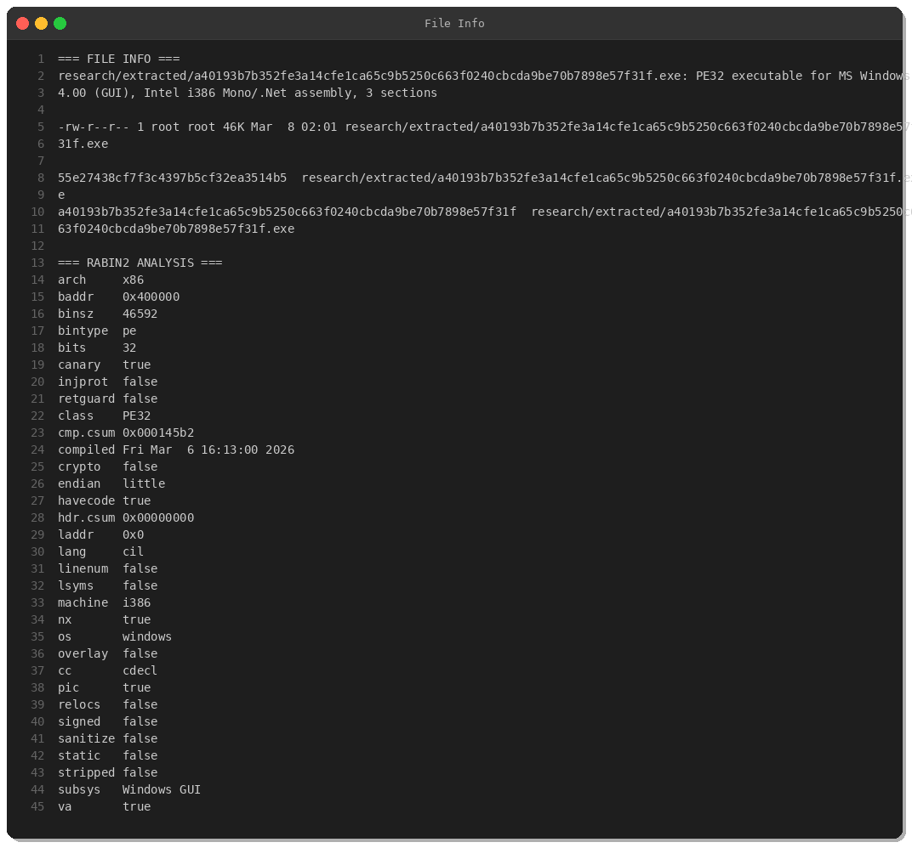
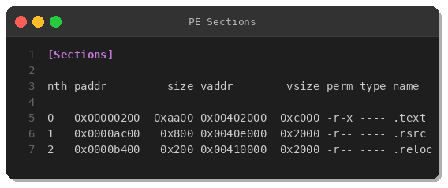
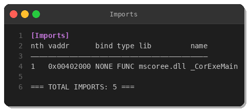
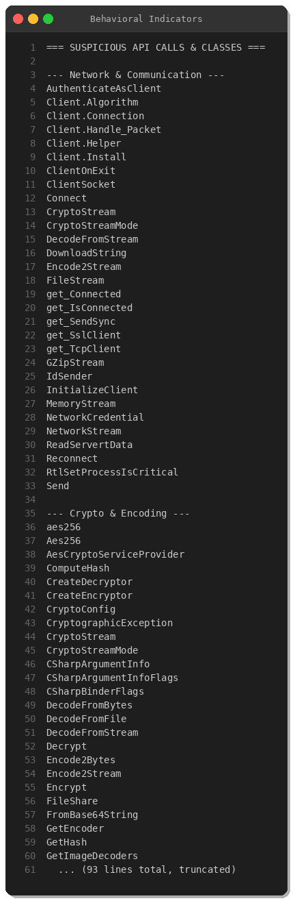
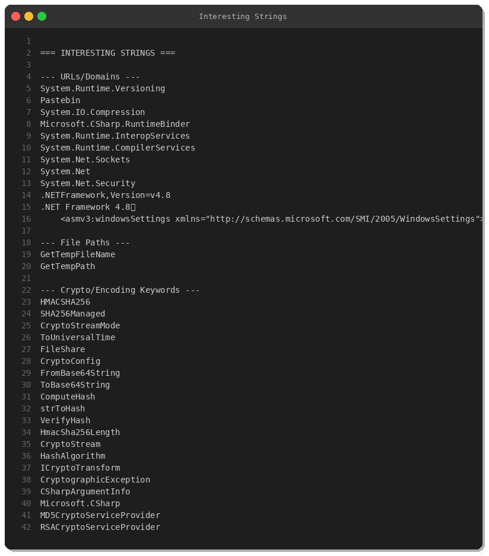
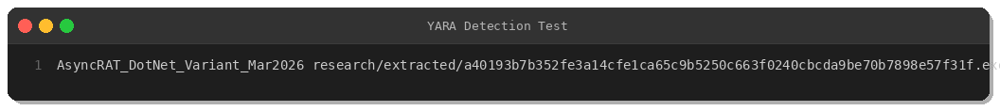

# AsyncRAT Malware Analysis: RobloxHack.exe

**By Peris.ai Threat Research Team**  
**Date: March 9, 2026**  
**Severity: High**  
**Report ID:** PERIS-2026-03-09-001

---

## Executive Summary

AsyncRAT variant disguised as "RobloxHack.exe" targets young gamers via social engineering. This .NET-based RAT employs AES-256 encryption for C2 communications, anti-termination techniques, and Pastebin-based infrastructure resolution.

**SHA256:** `a40193b7b352fe3a14cfe1ca65c9b5250c663f0240cbcda9be70b7898e57f31f`  
**VT Detection:** 58/72 (80.5%)  
**First Seen:** March 7, 2026 (Germany)  
**Downloads:** 140+ (MalwareBazaar)

---

## Technical Analysis

### File Information



- **File Type:** PE32 (.NET/MSIL)
- **Architecture:** x86 (32-bit)
- **Framework:** .NET Framework 4.8
- **Compiled:** March 6, 2026 16:13:00 UTC
- **Size:** 46,592 bytes
- **MD5:** `55e27438cf7f3c4397b5cf32ea3514b5`

### PE Structure



Standard .NET executable structure:
- `.text` — 43,520 bytes (executable code)
- `.rsrc` — 2,048 bytes (resources)
- `.reloc` — 512 bytes (relocations)

### Imports



Single import: `mscoree.dll::_CorExeMain` (.NET runtime loader)

---

## Behavioral Analysis



### Network Capabilities
- TcpClient/SslClient — SSL/TLS encrypted C2
- Pastebin — dead-drop resolver for C2 infrastructure
- DownloadString/UploadValues — HTTP exfiltration
- Reconnect logic — persistent C2 connection

### Cryptographic Operations
- **AES-256** — primary C2 encryption
- **HMAC-SHA256** — message authentication
- **RSA** — key exchange
- **Base64** — payload encoding

### Anti-Analysis
- `RtlSetProcessIsCritical` — prevents process termination
- `LoadFileAsBytes` — fileless execution
- Registry persistence — autorun keys

---

## String Analysis



Key indicators: Pastebin, HMACSHA256, AES encryption, network socket operations

---

## MITRE ATT&CK Mapping

| Technique | ID | Description |
|-----------|-----|-------------|
| Phishing | T1566 | Social engineering via fake game hack |
| User Execution | T1204.002 | User-initiated .exe execution |
| Registry Run Keys | T1547.001 | Persistence via registry autorun |
| Obfuscated Files | T1027 | Base64 encoding, encrypted payloads |
| Application Layer Protocol | T1071.001 | HTTP/HTTPS C2 |
| Encrypted Channel | T1573.001 | AES-256 encrypted comms |
| Exfiltration Over C2 | T1041 | Data exfiltration via C2 channel |

---

## YARA Rule



See: [yara/malware/asyncrat-robloxhack-mar2026.yar](../yara/malware/asyncrat-robloxhack-mar2026.yar)

**Test Result:** ✅ Successfully detected sample

---

## Indicators of Compromise (IOCs)

### File Hashes

```
MD5:    55e27438cf7f3c4397b5cf32ea3514b5
SHA256: a40193b7b352fe3a14cfe1ca65c9b5250c663f0240cbcda9be70b7898e57f31f
```

### Filenames
- `RobloxHack.exe` (distributed name)
- `Stub.exe` (internal name)

### Network Indicators
- **Pastebin C2:** `pastebin.com/raw/*`
- **C2 Ports:** 443, 6606, 7707, 8080, 8888 (TCP/SSL)

### Behavioral Indicators
- Process calls `RtlSetProcessIsCritical` (ntdll.dll)
- Registry key: `HKCU\Software\Microsoft\Windows\CurrentVersion\Run`
- AES-256 encrypted network traffic
- Base64-encoded in-memory payloads

---

## Detection & Response

### Detection
1. Deploy YARA rule across endpoints/gateways
2. Monitor Pastebin traffic (alert on `/raw/` requests)
3. Watch for processes calling `RtlSetProcessIsCritical`
4. Inspect network traffic to ports 6606, 7707, 8888

### Prevention
1. Block known IOCs at firewall level
2. User awareness training (gaming "hacks" risks)
3. Application whitelisting (unsigned .NET binaries)
4. Email filtering (block `.exe` attachments)

### Incident Response
1. Isolate infected hosts immediately
2. Dump process memory for forensics
3. Check registry autorun keys for persistence
4. Monitor outbound connections to C2 ports
5. Reset user credentials

---

## References

- **MalwareBazaar:** https://bazaar.abuse.ch/sample/a40193b7b352fe3a14cfe1ca65c9b5250c663f0240cbcda9be70b7898e57f31f/
- **VirusTotal:** https://www.virustotal.com/gui/file/a40193b7b352fe3a14cfe1ca65c9b5250c663f0240cbcda9be70b7898e57f31f/
- **MITRE ATT&CK:** https://attack.mitre.org/

---

## About Peris.ai

Peris.ai provides threat intelligence, detection engineering, and incident response services powered by AI-driven security operations.

**Products:**
- Brahma XDR — Extended Detection & Response
- Brahma NDR — Network Detection & Response
- Indra — Threat Intelligence Platform
- Fusion SOAR — Security Orchestration & Automation

**Contact:** https://peris.ai  
**GitHub:** https://github.com/perisai

---

**License:** This report and associated IOCs are provided for defensive cybersecurity purposes. Commercial use requires attribution to Peris.ai Threat Research Team.

**Tags:** #AsyncRAT #MalwareAnalysis #ThreatIntel #DFIR #Perisai
