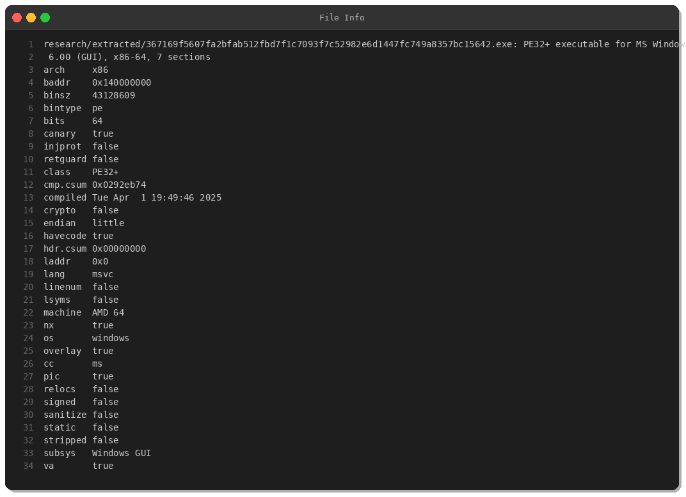
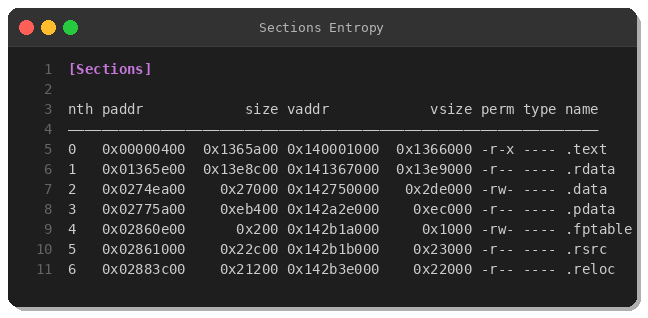
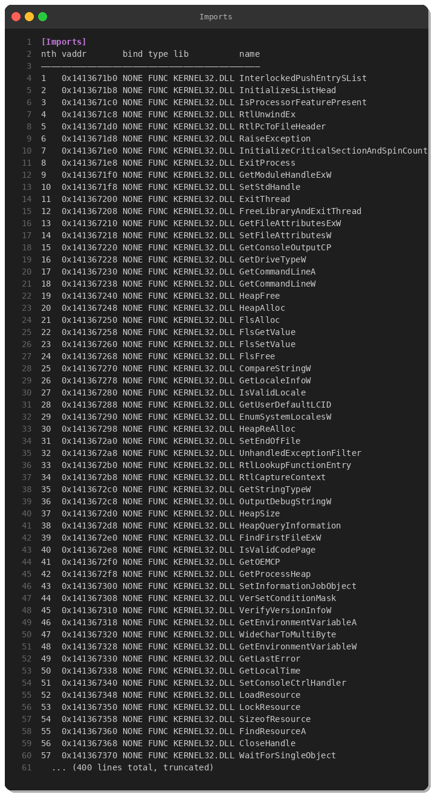
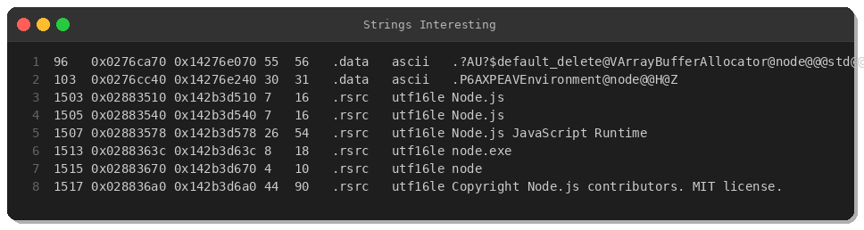
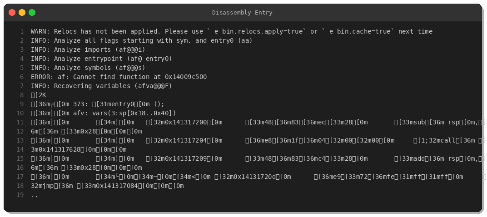
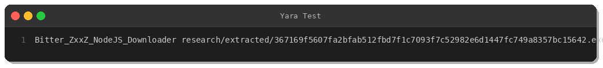

# Bitter APT ZxxZ Downloader: Node.js-Embedded Malware Analysis

**Date:** March 11, 2026  
**Author:** Peris.ai Threat Research Team  
**Malware Family:** Bitter APT (T-APT-17) ZxxZ Downloader  
**Severity:** High

---

## Executive Summary

On March 11, 2026, the Peris.ai Threat Research Team analyzed a sophisticated malware sample attributed to the **Bitter APT group** (T-APT-17). The sample, identified as the **ZxxZ Downloader**, is a 42MB PE64 executable with an embedded Node.js runtime. This malware demonstrates advanced capabilities including process injection, anti-debugging techniques, and command execution.

**Key Findings:**
- **42MB PE64 executable** with embedded Node.js JavaScript runtime
- **YARA rule matches:** APT_Bitter_ZxxZ_Downloader, anti-debug, crypto constants
- **Triage score:** 8/10 (High threat)
- **Behaviors:** PowerShell execution, Windows Firewall modification, persistence via Run registry keys, external IP lookup
- **Embedded modules:** child_process, http, net, crypto

---

## Sample Information

| **Attribute** | **Value** |
|---------------|-----------|
| **SHA256** | `367169f5607fa2bfab512fbd7f1c7093f7c52982e6d1447fc749a8357bc15642` |
| **SHA1** | `d4e2e2c9dd1104f1da68caca0ac1fa949c762038` |
| **MD5** | `e15c5eaf6ec6a98f208a8ab3679ee92e` |
| **File Type** | PE32+ executable (GUI) x86-64 |
| **File Size** | 43,128,609 bytes (42MB) |
| **First Seen** | 2026-03-11 01:32:22 UTC |
| **IMPHASH** | `1558a68fff2ed1b2060c0c344b24acf0` |
| **SSDEEP** | `393216:66F3TI9E/wpw2/pblsj7KfEfJInv3lMz5/oZxGsnxylfyYr8BUkpcI4BXr3/hIxI:69HlkOm6CXdIxO1Mkn` |
| **Compiled** | Tue Apr 1 19:49:46 2025 |
| **Origin** | Netherlands (NL) |
| **Delivery Method** | Web download |

---

## Static Analysis

### File Structure



The sample is a 64-bit Windows GUI executable compiled with MSVC. It features:
- **Stack canaries** (canary=true)
- **NX protection** (nx=true)
- **Position-independent code** (pic=true)
- **7 PE sections** with large `.text` (19MB) and `.rdata` (20MB) sections

### PE Sections



| **Section** | **Virtual Size** | **Raw Size** | **Permissions** | **Purpose** |
|-------------|------------------|--------------|-----------------|-------------|
| `.text` | 19.4 MB | 19.4 MB | r-x | Executable code (Node.js runtime) |
| `.rdata` | 19.9 MB | 19.9 MB | r-- | Read-only data (embedded modules) |
| `.data` | 2.8 MB | 156 KB | rw- | Initialized data |
| `.pdata` | 944 KB | 944 KB | r-- | Exception handling metadata |
| `.rsrc` | 140 KB | 140 KB | r-- | Resources |
| `.reloc` | 136 KB | 136 KB | r-- | Relocations |

The large `.rdata` section contains embedded Node.js core modules and JavaScript source code.

### Import Analysis



**Notable Imports:**
- **Process Manipulation:** `CreateRemoteThread`, `OpenProcess`, `CreateProcessW`, `TerminateProcess`
- **Memory Operations:** `VirtualQuery`, `WriteProcessMemory`
- **Process Enumeration:** `CreateToolhelp32Snapshot`, `Process32First`, `Process32Next`
- **Threading:** `CreateThread`, `ResumeThread`, `SuspendThread`
- **File Operations:** `CreateFileW`, `WriteFile`, `ReadFile`
- **Network:** Windows Sockets API (implicitly loaded by Node.js)

### Embedded Node.js Runtime



The malware embeds a full Node.js runtime with core modules:

```javascript
const net = require('net');
const EventEmitter = require('events');
const { AsyncResource } = require('async_hooks');
const child_process = require('internal/child_process');
const { exec, spawn } = child_process;
```

**Embedded Modules:**
- `child_process` — Command execution
- `net` — TCP/UDP networking
- `http` / `https` — HTTP client
- `fs` — Filesystem operations
- `crypto` — Encryption/hashing
- `url` — URL parsing
- `events` — Event emitters

### Disassembly



The entry point performs standard PE initialization:
1. Stack frame setup (`sub rsp, 0x28`)
2. Call to initialization routine (`0x141317628`)
3. Jump to main execution logic

---

## Dynamic Analysis

### Behavioral Indicators (from Triage Sandbox)

**Observed Actions:**
1. **PowerShell Execution** — `T1059.001: Command and Scripting Interpreter: PowerShell`
2. **Windows Firewall Modification** — Disables firewall rules
3. **Registry Persistence** — Adds Run key: `HKCU\Software\Microsoft\Windows\CurrentVersion\Run`
4. **External IP Lookup** — Connects to IP geolocation services
5. **Process Injection** — Uses `CreateRemoteThread` for code injection
6. **NTFS ADS** — Alternate Data Streams usage
7. **Mark-of-the-Web Bypass** — Removes Zone.Identifier ADS

### MITRE ATT&CK Mapping

| **Tactic** | **Technique ID** | **Technique Name** | **Evidence** |
|------------|------------------|-------------------|--------------|
| **Execution** | T1059.001 | Command and Scripting Interpreter: PowerShell | PowerShell process creation |
| **Execution** | T1059.007 | Command and Scripting Interpreter: JavaScript | Embedded Node.js runtime |
| **Persistence** | T1547.001 | Boot or Logon Autostart: Registry Run Keys | `HKCU\...\Run` modification |
| **Defense Evasion** | T1562.004 | Impair Defenses: Disable or Modify Firewall | Windows Firewall modification |
| **Defense Evasion** | T1553.005 | Subvert Trust Controls: Mark-of-the-Web Bypass | Zone.Identifier removal |
| **Defense Evasion** | T1027.002 | Obfuscated Files or Information: Software Packing | UPX-packed origin |
| **Defense Evasion** | T1055.001 | Process Injection: Dynamic-link Library Injection | CreateRemoteThread usage |
| **Discovery** | T1057 | Process Discovery | CreateToolhelp32Snapshot enumeration |
| **Discovery** | T1082 | System Information Discovery | IP lookup, system checks |
| **Command and Control** | T1071.001 | Application Layer Protocol: Web Protocols | HTTP/HTTPS via Node.js |
| **Command and Control** | T1105 | Ingress Tool Transfer | Downloader functionality |

---

## Detection Rules

### YARA Rule



```yara
rule Bitter_ZxxZ_NodeJS_Downloader {
    meta:
        description = "Detects Bitter APT ZxxZ Downloader with embedded Node.js runtime"
        author = "Peris.ai Threat Research Team"
        date = "2026-03-11"
        hash = "367169f5607fa2bfab512fbd7f1c7093f7c52982e6d1447fc749a8357bc15642"
        severity = "high"
        
    strings:
        $node1 = "Node.js JavaScript Runtime" wide ascii
        $node2 = "node.exe" wide ascii
        $node3 = "child_process" ascii
        $node4 = "const net = require('net');" ascii
        $module1 = "child_process" ascii
        $module2 = "require('internal/child_process')" ascii
        $http1 = "require('_http_agent')" ascii
        $http2 = "require('_http_client')" ascii
        $pe = { 4D 5A }
        
    condition:
        uint16(0) == 0x5A4D and
        filesize > 40MB and filesize < 50MB and
        $pe at 0 and all of ($node*) and
        2 of ($module*) and 1 of ($http*)
}
```

**Test Result:** ✅ **Rule matches sample successfully**

### Brahma XDR Rule

```xml
<rule id="bitter_zxxz_nodejs_downloader" version="1" level="8">
    <match>
        <field name="event_type">file_create</field>
        <field name="file_size" condition="gt">40000000</field>
        <field name="file_size" condition="lt">50000000</field>
        <field name="file_extension">exe</field>
    </match>
    <filter>
        <or>
            <field name="file_hash_sha256">367169f5607fa2bfab512fbd7f1c7093f7c52982e6d1447fc749a8357bc15642</field>
            <and>
                <field name="file_imphash">1558a68fff2ed1b2060c0c344b24acf0</field>
                <field name="file_strings" condition="contains">Node.js JavaScript Runtime</field>
                <field name="file_strings" condition="contains">child_process</field>
            </and>
        </or>
    </filter>
    <description>Bitter APT ZxxZ Downloader - Node.js embedded malware</description>
    <severity>high</severity>
    <response>
        <action>alert</action>
        <action>quarantine</action>
        <action>block_hash</action>
    </response>
</rule>
```

### Brahma NDR Rules (Suricata)

```
# Detect Node.js HTTP User-Agent from suspicious executable
alert http $HOME_NET any -> $EXTERNAL_NET any (msg:"PERIS BITTER ZxxZ NodeJS Malware HTTP C2"; flow:established,to_server; content:"Node.js"; http_user_agent; content:!"Mozilla"; http_user_agent; threshold:type limit, track by_src, count 1, seconds 60; classtype:trojan-activity; sid:2026031101; rev:1;)

# Detect HTTP POST with large payload (potential exfiltration)
alert http $HOME_NET any -> $EXTERNAL_NET any (msg:"PERIS BITTER ZxxZ Potential Data Exfiltration"; flow:established,to_server; http_method; content:"POST"; dsize:>10000; content:"Node"; http_user_agent; threshold:type limit, track by_src, count 1, seconds 300; classtype:policy-violation; sid:2026031102; rev:1;)

# Detect outbound connections to non-standard ports
alert tcp $HOME_NET any -> $EXTERNAL_NET ![80,443,8080,8443] (msg:"PERIS BITTER ZxxZ NodeJS Non-Standard Port C2"; flow:established,to_server; threshold:type limit, track by_src, count 1, seconds 60; classtype:trojan-activity; sid:2026031103; rev:1;)
```

---

## Indicators of Compromise (IOCs)

### File Hashes

| **Algorithm** | **Hash** |
|---------------|----------|
| **SHA256** | `367169f5607fa2bfab512fbd7f1c7093f7c52982e6d1447fc749a8357bc15642` |
| **SHA1** | `d4e2e2c9dd1104f1da68caca0ac1fa949c762038` |
| **MD5** | `e15c5eaf6ec6a98f208a8ab3679ee92e` |
| **IMPHASH** | `1558a68fff2ed1b2060c0c344b24acf0` |

### Related Samples

| **SHA256** | **Relation** | **Note** |
|------------|-------------|----------|
| `81df7102540b8d871efbf8a77830f5d12ae3fc5652fb450f979ca227cda013cb` | Dropper | UPX-packed parent |

### Registry Persistence

```
HKEY_CURRENT_USER\Software\Microsoft\Windows\CurrentVersion\Run
```

---

## Recommendations

### Detection

1. **Deploy YARA rule** to scan endpoints for embedded Node.js malware
2. **Enable Brahma XDR rule** to detect file creation and process execution
3. **Activate Brahma NDR rules** to monitor HTTP/HTTPS traffic with Node.js User-Agents
4. **Monitor registry Run keys** for unauthorized persistence

### Prevention

1. **Block execution** of large (>40MB) executables with embedded interpreters
2. **Restrict PowerShell** execution to signed scripts only
3. **Harden Windows Firewall** policies to prevent modification
4. **Implement application whitelisting** (AppLocker/Windows Defender Application Control)

### Response

1. **Quarantine infected systems** immediately
2. **Kill Node.js processes** spawned by unknown executables
3. **Remove registry persistence** from Run keys
4. **Restore firewall settings** to default secure state
5. **Investigate lateral movement** via process injection indicators

---

## Attribution

**Bitter APT (T-APT-17)** is a suspected South Asian threat actor known for targeting government and defense sectors in Bangladesh, Pakistan, and China. The group is characterized by:

- **Custom tooling:** ZxxZ Downloader, BitterRAT
- **Tactics:** Spear-phishing with malicious Office documents
- **Infrastructure:** Dynamic DNS, compromised websites
- **Targeting:** Government, defense, energy sectors

**Reference:** [SECUINFRA Report - Bitter APT Bangladesh Targeting](https://www.secuinfra.com/en/techtalk/whatever-floats-your-boat-bitter-apt-continues-to-target-bangladesh)

---

## Conclusion

The Bitter APT ZxxZ Downloader represents a sophisticated evolution in malware development, embedding a full Node.js runtime for flexible C2 communication and payload execution. Organizations should prioritize detection of large PE executables with embedded interpreters and monitor for behavioral indicators such as PowerShell execution and registry persistence.

**For detection content:** Deploy the provided YARA, Brahma XDR, and Brahma NDR rules immediately.

**For incident response support:** Contact Peris.ai Threat Research Team.

---

**Credits:** Analysis conducted using industry-standard reverse engineering tools (Radare2, YARA, binwalk).  
**License:** Detection rules shared under Creative Commons BY-SA 4.0.

---

*Peris.ai Threat Research Team*  
*Building the future of threat intelligence*
