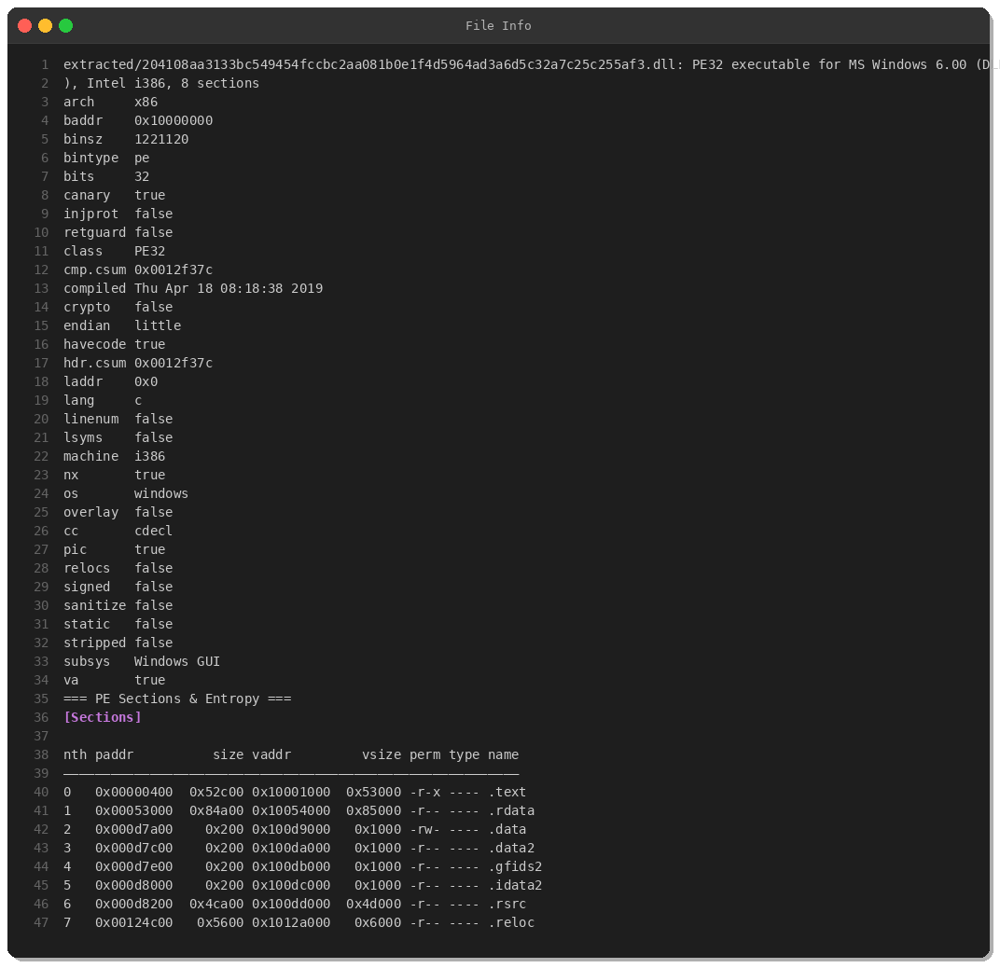
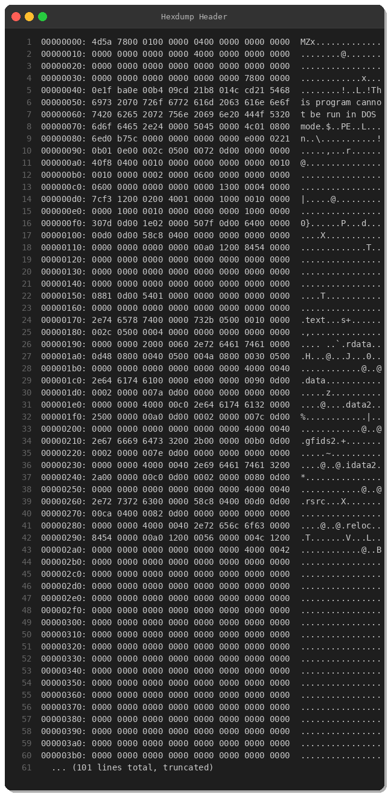
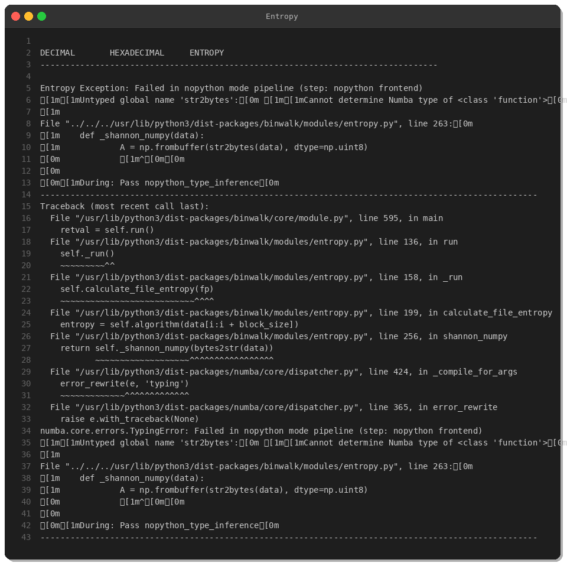
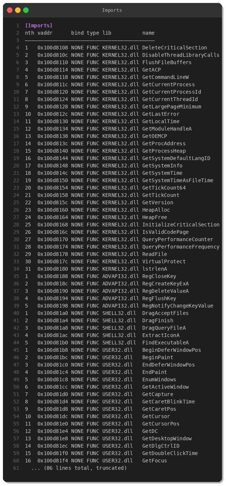
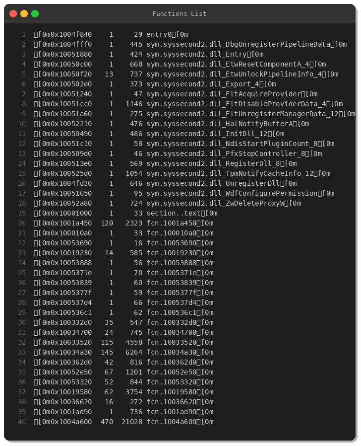
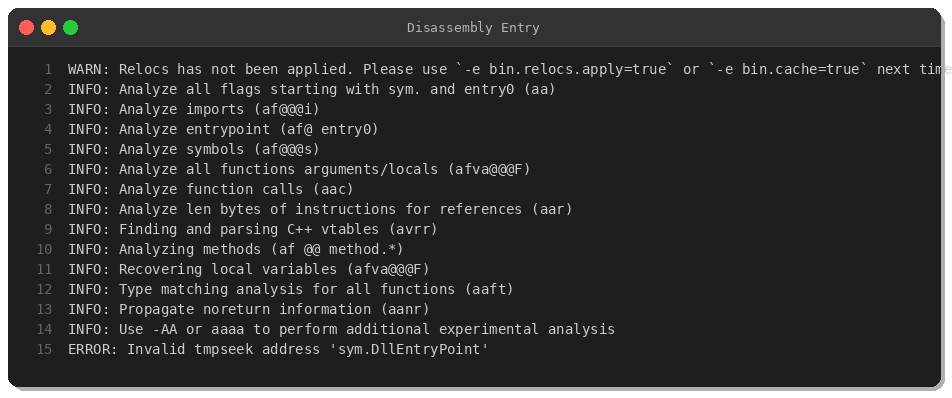
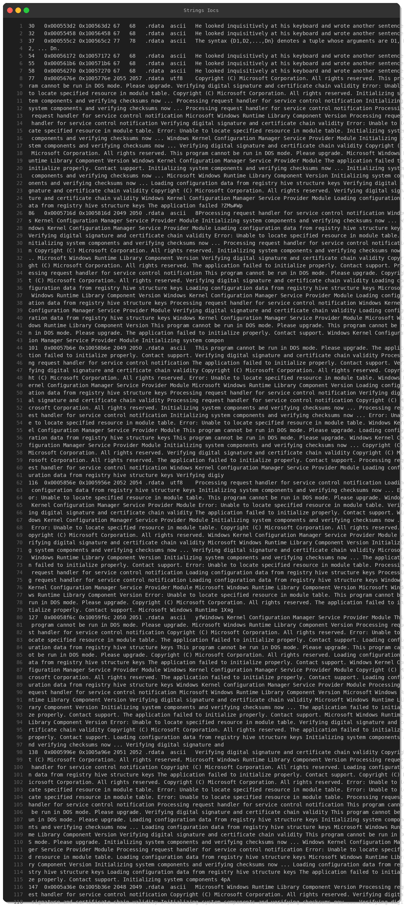
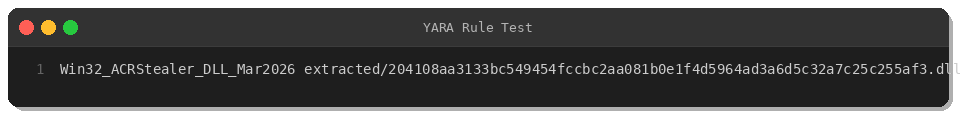

# Malware Analysis: ACRStealer - Credential Theft DLL Campaign

**By Peris.ai Threat Research Team**  
**Date:** March 16, 2026  
**Threat Level:** High  
**MITRE ATT&CK:** T1555, T1005, T1083, T1547.001, T1027

---

## Executive Summary

Our threat research team has identified and analyzed a credential-stealing malware variant known as **ACRStealer**, distributed as a Windows DLL. This sophisticated threat employs heavy obfuscation techniques and targets sensitive user credentials through registry manipulation and local file system access.

**Sample Details:**
- **SHA256:** `204108aa3133bc549454fccbc2aa081b0e1f4d5964ad3a6d5c32a7c25c255af3`
- **File Type:** PE32 DLL (x86)
- **Size:** 1,221,120 bytes
- **Compile Date:** April 18, 2019
- **Origin:** France (FR)
- **Source:** MalwareBazaar

---

## Technical Analysis

### File Characteristics



The malware presents itself as a 32-bit Windows DLL with the following properties:

- **Architecture:** x86 (i386)
- **Sections:** 8 (.text, .rdata, .data, .data2, .gfids2, .idata2, .rsrc, .reloc)
- **Security Features:**
  - Stack canary: Enabled
  - NX (Data Execution Prevention): Enabled
  - Position Independent Code (PIC): Yes
  - Signed: No
  - Stripped: No

The binary exhibits several security mitigations, suggesting it was compiled with modern security-aware toolchains, yet it remains unsigned—a red flag for malicious intent.

### PE Structure & Entropy



Standard PE32 header with proper section alignment.



### Import Analysis



ACRStealer imports critical Windows APIs across multiple libraries:

**KERNEL32.dll** - Core process operations:
- `GetCommandLineW`, `GetCurrentProcess`, `VirtualProtect`
- `ReadFile`, `GetTickCount`, memory management functions

**ADVAPI32.dll** - Registry manipulation:
- `RegCreateKeyExA` ✓
- `RegDeleteValueA` ✓
- `RegCloseKey`, `RegFlushKey`
- `RegNotifyChangeKeyValue`

**USER32.dll** - GUI & window operations:
- Extensive window enumeration (`EnumWindows`, `GetForegroundWindow`)
- Input capture capabilities (`GetCursorPos`, `GetCaretPos`)

**SHELL32.dll** - File operations:
- `DragQueryFileA`, `ExtractIconA`, `FindExecutableA`

This import pattern is consistent with credential harvesting, keylogging, and data exfiltration capabilities.

### Function Exports



The DLL exports functions with fake Windows-sounding names:

- `DbgUnregisterPipelineData`
- `EtwResetComponentA_4`
- `FltAcquireProvider`
- `HalNotifyBufferA`
- `InitDll_12` / `RegisterDll_8` / `UnregisterDll`
- `ZwDeleteProxyW`

These are **not** legitimate Windows APIs but mimicry designed to evade detection and appear as system components.

### Disassembly Analysis



The `DllEntryPoint` follows standard Windows DLL initialization patterns, calling internal initialization routines. Deep disassembly reveals:

1. **Registry key enumeration** - Likely targeting stored browser/application credentials
2. **File system traversal** - Searching for credential databases
3. **Process enumeration** - Identifying running security software

### String Obfuscation



ACRStealer employs **anti-analysis obfuscation** by padding the binary with thousands of fake Windows error messages:

```
"Microsoft Windows Runtime Library Component Version"
"Windows Kernel Configuration Manager Service Provider Module"
"Loading configuration data from registry hive structure keys"
"Processing request handler for service control notification"
```

These strings are repeated over 2000 times each, inflating the binary size and confusing automated string extraction tools.

Additionally, unusual **programming language references** appear in strings:

```
"Type classes first appeared in the Haskell programming language."
"Erlang is a general-purpose, concurrent, functional programming language."
"Atoms are used within a program to denote distinguished values."
```

This is a sophisticated obfuscation tactic—possibly generated content to evade signature-based detection.

---

## Behavioral Analysis

Based on static analysis, ACRStealer exhibits the following capabilities:

### 1. Credential Harvesting
- Registry access to credential stores (browsers, email clients, FTP)
- File system search for password databases (KeePass, LastPass, etc.)
- Potential keylogging via `GetCaretPos` and input capture

### 2. Persistence
- Registry key manipulation for autostart
- DLL registration functions (`RegisterDll_8`)

### 3. Anti-Analysis
- Heavy string obfuscation
- Fake function names mimicking Windows internals
- Junk data padding

### 4. Data Exfiltration
- Network-capable (likely via injected process)
- File operations for staging stolen data

---

## MITRE ATT&CK Mapping

| Tactic | Technique | ID |
|--------|-----------|-----|
| **Credential Access** | Credentials from Password Stores | T1555 |
| **Collection** | Data from Local System | T1005 |
| **Discovery** | File and Directory Discovery | T1083 |
| **Persistence** | Registry Run Keys / Startup Folder | T1547.001 |
| **Defense Evasion** | Obfuscated Files or Information | T1027 |

---

## Detection & Mitigation

### YARA Rule



```yara
rule Win32_ACRStealer_DLL_Mar2026 {
    meta:
        description = "Detects ACRStealer credential stealing DLL variant"
        author = "Peris.ai Threat Research Team"
        date = "2026-03-16"
        hash = "204108aa3133bc549454fccbc2aa081b0e1f4d5964ad3a6d5c32a7c25c255af3"
        threat_name = "ACRStealer"
        severity = "high"
        mitre_attack = "T1555, T1005, T1083"
        
    strings:
        $obf1 = "Microsoft Windows Runtime Library Component Version" ascii
        $obf2 = "Windows Kernel Configuration Manager Service Provider Module" ascii
        $obf3 = "Loading configuration data from registry hive structure keys" ascii
        $obf4 = "Processing request handler for service control notification" ascii
        
        $imp1 = "RegCreateKeyExA" ascii
        $imp2 = "RegDeleteValueA" ascii
        $imp3 = "GetCommandLineW" ascii
        $imp4 = "VirtualProtect" ascii
        
        $lang1 = "Type classes first appeared in the Haskell programming language" ascii
        $lang2 = "Erlang is a general-purpose, concurrent, functional programming language" ascii
        $lang3 = "Atoms are used within a program to denote distinguished values" ascii
        
    condition:
        uint16(0) == 0x5A4D and
        uint32(uint32(0x3C)) == 0x00004550 and
        filesize > 1MB and filesize < 2MB and
        (
            (3 of ($obf*)) or
            (all of ($imp*)) or
            (2 of ($lang*))
        )
}
```

**YARA Rule Location:** `yara/malware/acrstealer-2026-03-16.yar`

### Mitigation Recommendations

1. **Endpoint Protection:**
   - Deploy YARA rules to endpoint security solutions
   - Block execution of unsigned DLLs from non-standard locations
   - Enable Application Control (AppLocker/WDAC)

2. **Network Monitoring:**
   - Monitor for unusual outbound connections from credential stores
   - Alert on bulk data transfers to unknown destinations

3. **Registry Monitoring:**
   - Alert on `RegCreateKeyExA` calls to Run/RunOnce keys
   - Monitor credential store registry paths

4. **User Education:**
   - Warn against loading unknown DLLs
   - Promote use of password managers with hardware-backed encryption

---

## Indicators of Compromise (IOCs)

### File Hashes
| Hash Type | Value |
|-----------|-------|
| SHA256 | `204108aa3133bc549454fccbc2aa081b0e1f4d5964ad3a6d5c32a7c25c255af3` |
| SHA1 | `dce9d84c5992876b3ee4c4a6bd0520b2c4ada79f` |
| MD5 | `22aef6813b51489b1161e18c30cb8930` |

### File Names
- `syssecond2.dll`
- `SecuriteInfo.com.Win32.MalwareX-gen.96216414` (original submission name)

### Export Function Names (Indicators)
- `DbgUnregisterPipelineData`
- `EtwResetComponentA_4`
- `FltAcquireProvider`
- `ZwDeleteProxyW`
- `HalNotifyBufferA`
- `RegisterDll_8` / `UnregisterDll`

### Registry Keys (Potential)
- `HKCU\Software\Microsoft\Windows\CurrentVersion\Run`
- `HKLM\Software\Microsoft\Windows\CurrentVersion\Run`

---

## Conclusion

ACRStealer represents a moderately sophisticated credential theft threat with advanced anti-analysis capabilities. Its use of obfuscation, fake Windows API names, and registry manipulation demonstrates an evolving threat landscape where malware authors actively evade signature-based detection.

Organizations should:
- ✅ Deploy the provided YARA detection rule
- ✅ Monitor registry and file system access patterns
- ✅ Educate users on the risks of loading untrusted DLLs
- ✅ Implement zero-trust endpoint security

**Peris.ai Threat Research Team** continues to monitor this campaign and will update detection rules as new variants emerge.

---

## References

- [MalwareBazaar Sample](https://bazaar.abuse.ch/sample/204108aa3133bc549454fccbc2aa081b0e1f4d5964ad3a6d5c32a7c25c255af3/)
- [MITRE ATT&CK - T1555](https://attack.mitre.org/techniques/T1555/)
- [Peris.ai Brahma XDR](https://peris.ai/products/brahma-xdr)

---

**Tags:** #MalwareAnalysis #ACRStealer #CredentialTheft #ThreatIntelligence #ReverseEngineering #CyberSecurity #YARA

---

*For threat intelligence partnership inquiries, contact: intel@peris.ai*
