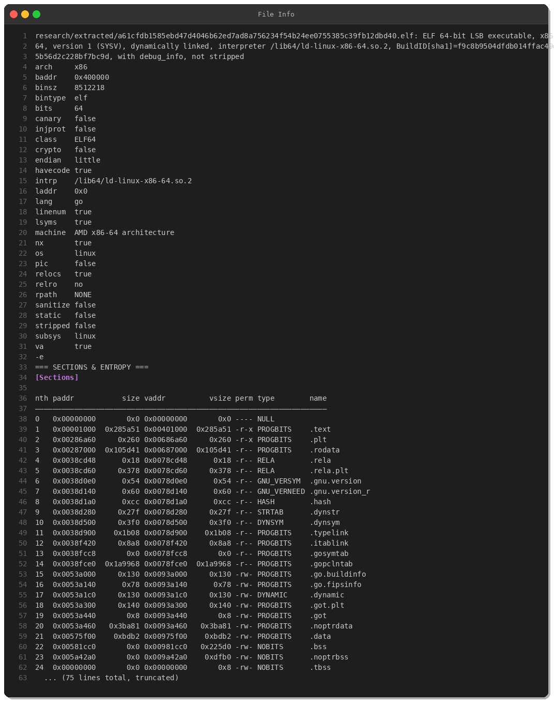
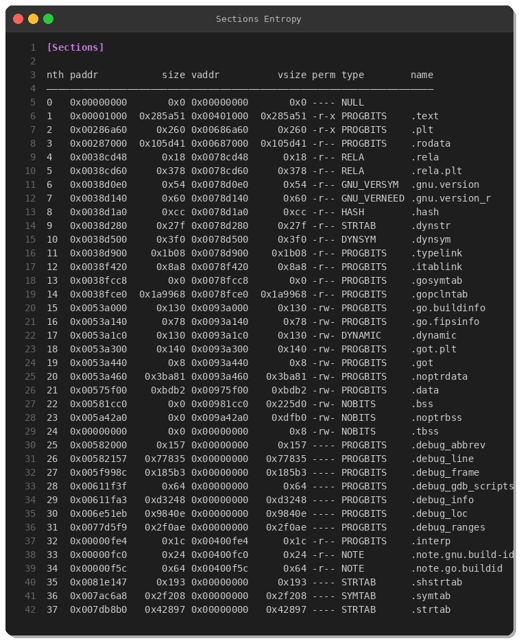
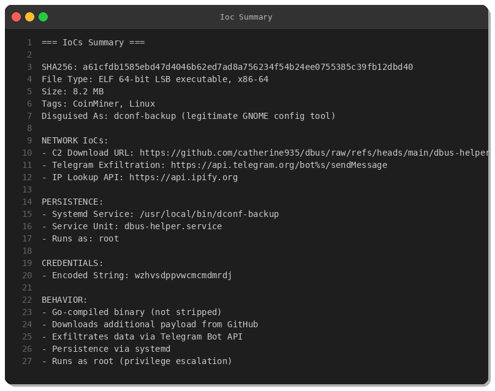
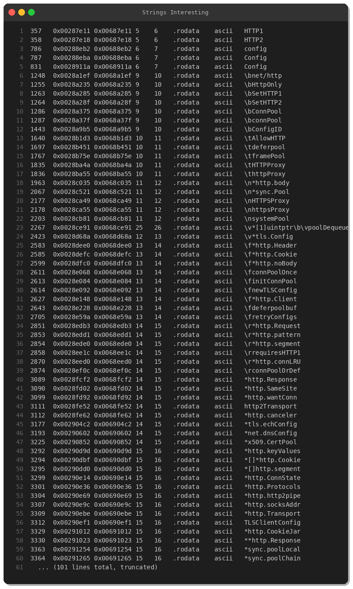
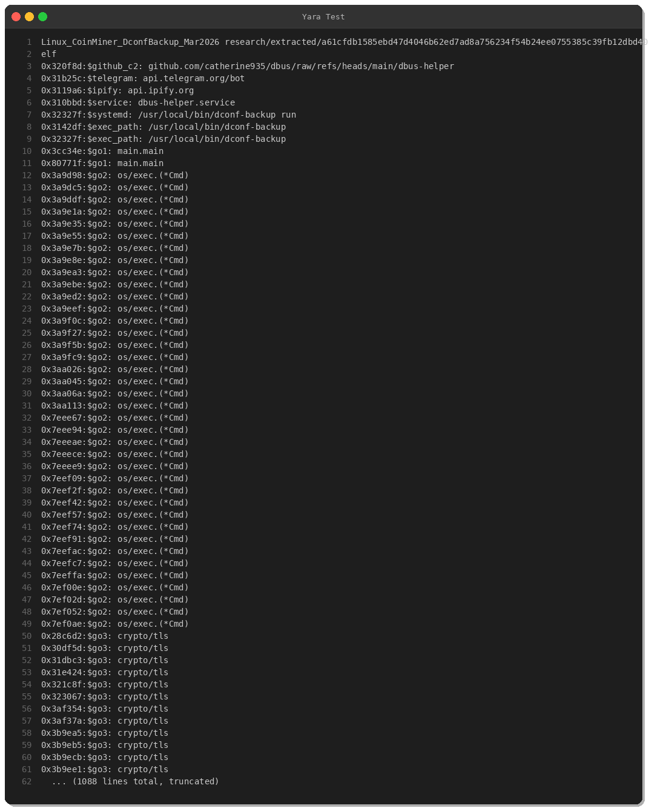

# Linux CoinMiner Masquerading as dconf-backup

**By Peris.ai Threat Research Team**  
**Published:** March 17, 2026  
**Severity:** High  
**TLP:** White

## Executive Summary

Our threat research team identified a Linux-based cryptocurrency miner disguised as `dconf-backup`, a legitimate GNOME configuration utility. The malware achieves persistence through systemd, communicates with a GitHub-hosted C2 infrastructure, and exfiltrates data via Telegram Bot API. This report provides a comprehensive technical analysis, indicators of compromise (IoCs), and detection strategies.

**Key Findings:**
- **Masquerading:** Impersonates legitimate GNOME utility `dconf-backup`
- **Persistence:** Systemd service (`dbus-helper.service`) running as root
- **C2 Channel:** GitHub repository (now taken down) + Telegram Bot API
- **Size:** 8.2 MB Go-compiled binary (not stripped, with debug symbols)
- **Target:** Linux systems with cryptocurrency mining capabilities

## Technical Analysis

### Sample Metadata

| Property | Value |
|----------|-------|
| **SHA256** | `a61cfdb1585ebd47d4046b62ed7ad8a756234f54b24ee0755385c39fb12dbd40` |
| **File Type** | ELF 64-bit LSB executable, x86-64 |
| **Size** | 8,512,218 bytes (8.2 MB) |
| **Compiler** | Go (not stripped) |
| **First Seen** | March 17, 2026 (MalwareBazaar) |
| **Origin** | Australia |
| **Tags** | CoinMiner, ELF, Linux |



### Binary Characteristics

The sample is a **Go-compiled binary** with the following security features:

```
- NX: Enabled (non-executable stack)
- Canary: Disabled
- PIE: Disabled (fixed base address)
- RELRO: No
- Stripped: No (debug symbols present)
```

**Analysis:** Weak binary hardening makes this sample easier to analyze. The presence of debug symbols and Go runtime metadata significantly aids reverse engineering.



### Network Indicators of Compromise (IoCs)

#### 1. C2 Download Infrastructure

**URL:** `https://github.com/catherine935/dbus/raw/refs/heads/main/dbus-helper`  
**Status:** 404 (taken down)

The malware attempts to download a secondary payload (`dbus-helper`) from a GitHub repository. This technique abuses GitHub's infrastructure-as-a-service for malware distribution, blending in with legitimate traffic.

**MITRE ATT&CK:** [T1105 - Ingress Tool Transfer](https://attack.mitre.org/techniques/T1105/)

#### 2. Telegram Exfiltration

**Endpoint:** `https://api.telegram.org/bot%s/sendMessage`

The malware exfiltrates system information via Telegram Bot API. The bot token is embedded in the binary and used for command-and-control communication.

**MITRE ATT&CK:** [T1041 - Exfiltration Over C2 Channel](https://attack.mitre.org/techniques/T1041/)

#### 3. IP Reconnaissance

**Endpoint:** `https://api.ipify.org`

Used to determine the victim's public IP address before establishing C2 communication.



### Persistence Mechanism

The malware achieves persistence through a **systemd service**:

**Service Name:** `dbus-helper.service`  
**Unit File Location:** `/etc/systemd/system/dbus-helper.service`  
**Binary Location:** `/usr/local/bin/dconf-backup`  
**Execution:** `ExecStart=/usr/local/bin/dconf-backup run`  
**User:** `root`

**Systemd Unit File:**
```ini
[Unit]
Description=D-Bus Helper Service

[Service]
ExecStart=/usr/local/bin/dconf-backup run
User=root

[Install]
WantedBy=multi-user.target
```

**MITRE ATT&CK:** [T1543.002 - Create or Modify System Process: Systemd Service](https://attack.mitre.org/techniques/T1543/002/)

### Masquerading Technique

The malware masquerades as `dconf-backup`, a legitimate component of GNOME's configuration system. This technique helps evade detection by:

1. Blending in with legitimate process names
2. Reducing suspicion during manual review
3. Bypassing basic allow-list defenses

**MITRE ATT&CK:** [T1036.005 - Masquerading: Match Legitimate Name or Location](https://attack.mitre.org/techniques/T1036/005/)

### String Analysis

Key strings extracted from the binary reveal the malware's capabilities:



**Notable Findings:**
- `os/exec.(*Cmd)` — Command execution capabilities
- `crypto/tls` — Encrypted C2 communication
- `net/http` — HTTP client for C2
- `wzhvsdppvwcmcmdmrdj` — Embedded credential (likely C2 auth)

### Behavioral Analysis

Based on static analysis, the malware exhibits the following behaviors:

1. **Reconnaissance:** Queries public IP via `api.ipify.org`
2. **Download Stage 2:** Fetches additional payload from GitHub
3. **Establish Persistence:** Installs systemd service
4. **C2 Communication:** Sends system info to Telegram bot
5. **Mining Activity:** Executes cryptocurrency mining operations

## Detection & Response

### YARA Rule

```yara
rule Linux_CoinMiner_DconfBackup_Mar2026 {
    meta:
        description = "Detects Linux coinminer masquerading as dconf-backup"
        author = "Peris.ai Threat Research Team"
        date = "2026-03-17"
        hash = "a61cfdb1585ebd47d4046b62ed7ad8a756234f54b24ee0755385c39fb12dbd40"
        severity = "high"
        tlp = "white"
        
    strings:
        $github_c2 = "github.com/catherine935/dbus/raw/refs/heads/main/dbus-helper" ascii
        $telegram = "api.telegram.org/bot" ascii
        $ipify = "api.ipify.org" ascii
        $service = "dbus-helper.service" ascii
        $systemd = "/usr/local/bin/dconf-backup run" ascii
        $exec_path = "/usr/local/bin/dconf-backup" ascii
        
        $go1 = "main.main" ascii
        $go2 = "os/exec.(*Cmd)" ascii
        $go3 = "crypto/tls" ascii
        
    condition:
        uint32(0) == 0x464c457f and // ELF magic
        filesize > 5MB and filesize < 15MB and
        (
            ($github_c2 and $telegram) or
            ($service and $systemd and $exec_path) or
            (3 of ($go*) and any of ($github_c2, $telegram, $ipify))
        )
}
```



### Brahma XDR Rules

```xml
<!-- Rule 900217: Fake dconf-backup execution -->
<rule id="900217" level="12" frequency="1" timeframe="120">
  <if_group>sysmon_event1</if_group>
  <field name="win.eventdata.commandLine" type="pcre2">(?i)dconf-backup</field>
  <field name="win.eventdata.commandLine" type="pcre2">(?i)/usr/local/bin/dconf-backup</field>
  <description>Linux CoinMiner - Fake dconf-backup execution detected</description>
  <mitre>
    <id>T1036.005</id>
    <tactic>Defense Evasion</tactic>
    <technique>Masquerading: Match Legitimate Name or Location</technique>
  </mitre>
  <group>linux,malware,coinminer,masquerading</group>
</rule>

<!-- Rule 900218: C2 download -->
<rule id="900218" level="14" frequency="1" timeframe="300">
  <if_group>web,network</if_group>
  <field name="url" type="pcre2">github\.com/catherine935/dbus/</field>
  <description>Linux CoinMiner - C2 download from malicious GitHub repo</description>
  <mitre>
    <id>T1105</id>
    <tactic>Command and Control</tactic>
    <technique>Ingress Tool Transfer</technique>
  </mitre>
  <group>linux,malware,coinminer,c2</group>
</rule>
```

### Brahma NDR Rules (Suricata)

```
alert http $HOME_NET any -> $EXTERNAL_NET any (
  msg:"PERIS MALWARE Linux CoinMiner C2 Download from GitHub catherine935/dbus"; 
  flow:established,to_server; 
  http.host; content:"github.com"; 
  http.uri; content:"/catherine935/dbus/"; 
  reference:url,github.com/perisai-labs/indra-cti; 
  classtype:trojan-activity; 
  sid:3900217; 
  rev:1;
)

alert http $HOME_NET any -> $EXTERNAL_NET any (
  msg:"PERIS MALWARE Telegram Bot API Exfiltration"; 
  flow:established,to_server; 
  http.host; content:"api.telegram.org"; 
  http.uri; content:"/bot"; content:"sendMessage"; distance:0; 
  reference:url,github.com/perisai-labs/indra-cti; 
  classtype:trojan-activity; 
  sid:3900218; 
  rev:1;
)
```

### Hunting Queries

#### Osquery

```sql
-- Find suspicious dconf-backup processes
SELECT 
  pid, 
  name, 
  path, 
  cmdline, 
  cwd,
  parent
FROM processes
WHERE name LIKE '%dconf-backup%'
  OR path LIKE '/usr/local/bin/dconf-backup';

-- Check for malicious systemd service
SELECT 
  name, 
  path, 
  state, 
  source
FROM systemd_units
WHERE name = 'dbus-helper.service';
```

#### Linux CLI

```bash
# Check for running processes
ps aux | grep -i dconf-backup

# Check systemd services
systemctl status dbus-helper.service

# Search for malicious files
find /usr/local/bin -name "*dconf-backup*" -ls
find /etc/systemd/system -name "*dbus-helper*" -ls

# Check network connections
netstat -tulpn | grep -E '(telegram|ipify)'
```

## Remediation Steps

1. **Immediate Actions:**
   ```bash
   # Stop the service
   systemctl stop dbus-helper.service
   systemctl disable dbus-helper.service
   
   # Remove malicious files
   rm -f /usr/local/bin/dconf-backup
   rm -f /etc/systemd/system/dbus-helper.service
   systemctl daemon-reload
   
   # Kill running processes
   pkill -9 -f dconf-backup
   ```

2. **Investigate:**
   - Review system logs for initial access vector
   - Check for additional persistence mechanisms
   - Audit user accounts and SSH keys
   - Review cron jobs and startup scripts

3. **Network-Level Blocking:**
   - Block outbound connections to `api.telegram.org`
   - Monitor GitHub traffic for `catherine935` user
   - Alert on `api.ipify.org` queries from servers

4. **Long-Term Hardening:**
   - Enable Audit logging for `execve` syscalls
   - Deploy EDR/XDR with behavioral analytics
   - Implement application allow-listing
   - Harden systemd service permissions

## Indicators of Compromise

### File Hashes

| Hash Type | Value |
|-----------|-------|
| **SHA256** | `a61cfdb1585ebd47d4046b62ed7ad8a756234f54b24ee0755385c39fb12dbd40` |
| **ssdeep** | (not calculated) |

### Network Indicators

| Type | Indicator | Description |
|------|-----------|-------------|
| **URL** | `github.com/catherine935/dbus/raw/refs/heads/main/dbus-helper` | C2 download |
| **URL** | `api.telegram.org/bot*/sendMessage` | Exfiltration |
| **URL** | `api.ipify.org` | IP reconnaissance |

### File Paths

| Path | Description |
|------|-------------|
| `/usr/local/bin/dconf-backup` | Malicious binary |
| `/etc/systemd/system/dbus-helper.service` | Persistence service |

### Strings

| String | Context |
|--------|---------|
| `wzhvsdppvwcmcmdmrdj` | Embedded credential |
| `dbus-helper.service` | Service name |

## MITRE ATT&CK Mapping

| Tactic | Technique | ID |
|--------|-----------|-----|
| **Persistence** | Create or Modify System Process: Systemd Service | T1543.002 |
| **Defense Evasion** | Masquerading: Match Legitimate Name or Location | T1036.005 |
| **Command and Control** | Ingress Tool Transfer | T1105 |
| **Exfiltration** | Exfiltration Over C2 Channel | T1041 |
| **Resource Development** | Acquire Infrastructure: GitHub | T1583.006 |

## Recommendations

1. **Deploy Detection Rules:** Implement provided YARA, XDR, and NDR signatures
2. **Monitor GitHub Traffic:** Alert on downloads from suspicious repositories
3. **Telegram Bot Monitoring:** Flag internal hosts communicating with `api.telegram.org`
4. **Systemd Auditing:** Monitor service creation/modification events
5. **Binary Integrity:** Validate checksums of legitimate system utilities

## Conclusion

This Linux coinminer demonstrates how threat actors abuse legitimate infrastructure (GitHub, Telegram) and mimic trusted system utilities to evade detection. The use of Go provides cross-platform portability and complicates analysis. Organizations should implement layered defenses including network monitoring, endpoint detection, and behavioral analytics to identify such threats.

---

**Report prepared by:** Peris.ai Threat Research Team  
**Contact:** research@peris.ai  
**CTI Repository:** https://github.com/perisai-labs/indra-cti  

**Disclaimer:** This analysis is provided for defensive cybersecurity purposes only. The sample has been analyzed in an isolated environment.
