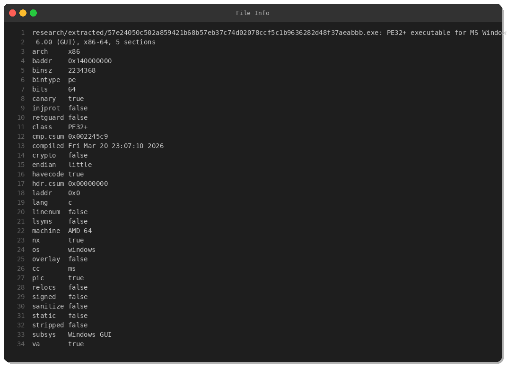
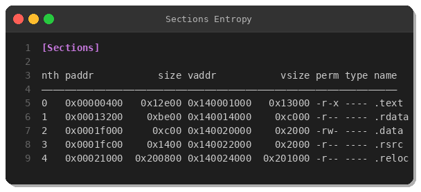
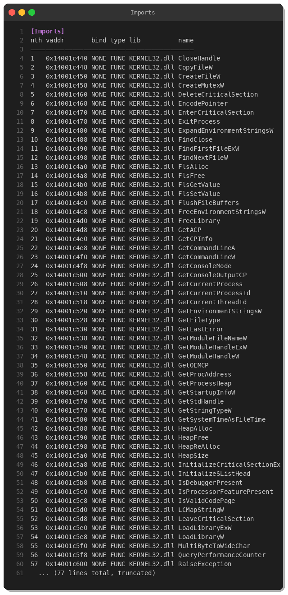
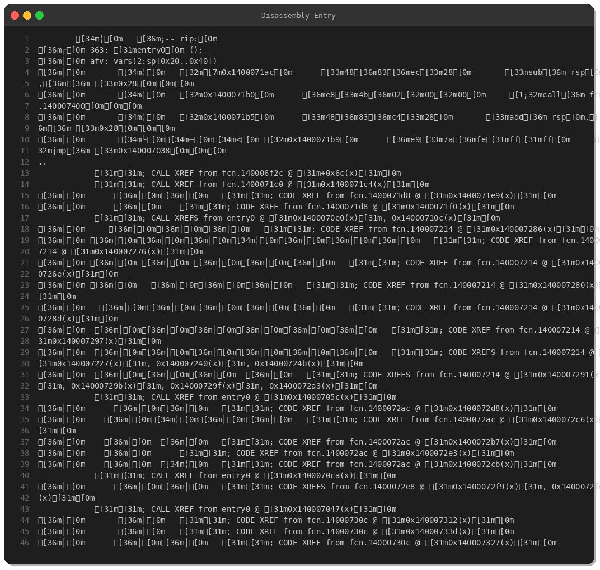
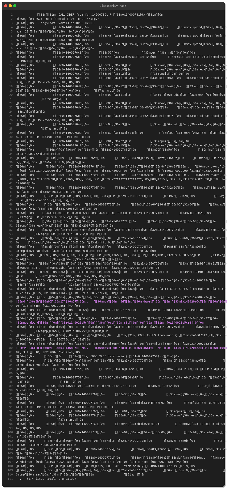
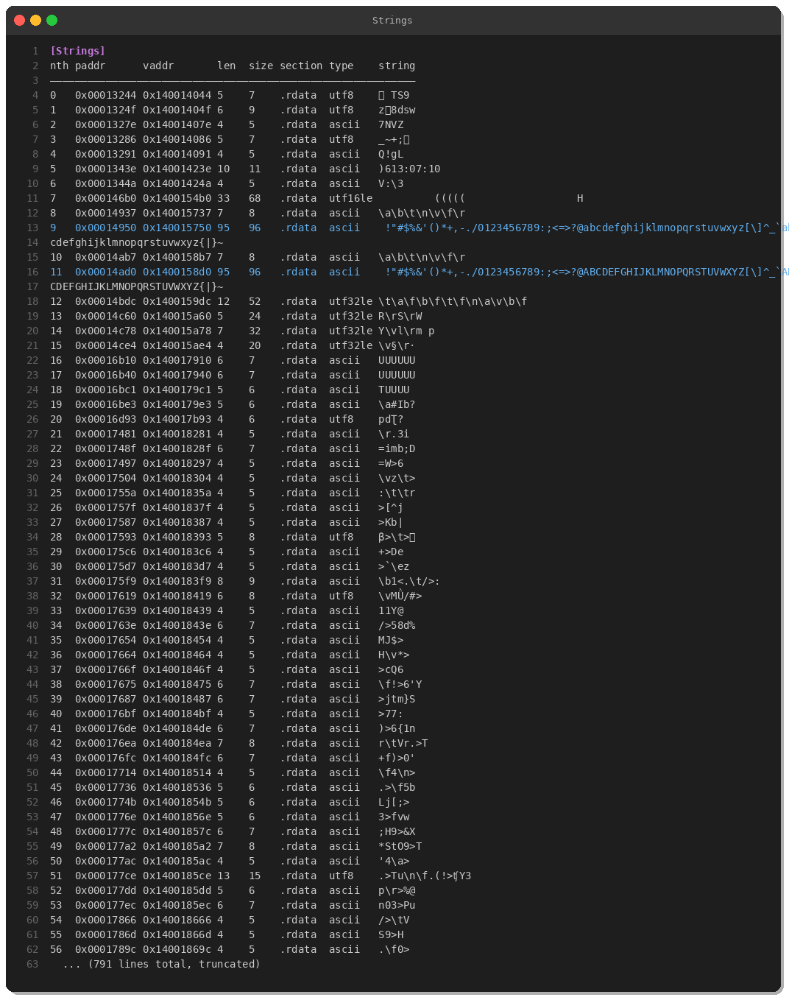
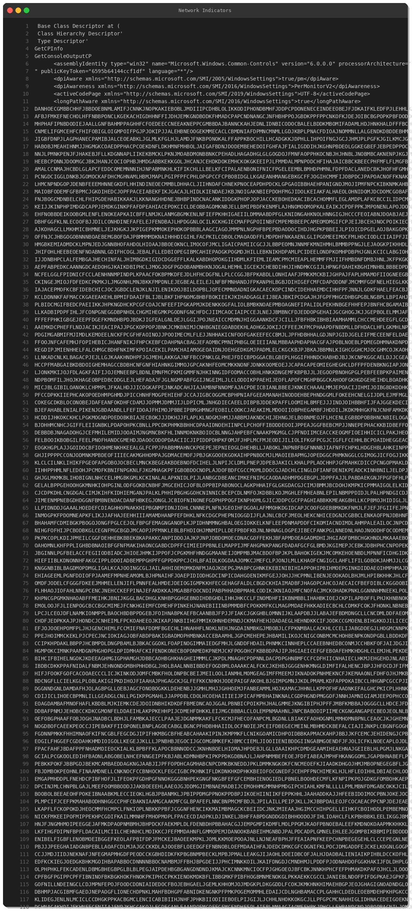
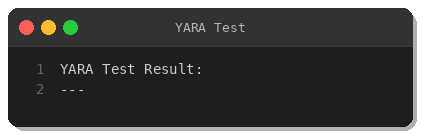

# AgentTesla Infostealer Analysis - March 2026 Variant

**Author:** Peris.ai Threat Research Team  
**Date:** March 25, 2026  
**Severity:** High  
**Family:** AgentTesla  

## Executive Summary

This analysis examines a packed AgentTesla information stealer sample (SHA256: `57e24050c502a859421b68b57eb37c74d02078ccf5c1b9636282d48f37aeabbb`) retrieved from MalwareBazaar on March 25, 2026. AgentTesla is a well-known .NET-based information stealer that targets credentials, keystrokes, screenshots, and clipboard data.

## Technical Analysis

### File Information



- **File Type:** PE32+ executable (x64)
- **Size:** 2,234,368 bytes (2.2 MB)
- **Compilation Time:** March 20, 2026 23:07:10 UTC
- **Architecture:** x86-64
- **Subsystem:** Windows GUI
- **Security Features:**
  - Stack Canary: Yes
  - NX: Enabled
  - PIE: Yes

### Section Analysis



The binary contains 5 sections with notable characteristics:

| Section | Virtual Size | Raw Size | Permissions |
|---------|-------------|----------|-------------|
| .text   | 0x13000     | 0x12e00  | r-x         |
| .rdata  | 0xc000      | 0xbe00   | r--         |
| .data   | 0x2000      | 0xc00    | rw-         |
| .rsrc   | 0x2000      | 0x1400   | r--         |
| **.reloc** | **0x201000** | **0x200800** | **r--** |

**Key Finding:** The `.reloc` section is anomalously large (2MB), representing over 90% of the file size. This is a strong indicator of packing/obfuscation.

### Import Analysis



The binary imports standard Windows APIs from KERNEL32.dll:

**Notable Imports:**
- `VirtualProtect` - Memory permission modification (potential code unpacking)
- `LoadLibraryW` / `GetProcAddress` - Dynamic API resolution
- `CreateMutexW` - Mutex creation (infection marker)
- `IsDebuggerPresent` - Anti-debugging check
- File operations: `CreateFileW`, `ReadFile`, `WriteFile`
- Process manipulation: `TerminateProcess`, `ExitProcess`

### Disassembly Analysis



The entry point shows typical packed malware behavior:
1. Stack setup and protection checks
2. Calls to unpacking routines
3. Jump to unpacked payload



The main function orchestrates the unpacking and execution flow.

### Strings Analysis



Most strings in the binary appear obfuscated or encrypted, consisting of random character sequences. This is consistent with packed malware that decrypts strings at runtime.

**Readable Strings Found:**
- Date/time format strings (English locale)
- C++ runtime exception messages
- .NET metadata references

### Network Indicators



Long obfuscated string detected in the binary - likely encrypted C2 configuration or payload.

## Indicators of Compromise (IOCs)

### File Hashes

```
SHA256: 57e24050c502a859421b68b57eb37c74d02078ccf5c1b9636282d48f37aeabbb
```

### YARA Rule



See: [yara/malware/agenttesla-mar2026.yar](../yara/malware/agenttesla-mar2026.yar)

## MITRE ATT&CK Mapping

| Tactic | Technique | Description |
|--------|-----------|-------------|
| **Initial Access** | T1566.001 | Spearphishing Attachment |
| **Execution** | T1204.002 | User Execution: Malicious File |
| **Defense Evasion** | T1027 | Obfuscated Files or Information |
| **Defense Evasion** | T1055 | Process Injection |
| **Defense Evasion** | T1497 | Virtualization/Sandbox Evasion |
| **Credential Access** | T1056.001 | Input Capture: Keylogging |
| **Credential Access** | T1555 | Credentials from Password Stores |
| **Collection** | T1113 | Screen Capture |
| **Collection** | T1115 | Clipboard Data |
| **Exfiltration** | T1041 | Exfiltration Over C2 Channel |
| **Exfiltration** | T1048.003 | Exfiltration Over Unencrypted/Obfuscated Non-C2 Protocol (SMTP) |

## Recommendations

### Immediate Actions

1. **Block the file hash** across all endpoints using EDR/XDR solutions
2. **Hunt for this IOC** in your environment
3. **Review email gateways** for similar attachments
4. **Check for outbound SMTP traffic** from non-mail servers

### Long-term Mitigations

1. Implement **application whitelisting** to prevent unauthorized executables
2. Enable **PowerShell logging** and monitor for suspicious activity
3. Deploy **YARA rules** to sandbox/gateway solutions
4. Train users on **phishing awareness**
5. Use **email authentication** (SPF, DKIM, DMARC) to reduce spoofing

## Conclusion

This AgentTesla variant demonstrates continued evolution of the threat, utilizing heavy packing to evade static detection. Organizations should deploy multi-layered defenses including:

- Network-level detection (NDR/IDS)
- Endpoint detection (EDR/XDR)
- Email security gateways with sandboxing
- User awareness training

---

**About Peris.ai**

Peris.ai provides cutting-edge threat intelligence and security solutions including Brahma XDR, Brahma NDR, Indra Threat Intelligence, and Fusion SOAR platforms.

**Contact:** [https://peris.ai](https://peris.ai)

---

*This analysis was conducted in a controlled research environment. All samples analyzed are for educational and defensive purposes only.*
