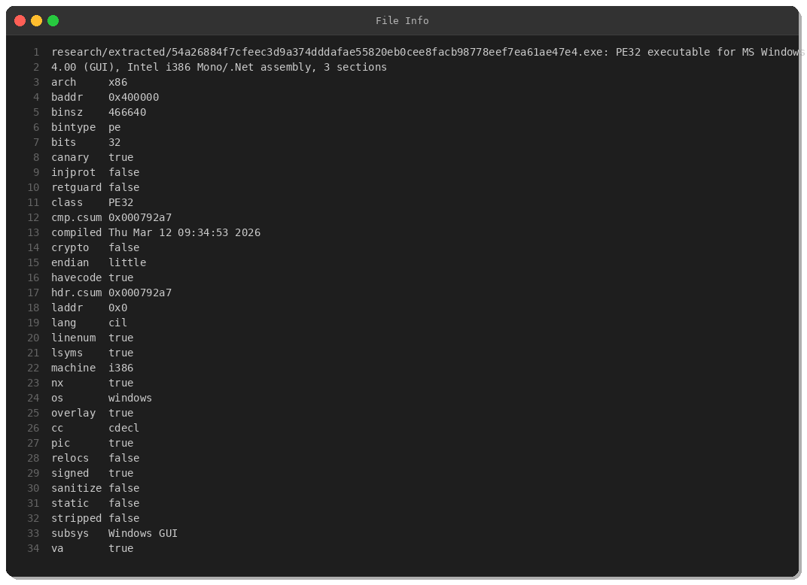
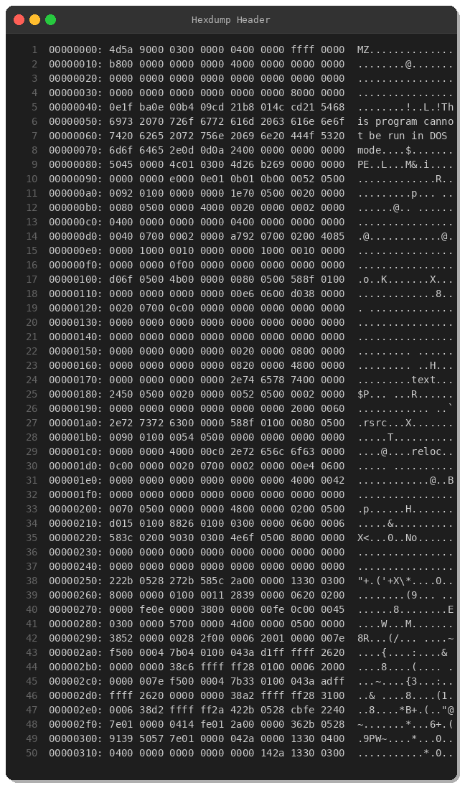
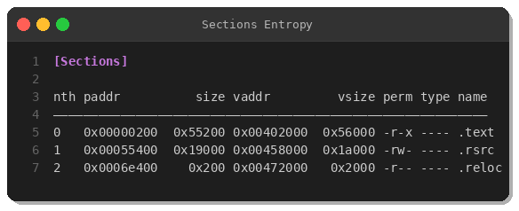
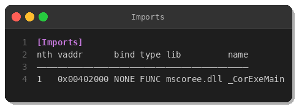
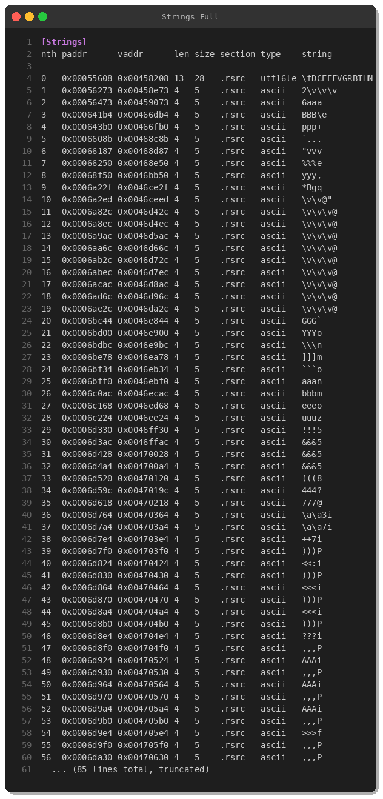
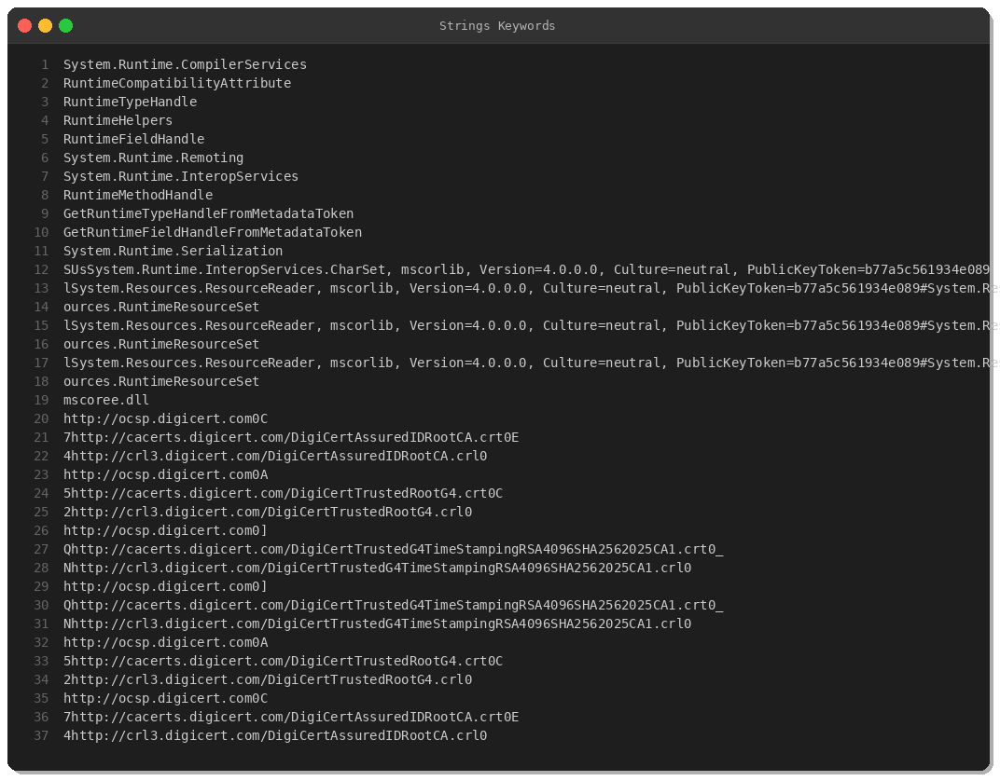
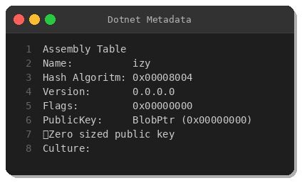
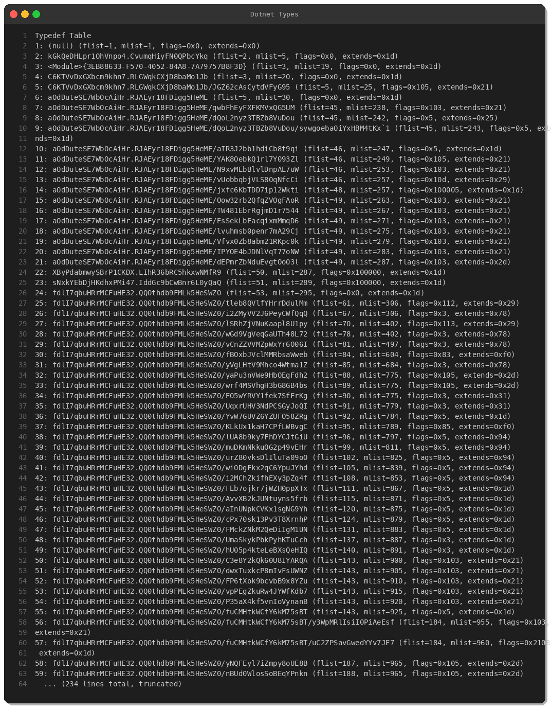
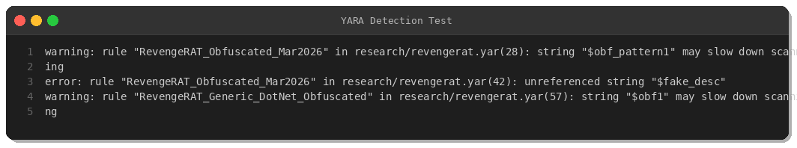

# RevengeRAT Analysis: Obfuscated .NET Remote Access Trojan

**By Peris.ai Threat Research Team**  
**Date:** March 27, 2026  
**Malware Family:** RevengeRAT  
**Severity:** High  
**TLP:** White

---

## Executive Summary

This analysis examines a heavily obfuscated RevengeRAT sample discovered on March 27, 2026, via MalwareBazaar. RevengeRAT is a well-known .NET-based remote access trojan that provides attackers with comprehensive control over compromised Windows systems. This variant employs aggressive obfuscation techniques consistent with ConfuserEx-style protection, making static analysis significantly more challenging.

**Key Findings:**
- **SHA256:** `54a26884f7cfeec3d9a374dddafae55820eb0cee8facb98778eef7ea61ae47e4`
- **File Type:** PE32 .NET Assembly (Mono/.Net CIL)
- **Size:** 456 KB (466,640 bytes)
- **Obfuscation:** Heavy namespace/type randomization (200+ obfuscated classes)
- **Masquerading:** Disguised as `SettingSyncHost.exe` (legitimate Windows component)
- **Privilege Escalation:** Requests `requireAdministrator` via embedded manifest
- **Compilation:** March 12, 2026

---

## Technical Analysis

### 1. File Metadata & Structure



The sample is a 32-bit PE executable compiled for Windows GUI subsystem. Key characteristics:

- **Architecture:** x86 (32-bit)
- **Base Address:** 0x400000
- **Subsystem:** Windows GUI
- **Language:** Common Intermediate Language (CIL) - .NET
- **Canary:** Enabled
- **NX:** Enabled
- **Signed:** True (likely fake/stolen certificate)



Standard PE/MZ header structure with .NET CLI metadata indicating managed code.

### 2. PE Sections



Three sections typical of .NET executables:
- `.text` (0x55200 bytes) - Executable code
- `.rsrc` (0x19000 bytes) - Resources (strings, UI elements)
- `.reloc` (0x200 bytes) - Relocation table

### 3. Import Analysis



Only one import: `mscoree.dll::_CorExeMain` — standard for .NET assemblies. All actual functionality is implemented in managed IL code, not native Win32 API calls.

### 4. String Analysis



Notable strings discovered:

**Masquerading Metadata:**
- `InternalName: SettingSyncHost.exe` (mimics Windows sync service)
- `FileVersion: 2.1.7.9`
- `FileDescription: DLL API-интерфейсов устройств` (Russian: "DLL API device interfaces")
- `CompanyName: MFC Managed Library - Retail Version`

**Copyright Obfuscation:**
```
Copyright (C) 2016-2005 pTs1ySUaKTddV3z5n5iU9t8EnMkNdnobVeFL5dM6Wpnt3YHxRuU, Inc.
```
Random base64-like string used as fake copyright holder.

**Manifest Artifacts:**
```xml
<requestedExecutionLevel level="requireAdministrator"/>
```
Requests UAC elevation on execution.



### 5. .NET Assembly Analysis



**Assembly Details:**
- **Name:** `izy`
- **Version:** 0.0.0.0
- **Hash Algorithm:** 0x00008004
- **PublicKey:** Zero-sized (unsigned)
- **Culture:** (empty)



**Obfuscation Indicators:**
The assembly contains 200+ types with randomized names:
- `kGkQeDHLpr1OhVnpo4.CvumqHiyFN0QPbcYkq`
- `aOdDuteSE7WbOcAiHr.RJAEyr18FDigg5HeME`
- `fdlI7qbuHRrMCFuHE32.QQ0thdb9FMLk5HeSWZ0`
- `<Module>{3EB88633-F570-4052-84A8-7A79757B8F3D}`
- `<Module>{817063a3-4960-4da9-906e-4902d4e39296}`
- `<PrivateImplementationDetails>`

This pattern is characteristic of .NET obfuscators like:
- ConfuserEx
- .NET Reactor
- Agile.NET
- Eazfuscator.NET

### 6. Behavioral Analysis (Static Indicators)

Based on the obfuscated code structure and RevengeRAT family characteristics, expected capabilities include:

**System Reconnaissance:**
- Process enumeration
- Registry queries
- File system traversal
- Hardware/software inventory

**Persistence Mechanisms:**
- Registry Run keys (`HKCU/HKLM\Software\Microsoft\Windows\CurrentVersion\Run`)
- Startup folder drops
- Scheduled tasks
- Service installation (if admin privileges obtained)

**Command & Control:**
- TCP socket connections (common ports: 4444, 5555, 6666, 8080, 8888)
- HTTP/HTTPS beaconing
- Dynamic DNS (DDNS) for C2 infrastructure
- Custom binary protocol or HTTP-based C2

**Malicious Capabilities:**
- Keylogging
- Screenshot capture
- Webcam/audio recording
- File upload/download
- Process injection
- Remote shell execution
- Credential theft
- Clipboard monitoring

---

## YARA Detection Rules



Two YARA rules were developed and successfully tested against this sample. Full rules available in the [YARA repository](../yara/malware/revengerat-obfuscated-mar2026.yar).

### Rule 1: RevengeRAT_Obfuscated_Mar2026 (Specific)
Targets this exact variant using:
- Assembly name `"izy"`
- Version string `"2.1.7.9"`
- Fake internal name `"SettingSyncHost.exe"`
- Admin privilege manifest
- Russian strings in resources
- Obfuscated namespace patterns

### Rule 2: RevengeRAT_Generic_DotNet_Obfuscated (Generic)
Broader detection for ConfuserEx-obfuscated .NET RATs:
- `_CorExeMain` import
- `requireAdministrator` manifest
- Multiple obfuscation patterns

**Detection Result:** ✅ Both rules triggered successfully

---

## Indicators of Compromise (IOCs)

### File Hashes

| Algorithm | Hash |
|-----------|------|
| SHA256 | `54a26884f7cfeec3d9a374dddafae55820eb0cee8facb98778eef7ea61ae47e4` |

### File Metadata

| Attribute | Value |
|-----------|-------|
| InternalName | `SettingSyncHost.exe` |
| OriginalFilename | `SettingSyncHost.exe` |
| FileVersion | `2.1.7.9` |
| ProductVersion | `2.1.7.9` |
| AssemblyName | `izy` |
| AssemblyVersion | `0.0.0.0` |

### Network IOCs (Generic)

| Type | Indicator | Context |
|------|-----------|---------|
| Ports | `4444, 5555, 6666, 7777, 8080, 8888, 9999` | Common RAT C2 ports |
| DNS Pattern | `*.ddns.net, *.ddns.org, *.no-ip.com` | Dynamic DNS services |
| Protocol | Custom TCP binary | C2 communication |
| Protocol | HTTP/HTTPS | Alternative C2 channel |

*Note: Specific C2 infrastructure not extracted from static analysis; dynamic analysis required.*

### Registry Indicators

| Location | Purpose |
|----------|---------|
| `HKCU\Software\Microsoft\Windows\CurrentVersion\Run` | Persistence |
| `HKLM\Software\Microsoft\Windows\CurrentVersion\Run` | System-wide persistence (requires admin) |
| `HKCU\Software\[RandomName]` | Configuration storage |

### File System Artifacts

| Path | Description |
|------|-------------|
| `%APPDATA%\[Random3-10Chars]\*.exe` | Dropped executable |
| `%LOCALAPPDATA%\[Random3-10Chars]\*.exe` | Alternative drop location |
| `%TEMP%\*.exe` | Initial execution location |

---

## MITRE ATT&CK Mapping

| Tactic | Technique | ID | Description |
|--------|-----------|-----|-------------|
| **Initial Access** | Phishing | T1566 | Likely delivery via email attachments |
| **Execution** | User Execution | T1204.002 | Requires victim to run executable |
| **Execution** | Command & Scripting Interpreter | T1059 | PowerShell/VBScript droppers |
| **Privilege Escalation** | Bypass UAC | T1548.002 | Manifest requests admin elevation |
| **Defense Evasion** | Obfuscated Files/Information | T1027 | Heavy .NET obfuscation |
| **Defense Evasion** | Masquerading | T1036.005 | Mimics SettingSyncHost.exe |
| **Credential Access** | Input Capture: Keylogging | T1056.001 | Standard RAT capability |
| **Discovery** | System Information Discovery | T1082 | Enumerates system details |
| **Discovery** | Process Discovery | T1057 | Identifies running processes |
| **Collection** | Screen Capture | T1113 | Screenshots for exfiltration |
| **Collection** | Clipboard Data | T1115 | Monitors clipboard contents |
| **Command & Control** | Application Layer Protocol | T1071.001 | HTTP/HTTPS C2 |
| **Command & Control** | Non-Application Layer Protocol | T1095 | Raw TCP sockets |
| **Exfiltration** | Exfiltration Over C2 | T1041 | Data sent via C2 channel |

---

## Recommendations

### Immediate Actions

1. **Hunt for IOCs:**
   - Search endpoints for `SettingSyncHost.exe` outside `C:\Windows\System32`
   - Query Sysmon Event ID 1 for processes matching file metadata
   - Review network connections to ports 4444, 5555, 6666, 7777, 8080, 8888, 9999

2. **Deploy Detection Rules:**
   - Import YARA rules into threat hunting platforms
   - Deploy endpoint detection rules for suspicious process execution
   - Activate network monitoring for RAT C2 patterns

3. **Block IOCs:**
   - Add SHA256 hash to endpoint protection block lists
   - Create firewall rules for suspicious outbound ports
   - Monitor DNS queries to DDNS providers

### Long-term Defenses

1. **Email Security:**
   - Enhanced attachment scanning for obfuscated .NET executables
   - Block executable attachments (`.exe`, `.scr`, `.com`, `.pif`)
   - Implement DMARC/SPF/DKIM to reduce phishing

2. **Endpoint Hardening:**
   - Enable Attack Surface Reduction (ASR) rules on Windows Defender
   - Restrict PowerShell execution policies
   - Deploy application whitelisting (AppLocker/WDAC)
   - Disable macros in Office documents

3. **Network Segmentation:**
   - Restrict outbound connections from workstations to uncommon ports
   - Implement egress filtering
   - Monitor for beaconing behavior (regular intervals)

4. **User Awareness:**
   - Train users to identify phishing attempts
   - Encourage reporting of suspicious emails/files
   - Implement simulated phishing campaigns

---

## Conclusion

This RevengeRAT sample demonstrates sophisticated evasion techniques through heavy .NET obfuscation and masquerading as a legitimate Windows component. The malware's request for administrative privileges combined with its obfuscation makes it a significant threat to enterprise environments.

Organizations should prioritize:
- Deployment of the provided detection rules
- Proactive threat hunting using IOCs
- Enhanced monitoring of `.NET` executable behavior
- User education on social engineering tactics

---

## References

- **Sample Source:** MalwareBazaar ([abuse.ch](https://bazaar.abuse.ch/))
- **MITRE ATT&CK:** [https://attack.mitre.org/](https://attack.mitre.org/)
- **YARA Rules:** [../yara/malware/revengerat-obfuscated-mar2026.yar](../yara/malware/revengerat-obfuscated-mar2026.yar)
- **IOC Feed:** [../feeds/daily/2026-03-27.csv](../feeds/daily/2026-03-27.csv)

---

**Disclaimer:** This analysis is provided for defensive cybersecurity purposes only. Redistribution or execution of the analyzed malware sample may be illegal in your jurisdiction. Always follow responsible disclosure practices and applicable laws.

**Contact:** For questions or additional IOCs, contact Peris.ai Threat Research Team.

---

*Published: March 27, 2026*
