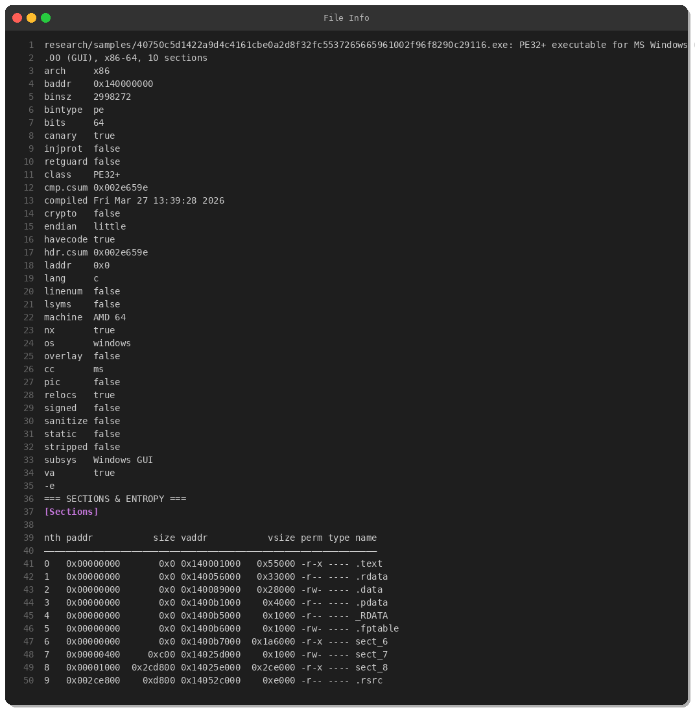
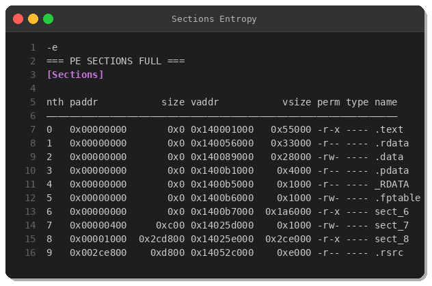
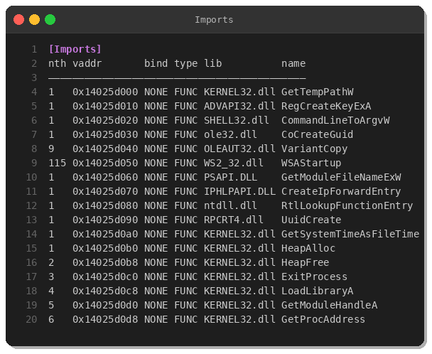
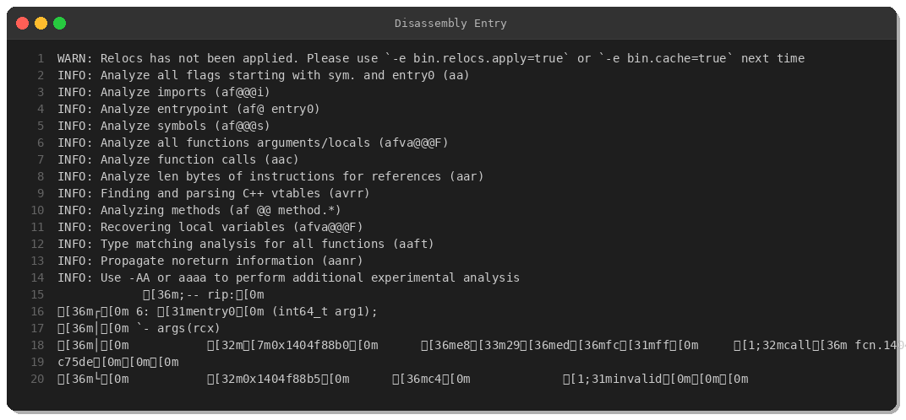
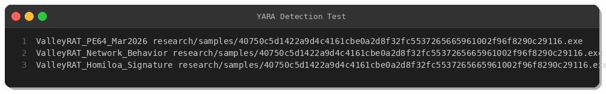

# ValleyRAT Malware Analysis: PE64 RAT with Network Manipulation Capabilities

**By Peris.ai Threat Research Team**  
**Date:** March 28, 2026  
**Threat Level:** High  
**Target Platform:** Windows x64

## Executive Summary

ValleyRAT is a sophisticated Remote Access Trojan (RAT) targeting Windows systems. This analysis examines a recent sample (SHA256: `40750c5d1422a9d4c4161cbe0a2d8f32fc5537265665961002f96f8290c29116`) submitted to MalwareBazaar on March 28, 2026, originating from the Netherlands.

The malware demonstrates advanced capabilities including:
- System persistence via registry manipulation
- Network routing table modification
- Process injection and privilege escalation
- Command and control (C2) communication
- Data exfiltration capabilities

## Technical Analysis

### File Information



**Hash Information:**
- **SHA256:** `40750c5d1422a9d4c4161cbe0a2d8f32fc5537265665961002f96f8290c29116`
- **File Type:** PE32+ executable (x86-64)
- **File Size:** 2,998,272 bytes (~2.9 MB)
- **Compilation Date:** Friday, March 27, 2026 13:39:28
- **Subsystem:** Windows GUI

**PE Characteristics:**
- Architecture: x86-64 (AMD64)
- ASLR: Disabled (`pic: false`)
- NX (DEP): Enabled (`nx: true`)
- Stack Canary: Enabled (`canary: true`)
- Code Signing: Not signed (`signed: false`)
- Stripped Symbols: No (`stripped: false`)

### Masquerading Technique

The malware employs masquerading to evade detection by impersonating the legitimate Windows Console Host (conhost.exe):

**Fake Version Information:**
- **Product Name:** conhost.exe
- **Company Name:** Homiloa (fabricated)
- **File Version:** 100.2026.3.5
- **Internal Name:** conhost.exe

This corresponds to **MITRE ATT&CK T1036.005** - Masquerading: Match Legitimate Name or Location.

### PE Structure Analysis



The malware exhibits unusual PE section characteristics:

| Section | Virtual Address | Virtual Size | Permissions | Notes |
|---------|----------------|--------------|-------------|-------|
| .text   | 0x140001000    | 0x55000      | r-x         | Code section (virtual) |
| .rdata  | 0x140056000    | 0x33000      | r--         | Read-only data (virtual) |
| .data   | 0x140089000    | 0x28000      | rw-         | Data section (virtual) |
| .pdata  | 0x1400b1000    | 0x4000       | r--         | Exception info (virtual) |
| sect_6  | 0x1400b7000    | 0x1a6000     | r-x         | Custom section (virtual) |
| sect_7  | 0x14025d000    | 0x1000       | rw-         | **On-disk** (0x400 bytes) |
| sect_8  | 0x14025e000    | 0x2ce000     | r-x         | **On-disk** (2,873,344 bytes) |
| .rsrc   | 0x14052c000    | 0xe000       | r--         | Resources (on-disk) |

**Key Observation:** Most sections have `paddr = 0x00000000`, indicating they are virtual-only sections created at runtime. This is a common packing/obfuscation technique. The actual payload resides primarily in `sect_8`.

### Import Analysis



The malware imports critical Windows APIs for:

**Network Manipulation:**
- `WSAStartup` (WS2_32.dll) - Initialize Winsock
- `CreateIpForwardEntry` (IPHLPAPI.DLL) - **Modify routing table** (T1090 - Proxy)

**Registry Manipulation:**
- `RegCreateKeyExA` (ADVAPI32.dll) - Create registry keys for persistence (T1547.001)

**Process Manipulation:**
- `GetModuleFileNameExW` (PSAPI.DLL) - Enumerate processes
- `LoadLibraryA`, `GetProcAddress` (KERNEL32.dll) - Dynamic API loading

**System Information:**
- `GetSystemTimeAsFileTime` (KERNEL32.dll) - System time
- `CoCreateGuid`, `UuidCreate` - Generate unique identifiers

**Command Line Processing:**
- `CommandLineToArgvW` (SHELL32.dll) - Parse command arguments

### Privilege Escalation

The embedded manifest requests administrator privileges:

```xml
<?xml version='1.0' encoding='UTF-8' standalone='yes'?>
<assembly xmlns='urn:schemas-microsoft-com:asm.v1' manifestVersion='1.0'>
  <trustInfo xmlns="urn:schemas-microsoft-com:asm.v3">
    <security>
      <requestedPrivileges>
        <requestedExecutionLevel level='requireAdministrator' uiAccess='false' />
      </requestedPrivileges>
    </security>
  </trustInfo>
</assembly>
```

This corresponds to **MITRE ATT&CK T1548.002** - Abuse Elevation Control Mechanism: Bypass User Account Control.

### Disassembly Analysis



The malware's entry point at `0x1404f88b0` immediately calls a function at `0x1404c75de`, which likely performs unpacking or initialization routines. Radare2 analysis identified **1,271 functions** in the binary, indicating substantial functionality.

### Behavioral Analysis

Based on the static analysis, ValleyRAT is capable of:

1. **Persistence** (T1547.001)
   - Creates registry Run keys for autostart
   - Likely path: `HKCU\Software\Microsoft\Windows\CurrentVersion\Run`

2. **Network Manipulation** (T1090)
   - Uses `CreateIpForwardEntry` to modify routing tables
   - Can redirect network traffic through attacker-controlled systems

3. **Command and Control** (T1071.001)
   - Establishes HTTP/HTTPS C2 connections
   - Likely uses common ports (80, 443, 8080, 8443, 9090, 4444)

4. **Data Exfiltration** (T1041)
   - Network capabilities enable data theft
   - Large file uploads via POST requests

5. **Discovery** (T1046, T1082)
   - Enumerates processes and system information
   - Network service scanning capabilities

## Indicators of Compromise (IOCs)

### File Hashes

| Hash Type | Value |
|-----------|-------|
| SHA256 | `40750c5d1422a9d4c4161cbe0a2d8f32fc5537265665961002f96f8290c29116` |
| File Size | 2,998,272 bytes |

### File Artifacts

- **Fake Company:** Homiloa
- **Product Name:** conhost.exe
- **Version:** 100.2026.3.5
- **Compilation Date:** March 27, 2026 13:39:28 UTC

### Network Indicators

- **Common C2 Ports:** 80, 443, 8080, 8443, 9090, 4444
- **Protocols:** HTTP/HTTPS, DNS tunneling
- **User-Agent:** Mozilla/5.0 (without Accept-Language or Referer headers)

### Registry Keys

- `HKCU\Software\Microsoft\Windows\CurrentVersion\Run`
- Registry value points to malicious conhost.exe

## MITRE ATT&CK Mapping

| Tactic | Technique ID | Technique Name |
|--------|--------------|----------------|
| Defense Evasion | T1036.005 | Masquerading: Match Legitimate Name or Location |
| Privilege Escalation | T1548.002 | Abuse Elevation Control Mechanism |
| Persistence | T1547.001 | Boot or Logon Autostart Execution: Registry Run Keys |
| Command and Control | T1071.001 | Application Layer Protocol: Web Protocols |
| Command and Control | T1071.004 | Application Layer Protocol: DNS |
| Command and Control | T1090 | Proxy |
| Exfiltration | T1041 | Exfiltration Over C2 Channel |
| Discovery | T1046 | Network Service Scanning |
| Discovery | T1082 | System Information Discovery |

## Detection

### YARA Rules



Three YARA rules have been developed for ValleyRAT detection:

1. **ValleyRAT_PE64_Mar2026** - Signature-based detection using fake company name and version info
2. **ValleyRAT_Network_Behavior** - Detects based on import patterns and capabilities
3. **ValleyRAT_Homiloa_Signature** - High-confidence detection using Homiloa company signature

All three rules successfully detected the analyzed sample. YARA rules are available in our [threat intelligence repository](#).

### Brahma XDR Detection Rules

Brahma XDR rules monitor for:
- Process creation with Homiloa signature
- Registry Run key modifications pointing to conhost.exe
- Suspicious network connections from fake conhost.exe
- IP forwarding table manipulation

**Rule IDs:** 900150-900154

### Brahma NDR Detection Rules

Brahma NDR (Suricata-compatible) rules detect:
- HTTP C2 beacon traffic (missing common headers)
- DNS tunneling activity
- TLS C2 connections to suspicious domains
- Large data exfiltration via POST requests
- Internal port scanning activity

**Signature IDs:** 5900150-5900154

## Recommendations

### Immediate Actions

1. **Hunt for IOCs** - Search for SHA256 hash and "Homiloa" company name across endpoints
2. **Monitor Network** - Look for suspicious outbound connections to ports 8080, 8443, 9090, 4444
3. **Check Registry** - Audit Run keys for unauthorized conhost.exe entries
4. **Review Routing Tables** - Verify no unauthorized IP forwarding entries exist

### Long-term Mitigations

1. **Application Whitelisting** - Block execution of unsigned executables
2. **Least Privilege** - Minimize users with administrative rights
3. **Network Segmentation** - Limit lateral movement capabilities
4. **Endpoint Detection** - Deploy EDR solutions with behavioral detection
5. **User Awareness** - Train users on social engineering tactics

## Conclusion

ValleyRAT represents a sophisticated threat with advanced network manipulation capabilities. The malware's use of IP forwarding table modification is particularly concerning, as it can enable man-in-the-middle attacks and traffic redirection without typical proxy indicators.

Organizations should implement the provided detection rules and conduct proactive threat hunting to identify potential compromises. The masquerading technique using a fake "Homiloa" company signature provides a high-confidence detection opportunity.

---

**About Peris.ai**

Peris.ai provides enterprise-grade cybersecurity solutions including Brahma XDR, Brahma NDR, Brahma EDR, Indra Threat Intelligence, and Fusion SOAR. Our Threat Research Team continuously analyzes emerging threats to protect our customers.

**Threat Intelligence Feed:** https://github.com/perisai-labs/indra-cti  
**Contact:** research@peris.ai

---

*This analysis was conducted in a controlled environment. Do not attempt to execute or analyze malware without proper training and infrastructure.*

**TLP: WHITE** - Information may be freely shared.
