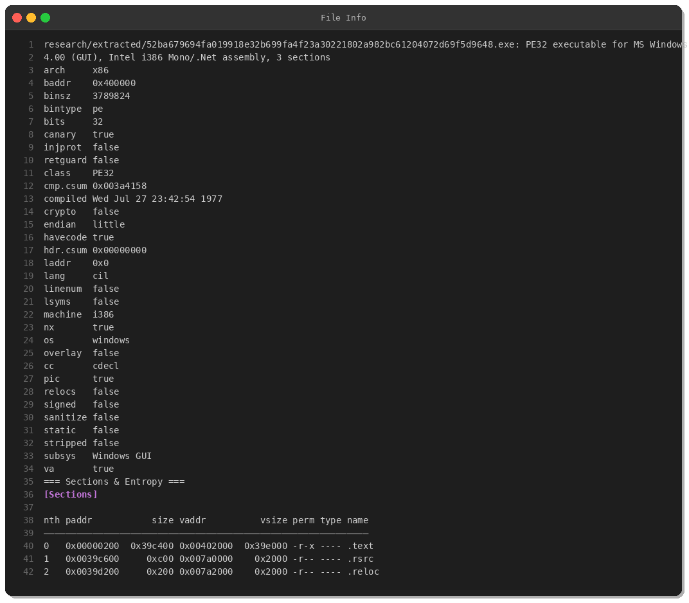
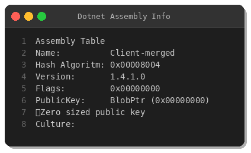
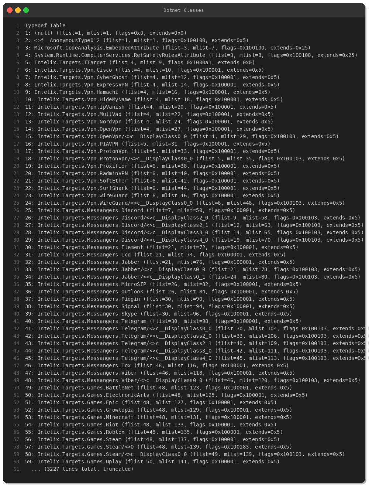
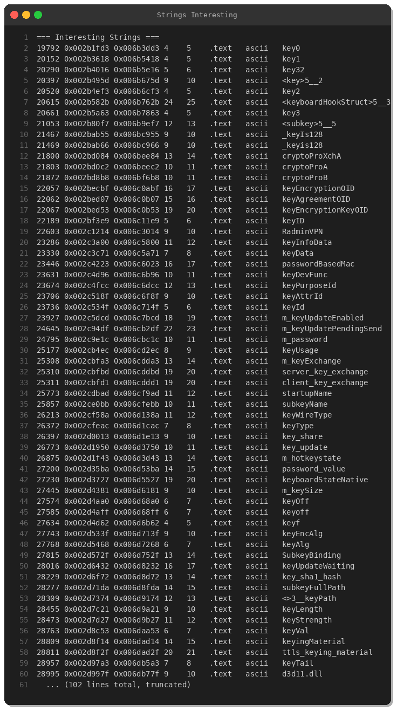
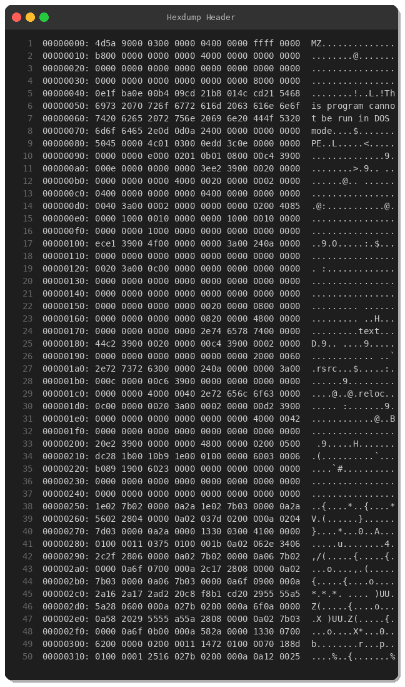
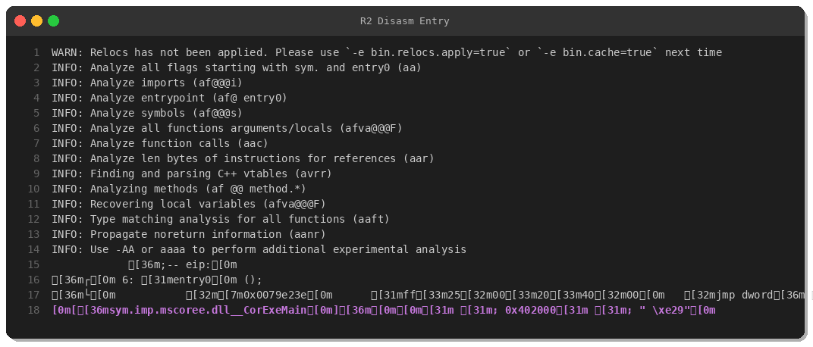
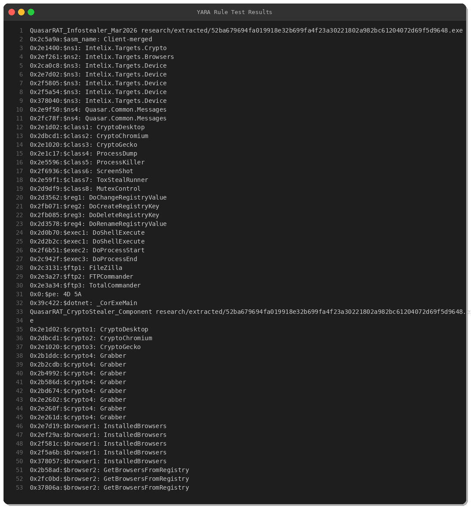

# QuasarRAT Infostealer with Cryptocurrency Theft Capabilities

**Threat Intelligence Report**  
**Peris.ai Threat Research Team**  
**Published:** March 29, 2026  
**Classification:** TLP:WHITE

---

## Executive Summary

This report details analysis of a sophisticated QuasarRAT variant incorporating extensive cryptocurrency wallet and credential stealing capabilities. The malware is distributed as a .NET assembly and demonstrates advanced capabilities targeting cryptocurrency users, browser credentials, and FTP client credentials.

**Key Findings:**
- Critical-severity Remote Access Trojan (RAT)
- Specialized cryptocurrency wallet theft modules
- Multi-browser credential harvesting
- Process manipulation and surveillance capabilities
- .NET-based, targeting Windows systems

**Sample Hash:**  
SHA-256: `52ba679694fa019918e32b699fa4f23a30221802a982bc61204072d69f5d9648`

---

## Sample Characteristics

| Property | Value |
|----------|-------|
| **SHA-256** | 52ba679694fa019918e32b699fa4f23a30221802a982bc61204072d69f5d9648 |
| **File Type** | PE32 executable for MS Windows |
| **Architecture** | Intel i386 (.NET CIL) |
| **File Size** | 3,789,824 bytes (3.7 MB) |
| **Assembly Name** | Client-merged |
| **Assembly Version** | 1.4.1.0 |
| **Compiler** | .NET Framework |
| **Protections** | Stack canary, NX enabled |



---

## Technical Analysis

### .NET Assembly Structure

The malware is a .NET assembly containing 3,224 class definitions and 264 functions. Analysis of the assembly metadata reveals the malicious functionality through namespace and class naming patterns.



### Malicious Namespaces Identified

- `Intelix.Targets.Crypto` - Cryptocurrency wallet theft
- `Intelix.Targets.Browsers` - Browser credential theft
- `Intelix.Targets.Device` - Device profiling and reconnaissance
- `Intelix.Targets.Applications` - Application credential theft
- `Quasar.Common.Messages` - C2 communication framework
- `CvMega.ToxStealRunner` - Data exfiltration module



### Capability Matrix

| Capability | Implementation | MITRE ATT&CK |
|------------|---------------|--------------|
| **Cryptocurrency Theft** | CryptoDesktop, CryptoChromium, CryptoGecko | T1005, T1552 |
| **Browser Credentials** | InstalledBrowsers, GetBrowsersFromRegistry | T1555, T1552 |
| **FTP Credentials** | FileZilla, FTPCommander, TotalCommander | T1552 |
| **Process Manipulation** | ProcessDump, ProcessKiller, ProcessWindows | T1003, T1057, T1055 |
| **Screen Capture** | ScreenShot class | T1113 |
| **Keystroke Logging** | Keyboard hook structures | T1056.001 |
| **Registry Manipulation** | Complete CRUD operations | T1112, T1547 |
| **Remote Execution** | DoShellExecute | T1059 |
| **Data Exfiltration** | ToxStealRunner | T1041 |
| **Persistence** | MutexControl, Registry autostart | T1547.001 |

---

## Detailed Capability Analysis

### 1. Cryptocurrency Wallet Theft

The malware implements three specialized cryptocurrency theft modules:

- **CryptoDesktop:** Targets desktop wallet applications (Electrum, Exodus, etc.)
- **CryptoChromium:** Extracts wallet data from Chromium-based browser extensions
- **CryptoGecko:** Extracts wallet data from Firefox/Gecko-based browser extensions

These modules systematically enumerate browser installations, locate wallet files, and exfiltrate wallet data.

### 2. Browser Credential Harvesting

The `InstalledBrowsers` class enumerates installed browsers via Windows Registry, then extracts stored credentials from:
- Chromium-based browsers (Chrome, Edge, Brave, etc.)
- Firefox/Gecko-based browsers
- Browser credential databases

### 3. FTP Client Credential Theft

Dedicated modules target popular FTP clients:
- **FileZilla** - Open-source FTP client
- **FTPCommander** - Commercial FTP solution
- **TotalCommander** - File manager with FTP capabilities

### 4. Process and System Manipulation

- **ProcessDump:** Memory dumping for credential extraction
- **ProcessKiller:** Terminating security software or competing malware
- **ProcessWindows:** Process and window enumeration
- **Remote Process Control:** Start/stop processes remotely

### 5. Surveillance Capabilities

- **Screen Capture:** Periodic screenshot capture via ScreenShot class
- **Keystroke Logging:** Keyboard hook implementation for capturing typed credentials

### 6. Persistence and Registry Manipulation

Complete registry CRUD (Create, Read, Update, Delete) operations including:
- DoChangeRegistryValue
- DoCreateRegistryKey / DoCreateRegistryValue
- DoDeleteRegistryKey / DoDeleteRegistryValue
- DoRenameRegistryKey / DoRenameRegistryValue

These capabilities enable:
- Persistence via Run keys
- System configuration manipulation
- Anti-analysis registry modifications

---

## String Analysis

Analysis revealed 46,152 embedded strings including:



**Notable string patterns:**
- Cryptographic function references (AES, ChaCha20, RIPEMD)
- Keyboard hook structures
- Password and credential keywords
- Registry manipulation keywords

---

## PE Structure Analysis



The PE header confirms legitimate Windows executable structure with .NET metadata sections containing the malicious class definitions.



Entry point jumps to `_CorExeMain` from mscoree.dll, typical for .NET executables.

---

## MITRE ATT&CK Framework Mapping

| Tactic | Technique ID | Technique Name |
|--------|-------------|----------------|
| **Credential Access** | T1003 | OS Credential Dumping |
| **Credential Access** | T1555 | Credentials from Password Stores |
| **Credential Access** | T1552 | Unsecured Credentials |
| **Collection** | T1005 | Data from Local System |
| **Collection** | T1056.001 | Input Capture: Keylogging |
| **Collection** | T1113 | Screen Capture |
| **Discovery** | T1012 | Query Registry |
| **Discovery** | T1057 | Process Discovery |
| **Discovery** | T1082 | System Information Discovery |
| **Persistence** | T1547.001 | Boot or Logon Autostart Execution: Registry Run Keys |
| **Defense Evasion** | T1055 | Process Injection |
| **Defense Evasion** | T1112 | Modify Registry |
| **Execution** | T1059 | Command and Scripting Interpreter |
| **Exfiltration** | T1041 | Exfiltration Over C2 Channel |

---

## Detection

### YARA Rules

Two YARA rules have been developed for detection:



**Rule 1: QuasarRAT_Infostealer_Mar2026**
- Detects assembly name "Client-merged"
- Identifies malicious namespace patterns (Intelix.Targets.*, Quasar.Common.Messages)
- Matches cryptocurrency stealing class names
- Validates .NET structure

**Rule 2: QuasarRAT_CryptoStealer_Component**
- Specialized detection for cryptocurrency theft components
- Matches CryptoDesktop, CryptoChromium, CryptoGecko classes
- Identifies wallet-related strings

**YARA rules available at:** `yara/malware/quasarrat.yar`

**Test Results:** Both rules successfully matched the sample with 30+ string hits.

### Behavioral Indicators

Organizations should monitor for:

**File Indicators:**
- .NET executables with assembly name "Client-merged"
- PE files containing namespaces: Intelix.Targets.*, Quasar.Common.Messages, CvMega.*
- Files containing multiple cryptocurrency theft class names

**Process Indicators:**
- Unauthorized access to browser profile directories
- Access to cryptocurrency wallet files (wallet.dat, etc.)
- Registry key creation in HKCU\Software\Microsoft\Windows\CurrentVersion\Run
- Process injection or memory dumping behavior

**Network Indicators:**
- HTTP User-Agent strings containing "QuasarRAT" or "Intelix"
- POST requests with "wallet.dat" in request body
- Frequent small beacons to external IPs (C2 heartbeat)
- Image uploads indicating screenshot exfiltration

---

## Indicators of Compromise (IOCs)

### File Hashes

```
SHA-256: 52ba679694fa019918e32b699fa4f23a30221802a982bc61204072d69f5d9648
```

### File Metadata

```
Assembly Name: Client-merged
Version: 1.4.1.0
File Size: 3789824 bytes
PE Timestamp: Wed Jul 27 23:42:54 1977 (likely forged)
```

### Code Artifacts

**Malicious Namespaces:**
```
Intelix.Targets.Crypto
Intelix.Targets.Browsers
Intelix.Targets.Device
Intelix.Targets.Applications
Quasar.Common.Messages
CvMega.ToxStealRunner
CvMega.Helper.MutexControl
```

**Malicious Class Names:**
```
CryptoDesktop
CryptoChromium
CryptoGecko
Grabber
ProcessDump
ProcessKiller
ProcessWindows
ScreenShot
ToxStealRunner
MutexControl
DoShellExecute
DoProcessStart / DoProcessEnd
DoChangeRegistryValue
DoCreateRegistryKey
```

---

## Recommendations

### For Organizations

1. **Deploy Detection Rules**
   - Implement YARA rules for file-based detection
   - Monitor for behavioral indicators listed above
   - Alert on .NET assemblies with suspicious names

2. **Network Monitoring**
   - Monitor for User-Agent strings: "QuasarRAT", "Intelix"
   - Watch for POST requests containing "wallet.dat"
   - Alert on frequent small beacons to external IPs

3. **Endpoint Protection**
   - Block known hash: `52ba679694fa019918e32b699fa4f23a30221802a982bc61204072d69f5d9648`
   - Monitor registry Run key modifications
   - Alert on unauthorized browser profile access

4. **User Education**
   - Train users on phishing and social engineering
   - Warn about cryptocurrency wallet security
   - Educate on secure credential storage

### For Security Analysts

1. **Threat Hunting**
   - Search for .NET assemblies with "Client-merged" name
   - Hunt for processes accessing cryptocurrency wallet files
   - Investigate registry persistence in Run keys

2. **Incident Response**
   - Isolate systems with positive detections immediately
   - Examine browser credential stores for compromise
   - Review cryptocurrency wallet access logs
   - Analyze network logs for C2 communication
   - Check registry for persistence mechanisms

3. **Intelligence Sharing**
   - Submit IOCs to threat intelligence platforms
   - Share detection rules with community
   - Report variants and new samples

### For Users

1. **Use hardware wallets** for significant cryptocurrency holdings
2. **Enable 2FA** on all cryptocurrency accounts
3. **Keep software updated** (Windows, .NET Framework, browsers)
4. **Use reputable antivirus** with real-time protection
5. **Avoid suspicious downloads** from untrusted sources
6. **Monitor system behavior** for unexplained activity

---

## References

- **Sample Source:** MalwareBazaar
- **MITRE ATT&CK:** https://attack.mitre.org/
- **QuasarRAT Project:** https://github.com/quasar/Quasar
- **Detection Rules:** See `yara/malware/quasarrat.yar`

---

## About This Report

This threat intelligence report is provided by the Peris.ai Threat Research Team to assist security professionals in detecting and responding to this threat. The analysis was conducted in isolated research environments using industry-standard malware analysis tools.

**Report Classification:** TLP:WHITE  
**Distribution:** Unlimited  
**Purpose:** Detection and prevention

For questions or additional intelligence, contact: threat-research@peris.ai

---

**Disclaimer:** This report is for educational and defensive security purposes only. The analyzed sample is real malware and should only be handled in isolated research environments by trained security professionals.

---

*Report Version: 1.0*  
*Last Updated: March 29, 2026*  
*Report ID: PERIS-TR-2026-0329-001*
