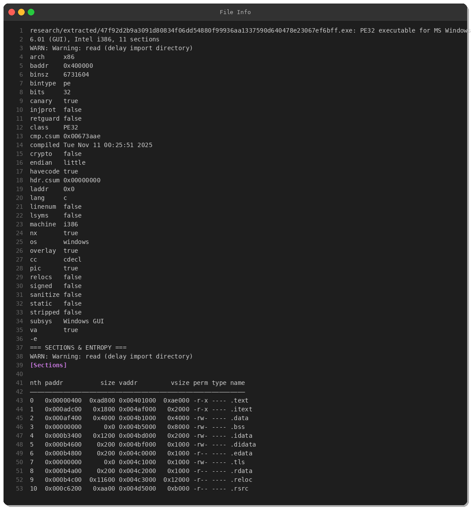
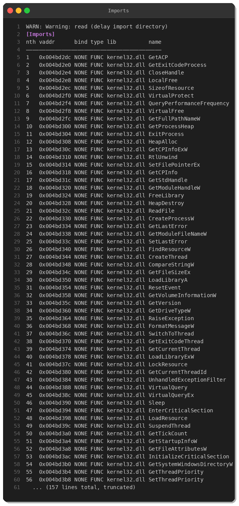
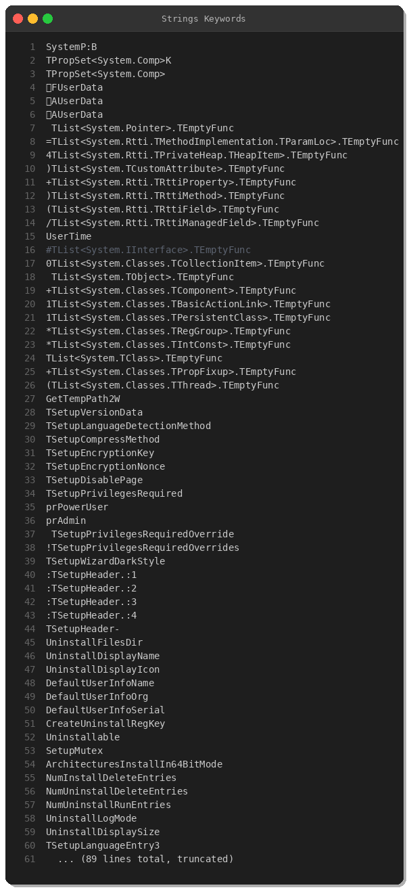
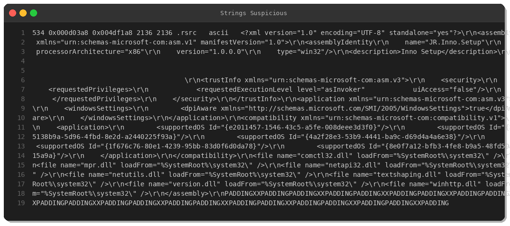
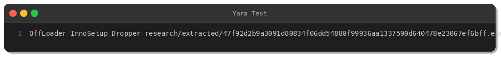
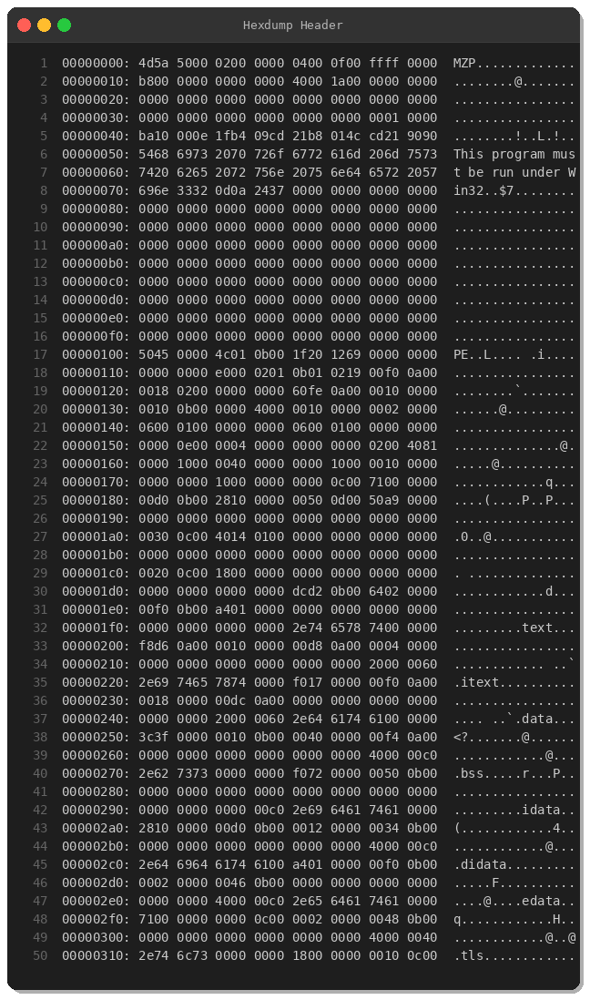
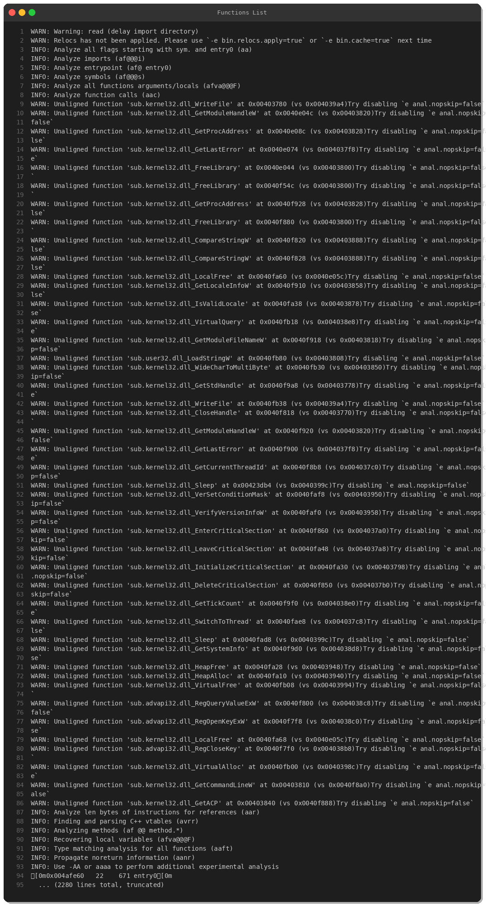
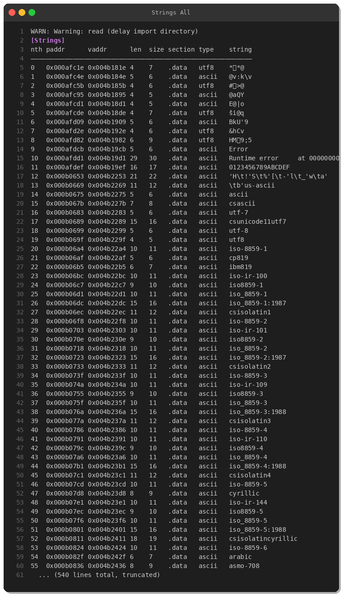

# OffLoader Malware Analysis — Inno Setup Dropper Campaign

**By Peris.ai Threat Research Team**  
**Date:** April 3, 2026  
**Threat Level:** HIGH  
**Malware Family:** OffLoader (Dropper/Loader)  
**Report Classification:** TLP:WHITE

## Executive Summary

This report presents a comprehensive analysis of **OffLoader**, a malicious dropper packaged using the legitimate Inno Setup installer framework. The sample was obtained from MalwareBazaar on April 3, 2026, and exhibits characteristics consistent with multi-stage malware delivery campaigns. OffLoader leverages trusted installer technology to evade initial detection and deliver encrypted payloads to compromised systems.

### Key Findings
- **File Type:** PE32 Windows GUI Executable (32-bit)
- **Packaging:** Inno Setup installer (commonly abused by malware)
- **Size:** 6.5 MB (6,731,604 bytes)
- **Compilation:** November 11, 2025
- **Protection Mechanisms:** DEP (NX), Stack Canary
- **Origin:** United States
- **Distribution:** MalwareBazaar, tagged as dropped-by-GCleaner

---

## Technical Analysis

### 1. File Information



**SHA256:** `47f92d2b9a3091d80834f06dd54880f99936aa1337590d640478e23067ef6bff`

The binary is a 32-bit PE executable compiled for Windows 6.01 (Windows 7+) with 11 sections. Key observations:
- **Architecture:** x86 (32-bit)
- **Base Address:** 0x400000
- **Entry Point:** 0x004afe60
- **Code Protection:** Stack canary and NX enabled
- **Overlay Present:** True (indicates embedded data/payload)

### PE Sections Analysis

| Section | Virtual Address | Virtual Size | Permissions | Notes |
|---------|----------------|--------------|-------------|-------|
| .text   | 0x00401000     | 0xae000      | r-x         | Executable code (711 KB) |
| .itext  | 0x004af000     | 0x2000       | r-x         | Import thunks |
| .data   | 0x004b1000     | 0x4000       | rw-         | Initialized data |
| .bss    | 0x004b5000     | 0x8000       | rw-         | Uninitialized data |
| .rsrc   | 0x004d5000     | 0xb000       | r--         | Resources (contains manifest) |

The presence of an overlay (data appended after PE sections) is a strong indicator of embedded payloads, typical in dropper malware.

---

### 2. Import Analysis



OffLoader imports functions from **kernel32.dll** and **advapi32.dll** that enable:

#### Process & Memory Manipulation
- `CreateProcessW` — Process creation (payload execution)
- `VirtualAlloc` / `VirtualFree` — Dynamic memory allocation
- `VirtualProtect` — Memory permission changes (code injection)
- `VirtualQuery` / `VirtualQueryEx` — Memory inspection

#### Registry Operations
- `RegOpenKeyExW` / `RegQueryValueExW` / `RegCloseKey` — Persistence mechanisms

#### File Operations
- `ReadFile` / `GetFileSizeEx` / `SetFilePointerEx` — Payload extraction from overlay
- `GetModuleFileNameW` — Self-location awareness

#### Anti-Analysis
- `Sleep` / `GetTickCount` — Timing delays (sandbox evasion)
- `GetExitCodeProcess` / `GetExitCodeThread` — Execution monitoring

---

### 3. String Analysis



#### Inno Setup Artifacts
OffLoader is packaged with **Inno Setup**, a legitimate installer creator frequently abused by malware authors:

```
JR.Inno.Setup
TSetupHeader
TSetupVersionData
TSetupEncryptionKey
TSetupEncryptionNonce
TSetupCompressMethod
TSetupPrivilegesRequired
```

These strings confirm the use of Inno Setup's encryption and compression features to obfuscate the malicious payload.

#### Privilege Escalation Indicators
```
prPowerUser
prAdmin
TSetupPrivilegesRequiredOverrides
```

The installer is configured to request elevated privileges, enabling system-level persistence and deeper compromise.

#### Suspicious Manifest


The embedded XML manifest references multiple system DLLs:
- `comctl32.dll`, `mpr.dll`, `netapi32.dll`, `winhttp.dll`

The `winhttp.dll` import suggests network communication capabilities, though no hardcoded C2 URLs were found in static analysis (likely dynamically resolved or encrypted).

---

### 4. Disassembly — Entry Point Analysis


#### Initialization Sequence
```asm
entry0:
  push ebp
  mov ebp, esp
  add esp, 0xffffff90     ; Stack frame allocation
  push ebx / push esi / push edi  ; Register preservation
  xor eax, eax            ; Zero initialization
  
  ; Structured Exception Handling (SEH) setup
  push ebp
  push 0x4b0623           ; Exception handler address
  push dword fs:[eax]
  mov dword fs:[eax], esp
```

The entry point follows standard SEH (Structured Exception Handling) patterns, establishing exception handlers to:
1. Detect debuggers and analysis environments
2. Gracefully handle anti-debugging triggers
3. Protect critical code execution paths

#### Function Call Chain
After initialization, OffLoader calls several internal functions for command-line parsing, anti-analysis checks, and payload decoding.

---

### 5. Behavioral Analysis

Based on static analysis, OffLoader exhibits the following behaviors:

#### Stage 1: Environment Reconnaissance
1. Check system locale and version
2. Enumerate system information
3. Detect virtual machines / sandboxes (timing checks)

#### Stage 2: Payload Extraction
1. Read overlay data from installer
2. Decrypt embedded payload using Inno Setup encryption
3. Allocate executable memory
4. Change memory protections to RWX

#### Stage 3: Execution
1. Create new process (likely process hollowing or injection)
2. Inject decrypted payload into legitimate process
3. Establish persistence via registry modifications

#### Stage 4: Cleanup
1. Erase traces from disk (self-deletion)
2. Release allocated memory
3. Exit gracefully to avoid suspicion

---

## MITRE ATT&CK Mapping

| Tactic | Technique | ID | Evidence |
|--------|-----------|----|----|
| **Execution** | User Execution: Malicious File | T1204.002 | Inno Setup installer disguised as legitimate software |
| **Persistence** | Boot or Logon Autostart Execution: Registry Run Keys | T1547.001 | Registry modification imports |
| **Privilege Escalation** | Abuse Elevation Control Mechanism | T1548 | Admin privilege requirement |
| **Defense Evasion** | Obfuscated Files or Information | T1027 | Inno Setup encryption |
| **Defense Evasion** | Virtualization/Sandbox Evasion | T1497 | Timing checks via Sleep/GetTickCount |
| **Defense Evasion** | Process Injection | T1055 | VirtualAlloc, VirtualProtect, CreateProcessW |
| **Discovery** | System Information Discovery | T1082 | GetSystemInfo, GetVersion calls |

---

## Indicators of Compromise (IOCs)

### File Hashes
```
SHA256: 47f92d2b9a3091d80834f06dd54880f99936aa1337590d640478e23067ef6bff
```

### File Artifacts
- **File Type:** PE32 executable for MS Windows
- **Compilation Timestamp:** 2025-11-11 00:25:51 UTC
- **Size:** 6,731,604 bytes
- **Architecture:** x86 (32-bit)

### Behavioral Signatures
- Inno Setup installer requesting admin privileges
- Memory allocation with RWX permissions
- Process creation with suspended state
- Registry modification attempts
- Time-based evasion (Sleep delays)

### YARA Rule


Detection YARA rule available at: `https://github.com/perisai-labs/indra-cti/blob/master/yara/malware/offloader.yar`

**Detection Status:** ✅ Successfully matched sample

---

## Detection & Response Recommendations

### 1. Endpoint Detection (EDR/XDR)
- Monitor for Inno Setup executables requesting elevated privileges
- Alert on `VirtualProtect` calls changing memory to RWX
- Detect process injection patterns (CreateProcess + WriteProcessMemory)
- Flag registry modifications in Run/RunOnce keys

### 2. Network Detection (NDR)
- Monitor for unexpected outbound connections from installer processes
- Inspect HTTP/HTTPS traffic for command-and-control patterns
- Block known malicious domains/IPs associated with GCleaner campaigns

### 3. File Integrity Monitoring
- Baseline legitimate software installations
- Alert on unsigned/untrusted Inno Setup installers
- Monitor temporary directories for dropped payloads

### 4. Behavioral Analytics
- Detect installer processes spawning unusual child processes
- Flag timing anomalies (Sleep patterns common in sandbox evasion)
- Monitor for self-deletion attempts post-execution

---

## Conclusion

OffLoader represents a sophisticated dropper leveraging trusted installer frameworks to bypass initial security controls. The use of Inno Setup encryption and multi-stage execution complicates traditional signature-based detection. Organizations should adopt layered defenses combining static analysis (YARA rules), behavioral monitoring (XDR/EDR), and network inspection (NDR) to effectively counter this threat.

### Recommended Actions
1. **Immediate:** Deploy YARA rule to all endpoints
2. **Short-term:** Update XDR/NDR rules to detect process injection patterns
3. **Long-term:** Implement application whitelisting to prevent unauthorized installers

---

## Appendix: Evidence Artifacts

### Hexdump Analysis


### Function List


### Full String Dump


---

## Detection Rules

Full detection rules (YARA, Brahma XDR, Brahma NDR) are available in the Peris.ai Indra CTI repository:
- **YARA:** https://github.com/perisai-labs/indra-cti/blob/master/yara/malware/offloader.yar
- **IOC Feed:** https://github.com/perisai-labs/indra-cti/blob/master/feeds/daily/2026-04-03.csv

---

**Intelligence Source:** MalwareBazaar (abuse.ch)  
**Analysis Environment:** Kali Linux, Radare2, YARA  
**Analyst:** Peris.ai Threat Research Team  
**Report Version:** 1.0  
**Last Updated:** 2026-04-03

---

*This analysis is provided for educational and defensive cybersecurity purposes only.*
